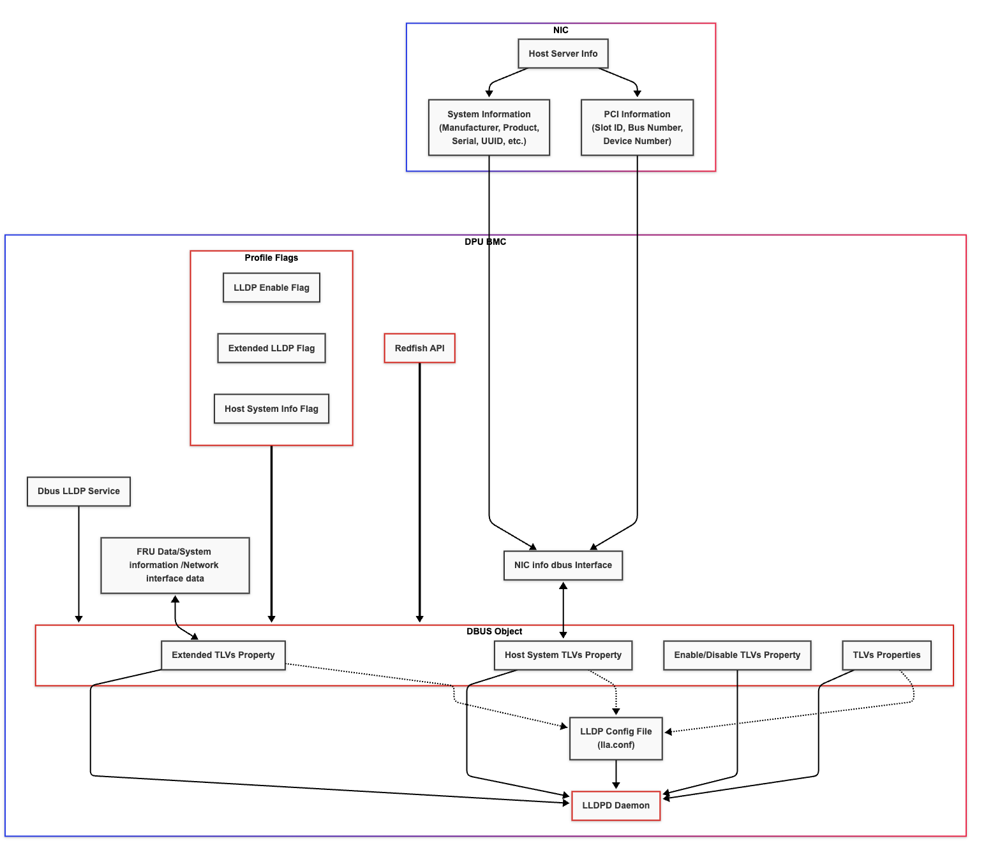
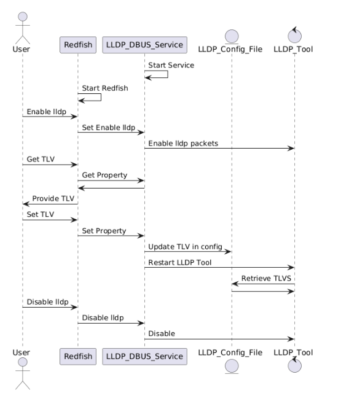
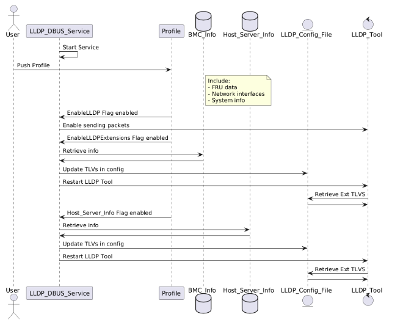

# Design proposal for LLDP managment in OpenBMC

Author: Linoy Cohen Bachar
Created: 2025-04-30

## Problem Description

Currently, BMC discovery and network management capabilities are limited in OpenBMC systems. The existing implementation relies on direct interaction with the OpenLLDP tool through Redfish. Additionally, the current LLDP implementation is located in the NVIDIA OEM directory, which limits its accessibility and integration with the broader OpenBMC ecosystem.

There is a need to implement a more flexible and extensible LLDP solution that enables:
- Handeling discovery of BMCs in the network
- Standardized configuration through D-Bus
- Support for custom TLVs under NVIDIA's OUI
- Backward compatibility with existing Redfish interfaces
- Dynamic control over LLDP packet contents
- Unified interface for managing LLDP across different access methods (Redfish, IPMI, and system configuration)
- Migration from NVIDIA's OEM directory to the general network directory

## Background and References

LLDP is a Layer-2 Ethernet protocol that enables devices to advertise and exchange information with their neighbors on a network. Currently, LLDP functionality is provided through Redfish using the OpenLLDP tool, which must be maintained for backward compatibility.

## Proposed Design for LLDP Enablement in OpenBMC

This proposal aims to implement LLDP functionality through a new D-Bus service that will manage LLDP configuration and TLV information, while maintaining backward compatibility with existing Redfish interfaces. The design introduces two main interfaces:

### D-Bus Interfaces

1. `xyz.openbmc_project.Network.LLDP.Settings`
   - This interface provides control over LLDP functionality and packet content
   - Properties:
     - `EnableLLDP` (bool): Controls basic LLDP functionality
     - `EnableLLDPExtensions` (bool): Controls extended TLVs under NVIDIA's OUI
     - `EnableHostSystemInfo` (bool): Controls host system information in TLVs
   - These settings allow dynamic control over:
     - Basic LLDP packet transmission
     - Addition of custom TLVs under NVIDIA's OUI
     - Inclusion of host system information in TLVs

2. `xyz.openbmc_project.Network.LLDP.TLVs`
   - This interface provides access to all LLDP TLV information
   - Properties:
     - `ChassisId` (string)
     - `ChassisIdSubtype` (uint8)
     - `ManagementAddressIPv4` (string)
     - `ManagementAddressIPv6` (string)
     - `ManagementAddressMAC` (string)
     - `ManagementVlanId` (uint16)
     - `PortId` (string)
     - `PortIdSubtype` (uint8)
     - `SystemCapabilities` (array[uint8])
     - `SystemName` (string)
     - `SystemDescription` (string)
   - These properties allow:
     - Reading and writing TLV values
     - Dynamic updates to LLDP packet contents
     - Integration with other BMC services

### BMC Support

- Enable LLDP D-Bus interfaces for standardized configuration
- Support configuration through Redfish API for backward compatibility
- Maintain backward compatibility with existing OpenLLDP-based Redfish interfaces
- Provide a unified interface for both basic and extended LLDP functionality

### D-Bus Service

The LLDP service will be implemented as a D-Bus service that manages both transmit and receive information:

1. Transmit Operations:
   - The service will maintain the transmit interface object at `/xyz/openbmc_project/network/lldpTransmit`
   - This interface will handle all outgoing LLDP packets
   - It will use the Settings interface to determine which TLVs to include
   - The TLVs interface will provide the actual values to be transmitted

2. Receive Operations:
   - The service will maintain the receive interface object at `/xyz/openbmc_project/network/lldpReceive`
   - This interface will store information received from neighboring devices
   - It will parse and store all received TLVs
   - The information will be available through the same TLV properties as the transmit interface

## High-Level Architecture Diagram

This design implements LLDP on the DPU BMC with the following key features: Customizable Profiles, Extended TLVs, LLDPD Transition, and Redfish Interface Updates. 
The architecture utilizes a new D-Bus service to manage LLDP configuration and communication, providing a flexible and extensible solution while maintaining backward compatibility.

## Redfish API

Provides a standardized RESTful interface for external management systems to configure and monitor LLDP. It interacts with the LLDP D-Bus service to translate Redfish commands to D-Bus calls. 
  1.  A user or management system sends a Redfish command to configure LLDP (e.g., enable LLDP, set TLV values).
  2.  The Redfish service translates the Redfish command into corresponding D-Bus calls to the LLDP D-Bus service.
  3.  The LLDP D-Bus service processes the requests:
      * For enabling/disabling LLDP, it controls the sending of LLDP packets.
      * For setting TLV values, it updates the LLDP configuration file and restarts the lldpd daemon. 
  4.  The lldpd daemon retrieves TLV information from the configuration file for inclusion in LLDP packets.

## Profile API

A configuration mechanism within OpenBMC that allows users to define LLDP settings using flags. These flags (EnableLLDP, EnableLLDPExtensions, EnableHostSystemInfo) control LLDP behavior and the inclusion of extended TLVs. 
  1.  A user or system pushes a profile to the OpenBMC, including flags to configure LLDP (EnableLLDP, EnableLLDPExtensions, EnableHostSystemInfo). 
  2.  The LLDP D-Bus service receives the profile.
  3.  Based on the EnableLLDP flag, the service enables or disables LLDP packet sending.
  4.  If the EnableLLDPExtensions flag is enabled, the service retrieves relevant information (FRU data, network interface data, system information) and updates the LLDP configuration file.  
      The lldpd daemon is restarted to apply the changes.
  5.  If the EnableHostSystemInfo flag is also enabled, the service retrieves host server information and further updates the LLDP configuration file, restarting the lldpd daemon again. 
  6.  The lldpd daemon retrieves the extended TLVs from the configuration file and includes them in LLDP packets.
