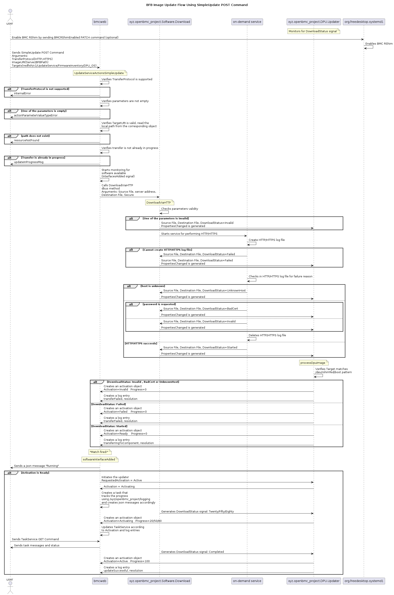

# Bluefield BFB Firmware Update via Redfish using HTTP/HTTPS protocols

Author: Vu Pham

Created: February 10, 2024

## Problem Description
The objective of this feature is to enhance the BFB (Bluefield Boot Image) firmware update implementation by adding support for update via Redfish using HTTP/HTTPS protocols.

With this feature, users will be able to remotely update the BFB firmware through the Redfish interface which provides greater flexibility and convenience.

## Background and References
This design shares the same common background, problem, and limitations with the previous design "Bluefield BFB Firware Update via Redfish using SCP" where the previous design uses underline SCP protocol to download the BFB firmware file.


This design will specifically look into using HTTP/HTTPS protocols with CURL application to download the BFB firmware file from remote host and redirect it to BMC's RShim.

1. The RShim shall be disabled on the host.
Run on the host to disable host's RShim:

```
systemctl stop rshim
systemctl disable rshim
```

2. The RShim must be enabled on BMC.
a. When SimpleUpdate procedure is initiated, BMC's RShim interface will be loaded/enabled.

b. Or explicitly using Redfish command:

```
curl -k -H "X-Auth-Token: $token" -H "Content-Type: application/json" -X GET https://$bmc/redfish/v1/Managers/Bluefield_BMC/Oem/Nvidia
{
  "BmcRShim": {
    "BmcRShimEnabled": false
  }
}

curl -k -H "X-Auth-Token: $token" -H "Content-Type: application/json" -XPATCH -d '{
      "BmcRShim": {
        "BmcRShimEnabled": true
      }
}' https://$bmc/redfish/v1/Managers/Bluefield_BMC/Oem/Nvidia
```

Verify that the RShim service is running and that the /dev/rshim device is present:

```
curl -k -H "X-Auth-Token: $token" -H "Content-Type: application/json" -X GET https://$bmc/redfish/v1/Managers/Bluefield_BMC/Oem/Nvidia
{
  "BmcRShim": {
    "BmcRShimEnabled": true
  }
}
```
The expected output is "BmcRshimEnabled": true

3. If authentication is used/enforced then add a CA certificate to authenticate the remote server used for downloading the BFB firmware.
```
curl -c cjar -b cjar -k -H "X-Auth-Token: $token" -X POST https://$bmc/redfish/v1/Managers/Bluefield_BMC/Truststore/Certificates -d @CAcert.json
```

How to create and install the correct CA certificate for remote server is beyond the scope of this design.

4. Since the BFB is too large to be stored on the BMC flash or tmpfs, the image needs to be written directly to the RShim device as redirect output of CURL application which download the BFB firmware file from the remote server.

a. Run on BMC using HTTPS for authentication:

```
curl -o /dev/rshim0/boot https://<remote-server>/<path_to_bfb> --capath /etc/ssl/certs/authority
```
The writing above initiates a soft reset on the BF and then pushes the bootstream.

If wrong/bad certificate installed, CURL will fail to verify the certificate. For example :

```
curl -o /dev/rshim0/boot https://<remote-server>/<path_to_bfb> --capath /etc/ssl/certs/authority

  % Total    % Received % Xferd  Average Speed   Time    Time     Time  Current
                                 Dload  Upload   Total   Spent    Left  Speed
  0     0    0     0    0     0      0      0 --:--:-- --:--:-- --:--:--     0
curl: (60) SSL: no alternative certificate subject name matches target host name '<remote-server>'
More details here: https://curl.se/docs/sslcerts.html

curl failed to verify the legitimacy of the server and therefore could not
establish a secure connection to it. To learn more about this situation and
how to fix it, please visit the web page mentioned above.

```

b. Run on BMC using HTTP without authentication enforcement:

```
curl -o /dev/rshim0/boot http://<remote-server>/<path_to_bfb>

  % Total    % Received % Xferd  Average Speed   Time    Time     Time  Current
                                 Dload  Upload   Total   Spent    Left  Speed
100 1255M  100 1255M    0     0  5127k      0  0:04:10  0:04:10 --:--:-- 7354k
```

The writing above initiates a soft reset on the BF and then pushes the bootstream.

5. Finally, the BFB firmware file is completely pushed and DPU to start the installation process.

### Proposed Design flow chart
The general flow is described in the following sequence diagram:


### Necessary changes in phosphor-dbus-interface APIs
Currently OpenBMC support TFTP and SCP to download the BFB firmware file. To extend the support for HTTP/HTTPS protocols, this design will introduce a phosphor-dbus-interface APIs sdbusplus::xyz::openbmc_project::Common::server::HTTP. It will provide a basic framework to download file from remote server using HTTP/HTTPS.

Follow the current design and implementation, each protocol has its own phosphor-dbus-interface YAML file:
sdbusplus::xyz::openbmc_project::Common::server::TFTP
sdbusplus::xyz::openbmc_project::Common::server::SCP
sdbusplus::xyz::openbmc_project::Common::server::HTTP

Using this approach will end up with some duplicate codes in bmcweb, phosphor-dbus, phosphor-bmc-code-mgt and dpu-manager; however, it will retain the independence of each protocols and their characteristics. To minize the duplications as much as possible, we will also introduce a common interface called DownloadStatus so that common dpu-manager codes can monitor the download status of different protocols.

1. Phosphor-dbus-interface YAML file for HTTP ie. HTTP.interface.yaml

sdbusplus::xyz::openbmc_project::Common::server::HTTP

```
    Description:
        Implement to provide download file(s) interface over HTTP/HTTPS protocol
    Methods:
        name: DowloadViaHTTP
        description:
           Download a file via HTTP/HTTPS
        parameters:
           name: SrcFile
           name: ServerAddress
           name: Secure
           name: DestFile (optional ie. /dev/rshim0/boot)
       errors:
           xyz.openbmc_project.Common.Error.InternalFailure
           xyz.openbmc_project.Common.Error.InvalidArgument
           xyz.openbmc_project.Common.Error.NotAllowed
```

2. Phosphor-dbus-interface YAML file for DonwloadStatus ie. DownloadStatus.interface.yaml

```
    Description:
        Implement to provide status of a file download using different protocols such
        as SCP, HTTP, HTTPS.

    Properties:
        -name: Status
         type: enum[self.DownloadStatus]
         description: >
             Indicate the state of the download. The default should be None
             during the operation if no input is provided.
        -name: Progress
         type: byte
         description: >
             An integer between 0 and 100 representing the percentage of
             completion of the download operation

    enumerations:
        - name: DownloadStatus
          description: >
              Enumeration representing the possible statuses of a file download.
          values:
              - name: None
                description: >
                    Initial state.
              - name: Started
                description: >
                    The download has started.
              - name: Invalid
                description: >
                    The download failed due to invalid parameter.
              - name: UnknownHost
                description: >
                    The download failed due to unknown host.
              - name: UnauthorizedClient
                description: >
                    The transfer failed due to unauthorized client.
              - name: BadCert
                description: >
                    The download failed due to bad certification on SSL connection.
              - name: Completed
                description: >
                    The download completed.
              - name: Failed
                description: >
                    The download has failed.
```

### Enabling the RShim interface on BMC
The user is required to disable the host RShim before initiating the update procedure.
The BMC RShim can be enabled using the following options:

1. When the SimpleUpdate procedure starts, the dpu-manager will attempt to automatically enable the RShim.
2. Or explicitly using Redfish command (failsafe from #1 and/or user explicit option).

### Pushing the image
The implementation is structured into three distinct layers:
1. The SimpleUpdate redfish command - bmcweb
2. The generic method DownloadViaProtocol implementation - phosphor-dbus-interface and phosphor-bmc-code-mgmt
3. The HTTP/HTTPS methods implementation - phosphor-bmc-code-mgmt
4. The DPU updater - dpu-manager

#### The SimpleUpdate redfish command
The TransferProtocol of SimpleUpdate action within the UpdateService schema will be extended with HTTP/HTTPS:
```
https://<bmc_ip>/redfish/v1/UpdateService/SimpleUpdateActionInfo
{
  "@odata.id": "/redfish/v1/UpdateService/SimpleUpdateActionInfo",
  "@odata.type": "#ActionInfo.v1_2_0.ActionInfo",
  "Id": "SimpleUpdateActionInfo",
  "Name": "Simple Update Action Info",
  "Parameters": [
    ...
    {
      "Name": "TransferProtocol",
      "Required": false,
      "DataType": "String",
      "Description": "The protocol used to download the firmware image",
      "AllowableValues": [
        "SCP"
        "HTTP"
        "HTTPS"
      ]
    },
    ...
  ]
}

curl -k -H "X-Auth-Token: <token>" -H "Content-Type: application/json" -X POST -d
'{"TransferProtocol":"HTTP", "ImageURI":"<ImageURI>", "Targets":"<TargetURI>"}'
https://$bmc/redfish/v1/UpdateService/Actions/UpdateService.SimpleUpdate

curl -k -H "X-Auth-Token: <token>" -H "Content-Type: application/json" -X POST -d
'{"TransferProtocol":"HTTPS", "ImageURI":"<ImageURI>", "Targets":"<TargetURI>"}'
https://$bmc/redfish/v1/UpdateService/Actions/UpdateService.SimpleUpdate
```

##### ImageURI
The URL of the firmware image to be updated. Its format should be <HTTPServer>/<BFBPath>.

##### TransferProtocol
The protocol used to download the firmware image. The newly supported protocol are HTTP/HTTPS.

##### Targets
The array of target URIs to apply the firmware update. In our case, only one update is allowed at a time, meaning the user needs to provide just one URI. Users are limited to using only the URIs under UpdateService/FirmwareInventory for which their "updateable" field is true.

In our case only: redfish/v1/UpdateService/FirmwareInventory/DPU_OS
But other services might choose other URIs.

```
curl -k -H "X-Auth-Token: $token" -H "Content-Type: application/json" -X GET \
https://$bmc/redfish/v1/UpdateService/FirmwareInventory/DPU_OS
{
  "@odata.id": "/redfish/v1/UpdateService/FirmwareInventory/DPU_OS",
  "@odata.type": "#SoftwareInventory.v1_4_0.SoftwareInventory",
  "Description": "Host image",
  "Id": "DPU_OS",
  "Members@odata.count": 1,
  "Name": "Software Inventory",
  ...
  "Updateable": true,
  "Version": "DOCA_2.2.0_BSP_4.2.0_Ubuntu_22.04-1.20230711.dev"
```
The objects create the FirmwareInventory entries will inherit from the FilePath inteface, and will hold the actual internal path used for the update procedure.

#### The HTTP Interface
To add HTTP/HTTPS support, a new interface called xyz.openbmc_project.Common.HTTP will be added to phosphor-dbus-interface. This HTTP interface will contain a method for downloading firmware images using HTTP or HTTPS protocol basing on the parameter passed in. It also has three properties to keep track/indicate the download status.

```
busctl introspect xyz.openbmc_project.Software.Download /xyz/openbmc_project/software
NAME                                TYPE      SIGNATURE  RESULT/VALUE   FLAGS
....
xyz.openbmc_project.Common.DownloadViaProtocol      interface      -          -          -
.DownloadViaProtocol                method    ssss       -                                        -
.SourceFile                         property  s          ""                                       emits-change writable
.DestDir                            property  s          ""                                       emits-change writable
.Progress                           property  xyz.openbmc_project.Common.DownloadStatus   ""
....
```
DownloadViaHTTP will run a shell script "http-download" to perform CURL application over HTTP or HTTPS depending on the passed in parameter and to update "xyz.openbmc_project.Software.Download" service status properties accordingly.

##### The Progress property
The property Progress which includes an interger indicating percentage progress and a status will be updated by the on-demand service when the download starts, progresses 0-100%, completes or fails.

#### The DPU updater
The DPU Updater is a platform-specific service.
```
busctl tree xyz.openbmc_project.Software.DPU.Updater
`-/xyz
  `-/xyz/openbmc_project
    `-/xyz/openbmc_project/software
      `-/xyz/openbmc_project/software/BF_DPU_BFB_UPDATE
```

When an update procedure is initiated, a new activation and activation progress object called "/xyz/openbmc_project/software/BF_DPU_BFB_UPDATE" is created. This object is required by bmcweb and is responsible for tracking the progress of the download.

Whenever the Progress property is changed and a PropertiesChanged signal is generated, the DPU Updater updates the progress (0-100), creates an activation object, and creates a log entry with all the necessary information.

### Tracking the procedure
A new task is created under the TaskService whenever a transferring procedure is initiated. This task serves as a record of the ongoing procedure and provides updated messages at various stages, including the start, failure, and completion of the procedure.

```
curl -k -H "X-Auth-Token: $token" -H "Content-Type: application/json" -X GET https://$bmc/redfish/v1/TaskService/Tasks
```
During the download, a keep-alive message is generated every minute with the content:
'Transfer is x%. Please wait,' which contains the download progress (0-20-50-80-100)%. This periodic message reassures the user that the download process is ongoing.

```
    {
      "@odata.type": "#MessageRegistry.v1_4_1.MessageRegistry",
      "Message": "Image 'DOCA_2.0.2_BSP_4.0.1_Ubuntu_22.04-1.20230330.bfb' is being transferred to '/dev/rshim0/boot'.",
      "MessageArgs": [
        "DOCA_2.0.2_BSP_4.0.1_Ubuntu_22.04-1.20230330.bfb",
        "/dev/rshim0/boot"
      ],
      "MessageId": "Update.1.0.TransferringToComponent",
      "Resolution": "Transfer is 20%. Please wait",
      "Severity": "OK"
    },
```
