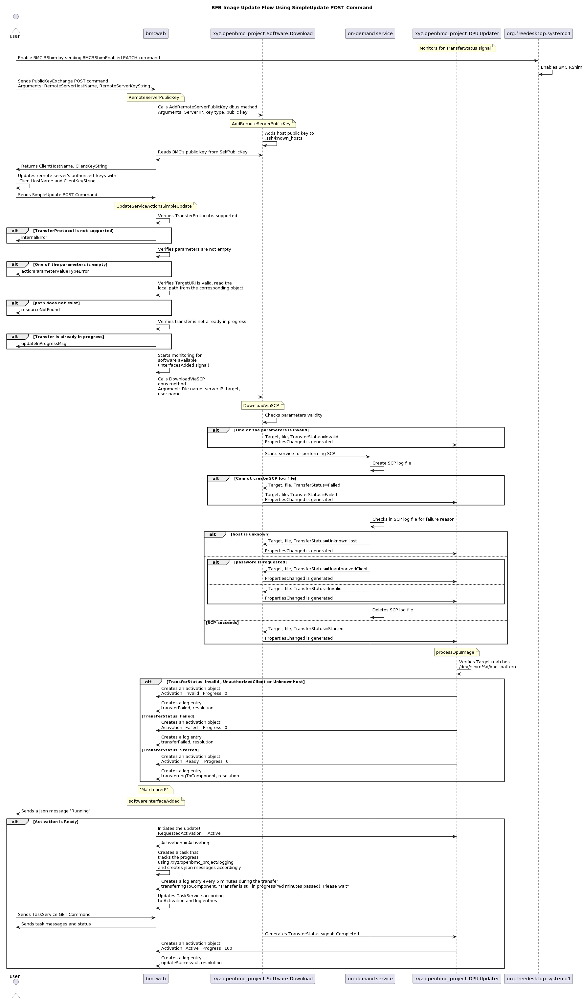

# Bluefield BFB Firmware Update via Redfish

Author: Orit Kashany

Created: September 10, 2023

## Problem Description
The objective of this feature is to enhance the firmware update implementation by adding support for
BFB (Bluefield Boot Image) firmware update via Redfish.
With this feature, users will be able to remotely update the BFB firmware through the Redfish interface
which provides greater flexibility and convenience.

## Background and References
The BFB is updated using the RShim boot module, with the file transfer possible from either the host or the BMC.
The size of the BFB image may vary and can exceed 1GB. The steps for transferring the file from the BMC RShim
are as follows:

1. The RShim shall be disabled on the host and enabled on the BMC.
Run on the host:
```
systemctl stop rshim
systemctl disable rshim
```
Run on the BMC:
```
ipmitool raw 0x32 0x6a 1
```
Verify that the RShim service is running and that the /dev/rshim device is present: 
```
ipmitool raw 0x32 0x69
```
The expected output is 0x01.

2. Since the BFB is too large to be stored on the BMC flash or tmpfs, the image needs to be written to the RShim
device from the remote server directly. Run on the host:
```
scp <path_to_bfb> root@<bmc_ip>:/dev/rshim0/boot
```
The writing above initiates a soft reset on the BF and then pushes the bootstream.
For BFBs, the eMMC is flashed automatically once the bootstream is pushed.

3. The RShim misc log level can be configured in order to receive the log messages during the procedure:   
```
echo 'DISPLAY_LEVEL 2' > /dev/rshim0/misc
cat /dev/rshim0/misc
```

4. Finally, the installed BFB file is located in the bluefield software directory under the sample directory.

## Limitations
1. The UpdateService POST command is configured to transfer new BMC/CEC images to BMC /tmp/images directory.
However, due to the large size of the BFB image, it cannot be directly transferred to the BMC using the
UpdateService POST command. Therefore an alternative method must be used for this particular case.
2. The SCP usage from a C++ program requires avoiding interactive sessions such as host trust prompts ("Do you
want to continue connecting? (y/n)"). However, the Dropbear 2022.82 SCP lacks the (-y) option to automatically
accept remote host keys as in SSH. Additionally, the (-o) option for passing options to ssh was removed.
3. DropbearSSH does not support the use of certificates, whereas the UpdateService schema solely includes
the RemoteServerCertification field for host authentication.   
4. The progress of the transfer will be only 0 or 100, as the SCP progress meter is disabled in cases where
the STDERR is not redirected to TTY.
5. When using DropbearSSH to transfer a file to /dev/rshim0/boot (a device file) using SCP, an "Invalid argument"
error is generated at the end of the transmission, although the transfer completes successfully.
Apparently OpenSSH's SCP has an S_ISREG() test guarding the truncate
(https://github.com/openssh/openssh-portable/blob/64e0600f23c6dec36c3875392ac95b8a9100c2d6/scp.c#L1934-L1935),
whereas Dropbear's does not
(https://github.com/mkj/dropbear/blob/9925b005e5b71080535afc94955ef2fe8c9d4c77/src/scp.c#L1054-L1055).
This behavior forces us to ignore Dropbear SCP failures during the transfer.

## Proposed Design - BFB Update
The general flow is described in the following sequence diagram:


### Enabling the RShim interface on BMC
The user is required to enable the BMC RShim before initiating the update procedure.
A new OEM property will be added to the Managers schema under Bluefield_BMC/Oem/Nvidia:
```
https://<bmc_ip>/redfish/v1/Managers/Bluefield_BMC/Oem/Nvidia
{
  "BmcRShim": {
    "BmcRShimEnabled": false
  }
}

curl -k -H "X-Auth-Token: $token" -H "Content-Type: application/json" -X GET https://$bmc/redfish/v1/Managers/Bluefield_BMC/Oem/Nvidia

curl -k -H "X-Auth-Token: $token" -H "Content-Type: application/json" -XPATCH -d '{
      "BmcRShim": {
        "BmcRShimEnabled": true
      }
}' https://$bmc/redfish/v1/Managers/Bluefield_BMC/Oem/Nvidia
```
- The GET command will be used to check whether the BMC RShim is currently enabled or disabled
by verifying that /dev/rshim0 exists and reading the property "ActiveState" of "org.freedesktop.systemd1.Unit" 
interface in service "org.freedesktop.systemd1" object "/org/freedesktop/systemd1/unit/rshim_2eservice". 

- The PATCH command will provide the ability to enable or disable the BMC RShim,
using the methods "Start" and "Stop" of "org.freedesktop.systemd1.Unit" interface in service "org.freedesktop.systemd1"
object "/org/freedesktop/systemd1/unit/rshim_2eservice".
```
busctl introspect org.freedesktop.systemd1 /org/freedesktop/systemd1/unit/rshim_2eservice
NAME                                TYPE      SIGNATURE       RESULT/VALUE                             FLAGS
...
org.freedesktop.systemd1.Unit       interface -               -                                        -
.Start                              method    s               o                                        -
.Stop                               method    s               o                                        -
...
.ActiveState                        property  s               "active"                                 emits-change
```
Note that it is under user's responsibility to first disable the RShim on the host before enabling the BMC RShim.

Given that this API is platform-specific, its implementation will be protected with an 'ifdef' 
BMCWEB_ENABLE_NVIDIA_OEM_BF_PROPERTIES and only compiled when the right flag is added.

### Server-Client Mutual Authentication
#### PublicKeyExchange
- To mitigate the risk of MITM attacks, it is crucial to authenticate the remote server from which the image is being downloaded.
Therefore, the user will be required to provide the remote server's public key prior the transfer request.
- To ensure a secure transfer without the need to handle and store the user's password, it is crucial to use a key-based authentication
method which uses client's public key instead of password. Therefore, the user will be provided with a public key generated by the BMC in
order to paste it as a new line at the end of the authorized_keys file on the remote server.
```
https://<bmc_ip>/redfish/v1/UpdateService/Oem/Nvidia/PublicKeyExchange
{
  "@odata.id": "/redfish/v1/UpdateService/Oem/Nvidia/PublicKeyExchange",
  "@odata.type": "#ActionInfo.v1_2_0.ActionInfo",
  "Id": "PublicKeyExchange",
  "Name": "Public key exchange",
  "Parameters": [
    {
      "Name": "RemoteServerIP",
      "Required": true,
      "DataType": "String",
      "Description": "Remote server IP address"
    },
    {
      "Name": "RemoteServerKeyString",
      "Required": true,
      "DataType": "String",
      "Description": "The remote server's public key string ("<type> <key>")"
    }
  ]    
}

Request:
curl -k -H "X-Auth-Token: <token>" -H "Content-Type: application/json" -X POST -d
'{"RemoteServerIP":"<IPAddress>", "RemoteServerKeyString":"<PublicKey>"}'
https://$bmc/redfish/v1/UpdateService/Actions/UpdateService.PublicKeyExchange

curl -k -H "X-Auth-Token: $token" -H "Content-Type: application/json" -X POST -d '{"RemoteServerIP":"10.237.69.203", "RemoteServerKeyString":"ssh-ed25519 AAAAC3NzaC1lZDI1NTE5AAAAICO3M+a95s3QfhraC5MHZdd92Ex37mo59HF+7rOEs2Hl"}' https://$bmc/redfish/v1/UpdateService/Actions/Oem/NvidiaUpdateService.PublicKeyExchange
{
  "@Message.ExtendedInfo": [
    {
      "@odata.type": "#Message.v1_1_1.Message",
      "Message": "Please add the following public key info to ~/.ssh/authorized_keys on the remote server",
      "MessageArgs": [
        "ssh-ed25519 AAAAC3NzaC1lZDI1NTE5AAAAIEPKltfiWUKXYgZ97esJHdLTFeSECLidTzlV8GeCpt4s root@dpu-bmc"
      ],
    },
    {
      "@odata.type": "#Message.v1_1_1.Message",
      "Message": "The request completed successfully.",
      "MessageArgs": [],
      "MessageId": "Base.1.15.0.Success",
      "MessageSeverity": "OK",
      "Resolution": "None"
    }
  ]
}
```
Input parameters: "RemoteServerIP" and "RemoteServerKeyString"
Output parameters: "ClientHostName" and "ClientKeyString"
For example:
Input: "10.237.69.203" , "ssh-ed25519 AAAAC3NzaC1lZDI1NTE5AAAAICO3M+a95s3QfhraC5MHZdd92Ex37mo59HF+7rOEs2Hl"
Output: "root@dpu-bmc" , "ssh-ed25519 AAAAC3NzaC1lZDI1NTE5AAAAIEPKltfiWUKXYgZ97esJHdLTFeSECLidTzlV8GeCpt4s"

All the required information for the remote server authentication can be found in the second line of the ssh-keyscan response.
```
ssh-keyscan -t <key_algorithm> <remote_server_ip>

For example:
ssh-keyscan -t ed25519 10.237.69.203
# 10.237.69.203:22 SSH-2.0-OpenSSH_8.9p1 Ubuntu-3ubuntu0.1
10.237.69.203 ssh-ed25519 AAAAC3NzaC1lZDI1NTE5AAAAICO3M+a95s3QfhraC5MHZdd92Ex37mo59HF+7rOEs2Hl

ServerIP = 10.237.69.203 , KeyAlgorithm = ssh-ed25519
PublicKey = AAAAC3NzaC1lZDI1NTE5AAAAICO3M+a95s3QfhraC5MHZdd92Ex37mo59HF+7rOEs2Hl
```
The action will use the methods AddRemoteServerPublicKey and the property SelfPublicKey
in the SCP interface described below.

### Revoking all server public keys
This action will be used for revoking all the keys of the given remote server from the ~/.ssh/known_hosts file.
```
https://<bmc_ip>/redfish/v1/UpdateService/Oem/Nvidia/RevokeAllRemoteServerPublicKeys
{
  "@odata.id": "/redfish/v1/UpdateService/Oem/Nvidia/RevokeAllRemoteServerPublicKeys",
  "@odata.type": "#ActionInfo.v1_2_0.ActionInfo",
  "Id": "Revoke all remote server public keys",
  "Name": "RevokeAllRemoteServerPublicKeys",
  "Parameters": [
    {
      "Name": "RemoteServerIP",
      "Required": true,
      "DataType": "String",
      "Description": "Remote server IP address"
    }
  ]
}

Request:
curl -k -H "X-Auth-Token: $token" -H "Content-Type: application/json" -X POST -d '{"RemoteServerIP":"<IP>"}' 
https://$bmc/redfish/v1/UpdateService/Actions/Oem/NvidiaUpdateService.RevokeAllRemoteServerPublicKeys

Answer:
{
  "@Message.ExtendedInfo": [
    {
      "@odata.type": "#Message.v1_1_1.Message",
      "Message": "The request completed successfully.",
      "MessageArgs": [],
      "MessageId": "Base.1.15.0.Success",
      "MessageSeverity": "OK",
      "Resolution": "None"
    }
  ]
}
```

### Pushing the image
The implementation is structured into three distinct layers:
1. The SimpleUpdate redfish command - bmcweb
2. The SCP interface and methods implementation - phosphor-dbus-interface and phosphor-bmc-code-mgmt
3. The DPU updater - dpu-manager

#### The SimpleUpdate redfish command
The SimpleUpdate action within the UpdateService schema will be used for the BFB updates:
```
https://<bmc_ip>/redfish/v1/UpdateService/SimpleUpdateActionInfo
{
  "@odata.id": "/redfish/v1/UpdateService/SimpleUpdateActionInfo",
  "@odata.type": "#ActionInfo.v1_2_0.ActionInfo",
  "Id": "SimpleUpdateActionInfo",
  "Name": "Simple Update Action Info",
  "Parameters": [
    {
      "Name": "ImageURI",
      "Required": true,
      "DataType": "String",
      "Description": "The URL of the firmware image to be updated. Its format should be <ServerIP>/<BFBPath>."
    },
    {
      "Name": "TransferProtocol",
      "Required": false,
      "DataType": "String",
      "Description": "The protocol used to transfer the firmware image",
      "AllowableValues": [
        "SCP"
      ]
    },
    {
      "Name": "Targets",
      "Required": false,
      "DataType": "StringArray",
      "Description": "The array of target URI to apply the firmware update"
    },
    {
      "Name": "Username",
      "Required": false,
      "DataType": "String",
      "Description": "The username on the remote server to authenticate the file transfer"
    }
  ]
}

curl -k -H "X-Auth-Token: <token>" -H "Content-Type: application/json" -X POST -d
'{"TransferProtocol":"SCP", "ImageURI":"<ImageURI>", "Targets":"<TargetURI>", "Username":"<Username>"}'
https://$bmc/redfish/v1/UpdateService/Actions/UpdateService.SimpleUpdate
```

##### ImageURI
The URL of the firmware image to be updated. Its format should be <ServerIP>/<BFBPath>.

##### TransferProtocol
The protocol used to transfer the firmware image. The only supported protocol is SCP.

##### Targets
The array of target URIs to apply the firmware update. In our case, only one update is allowed at a time, 
meaning the user needs to provide just one URI. Users are limited to using only the URIs under
UpdateService/FirmwareInventory for which their "updateable" field is true.
In our case only: redfish/v1/UpdateService/FirmwareInventory/DPU_OS
But other services might choose other URIs.
```
curl -k -H "X-Auth-Token: $token" -H "Content-Type: application/json" -X GET \
https://$bmc/redfish/v1/UpdateService/FirmwareInventory/DPU_OS
{
  "@odata.id": "/redfish/v1/UpdateService/FirmwareInventory/DPU_OS",
  "@odata.type": "#SoftwareInventory.v1_4_0.SoftwareInventory",
  "Description": "Host image",
  "Id": "DPU_OS",
  "Members@odata.count": 1,
  "Name": "Software Inventory",
  ...
  "Updateable": true,
  "Version": "DOCA_2.2.0_BSP_4.2.0_Ubuntu_22.04-1.20230711.dev"
```
The objects create the FirmwareInventory entries will inherit from the FilePath inteface, and will hold
the actual internal path used for the update procedure.

##### Username
The username on the remote server to authenticate the file transfer.

#### The SCP Interface
OpenBMC currently only supports TFTP for firmware image transfer. To add the SCP support, a new SCP interface called
xyz.openbmc_project.Common.SCP will be added to phosphor-dbus-interface. The SCP interface will contain three methods for
adding and removing a new known host, and downloading firmware images, and three properties for indicating the
transfer status:
https://gitlab-master.nvidia.com/dgx/bmc/phosphor-dbus-interfaces/-/blob/develop/yaml/xyz/openbmc_project/Common/SCP.interface.yaml


The /xyz/openbmc_project/software object in the "xyz.openbmc_project.Software.Download" service will inherit from the
SCP interface and will perform the SCP transfer:
```
busctl introspect xyz.openbmc_project.Software.Download /xyz/openbmc_project/software
NAME                                TYPE      SIGNATURE  RESULT/VALUE   FLAGS
....
xyz.openbmc_project.Common.SCP      interface -          -                                        -
.AddRemoteServerPublicKey           method    ss         -                                        -
.DownloadViaSCP                     method    ssss       -                                        -
.GenerateSelfKeyPair                method    -          s                                        -
.RevokeAllRemoteServerPublicKeys    method    s          -                                        -
.FileName                           property  s          ""                                       emits-change writable
.Target                             property  s          ""                                       emits-change writable
.TransferStatus                     property  s          "xyz.openbmc_project.Common.SCP.Statu... emits-change writable
xyz.openbmc_project.Common.TFTP     interface -          -                                        -
.DownloadViaTFTP                    method    ss         -                                        -
```
##### AddRemoteServerPublicKey
The AddRemoteServerPublicKey method will be used for adding servers' public keys to the known hosts list which
is stored in ~/.ssh/known_host. Receives ServerAddress and PublicKeyStr ("<type> <key>").

##### RevokeRemoteServerPublicKey
The RevokeRemoteServerPublicKey method will be used for removing all the public keys related to a given remote server
from the known hosts list which is stored in ~/.ssh/known_host. Receives ServerAddress.

##### GenerateSelfKeyPair
The GenerateSelfKeyPair method will be used for generating BMC's SSH key pair for key-based authentication.
In case the key already exists:
```
dropbearkey -y -f ~/.ssh/id_dropbear
```
In case it does not exist, it will be generated using the following:
```
dropbearkey -t ed25519 -f ~/.ssh/id_dropbear
```

##### DownloadViaSCP
The method will start an on-demand service, which will run a shell script to perform the SCP and to update
"xyz.openbmc_project.Software.Download" service status properties accordingly.
Dropbear SCP will be used for transfering the file. In order to avoid any interaction sessions, the user
is required to:
1. Modify the remote server's authorized_keys file with the BMC root's public key.
2. Provide the remote server public key, which will be added to the BMC's known_host file.
Only one transfer is allowed at a time.

##### Status properties
The status properties; FileName, Target and TransferStatus, will be updated by the on-demand service when the
transfer starts, fails and completes.

#### The DPU updater
The DPU Updater is a platform-specific service.
```
busctl tree xyz.openbmc_project.Software.DPU.Updater
`-/xyz
  `-/xyz/openbmc_project
    `-/xyz/openbmc_project/software
      `-/xyz/openbmc_project/software/BF_DPU_BFB_UPDATE
```

When an update procedure is initiated, a new activation and activation progress object called
"/xyz/openbmc_project/software/BF_DPU_BFB_UPDATE" is created. This object is required by bmcweb and is responsible
for tracking the progress of the transfer.
Whenever the TransferStatus property is changed and a PropertiesChanged signal is generated, the DPU Updater
updates the progress (0 or 100), creates an activation object, and creates a log entry with all the necessary information.

### Tracking the procedure
A new task is created under the TaskService whenever a transferring procedure is initiated. This task serves as a record
of the ongoing procedure and provides updated messages at various stages, including the start, failure, and completion of
the procedure.
```
curl -k -H "X-Auth-Token: $token" -H "Content-Type: application/json" -X GET https://$bmc/redfish/v1/TaskService/Tasks
```
During the transfer, a keep-alive message is generated every 5 minutes with the content:
'Transfer is still in progress (%d minutes elapsed): Please wait,' which contains the elapsed time. This periodic message
reassures the user that the transfer process is ongoing.
```
    {
      "@odata.type": "#MessageRegistry.v1_4_1.MessageRegistry",
      "Message": "Image 'DOCA_2.0.2_BSP_4.0.1_Ubuntu_22.04-1.20230330.bfb' is being transferred to '/dev/rshim0/boot'.",
      "MessageArgs": [
        "DOCA_2.0.2_BSP_4.0.1_Ubuntu_22.04-1.20230330.bfb",
        "/dev/rshim0/boot"
      ],
      "MessageId": "Update.1.0.TransferringToComponent",
      "Resolution": "Transfer is still in progress (25 minutes passed): Please wait",
      "Severity": "OK"
    },
```
