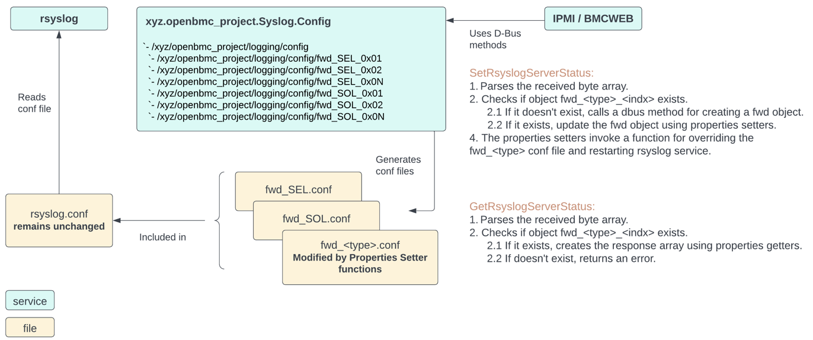

# Bluefield BMC Log Streaming to rsyslog Servers

Author: Orit Kashany

Created: May 27, 2024

## Problem Description
The objective of this feature is to support the ability of streaming out
multiple types of log reports to rsyslog servers. This design suggests
an implementation that allows users to configure rsyslog fwd actions and rulesets in
generated conf files.

## Background and References
### rsyslog
Rsyslog is a rocket-fast system for log processing, known for its exceptional
performance, robust security features and modular design. Originally developed
as a traditional syslogd, rsyslog has evolved into a versatile tool for logging.
It can:
* Accept inputs from a wide range of sources.
* Transform the collected data.
* Output the results to various destinations.

The rsyslog is configured using the rsyslog.conf file, which determines how the
logging system operates. It allows to define rules for log processing,
including input sources, message filtering and output destinations.
In the BMC, rsyslog.conf is found in /etc directory and includes all the conf
files located in /etc/rsyslog.d/:
```
      etc
    └── rsyslog.conf
    └── rsyslog.d
                ├── server.conf
                ├── ….
```

Ruleset in rsyslog is a container for rules that specify how to process log
messages. Action in rsyslog is a specific operation performed on log messages
that match the rules in a ruleset (e.g., forwarding, writing to a file).
To use a ruleset, it needs to be binded to specific log inputs. For example:
```
ruleset(name="MyRuleset") {
  action(type="omfwd" target="192.168.1.1" port="514" protocol="udp")
  action(type="omfwd" target="192.168.1.2" port="514" protocol="udp")
}

module(load="imuxsock") # for receiving log messages from syslog
input(type="imuxsock" ruleset="MyRuleset")
```

rsyslog API specification can be found here:
https://www.rsyslog.com/doc/index.html

### D-Bus API for Syslog Configuration
The xyz.openbmc_project.Syslog.Config service is part of the Phosphor-Logging
repository and responsible for editing /etc/rsyslog.d/server.conf to stream out
local logs. For example, to stream out local logs using TCP or UDP:
```
*.* @@<Server_IP>:<Server_Port> // TCP
*.* @<Server_IP>:<Server_Port> // UDP
```

The current tree of the service:
```
busctl tree xyz.openbmc_project.Syslog.Config
`- /xyz
  `- /xyz/openbmc_project
    `- /xyz/openbmc_project/logging
      `- /xyz/openbmc_project/logging/config
        `- /xyz/openbmc_project/logging/config/remote
```
The logging and logging/config objects inherit from
org.freedesktop.DBus.Introspectable, org.freedesktop.DBus.Peer and
org.freedesktop.DBus.Properties. 
The logging/config/remote inherites from the interfaces mentioned above and
from xyz.openbmc_project.Network.Client.

More information can be found here:
https://gitlab-master.nvidia.com/dgx/bmc/phosphor-logging#remote-logging-via-rsyslog


## Proposed Design
The general flow is described in the following block diagram:


### Rsyslog configuration
The rsyslog.conf will contain all the fixed configurations, while the rulesets
with the fwd actions, which should be modified, will be stored in dedicated
conf files fwd_<log_type>.conf located in /etc/rsyslog.d:
/etc/rsyslog.d/fwd_SEL.conf:
```
ruleset(name="RulesetFwdSEL") {
  action(type="omfwd" target="<Server1_IP>" port="<Server1_Port>" template="ConsoleTemplate")
  …
  action(type="omfwd" target="<ServerN_IP>" port="<ServerN_Port>" template="ConsoleTemplate")
}
```
/etc/rsyslog.d/fwd_SOL.conf:
```
ruleset(name="RulesetFwdSOL") {
  action(type="omfwd" target="<Server1_IP>" port="<Server1_Port>" template="ConsoleTemplate")
  …
  action(type="omfwd" target="<ServerN_IP>" port="<ServerN_Port>" template="ConsoleTemplate")
}
```

The rsyslog.conf, which is platform specific and installed as part of the openbmc
bbappeand files, will remain unchanged. For example:
```
...
# Add module of custom socket for serial console logs
module(load="imuxsock" SysSock.Use="off")
...
# Transfer DPU SoL to rsyslog
input(type="imuxsock"
  Socket="/run/rsyslog/console_input"
  CreatePath="on"
  UseSpecialParser="off"
  ParseHostname="off"
  ruleset="RulesetFwdSOL")

# Add module of reading lines from a file
module(load="imfile" Mode="inotify")

# Input configuration to read log messages from a file
input(type="imfile"
      File="/var/lib/logging/logs/errors/SEL/SELAdditionalData"
      ruleset="RulesetFwdSEL")
```

### D-Bus API
Two new interfaces will be added under phosphor-dbus-interface/yaml/xyz/openbmc_project/Logging:
  1. RsyslogActionsManager.interface - Allows creating new rsyslog actions.
  2. RsyslogFwd.interface - Represents a single fwd action.

#### RsyslogActionsManager.interface.yaml
```
description: >
    Manages rsyslog actions.

methods:
    - name: CreateRsyslogFwd
      description: >
          Creates a new rsyslog fwd action.
      parameters:
          - name: Index
            type: size
            description: >
                Index of Server.
          - name: LogType
            type: byte
            description: >
                Server log type.
      errors:
          - xyz.openbmc_project.Common.Error.InternalFailure
          - xyz.openbmc_project.Common.Error.InvalidArgument
```

#### RsyslogFwd.interface.yaml
```
description: >
    Provides rsyslog fwd action configurations.
    The setter functions of the properties generate and override conf files to be
    used by the rsyslog service.

properties:
    - name: Index
      type: size
      description: >
          Index of Server. Limited to 10.
    - name: LogType
      type: enum[self.LogType]
      description: >
          Server log type.
    - name: Enabled
      type: boolean
      description: >
          Rsyslog server fwd action is enabled/disabled.
    - name: TransportProtocol
      type: enum[self.TransportProtocol]
      description: >
          Server transport protocol.
    - name: NetworkProtocol
      type: enum[self.NetworkProtocol]
      description: >
          Server network protocol.
    - name: Address
      type: string
      description: >
          The IP address of the server in IPv4 or IPv6 format.
    - name: Port
      type: uint16
      description: >
          The port number which is used for the transport.

enumerations:
    - name: LogType
      description: >
          Possible log types.
      values:
          - name: AuditLog
          - name: SEL
          - name: Syslog
          - name: SOL
    - name: TransportProtocol
      description: >
          Possible transport layer protocols.
      values:
          - name: TCP
          - name: UDP
    - name: NetworkProtocol
      description: >
          Possible network layer protocols.
      values:
          - name: IPv4
          - name: IPv6
```

### Modifications in xyz.openbmc_project.Syslog.Config
The abilities of the xyz.openbmc_project.Syslog.Config service will be extended
to create and modify multiple conf files, one conf file per log type:
```
    etc
    └── rsyslog.conf
    └── rsyslog.d
                ├── server.conf
                ├── fwd_AuditLog.conf
                ├── fwd_SEL.conf
                ├── fwd_Syslog.conf
                ├── fwd_SOL.conf
```
The /xyz/openbmc_project/logging/config of the Syslog.Config service will
inherit from the RsyslogActionsManager interface described above.
The new objects, /xyz/openbmc_project/logging/config/fwd_SEL_<indx> will
inherit from the RsyslogFwd interface described above and from
xyz.openbmc_project.Object.Delete.
```
busctl tree xyz.openbmc_project.Syslog.Config
`- /xyz
  `- /xyz/openbmc_project
    `- /xyz/openbmc_project/logging
      `- /xyz/openbmc_project/logging/config
        `- /xyz/openbmc_project/logging/config/remote
        `- /xyz/openbmc_project/logging/config/fwd_SEL_0x01
        `- /xyz/openbmc_project/logging/config/fwd_SEL_0x0N
        `- /xyz/openbmc_project/logging/config/fwd_SOL_0x01
        `- /xyz/openbmc_project/logging/config/fwd_SEL_0x0N
```

* Adding a new fwd action will be performed by RsyslogActionsManager
CreateRsyslogFwd method.
* Modifying an existing fwd action will be performed by the setter
functions of the properties. These will also invoke a function for
overriding the relevant fwd_<type>.conf file and restarting rsyslog service.
* Deleting an existing fwd action will be performed by calling the Delete
method of the fwd_<type>_<indx> object, which will delete the object,
override the relevant fwd_<type>.conf file and restart rsyslog service.

The conf creation/modification will be triggered from changes in the
fwd_<type>_<indx> objects.

### IPMI Commands
#### Get rsyslog status
Request Content (2 Bytes):
1: Index
Index of Server.
2: Log type
0x00 AuditLog
0x01 SEL
0x02 Syslog
0x03 SOL

Response (12/24 Bytes):
1: Completion Code
2: Index
Index of Server
3: Log type
0x00 AuditLog
0x01 SEL
0x02 Syslog
0x03 SOL
4: rsyslog status
0x00 Disabled
0x01 Enabled
5: rsyslog server
0x00 UDP
0x01 TCP
6: rsyslog server ipv4/ipv6
0x00 ipv4
0x01 ipv6
7-n: rsyslog server (4/16 Bytes)
ipv4 address (4 Bytes)
ipv6 address (16 Bytes)
n-n+2: rsyslog server port
port (LSB first)

#### Set rsyslog status
Request Content (11/23 Bytes):
1: Index
Index of Server. Limited to 10.
2: Log type
0x00 AuditLog
0x01 SEL
0x02 Syslog
0x03 SOL
3: rsyslog status
0x00 Disabled
0x01 Enabled
4: rsyslog server
0x00 UDP
0x01 TCP
5: rsyslog server ipv4/ipv6
0x00 ipv4
0x01 ipv6
6-n: rsyslog server (4/16 Bytes)
ipv4 address (4 Bytes)

Response (1 Byte):
1: Completion Code

### Redfish Commands
The EventDestination schema should be used for configuring multiple rsyslog
servers. An EventDestination resource is created by performing a POST to
/redfish/v1/EventService/Subscriptions. These are examples of EventDestination
properties which are being set using a POST request to specify syslog:
* Destination - To express that a syslog server receiving the notifications.
* SubscriptionType - To indicate syslog.
* Protocol - To specify the transport type (TLS, TCP, UDP or RELP).
* SyslogFilters - To control what notifications are sent.

The EventDestintion schema is currently not supported by openbmc bmcweb.