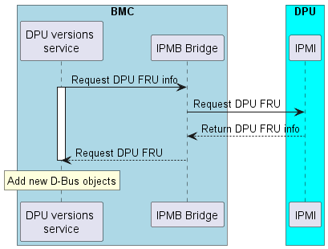
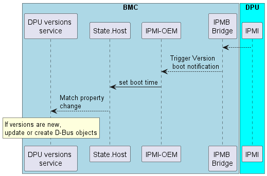

# DPU software versions

Author: Adi Fogel

Created: Jan 29, 2023

## Problem Description
The purpose of the feature is for the BMC to be able to have the current 
versions of the DPU entities. The versions should be under D-Bus object to 
make them available for all services in the BMC including the object mapper. 

## Background and References
The BMC holds versions of the BMC FW and ERoT, this feature will add 
additional DPU versions information and make all of them available under 
/xyz/openbmc_project/software path. All firmware versions are available by redfish under: 
UpdateService/FirmwareInventory. 

## Requirements
- The current version of DPU UEFI, ATF and NIC should be available for redfish
- The Version should be under the same path namespace as other versions in BMC: 
  /xyz/openbmc_project/software.
- The object interface shall also inherit from xyz.openbmc_project.Software.Version, 
  like other versions objects in BMC 
- The D-Bus object interface shall also inherit from xyz.openbmc_project.Association.Definitions
  and be associated to function.
 
 
## Proposed Design
The BMC and DPU communicate over IPMB channel. Using IPMB sendRequest command
the BMC can get the DPU SDR information and parsed to get the needed versions.
The DPU version service will create new D-Bus objects with the version information. 
```
┌───────────────────────────────────────────┐
│                                           │        ┌─────────────────────────────┐
│     ┌─────────┐                           │        │                             │
│     │   UEFI  │                           │        │                 ┌────────┐  │
│     │  VERSION◄──┐                        │        │                 │        │  │
│     │   Obj   │  │                        │        │               ┌─┤UEFI    │  │
│     └─────────┘  │       ┌─────────────┐  │        │               │ └────────┘  │
│                  │       │ IPMI OEM    │  │        │               |             │
│     ┌─────────┐  │       │             │  │ IPMB   │  ┌──────────┐ │ ┌────────┐  │
│     │ ATF     │  │create │ ┌─────────┐ ◄──┼────────┼──┘IPMI      | | |        |  │
│     │ Version ◄──┼───────┤ │ DPU     │ ┌──┼────────┼──►SDR entry ◄─┼─┤ATF     │  │
│     │ Obj     │  │       │ │ Version │ │  │        │  └──────────┘ │ └────────┘  │
│     └─────────┘  │       │ │ Service │ │  │        │               |             │
│                  │       │ └─────────┘ │  │        │               | ┌────────┐  │
│     ┌─────────┐  │       │             │  │        │               | │        |  │
│     │ NIC     │  │       └─────────────┘  │        │               ├─| NIC    |  │
│     │ Version ◄──┘                        │        │                 └────────┘  │
│     │ Obj     │                           │        │                             │
│     └─────────┘                           │        │                             |    
│ BMC                                       │        │   DPU                       │
└───────────────────────────────────────────┘        └─────────────────────────────┘
```

The DPU versions service will located in the nvidia-ipmi-oem repository and this service will 
manage the versions of the DPU in the following manner: 
## BMC boots
Upon start, following steps will happen: 
 1. Get the DPU versions (ATF, UEFI and NIC): 
      1. Find SDR record and loop till find the SDR record ID: 
        1. Loop over the DPU SDR, searching header for record type 0x12 (Management 
            controller device locator record)
        2. Get the Device ID string length
        3. read the Device ID string and check if match "Bluefield_MC"
        4. if strings are the same - get the SDR record ID
      3. Get record SDR entry info including length of data. 
      4. Read the SDR entry data. 
2. Parse the data to get the needed versions. 
3. Add a new D-Bus objects with the version information with 
    xyz.openbmc_project.Software.Version interface. 
If the DPU did not powered, the version will be set to an empty string. The version will
be update later when the DPU power up.


## DPU boots
Update from DPU side - when DPU power up, the UEFI will send an OEM command:
ipmitool raw 0x3C  0x92
This command will set the value of BootProgressLastUpdate in xyz.openbmc_project.State.Boot.Progress
under D-Bus service xyz.openbmc_project.State.Host, path:/xyz/openbmc_project/state/host0
This service is registered on property change of this value, in case of change:
1. Add sleep of 2 minutes because need to wait till mlx-OpenIPMI service is up
2. Repeat steps 1 – 2.
3. If there is a new version found, update the version of the object exists, if not exist, create the object.



## DPU software D-Bus object example:
Version object example: 
busctl introspect  xyz.openbmc_project. Software.DPU.version /xyz/openbmc_project/software/ATF_BlueField   

```
NAME                                        TYPE      SIGNATURE RESULT/VALUE                             FLAGS
org.freedesktop.DBus.Introspectable         interface -         -                                        -
.Introspect                                 method    -         s                                        -
org.freedesktop.DBus.Peer                   interface -         -                                        -
.GetMachineId                               method    -         s                                        -
.Ping                                       method    -         -                                        -
org.freedesktop.DBus.Properties             interface -         -                                        -
.Get                                        method    ss        v                                        -
.GetAll                                     method    s         a{sv}                                    -
.Set                                        method    ssv       -                                        -
.PropertiesChanged                          signal    sa{sv}as  -                                        -
xyz.openbmc_project.Association.Definitions interface -         -                                        -
.Associations                               property  a(sss)     3 (see table below)       emits-change writable
xyz.openbmc_project.Software.Version        interface -         -                                        -
.Purpose                                    property  s         "xyz.openbmc_project.Software.VersionPurpose.Host" emits-change writable
.SoftwareId                                 property  s         ""                                       emits-change writable
.Version                                    property  s         "3.9.3-7-g8f2d8ca"                                    emits-change writable
```


Assocoation:
|**Forward**|**Reverse**|**path**|
| :- | :- | :- |
|functional|software_version|/xyz/openbmc_project/software|
|updateable|software_version|/xyz/openbmc_project/software|
|parent_chassis|all_chassis|/xyz/openbmc_project/inventory/system/chassis/Card1|


All will be available in redfish under /redfish/v1/UpdateService/FirmwareInventory, for example:
```
{
  "@odata.id": "/redfish/v1/UpdateService/FirmwareInventory",
  "@odata.type": "#SoftwareInventoryCollection.SoftwareInventoryCollection",
  "Members": [
    {
      "@odata.id": "/redfish/v1/UpdateService/FirmwareInventory/72da593f_running"
    },
    {
      "@odata.id": "/redfish/v1/UpdateService/FirmwareInventory/BF_CEC"
    },
    {
      "@odata.id": "/redfish/v1/UpdateService/FirmwareInventory/DPU_ATF"
    },
    {
      "@odata.id": "/redfish/v1/UpdateService/FirmwareInventory/DPU_NIC"
    },
    {
      "@odata.id": "/redfish/v1/UpdateService/FirmwareInventory/DPU_UEFI"
    }
  ],
  "Members@odata.count": 5,
  "Name": "Software Inventory Collection"
```

## Alternatives Considered
Instead of getting DPU triggering sync of version, every 10 minutes the service will run sync versions.

## Testing
1. Check objects exist under the new service path 
2. Check objects exist under the object mapper, path: /xyz/openbmc_project/software and interface: xyz.openbmc_project.Software.Version
3. Verifing the all the version exist under: redfish/v1/UpdateService/FirmwareInventory/
4. Redfish Service Validator
5. Check under these scenarios:
  - Reboot only BMC
  - Reboot only DPU


