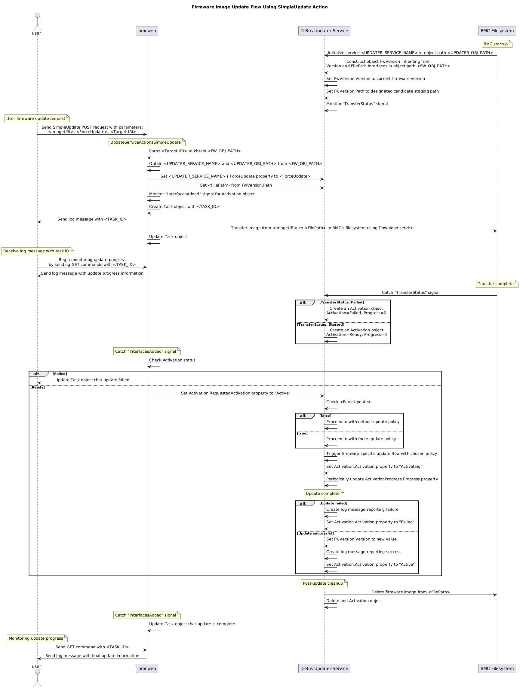

# Enabling ForceUpdate Parameter in SimpleUpdate Action in Redfish Interface

Author: Yuval Nissan

Created: August 6, 2024

- [Enabling ForceUpdate Parameter in SimpleUpdate Action in Redfish Interface](#enabling-forceupdate-parameter-in-simpleupdate-action-in-redfish-interface)
  - [Feature Description](#feature-description)
  - [References](#references)
  - [Background](#background)
    - [Redfish SimpleUpdate Action](#redfish-simpleupdate-action)
    - [Relevant D-Bus Interfaces](#relevant-d-bus-interfaces)
      - [xyz.openbmc\_project.Software.Version](#xyzopenbmc_projectsoftwareversion)
      - [xyz.openbmc\_project.Common.FilePath](#xyzopenbmc_projectcommonfilepath)
      - [xyz.openbmc\_project.Software.UpdatePolicy](#xyzopenbmc_projectsoftwareupdatepolicy)
    - [Firmware Inventory](#firmware-inventory)
    - [Updatable Firmware Inventory URIs](#updatable-firmware-inventory-uris)
  - [Requirements](#requirements)
  - [Proposed Design](#proposed-design)
    - [General Flow Diagram](#general-flow-diagram)
    - [Implementation of Force Update Option in D-Bus Layer](#implementation-of-force-update-option-in-d-bus-layer)
    - [Implementation of Force Update Option in Redfish Layer](#implementation-of-force-update-option-in-redfish-layer)
  - [Unit Testing](#unit-testing)
    - [Test Firmware Update with Item Supporting Force Update](#test-firmware-update-with-item-supporting-force-update)
    - [Test Firmware Update with Item Not Supporting Force Update](#test-firmware-update-with-item-not-supporting-force-update)
    - [Test Traceability Matrix](#test-traceability-matrix)

## Feature Description

The objective of this feature is to support the ability to override the default update policy of firmware components, so that the update is forced to be carried-out. In simpler terms, this feature supports the ability to perform a force update.

## References

1. [Redfish Data Model Specification (Version 2024.1)](https://www.dmtf.org/sites/default/files/standards/documents/DSP0268_2024.1.pdf)

## Background

### Redfish SimpleUpdate Action

Firmware components are updated through the Redfish interface using the `SimpleUpdate` action.

A `SimpleUpdate` action is executed by a user using the following command template:

```text
curl -k -u '<USERNAME>':'<PASSWORD>' -H "Content-Type: application/json" -X POST -d '{"TransferProtocol":"<TRANS_PROT>", "ImageURI":"<REMOTE_SERVER_IP>/<FW_IMAGE_PATH>", "Targets":["<FW_TARGET_URI>"], "ForceUpdate":<true/false>}' https://<BMC_IP>/redfish/v1/UpdateService/Actions/UpdateService.SimpleUpdate
```

The following specification about the `SimpleUpdate` action’s `ForceUpdate` parameter is taken directly from [[1]](#references), pages 1518-1519:

**Action Parameters**

|     Parameter Name     |   Type  | Attributes | Notes |
| ---------------------- | ------- | ---------- | ----- |
| `ForceUpdate` (v1.11+) | boolean | *Optional* | An indication of whether the service should bypass update policies when applying the provided image. The default is `false`.<br><br>- This parameter shall indicate whether the service should bypass update policies when applying the provided image, such as allowing a component to be downgraded. Services may contain update policies that are never bypassed, such as minimum version enforcement. If the client does not provide this parameter, the service shall default this value to `false`. |

### Relevant D-Bus Interfaces

#### xyz.openbmc_project.Software.Version

Source: [phosphor-dbus-interfaces/yaml/xyz/openbmc_project/Software/Version.interface.yaml](https://gitlab-master.nvidia.com/dgx/bmc/phosphor-dbus-interfaces/-/blob/develop/yaml/xyz/openbmc_project/Software/Version.interface.yaml)

Implement to associate a D-Bus object to a firmware component. When an object called `/xyz/openbmc_project/software` inherits from this interface, it is associated with the firmware level of a real device, making it part of the Firmware Inventory.

#### xyz.openbmc_project.Common.FilePath

Source: [phosphor-dbus-interfaces/yaml/xyz/openbmc_project/Common/FilePath.interface.yaml](https://gitlab-master.nvidia.com/dgx/bmc/phosphor-dbus-interfaces/-/blob/develop/yaml/xyz/openbmc_project/Common/FilePath.interface.yaml)

Implement to encapsulate a filesystem path in a D-Bus object. For a Firmware Inventory item, this associates the firmware version stored in the object with the path to the firmware image in the BMC’s filesystem.

#### xyz.openbmc_project.Software.UpdatePolicy

Source: [phosphor-dbus-interfaces/yaml/xyz/openbmc_project/Software/UpdatePolicy.interface.yaml](https://gitlab-master.nvidia.com/dgx/bmc/phosphor-dbus-interfaces/-/blob/develop/yaml/xyz/openbmc_project/Software/UpdatePolicy.interface.yaml)

Implement to allow client to configure the firmware update policy. The properties override the default policy of the firmware package associated with the Firmware Inventory item, and are applied during firmware update.

### Firmware Inventory

The Firmware Inventory is a collection of URIs assembled by the Redfish interface. Each URI corresponds to a D-Bus object contained in the path `/xyz/openbmc_project/software` and implementing the `xyz.openbmc_project.Software.Version` D-Bus interface. These D-Bus objects represent firmware components and are maintained by D-Bus services implementing tailored update procedures for each one. These update procedures can be triggered using the `SimpleUpdate` action in the Redfish interface.

Retrieving the Firmware Inventory is done by executing

```text
curl -k -u '<USERNAME>':'<PASSWORD>' -H 'Content-type: application/json' -X GET 'https://<BMP_IP>/redfish/v1/UpdateService/FirmwareInventory'
```

If succesful, the command above prints the following JSON array:

<details open>
    <summary>Output</summary>

```json
{
  "@odata.id": "/redfish/v1/UpdateService/FirmwareInventory",
  "@odata.type": "#SoftwareInventoryCollection.SoftwareInventoryCollection",
  "Members": [
    {
      "@odata.id": "/redfish/v1/UpdateService/FirmwareInventory/BMC_Firmware"
    },
    {
      "@odata.id": "/redfish/v1/UpdateService/FirmwareInventory/Bluefield_FW_ERoT"
    },
    {
      "@odata.id": "/redfish/v1/UpdateService/FirmwareInventory/DPU_ATF"
    },
    {
      "@odata.id": "/redfish/v1/UpdateService/FirmwareInventory/DPU_BOARD"
    },
    {
      "@odata.id": "/redfish/v1/UpdateService/FirmwareInventory/DPU_BSP"
    },
    {
      "@odata.id": "/redfish/v1/UpdateService/FirmwareInventory/DPU_NIC"
    },
    {
      "@odata.id": "/redfish/v1/UpdateService/FirmwareInventory/DPU_NODE"
    },
    {
      "@odata.id": "/redfish/v1/UpdateService/FirmwareInventory/DPU_OFED"
    },
    {
      "@odata.id": "/redfish/v1/UpdateService/FirmwareInventory/DPU_OS"
    },
    {
      "@odata.id": "/redfish/v1/UpdateService/FirmwareInventory/DPU_SYS_IMAGE"
    },
    {
      "@odata.id": "/redfish/v1/UpdateService/FirmwareInventory/DPU_UEFI"
    },
    {
      "@odata.id": "/redfish/v1/UpdateService/FirmwareInventory/golden_image_arm"
    },
    {
      "@odata.id": "/redfish/v1/UpdateService/FirmwareInventory/golden_image_nic"
    }
  ],
  "Members@odata.count": 13,
  "Name": "Software Inventory Collection"
}
```

</details>

### Updatable Firmware Inventory URIs

Currently, the following are the only Firmware Inventory URIs corresponding to firmware components which can be updated via the SimpleUpdate action:

1. `/redfish/v1/UpdateService/FirmwareInventory/DPU_OS` — used to request the installation of a BFB file to the DPU.
2. `/redfish/v1/UpdateService/FirmwareInventory/golden_image_arm` — used to request the update of the ARM golden image stored in the BMC's flash memory.
3. `/redfish/v1/UpdateService/FirmwareInventory/golden_image_nic` — used to request the update of the NIC firmware golden image stored in the BMC's flash memory.

## Requirements

| ID  | Description | Priority |
| --- | ----------- | -------- |
| FR1 | Firmware updating services should be able to support a firmware update with a force-update option. | Mandatory |
| FR2 | If supported, users should be able to enable the force-update option, by setting the `ForceUpdate` parameter to `true`, when executing a firmware update via a `SimpleUpdate` action. | Mandatory |
| FR3 | For a `SimpleUpdate` action, the default value of the force-update option, i.e. `ForceUpdate` parameter, for all firmware components should be `false`. | Mandatory |
| FR4 | The update policy should be explicitly set regardless of whether the `ForceUpdate` parameter is set to `true`, `false` or is omitted in a `SimpleUpdate` action. This is to ensure the correct configuration as there is no guarantee on the value of this option prior to the execution of the `SimpleUpdate` action. | Mandatory |
| FR5 | Execution of a `SimpleUpdate` action with the `ForceUpdate` parameter set to `true`, for a firmware component which does not support the force-update option, should proceed with the update with the default update policy. | Mandatory |

## Proposed Design

### General Flow Diagram

The general flow of a firmware component update via the Redfish interface is described in the following diagram:



### Implementation of Force Update Option in D-Bus Layer

In order to support a force-update option for a specific firmware component, the updater service owning the corresponding D-Bus object needs to implement the `xyz.openbmc_project.Software.UpdatePolicy` D-Bus interface. This interface includes the `ForceUpdate` property, which is set from the Redfish interface to control whether or not a force-update should be carried out. The implementation of each updater service should include how to handle the value of this property when an update request is initiated.

### Implementation of Force Update Option in Redfish Layer

The SimpleUpdate action parameter list includes `Targets`, which is assumed to have a single firmware target URI, of the form `/redfish/v1/UpdateService/FirmwareInventory/<FW_NAME>`. From this parameter, the updater service's name and object path need to be located in order to set the `ForceUpdate` property to the value given in the `ForceUpdate` parameter, which is denoted as `<FORCE_UPDATE>`. This is done the following way:

1. Obtain firmware D-Bus object path `<FW_OBJ_PATH>`:

   The D-Bus object path corresponding to the firmware component is assumed to be `/xyz/openbmc_project/software/<FW_NAME>`, where `<FW_NAME>` is the suffix of the `Targets` parameter value.

2. Obtain the updater service name `<UPDATER_SERVICE_NAME>`:

   The updater service name is obtained by executing an asynchronous method call equivalent to

   ```shell
   busctl call xyz.openbmc_project.ObjectMapper /xyz/openbmc_project/object_mapper xyz.openbmc_project.ObjectMapper GetObject sas "/xyz/openbmc_project/software/<FW_NAME>" 1 "xyz.openbmc_project.Software.Version"
   ```

   The returned value is a dictionary of service names to lists of implemented interfaces for the given path `<FW_OBJ_PATH>`. It is assumed that only one such service name exists.

3. Obtain object path of updater service `<UPDATER_OBJ_OATH>`:

   The updater object path is obtained by first executing an asynchronous method call equivalent to

   ```shell
   busctl call xyz.openbmc_project.ObjectMapper /xyz/openbmc_project/object_mapper xyz.openbmc_project.ObjectMapper GetSubTree sias "/xyz/openbmc_project/" 0 1 "xyz.openbmc_project.Software.UpdatePolicy"
   ```

   The returned value is a dictionary of object paths to service names where the path is in the subtree rooted in `/xyz/openbmc_project/` and implements the `xyz.openbmc_project.Software.UpdatePolicy` interface.

   Second, the service names are then compared to `<UPDATER_SERVICE_NAME>` to find the correct object path.

   If the object path is not found, then the updater service does not implement the `xyz.openbmc_project.Software.UpdatePolicy` interface.
   In this case, since the updater service does not implement the `ForceUpdate` property, skip to step 5.

4. Set `ForceUpdate` property:

   The `ForceUpdate` property is set by executing an asynchronous method call equivalent to

   ```shell
   busctl set-property <UPDATER_SERVICE_NAME> <UPDATER_OBJ_OATH> xyz.openbmc_project.Software.UpdatePolicy ForceUpdate b <FORCE_UPDATE>
   ```

5. The firmware image is downloaded using either SCP, HTTP or HTTPS to the target path in the BMC filesystem derived from the `ImageURI` parameter.

6. Activate the update flow when the updater service creates an activation object, signaling it is ready.

7. Get the final update status and log information from the updater service and report it back to the user.

## Unit Testing

### Test Firmware Update with Item Supporting Force Update

Description:

For a firmware component supporting the force-update option, check that a firmware update is optimized (skipped) when it is disabled, but is carrie out in full when it is enabled.

Prerequisites:

1. `<FW_TARGET_URI>` - The URI of a target Firmware Inventory item which supports the force-update option.
2. `<REMOTE_SERVER_IP>` - The IP address of a remote server.
3. `<FW_IMAGE_PATH>` - The path within the remote server to a firmware image of the same type as that associated with the target Firmware Inventory item. The firmware image should cause the default update policy to skip the update (depends on the implementation of the updater service for each firmware component).

Test procedure:

1. Execute Redfish `SimpleUpdate` action with `ForceUpdate` parameter not included.
2. Verify that the update was skipped using the log message (`MessageId` should be `ComponentUpdateSkipped`).
3. Retry `SimpleUpdate` action, this time with `“ForceUpdate”:false`.
4. Verify that the update was skipped using the log message (`MessageId` should be `ComponentUpdateSkipped`).
5. Retry `SimpleUpdate` action, this time with `“ForceUpdate”:true`.
6. Verify that the update was carried out in full using the log message (`MessageId` should be `UpdateSuccessful`).
7. Get the current version of the firmware component using `<FW_TARGET_URI>` via Redfish interface.
8. Verify returned and expected versions are equal.

### Test Firmware Update with Item Not Supporting Force Update

Description:

For a firmware component not supporting the force-update option, check that a firmware update succeeds even though it is enabled.

Prerequisites:

1. `<FW_TARGET_URI>` - The URI of a target Firmware Inventory item which does not support the force-update option.
2. `<REMOTE_SERVER_IP>` - The IP address of a remote server.
3. `<FW_IMAGE_PATH>` - The path within the remote server to a firmware image of the same type as that associated with the target Firmware Inventory item. The firmware image should cause the default update policy to not skip the update (depends on the implementation of the updater service for each firmware component).

Test procedure:

1. Execute Redfish `SimpleUpdate` action with `“ForceUpdate”:true`.
2. Verify that the update using the log message and the version (`MessageId` should be `UpdateSuccessful`).
3. Get the current version of the firmware component using `<FW_TARGET_URI>` via Redfish interface.
4. Verify returned and expected versions are equal.

### Test Traceability Matrix

|  ID | Description | Covered in |
| --- | ----------- | ---------- |
| FR1 | Firmware updating services should be able to support a firmware update with a force-update option. | [First testcase](#test-firmware-update-with-item-supporting-force-update), step 6. |
| FR2 | If supported, users should be able to enable the force-update option, by setting the `ForceUpdate` parameter to `true`, when executing a firmware update via a `SimpleUpdate` action. | [First testcase](#test-firmware-update-with-item-supporting-force-update), step 5. |
| FR3 | For a `SimpleUpdate` action, the default value of the force-update option, i.e. `ForceUpdate` parameter, for all firmware components should be `false`. | [First testcase](#test-firmware-update-with-item-supporting-force-update), steps 1-2. |
| FR4 | The update policy should be explicitly set regardless of whether the `ForceUpdate` parameter is set to `true`, `false` or is omitted in a `SimpleUpdate` action. This is to ensure the correct configuration as there is no guarantee on the value of this option prior to the execution of the `SimpleUpdate` action. | [First testcase](#test-firmware-update-with-item-supporting-force-update), steps 1-6. |
| FR5 | Execution of a `SimpleUpdate` action with the `ForceUpdate` parameter set to `true`, for a firmware component which does not support the force-update option, should proceed with the update with the default update policy. | [Second testcase](#test-firmware-update-with-item-not-supporting-force-update), step 2-3. |
