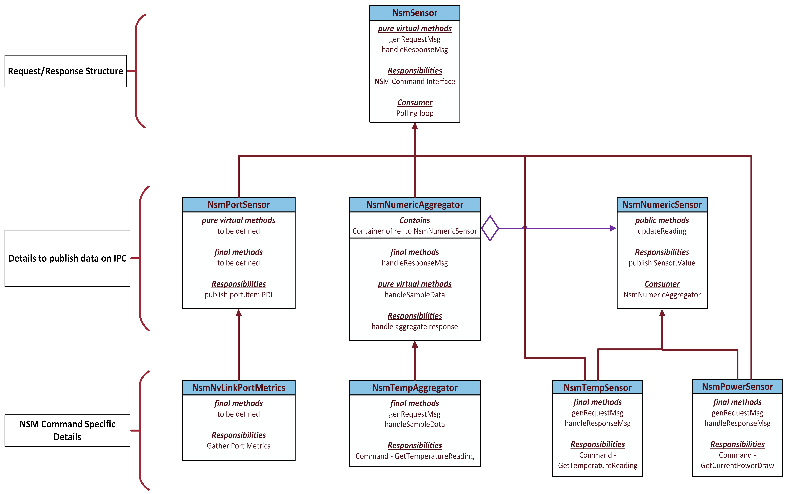
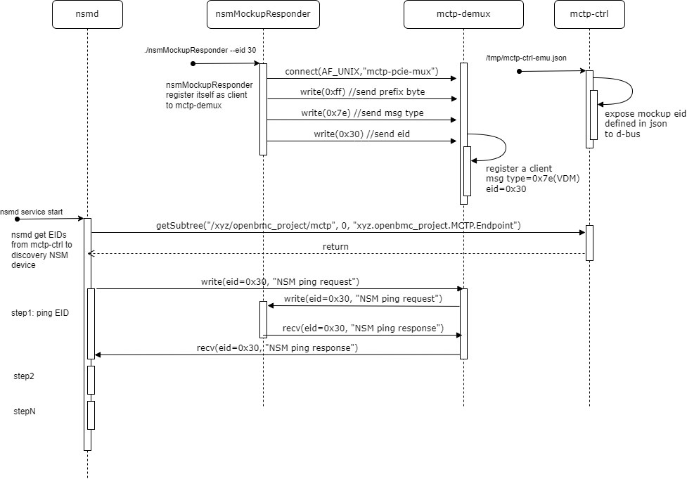
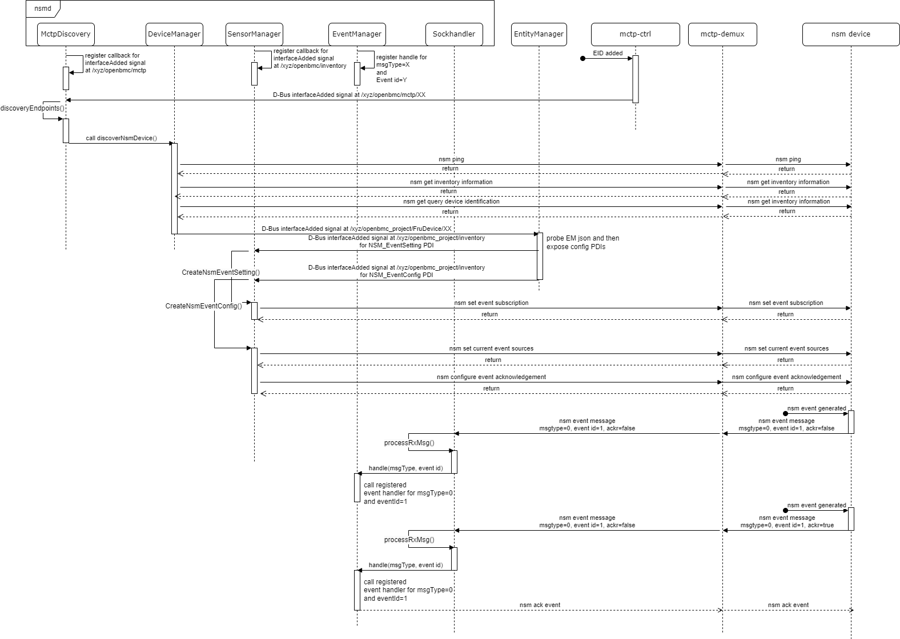

# Table Of Content

<!-- TOC -->

- [Table Of Content](#table-of-content)
- [nsmd - Nvidia System Management Daemon](#nsmd---nvidia-system-management-daemon)
  - [Problem Description](#problem-description)
  - [Background and References](#background-and-references)
    - [reference](#reference)
  - [Requirements](#requirements)
    - [Device Inventory](#device-inventory)
    - [Sensor refresh rate](#sensor-refresh-rate)
      - [Estimated Vulcan-next Sensor#](#estimated-vulcan-next-sensor)
      - [Estimation calculation](#estimation-calculation)
  - [Proposed Design](#proposed-design)
    - [Discovering NSM endpoint](#discovering-nsm-endpoint)
    - [Collecting FRU device](#collecting-fru-device)
      - [Table 1](#table-1)
      - [FRU Device PDI Properties](#fru-device-pdi-properties)
      - [Example 1](#example-1)
    - [Creating Device Inventory](#creating-device-inventory)
    - [NSM Device Inventory](#nsm-device-inventory)
    - [NSM configuration PDIs](#nsm-configuration-pdis)
      - [Properties common for NSM_Temp, NSM_Power, NSM_Energy, and NSM_Voltage PDIs](#properties-common-for-nsm_temp-nsm_power-nsm_energy-and-nsm_voltage-pdis)
      - [Additional properties for xyz.openbmc_project.Configuration.NSM_Power](#additional-properties-for-xyzopenbmc_projectconfigurationnsm_power)
      - [xyz.openbmc_project.Configuration.NSM_NVLink](#xyzopenbmc_projectconfigurationnsm_nvlink)
      - [Example 2](#example-2)
      - [Example 3](#example-3)
      - [Example 4](#example-4)
    - [Processing Configuration Data](#processing-configuration-data)
      - [Table 2](#table-2)
      - [revisited xyz.openbmc_project.item.Port PDI](#revisited-xyzopenbmc_projectitemport-pdi)
      - [new defined xyz.openbmc_project.state.PortMetrics PDI](#new-defined-xyzopenbmc_projectstateportmetrics-pdi)
      - [Example 5](#example-5)
    - [Associating NSM_Sensor to Device Inventory](#associating-nsm_sensor-to-device-inventory)
    - [Associating NSM_NVLink to Device Inventory](#associating-nsm_nvlink-to-device-inventory)
    - [Associating PLDM T2 sensors to Device Inventory](#associating-pldm-t2-sensors-to-device-inventory)
      - [Table 3](#table-3)
      - [Example 6](#example-6)
    - [Class hierarchy for NSM Sensors](#class-hierarchy-for-nsm-sensors)
    - [Polling sensor](#polling-sensor)
      - [sensor polling Example 1](#sensor-polling-example-1)
      - [sensor polling Example 2](#sensor-polling-example-2)
    - [error handling](#error-handling)
    - [nsmd endpoint discovery and sensor polling Sequence Diagram](#nsmd-endpoint-discovery-and-sensor-polling-sequence-diagram)
    - [NSM Endpoint mockup responder](#nsm-endpoint-mockup-responder)
      - [Mockup responder block diagram](#mockup-responder-block-diagram)
      - [Mockup responder sequence diagram](#mockup-responder-sequence-diagram)
      - [mockup EID json file](#mockup-eid-json-file)
      - [mockup NSM commands](#mockup-nsm-commands)
    - [NSM Utility](#nsm-utility)
      - [nsmtool](#nsmtool)
        - [Usage](#usage)
        - [nsmtool raw command usage](#nsmtool-raw-command-usage)
      - [NSMTool commands and sub commands](#nsmtool-commands-and-sub-commands)
    - [End to End data path of OpenBMC service block diagram](#end-to-end-data-path-of-openbmc-service-block-diagram)
  - [Alternatives Considered](#alternatives-considered)
  - [Impacts](#impacts)
  - [Testing](#testing)
  - [Backup](#backup)
    - [PLDM T2 round trip time measurement](#pldm-t2-round-trip-time-measurement)
    - [WIP Improving sensor polling performance by aggregate command](#wip-improving-sensor-polling-performance-by-aggregate-command)
      - [NSM_Aggregated_Temps configuration PDI](#nsm_aggregated_temps-configuration-pdi)
      - [Creating Aggregation Sensors](#creating-aggregation-sensors)
      - [Polling Aggregation Sensors](#polling-aggregation-sensors)
      - [example: Aggregated Temp sensors configruation PDI](#example-aggregated-temp-sensors-configruation-pdi)
      - [example: the result of D-Bus object tree](#example-the-result-of-d-bus-object-tree)
    - [WIP Event logging](#wip-event-logging)
      - [NSM_Event_Config configuration PDI](#nsm_event_config-configuration-pdi)
      - [example: NSM event configuration in EM json](#example-nsm-event-configuration-in-em-json)
      - [nsmd event initialization](#nsmd-event-initialization)
      - [nsmd event Sequence Diagram](#nsmd-event-sequence-diagram)

<!-- /TOC -->

# nsmd - Nvidia System Management Daemon

Author:
Gilbert Chen
Utkarsh Yadav

Primary assignee:
Gilbert Chen

Other contributors:
Deepak Kodihalli
Shakeeb Pasha

Created:
June 26, 2023

## Problem Description

Hopper-next devices supports [Nvidia MCTP System Management(NSM) API][1]. BMC needs
a service to gather device telemetry to D-Bus over MCTP OEM API.

## Background and References

PLDM type2 is not well to support port metrics and telemetry reporting. There
is usually many telemetry counters for a port but PLDM type2 design is hard to
monitor a port state efficiently. A port state needs multiple getSensorReadings
commands. It results the overhead too big when BMC tries to keep port telemetry
fresh.

So new nsmd service is proposed. The service utilizes the commands defined in
[NSM APIs][1] to discovery NSM endpoint, collect device inventory and polling
telemetry data to D-Bus for bmcweb.

### reference

[1]: https://confluence.nvidia.com/pages/viewpage.action?spaceKey=CSSRM&title=MCTP+System+Management+API
[2]: https://docs.google.com/document/d/1nP8F1Xc6kB_qU5xSr0NDQ5lQL1bTkEux0O3Rrmg8PUw/edit#heading=h.b0rjqe25oq81
[3]: https://nvidia.sharepoint.com/:x:/r/sites/NBU-Architecture/_layouts/15/Doc.aspx?sourcedoc=%7B7768CC37-D34A-4837-A07A-B009EEE76F41%7D&file=NIC_PLDM_DB_Model_rev1_12.xlsx&action=default&mobileredirect=true&cid=43dc931c-22de-48c5-b043-0d47095cfcfd
[4]: https://nvidia.sharepoint.com/:x:/r/sites/NBU-Architecture/SWArch/_layouts/15/Doc.aspx?sourcedoc=%7BDB94AF40-4D7D-4143-A4DF-F4E35ECC462A%7D&file=Switch_PLDM_DB_Model.xlsx&action=default&mobileredirect=true
[5]: https://gitlab-collab-01.nvidia.com/viking-team/libmctp/-/tree/spdm_v4_merged_develop
[6]: https://docs.google.com/document/d/1KIWdQnF3Tvx3JbntbWzPNxdwR1aJsQNkGW_f4cNwpoo/edit#heading=h.6zqe701le99u
[7]: https://www.dmtf.org/sites/default/files/standards/documents/DSP0257_1.0.1_0.pdf
[8]: https://www.dmtf.org/sites/default/files/standards/documents/DSP0236_1.3.0.pdf
[9]: https://gitlab-master.nvidia.com/dgx/bmc/openbmc/-/blob/develop/meta-nvidia/recipes-nvidia/gpuoob/files/hgx/oob_manifest_pcie_vulcan.json
[10]: https://www.dmtf.org/sites/default/files/standards/documents/DSP0249_1.1.0.pdf
[11]: https://gitlab-master.nvidia.com/dgx/bmc/phosphor-dbus-interfaces/-/tree/develop/yaml/xyz/openbmc_project/Inventory/Item?ref_type=heads
[12]: https://nvidia.sharepoint.com/:w:/r/sites/MCTPSystemManagementAPI/_layouts/15/Doc.aspx?sourcedoc=%7B9B1D3C7A-1958-48DD-91D1-742808256F77%7D&file=System%20Management%20API%20Base%20Specification.docx&action=default&mobileredirect=true&DefaultItemOpen=1

## Requirements

### Device Inventory

The NSM sensors need to be associated with inventory item and it is mandatory
for Redfish. The nsmd should associate thermal/port telemetry to the right
device inventory. The device inventory for GB100 will be handled by GpuMgr and
QM3 and CX7 will be handled by EntityManager.

### Sensor refresh rate

- The Freshness target is <= 500ms from NSM Endpoint to D-Bus
- The target Redfish TAT = 1 sec
  - Reserve 500ms for bmcweb to get reading from D-Bus and response to Redfish client
  - So the target sensor age is <= 500ms.

#### Estimated Vulcan-next Sensor#

| instance      | temp                           | power    | energy | misc. state                            | total | **PID total** |
| ------------- | ------------------------------ | -------- | ------ | -------------------------------------- | ----- | ------------- |
| GB100\*8      | 2\*8=16                        | 2\*8=16  | 1\*8=8 | (nvlink(2)+pcie(1))*counters(25)*8=600 | 640   | 640-600=40    |
| QM3\*2        | 1\*2=2                         |          |        | nvlink(10)*counters(25)*2=500          | 502   | 502-500= 2    |
| CX7           | 1+port\*2=3                    |          |        | (nvlink(2) + pcie(1))\*counters(25)=75 | 78    | 78-75= 3      |
| HSC\*11       | 1\*11=11                       | 1\*11=11 |        |                                        | 22    | 22            |
| FPGA          | 1                              | 1        |        |                                        | 1     | 1             |
| Baseboard     | pcb*4<br>inlet*2<br>retimer\*8 |          |        |                                        | 14    | 14            |
| total         | 47                             | 28       | 8      | 975                                    | 1057  |               |
| **PID total** | 47                             | 28       | 8      | 0                                      |       | **83**        |

#### Estimation calculation

If the requirement of end to end sensor age is 1 second, then

- set t1 = 250ms, reserve 250ms for D-Bus call and other cost
- set t2 = [3.5 ms](#pldm-t2-round-trip-time-measurement)
- max sensor# = t1 / t2

[note]

- t1 is the period of nsmd refresh loop
- t2 is TAT of a NSM command

1. When t1=250ms, t2=3.5ms then the max sensor# nsmd can handle by one big loop
   is 250/3.5 = 71. The total sensor#(1057) is greater than the 71, So polling
   sensor for each instance(QM3, GB100 and CX7) in different loop is needed.

2. When t1=250ms, t2=3.5ms, the QM3 sensor# is 251. It is greater than to 71, So
   priority pid sensor polling is needed.

3. When t1=250ms and the GB100 needs 8(2 temp, 2 power, 1 energy, 3 port) NSM
   commands to refresh telemetry and then the max t2 = 250ms/8 = 31ms.
   If the NSM command TAT is greater than 31ms, the thermal aggregate command
   is needed.

   Since the TAT for MCTP I2C binding is about [3.5 ms](#pldm-t2-round-trip-time-measurement)
   NSM API for thermal aggregate command is not necessary now.

## Proposed Design

To meeting the sensor refresh requirement in previous section, the nsmd
should have the designs listed below.

1. nsmd needs to expose numeric sensor and telemetry counters with
   Time.Epoch PDI for timestamp property.
2. nsmd should poll sensor for each instance parallelly.
3. nsmd should implement priority polling for pid sensor.
4. NSM API should provide thermal aggregate command if NSM command TAT is
   too long.
5. nsmd should implement the error handle defined in the [HMC OOB telemetry
   workflow on errors][6]
6. When NSM communicates multiple NSM endpoints, functional endpoint should
   not be impact by failed endpoint.

The nsmd will be a single thread app based on sdbusplus lib to send/recv MCTP
message by async APIs. To start/stop nsmd service is managed by systemd. For
parsing NSM command defined in [1] conveniently, a libnsm will be developed.

1. When nsmd start, nsmd get EID list from mctp-ctrl daemon to discovery EID
   list which supports NSM API.
2. nsmd gets the platform inventory by Type0 QueryDeviceIdentification command
   for mandatory Inventory Device Type and Device Instance property. If the
   device supports GetInventoryInformation command, nsmd also try to get other
   Inventory properties(e.g. Part#). And then exposes QM3/CX7 collected FRU
   data to D-Bus by FruDevice PDI. The GB100 FRU Data is populated by GpuMgr
   as before(Vulcan).
3. Entity-Manager gets notification for new FruDevice PDI added and then probing
   the json config file to populate QM3/CX7 device inventory and Configuration
   PDI defined in "expose" section to D-Bus. The Device Inventory and
   configuration PDI of GB100 are populated by GpuMgr.
4. nsmd gets notification for GB100/QM3/CX7 device inventory added and then process
   the Configuration data to create sensor instance.
5. nsmd starts sd_event timer to poll sensors regularly to keep sensor reading
   fresh.

### Discovering NSM endpoint

When nsmd start, nsmd gets MCTP Endpoints by ObjectMapper.GetSubTree method to
the path:/xyz/openbmc_project/mctp for the object with
xyz.openbmc_project.MCTP.Endpoint PDI and then register a callback to monitor
mctpEndpointAddedSignal on the same path for new MCTP endpoint is added.

When nsmd get new EID/UUID pair list, nsmd should check which EID is a NSM
endpoint by the steps below.

1. Check if 0x7E(VDM-PCI) is in SupportedMessageTypes array of
   xyz.openbmc_project.MCTP.Endpoint PDI of the MCTP Endpoint
2. Send MCTP Control command, Get Vendor Defined Message Support Message(0x6)
   to the EID to get all support Vendor ID Sets.
   - If get error, skip the EID and goto 1 to check the next EID in list
   - nsmd checks if there is NVIDIA VID(0x10DE) in returned Vendor ID Sets.
3. Send NSM GetSupportedMessageTypes(msgType=0x0, cmd=0x01) and keep the returned
   NSM message type supported by the NSM endpoint.
   - If get error, log message to journal log, skip the EID and goto 1 to check
     the next EID in list
4. Send GetSupportedCommandCodes(msgType=0x0, cmd=0x02) and keep returned
   supported command list.
5. Check if the NSM endpoint support mandatory commands or skip the EID and
   goto step 1 to check next EID in list.
   - Platform Environment(msg type=0x3)
   - GetInventoryInformation(msgType=0x3, cmd=0x04)
   - QueryDeviceIdentification(msg type=0x0, cmd=0x7)
6. Add the EID/UUID pair in NSM endpoint list and keep the supported message types
   and commands received in 3 and 4 to the NSM endpoint. The EID/UUID table will
   be used for sensor manager to find which EID should the NSM command be sent to.

### Collecting FRU device

When new NSM endpoint is added in discovered, should expose the NSM endpoint's
FRU data to D-Bus by the steps below.
For the Device Type that its Device Inventory is not managed by Entity Manager,
the device type should be specified in "fru_ignore" list via CLI parameter.

1.  Send QueryDeviceIdentification command to EID and wait for response.
2.  Parse response to get Device Type Identifier and InstanceNumber
3.  Convert the Device Type Identifier enum to string
    - 0x0 - GPU
    - 0x1 - NVSwitch
    - 0x2 - PCIeBridge
    - 0x3 - FPGA
4.  Check if the Device Type is not in fru_ignore list.
5.  Create FruDevice PDI at /xyz/openbmc*project/FruDevice/{DeviceType}*{InstanceNumber}
    like the [example1](#example-1)
6.  Exposes Device Type Identifier to "DeviceType" property of FruDevice PDI
7.  Exposes Instance Number to "InstanceName" property of FruDevice PDI
8.  Exposes UUID to "UUID" property of FruDevicePDI
9.  Send GetInventoryInformation command to EID and wait for response.
10. Parse response to get FRU data.
11. Expose FRU data to corresponding property name of FruDevice as [table1](#table-1)

FRU Devices PDI will be published at Interface xyz.openbmc_project.FruDevice,
and Object path /xyz/openbmc_project/FruDevice at xyz.openbmc_project.NSM D-Bus
Service. Services that creates inventory PDIs, like Entity-Manager, should look
out for FRU Device PDIs at Object Path /xyz/openbmc_project/FruDevice, and
should not depend on the name of the D-Bus Service.

#### Table 1

NSM PropertyID to FruDevice PropertyName
| NSM Property ID | Name | FruDevice Property Name |
|----------------- |------------------- |------------------------- |
| 0 | Board part number | BOARD_PART_NUMBER |
| 1 | Serial number | BOARD_SERIAL_NUMBER |
| 2 | Marketing name | BOARD_PRODUCT_NAME |
| 8 | Build date | BOARD_MANUFACTURE_DATE |
| N/A | N/A | BOARD_MANUFACTURE |

#### FRU Device PDI Properties

List of Properties of FRU Device PDI created by nsmd.
D-Bus Interface - xyz.openbmc_project.FruDevice

| Property          | Type   | Mandatory/Optional | NSM Command used to get Value             | Use                                               |
| ----------------- | ------ | ------------------ | ----------------------------------------- | ------------------------------------------------- |
| BOARD_PART_NUMBER | string | Mandatory          | Type 3 Get Inventory Information (0x11)   | For debugability.                                 |
| DEVICE_TYPE       | byte   | Mandatory          | Type 0 Query Device Identification (0x09) | To determine list of inventories to be published. |
| INSTANCE_NUMBER   | byte   | Mandatory          | Type 0 Query Device Identification (0x09) | To determine list of inventories to be published. |
| SERIAL_NUMBER     | string | Mandatory          | Type 3 Get Inventory Information (0x11)   | For debugability.                                 |
| UUID              | string | Mandatory          | NA (Populated by MCTP Control Daemon)     | To uniquely identify a device and EID lookup.     |

#### Example 1

FruDevice D-Bus object (for exposition purpose only)

```
root@e4869:~# busctl introspect xyz.openbmc_project.NSM /xyz/openbmc_project/FruDevice/30
NAME                                TYPE      SIGNATURE RESULT/VALUE         FLAGS
xyz.openbmc_project.FruDevice       interface -         -                    -
.BOARD_PART_NUMBER                  property  s         "MCX750500B-0D00_DK" emits-change
.DEVICE_TYPE                        property  y         2                    emits-change
.EID                                property  y         30                   emits-change
.INSTANCE_NUMBER                    property  y         0                    emits-change
.SERIAL_NUMBER                      property  s         "SN123456789"        emits-change
.UUID                               property  s         "550e8400-e29b-41d4- emits-change
```

### Creating Device Inventory

Leverage Entity-Manager runtime JSON driven system configuration manager.
Platform developer maintains a json file to expose necessary configuration
data for nsmd. The configuration data can be similar to what properties
defined in [oob_manifest_pcie_vulcan.json][9] for nsmd to knows the device
configurations for further initialization. The [example 2](#example-2) and
[example 3](#example-3) is a reference json file for CX7 and QM3.

For the case that Device Inventory which is not created by EntityManger, the
service(e.g. GpuMgr) who creates the device Inventory should expose the
necessary configuration like EntityManager does for nsmd parsing.

Services that create device inventory should emit signal at object path
/xyz/openbmc_project/inventory whenever there is new configuration PDI at any of
its child objects (generally it can be achieved by employing
org.freedesktop.DBus.ObjectManager interface).

For the device supporting NSM protocol, there should be an inventory PDI
created according to its device type retrieved by GetQueryDeviceInformation
command.

### NSM Device Inventory

| Device               | Inventory PDI                                       |
| -------------------- | --------------------------------------------------- |
| GB100 (deviceType=0) | xyz.openbmc_project.inventory.item.Accelerator      |
| QM3 (deviceType=1)   | xyz.openbmc_project.Inventory.Item.Switch           |
| CX7 (deviceType=2)   | xyz.openbmc_project.Inventory.Item.NetworkInterface |
| FGPA (deviceType=3)  | xyz.openbmc_project.inventory.item.Accelerator      |

### NSM configuration PDIs

#### Properties common for NSM_Temp, NSM_Power, NSM_Energy, and NSM_Voltage PDIs

These properties will be present in PDIs listed below. Additional properties for these PDIs are captured in their respective tables.

1. xyz.openbmc_project.Configuration.NSM_Temp
2. xyz.openbmc_project.Configuration.NSM_Power
3. xyz.openbmc_project.Configuration.NSM_Energy
4. xyz.openbmc_project.Configuration.NSM_Voltage

| Configuration Property | type        | Description                                                                                                                                                                                                                    |
| ---------------------- | ----------- | ------------------------------------------------------------------------------------------------------------------------------------------------------------------------------------------------------------------------------ |
| Name                   | string      | Sensor Name                                                                                                                                                                                                                    |
| Association            | `string[N]` | Array of string pairs containing 'relationship' and 'object_path'. It will be used to populate Endpoints for ObjectMapper. [Reference](https://github.com/openbmc/docs/blob/master/architecture/object-mapper.md#associations) |
| Aggregated             | bool        | Should be true if sensor reading can be obtained from Aggregate variant of the command.                                                                                                                                        |
| UUID                   | string      | The UUID of device. used for lookup the assigned EID                                                                                                                                                                           |
| Priority               | bool        | Indicate the sensor updated in priority                                                                                                                                                                                        |
| SensorId               | uint64_t    | Value of SensorId field of request message of the NSM Command.                                                                                                                                                                 |

#### Additional properties for xyz.openbmc_project.Configuration.NSM_Power

| Configuration Property | type     | Description                                                           |
| ---------------------- | -------- | --------------------------------------------------------------------- |
| AveragingInterval      | uint64_t | Averaging Interval for Power measurement (Refer NSM Command content). |

#### xyz.openbmc_project.Configuration.NSM_NVLink

| Configuration Property | type   | Description                                                                                                                                                                                                                                                                                           |
| ---------------------- | ------ | ----------------------------------------------------------------------------------------------------------------------------------------------------------------------------------------------------------------------------------------------------------------------------------------------------- |
| Name                   | string | Prefix of Port Name (e.g, Port\_{INDEX})                                                                                                                                                                                                                                                              |
| Association            | string | The D-Bus object path the state.PortMetric PDI should be populated.                                                                                                                                                                                                                                   |
| Count                  | int    | The total port number of the device.<br>example: if Count=4 and Name="Port", then four state.PortMetric PDIs will be populated to<br>/xyz/openbmc_project/.../Ports/Port_0<br>/xyz/openbmc_project/.../Ports/Port_1<br>/xyz/openbmc_project/.../Ports/Port_2<br>/xyz/openbmc_project/.../Ports/Port_3 |
| UUID                   | string | The UUID of device. used for lookup the assigned EID                                                                                                                                                                                                                                                  |
| Priority               | bool   | Indicate the sensor updated in priority                                                                                                                                                                                                                                                               |

#### Example 2

An EM JSON file for CX7

```
[
   {
      "Exposes": [
         {
            "Name": "NVLink",
            "Type": "NSM_NVLink",
            "Association": "/xyz/openbmc_project/inventory/system/board/CX7_0/Ports",
            "UUID": $UUID,
            "Count": 2
         }
      ],
      "Probe": "xyz.openbmc_project.FruDevice({'DEVICE_TYPE': 'PCIeBridge','INSTANCE_NUMBER': 1})",
      "Name": "CX7_0",
      "Type": "Board",
      "Parent_Chassis": "/xyz/openbmc_project/inventory/chassis/Baseboard_0",
      "xyz.openbmc_project.Inventory.Decorator.Asset":
      {
        "Manufacturer": "Nvidia",
        "Model": "$BOARD_PRODUCT_NAME",
        "PartNumber": "$BOARD_PART_NUMBER",
        "SerialNumber": "$BOARD_SERIAL_NUMBER"
      },
      "xyz.openbmc_project.Inventory.Item.Chassis": {
         "Type": "xyz.openbmc_project.Inventory.Item.Chassis.ChassisType.Component"
      },
      "xyz.openbmc_project.Common.UUID": {
         "UUID": $UUID
      },
      "xyz.openbmc_project.Inventory.Item.NetworkInterface": {},
      "xyz.openbmc_project.Inventory.Decorator.Instance": {
            "InstanceNumber": $INSTANCE_NUMBER
      }
   }
]
```

#### Example 3

An EM JSON file for QM3

```
[
   {
      "Exposes": [
         {
            "Name": "QM3_0_Temp_0",
            "Type": "NSM_Sensor",
            "Association": [
                "chassis", "/xyz/openbmc_project/inventory/system/chassis/QM3_$INSTANCE_NUMBER",
                "processor", "/xyz/openbmc_project/inventory/system/fabric/switches/QM3_$INSTANCE_NUMBER"
            ],
            "UUID": $UUID,
            "SensorId": 0,
            "Aggregated": True,
            "Threshold": [
               {
                  "Direction": "greater than",
                  "Name": "upper critical",
                  "Severity": 1,
                  "Value": 108.0
               },
               {
                  "Direction": "greater than",
                  "Name": "upper non critical",
                  "Severity": 0,
                  "Value": 90.0
               },
               {
                  "Direction": "less than",
                  "Name": "lower non critical",
                  "Severity": 0,
                  "Value": 5
               }
            ]
         },
         {
            "Name": "NVLink",
            "Type": "NSM_NVLink",
            "Association": "/xyz/openbmc_project/inventory/system/board/QM3_0/Ports",
            "UUID": $UUID,
            "Count": 18
         }
      ],
      "Probe": "xyz.openbmc_project.FruDevice({'DEVICE_TYPE': 'QM3','INSTANCE_NUMBER': 1})",
      "Name": "QM3_0",
      "Type": "Board",
      "Parent_Chassis": "/xyz/openbmc_project/inventory/chassis/Baseboard_0",
      "xyz.openbmc_project.Inventory.Decorator.Asset":
      {
        "Manufacturer": "Nvidia",
        "Model": "$BOARD_PRODUCT_NAME",
        "PartNumber": "$BOARD_PART_NUMBER",
        "SerialNumber": "$BOARD_SERIAL_NUMBER"
      },
      "xyz.openbmc_project.Inventory.Item.Chassis": {
         "Type": "xyz.openbmc_project.Inventory.Item.Chassis.ChassisType.Module"
      },
      "xyz.openbmc_project.Inventory.Item.Switch": {},
      "xyz.openbmc_project.Inventory.Decorator.Instance": {
            "InstanceNumber": $INSTANCE_NUMBER
      }
   }
]
```

When new FruDevice PDI is added to D-Bus, Entity Manager will probe the
FruDevice PDI for the matched configuration json file. Entity Manager will
create the device inventory PDI and configuration PDI according to the matched
json file.

The [example 4](#example-4) below shows that Entity Manager detects a QM3 FRU
data successfully and then create QM3 device inventory and its configuration
data to D-Bus.

#### Example 4

An example result of QM3 device inventory busctl dump

```
busctl tree xyz.openbmc_project.EntityManager
/xyz/openbmc_project/inventory/system/board/QM3_0
/xyz/openbmc_project/inventory/system/board/QM3_0/NVLink
/xyz/openbmc_project/inventory/system/board/QM3_0/QM3_0_Temp_0

root@skinnyjoe:~# busctl introspect xyz.openbmc_project.EntityManager /xyz/openbmc_project/inventory/system/board/QM3_0
NAME                                              TYPE      SIGNATURE RESULT/VALUE                             FLAGS
org.freedesktop.DBus.Introspectable               interface -         -                                        -
.Introspect                                       method    -         s                                        -
org.freedesktop.DBus.Peer                         interface -         -                                        -
.GetMachineId                                     method    -         s                                        -
.Ping                                             method    -         -                                        -
org.freedesktop.DBus.Properties                   interface -         -                                        -
.Get                                              method    ss        v                                        -
.GetAll                                           method    s         a{sv}                                    -
.Set                                              method    ssv       -                                        -
.PropertiesChanged                                signal    sa{sv}as  -                                        -
xyz.openbmc_project.AddObject                     interface -         -                                        -
.AddObject                                        method    a{sv}     -                                        -
xyz.openbmc_project.Association.Definitions       interface -         -                                        -
.Associations                                     property  a(sss)    2 "parent_chassis" "all_chassis" "/xy... emits-change writable
xyz.openbmc_project.Inventory.Decorator.Asset     interface -         -                                        -
.Delete                                           method    -         -                                        -
.Manufacturer                                     property  s         "Nvidia"                                 emits-change writable
.Model                                            property  s         "QM3"                                    emits-change writable
.PartNumber                                       property  s         "2342-888-A1"                            emits-change writable
.SerialNumber                                     property  s         "1640223000389"                          emits-change writable
xyz.openbmc_project.Inventory.Item.Board          interface -         -                                        -
.Name                                             property  s         "QM3_0"                                  emits-change
.Probe                                            property  s         "xyz.openbmc_project.FruDevice({\'BUS... emits-change
.ProbePath                                        property  s         "/xyz/openbmc_project/FruDevice/GB100... emits-change
.Type                                             property  s         "Board"                                  emits-change
xyz.openbmc_project.Inventory.Item.Switch         interface -         -                                        -
xyz.openbmc_project.Common.UUID
.UUID                                             property  s         "871d3c78-eb66-2a56-a7a1-b7ee8013e60c"   emits-change
xyz.openbmc_project.Inventory.Decorator.Instance  interface -         -                                        -
.InstanceNumber                                   property  t         0                                        emits-change

root@skinnyjoe:~# busctl introspect xyz.openbmc_project.EntityManager /xyz/openbmc_project/inventory/system/board/QM3_0/QM3_0_NVLink
NAME                                         TYPE      SIGNATURE RESULT/VALUE                              FLAGS
org.freedesktop.DBus.Introspectable          interface -         -                                         -
.Introspect                                  method    -         s                                         -
org.freedesktop.DBus.Peer                    interface -         -                                         -
.GetMachineId                                method    -         s                                         -
.Ping                                        method    -         -                                         -
org.freedesktop.DBus.Properties              interface -         -                                         -
.Get                                         method    ss        v                                         -
.GetAll                                      method    s         a{sv}                                     -
.Set                                         method    ssv       -                                         -
.PropertiesChanged                           signal    sa{sv}as  -                                         -
xyz.openbmc_project.Configuration.NSM_NVLink interface -         -                                         -
.Name                                        property  s         "QM3_0_NVLink"                            emits-change
.Type                                        property  s         "NSM_NVLink"                              emits-change
.Association                                 property  s         "/xyz/openbmc_project/inventory/system... emits-change
.Count                                       property  t         18                                        emits-change

root@skinnyjoe:~# busctl introspect xyz.openbmc_project.EntityManager /xyz/openbmc_project/inventory/system/board/QM3_0/QM3_0_Temp_0
NAME                                                     TYPE      SIGNATURE RESULT/VALUE         FLAGS
org.freedesktop.DBus.Introspectable                      interface -         -                    -
.Introspect                                              method    -         s                    -
org.freedesktop.DBus.Peer                                interface -         -                    -
.GetMachineId                                            method    -         s                    -
.Ping                                                    method    -         -                    -
org.freedesktop.DBus.Properties                          interface -         -                    -
.Get                                                     method    ss        v                    -
.GetAll                                                  method    s         a{sv}                -
.Set                                                     method    ssv       -                    -
.PropertiesChanged                                       signal    sa{sv}as  -                    -
xyz.openbmc_project.Configuration.NSM_Sensor             interface -         -                    -
.Association                                             property  s         "/xyz/openbmc_proj...emits-change
.UUID                                                    property  s         "871d3c78-eb66-2a5...emits-change
.SensorId                                                property  t         0                    emits-change
.Name                                                    property  s         "QM3_0_Temp_0"       emits-change
.Type                                                    property  s         "NSM_Sensor"         emits-change
xyz.openbmc_project.Configuration.NSM_Sensor.Thresholds0 interface -         -                    -
.Delete                                                  method    -         -                    -
.Direction                                               property  s         "greater than"       emits-change writable
.Name                                                    property  s         "upper critical"     emits-change writable
.Severity                                                property  d         1                    emits-change writable
.Value                                                   property  d         108                  emits-change writable
xyz.openbmc_project.Configuration.NSM_Sensor.Thresholds1 interface -         -                    -
.Delete                                                  method    -         -                    -
.Direction                                               property  s         "greater than"       emits-change writable
.Name                                                    property  s         "upper non critical" emits-change writable
.Severity                                                property  d         0                    emits-change writable
.Value                                                   property  d         90                   emits-change writable
xyz.openbmc_project.Configuration.NSM_Sensor.Thresholds2 interface -         -                    -
.Delete                                                  method    -         -                    -
.Direction                                               property  s         "less than"          emits-change writable
.Name                                                    property  s         "lower non critical" emits-change writable
.Severity                                                property  d         0                    emits-change writable
.Value                                                   property  d         5                    emits-change writable
```

### Processing Configuration Data

The nsmd monitor D-Bus signal to get notification when EntityManager/GpuMgr
create device inventory. When signal is received, nsmd gets the
GB100/QM3/CX7/FGPA configuration data by the steps below.

[note] The phosphor-dbus-interface repo should have the yaml files to define
NSM Configuration PDIs(e.g. NSM_Sensor and NSM_NVLink)

1. Calls xyz.openbmc_project.ObjectMapper GetObject method for all device
   inventory D-Bus path with PDIs below to get the all GB100/QM3/CX7 device
   inventory paths. They can be populated by GpuMgr or EntityManager service.

   - xyz.openbmc_project.inventory.item.Accelerator
   - xyz.openbmc_project.Inventory.Item.Switch
   - xyz.openbmc_project.inventory.item.NetworkInterface

2. Calls xyz.openbmc_project.ObjectMapper GetSubTree method to get interesting
   configuration PDIs which is under the device inventory path found in step1.

   - xyz.openbmc_project.Configuration.NSM_NVLink
   - xyz.openbmc_project.Configuration.NSM_Temp

3. Create sensor according to Configuration PDI fetched from EM or GpuMgr

   1. Numeric Sensor:

      a. Expose xyz.openbmc_project.Sensor.Value PDI at the path defined at
      [table 2](#table-2) according to the "command" property of
      NSM_Sensor PDI got in step2. The [example 5](#example-5) shows the
      busctl introspect result.

      b. Expose xyz.openbmc_project.Association.Definitions PDI and set the
      endpoint property to {"chassis", "all_sensors", "{PARENT_CHASSIS}"}.
      The value PARENT_CHASSIS is from "Association" property of NSM_SENSOR
      configuration PDI.

      c. Look up the EID by the UUID property of configuration PDI and keep it
      in sensor class member variable for sending NSM command to device when
      updating sensor reading.

      d. If value of Configuration property 'Aggregator' is True, iterate over
      all Aggregators Class Objects of that EID, and if Aggregator Class
      Object for the NSM Command is not found, create an Aggregator Class
      Object. Put Aggregate Class object in priority sensor queue if Priority
      property is True, otherwise put it in round-robin sensor queue. If an
      existing Aggregate Class is found, put it in the correct sensor queue
      as per Priority property. Then, add the Numeric Sensor to the
      Aggregator Class Object.

#### Table 2

Configuration PDI/sensor path mapping

| PDI       | Command        | D-Bus path                               |
| --------- | -------------- | ---------------------------------------- |
| NSM_Temp  | getTemperature | /xyz/openbmc_project/sensors/Temperature |
| NSM_Power | getPower       | /xyz/openbmc_project/sensors/Power       |
| NSM_Fan   | ReadFanSpeed   | /xyz/openbmc_project/sensors/RPMS        |

2.  NSM_NVLink:

    a. Expose xyz.openbmc_project.Inventory.State.PortMetrics at the path
    defined in the "Association" property of NSM_NVLink configuration PDI

    b. item.port PDI will be revised to move out counter properties to
    state.PortMetric PDI

    c. Look up the EID by the UUID property of configuration PDI and keep it
    in sensor class member variable for sending NSM command to device when
    updating the counter properties of PortMetrics PDI.

#### revisited xyz.openbmc_project.item.Port PDI

```
busctl introspect xyz.openbmc_project.GpuMgr /xyz/openbmc_project/inventory/system/processor/GPU_0/Ports/NVLink_0
xyz.openbmc_project.Inventory.Item.Port     interface -         -                                        -
.CurrentSpeed                               property  d         212.496                                  emits-change
.LinkState                                  property  s         "xyz.openbmc_project.Inventory.Item.P... emits-change
.LinkStatus                                 property  s         "xyz.openbmc_project.Inventory.Item.P... emits-change
.MaxSpeed                                   property  d         212.496                                  emits-change
.Protocol                                   property  s         "xyz.openbmc_project.Inventory.Item.P... emits-change
.RXWidth                                    property  q         2                                        emits-change
.RuntimeError                               property  q         0                                        emits-change
.TXWidth                                    property  q         2                                        emits-change
.Type                                       property  s         "xyz.openbmc_project.Inventory.Item.P... emits-change
```

#### new defined xyz.openbmc_project.state.PortMetrics PDI

```
busctl introspect xyz.openbmc_project.NSMD /xyz/openbmc_project/inventory/system/processor/GPU_0/Ports/NVLink_0
xyz.openbmc_project.Inventory.State.PortMetric interface -         -                                        -
.DataCRCCount                                  property  u         0                                        emits-change
.FlitCRCCount                                  property  u         0                                        emits-change
.RXBytes                                       property  u         0                                        emits-change writable
.RXNoProtocolBytes                             property  t         0                                        emits-change
.RecoveryCount                                 property  u         0                                        emits-change
.ReplayCount                                   property  u         0                                        emits-change
.RuntimeError                                  property  q         0                                        emits-change
.TXBytes                                       property  u         0                                        emits-change writable
.TXNoProtocolBytes                             property  t         0                                        emits-change
.TrainingError                                 property  q         0                                        emits-change
```

#### Example 5

The temp sensor PDI created by nsmd for QM3

```
root@skinnyjoe:~# busctl introspect xyz.openbmc_project.NSMD /xyz/openbmc_project/sensors/temperature/QM3_0_Temp_0
NAME                                              TYPE      SIGNATURE RESULT/VALUE                             FLAGS
org.freedesktop.DBus.Introspectable               interface -         -                                        -
.Introspect                                       method    -         s                                        -
org.freedesktop.DBus.Peer                         interface -         -                                        -
.GetMachineId                                     method    -         s                                        -
.Ping                                             method    -         -                                        -
org.freedesktop.DBus.Properties                   interface -         -                                        -
.Get                                              method    ss        v                                        -
.GetAll                                           method    s         a{sv}                                    -
.Set                                              method    ssv       -                                        -
.PropertiesChanged                                signal    sa{sv}as  -                                        -
xyz.openbmc_project.Inventory.Decorator.Area      interface -         -                                        -
.PhysicalContext                                  property  s         "xyz.openbmc_project.Inventory.Decora... emits-change
xyz.openbmc_project.Sensor.Threshold.Critical     interface -         -                                        -
.CriticalAlarmHigh                                property  b         false                                    emits-change writable
.CriticalHigh                                     property  d         108                                      emits-change writable
.CriticalHighAlarmAsserted                        signal    d         -                                        -
.CriticalHighAlarmDeasserted                      signal    d         -                                        -
xyz.openbmc_project.Sensor.Threshold.Warning      interface -         -                                        -
.WarningAlarmHigh                                 property  b         true                                     emits-change writable
.WarningAlarmLow                                  property  b         false                                    emits-change writable
.WarningHigh                                      property  d         90                                        emits-change writable
.WarningLow                                       property  d         5                                        emits-change writable
.WarningHighAlarmAsserted                         signal    d         -                                        -
.WarningHighAlarmDeasserted                       signal    d         -                                        -
.WarningLowAlarmAsserted                          signal    d         -                                        -
.WarningLowAlarmDeasserted                        signal    d         -                                        -
xyz.openbmc_project.Sensor.Value                  interface -         -                                        -
.Unit                                             property  s         "xyz.openbmc_project.Sensor.Unit.Degr... emits-change
.Value                                            property  d         31.375                                   emits-change
xyz.openbmc_project.State.Decorator.Health        interface -         -                                        -
.Health                                           property  s         "xyz.openbmc_project.State.Decorator.... emits-change writable
xyz.openbmc_project.Time.EpochTime                interface -         -                                        -
.Elapsed                                          property  t         1691187953278                            emits-change
```

### Associating NSM_Sensor to Device Inventory

1. nsmd get device inventory path from the Association property of
   configuration.NSM_Sensor PDI
2. Expose xyz.openbmc_project.Association.Definitions PDI and set the
   endpoint property to {"chassis", "all_sensors", "{PARENT_CHASSIS}"}.
   The value PARENT_CHASSIS is from "Association" property of NSM_SENSOR
   configuration PDI.
3. It is required that the configuration provider set Association property of
   configuration.NSM_Sensor PDI to the correct Device Inventory D-Bus object
   path.

### Associating NSM_NVLink to Device Inventory

1. bmcweb assumes the portMetrics PDI and item.port PDI are at the same D-Bus
   object path for gathering specific port properties defined in Port schema.
2. The D-Bus object path of portMetrics PDI is from configuration.NVLink PDI.
3. nsmd will populate the portMEtrics PDI at the D-Bus object path according to
   Association property of configuration.NVLink PDI.
4. It is required that the configuration provider(EntityManager or GpuMgr) set
   Association property of configuration.NVLink PDI to the same D-Bus object path
   as item.port PDI for the requirement in step1.

### Associating PLDM T2 sensors to Device Inventory

QM3 and CX7 support both PLDM T2 and NSM protocols. The pldmd should associates
PLDM T2 sensor to correct Device Inventory by matching the UUID.

1. pldmd gets the UUID from /xyz/openbmc_project/mctp/0/{EID} D-Bus object path
   and keeps the UUID value in terminus class member variable.
2. pldmd get the entity type from its numeric/state sensor PDR.
3. pldmd get the all D-Bus object paths which has the corresponding inventory
   item PDI to sensor's entity type according to the [table 3](#table-3).
4. If pldmd cannot find the object paths in step3 then search the its container
   entity type and go to step3 till the containerID is system
5. If pldmd find the object paths in step3 and the UUID of the found inventory
   object path matched the UUID in step1, then pldmd associate the sensor to it.
6. If pldmd cannot find the object paths in step5 then associate sensor to baseboard
   inventory path.

#### Table 3

Entity type to Inventory PDI
| Entity Type | Inventory PDI |
|------------------------- |---------------------------------------------------- |
| Processor IO Module(81) | xyz.openbmc_project.Inventory.Item.ProcessorModule |
| Processor(135) | xyz.openbmc_project.Inventory.Item.Cpu |
| Add In Card(68) | xyz.openbmc_project.Inventory.Item.Board |

The mapping table above is default value and it can be overwritten by providing
json file like [example](#Example-6)

#### Example 6

The json object array to config Entity Type and PDI mapping table

```
{
   "InventoryToEntityType": [
      {"xyz.openbmc_project.Inventory.Item.ProcessorModule": 81},
      {"xyz.openbmc_project.Inventory.Item.Cpu": 135},
      {"xyz.openbmc_project.Inventory.Item.Board": 68}
   ]
}
```

- The Entity type are defined in [DSP0249](10)
- The Inventory PDI list can be found in [phosphor-dbus-interface](11)

### Class hierarchy for NSM Sensors

As a result of processing of Configuration PDI by nsmd, various polymorphic containers will be generated. These containers contain class objects that defines implementation of a unique NSM Command. These class objects are also responsible for publishing data obtained from NSM endpoints to IPC system for consumer services like bmcweb. Hence it is highly desirable that these classes are organised in well defined class inheritance hierarchy to enforce separation of concerns, remove logic duplication and facilitate refactoring.

These classes have following primary responsibilities.

1. Provide unique interface for generating NSM request buffer and for processing of NSM response buffer.
2. Implement NSM command specific encoding of request buffer and decoding of response buffer.
3. Publish data obtained from a perticular NSM command to IPC system, like D-Bus or NVIDIA Shared-Memory.
4. Provide common implementation for logic related to NSM Base spec.

To satisfy these responsibilities, nsmd defines a class inheritance hierarchy as illustrated in image given below.
In order to implement support for a NSM command, it is recommended to leverage existing classes whenever possible to avoid duplication of logic. If separate inheritance chain has to be created to implement yet unimplemented logic, it should inherit publicly from at least one appropriate parent class of the hierarchy, and put details related to various responsibilities in to new separate classes.

For exposition purpose only, actual identifier names may be different.


### Polling sensor

For polling sensor in background by single thread nsmd app, the nsmd start a
timer expired every 250ms. When timer expired the nsmd send NSM command defined
in EM json file periodically to get telemetry data from device and then
update the reading to D-Bus.

To meet the sensor refresh requirement, nsmd category sensor into two types.

1. priority sensor
   - The sensor is updated by the command is specified in Configure.NSM_PriorityCommand
     PDI
   - nsmd ensure the priority sensors are updated in every polling iteration.
2. non-priority sensors
   - The sensor is not categorized into priority sensor.
   - nsmd update non-priority sensor by round-robin scheduling till next timer
     expired.
   - nsmd ensure at least one of the non-priority sensor is updated in every
     polling iteration.

#### sensor polling Example 1

There is 20 sensors in a NSM endpoint.

- Sensor S1~S5 are PID sensor(temp, power or energy) and updated by Priority
  polling.
- Sensor S6~S20 are State sensor by Round-Robin polling
- Polling S1~S5 are completed within a timer period(<250ms).

|            | Prio | Prio | Prio | Prio | Prio | RR  | RR  | RR  | RR  | RR  |
| ---------- | ---- | ---- | ---- | ---- | ---- | --- | --- | --- | --- | --- |
| Iteration1 | S1   | S2   | S3   | S4   | S5   | S6  | S7  | S8  | S9  | S10 |
| Iteration2 | S1   | S2   | S3   | S4   | S5   | S11 | S12 | S13 | S14 | S15 |
| Iteration3 | S1   | S2   | S3   | S4   | S5   | S16 | S17 | S18 | S19 | S20 |
| Iteration4 | S1   | S2   | S3   | S4   | S5   | S6  | S7  | S8  | S9  | S10 |

#### sensor polling Example 2

There is 20 sensors in a NSM endpoint.

- Sensor S1~S10 are PID sensor(temp, power or energy) and updated by Priority
  polling.
- Sensor S11~S20 are State sensor by Round-Robin polling.
- Priority polling spent more than 250ms to update Priority sensors so nsmd just
  update one Round-Robin sensor in this iteration.

|            | Prio | Prio | Prio | Prio | Prio | Prio | Prio | Prio | Prio | Prio | RR  |
| ---------- | ---- | ---- | ---- | ---- | ---- | ---- | ---- | ---- | ---- | ---- | --- |
| Iteration1 | S1   | S2   | S3   | S4   | S5   | S6   | S7   | S8   | S9   | S10  | S11 |
| Iteration2 | S1   | S2   | S3   | S4   | S5   | S6   | S7   | S8   | S9   | S10  | S12 |
| Iteration3 | S1   | S2   | S3   | S4   | S5   | S6   | S7   | S8   | S9   | S10  | S13 |
| Iteration4 | S1   | S2   | S3   | S4   | S5   | S6   | S7   | S8   | S9   | S10  | S14 |

### error handling

| NSM Completion Code         | discovery phase                                                                                                                                                                 | polling phase                                                                                                                                                                                                                                                                                                                                                                            |
| --------------------------- | ------------------------------------------------------------------------------------------------------------------------------------------------------------------------------- | ---------------------------------------------------------------------------------------------------------------------------------------------------------------------------------------------------------------------------------------------------------------------------------------------------------------------------------------------------------------------------------------- |
| 0x0,SUCCESS                 | Update sensor reading<br>Update Available PDI to true<br>Update OperationalStatus PDI to Normal                                                                                 | Update sensor reading<br>Update Available PDI to true<br>Update OperationalStatus PDI to Normal                                                                                                                                                                                                                                                                                          |
| 0x01,ACCEPTED               | It is for non-blocking NSM API.<br>It needs to be Handled differently for each API.                                                                                             | It is for non-blocking NSM API.<br>It needs to be Handled differently for each API.                                                                                                                                                                                                                                                                                                      |
| 0x02,ERR_REQUEST            | Set sensor reading to default.<br>Set available PDI to false<br>set OperationalStatus PDI to Absent.                                                                            | Increase counter, do the check below, and then jump to next sensor.<br>When counter == 1,<br> >Keep the sensor reading and timestamp the same <br> >Change OperationalStatus PDI to Updating.<br>When counter == 3,<br> >Change Available PDI to false<br> >Change OperationalStatus PDI to Fault<br> >Print error message to journal log for debug<br>When counter > 3,<br> >Do nothing |
| 0x03,ERR_INVALID_MSG_LENGTH | Unexpected case so print error message to journal log for debug.                                                                                                                | Keep the sensor reading and timestamp the same.<br>Change OperationalStatus PDI to Updating.<br>Print error message to journal log for debug                                                                                                                                                                                                                                             |
| 0x04,ERR_INVLAID_MSG_TYPE   | Unexpected case so print error message to journal log for debug.                                                                                                                | Keep the sensor reading and timestamp the same.<br>Change OperationalStatus PDI to Updating.<br>Print error message to journal log for debug.                                                                                                                                                                                                                                            |
| 0x05,ERR_INVALID_CMD_CODE   | Unexpected case so print error message to journal log for debug.                                                                                                                | Keep the sensor reading and timestamp the same.<br>Change OperationalStatus PDI to Updating.<br>Print error message to journal log for debug.                                                                                                                                                                                                                                            |
| 0x06,ERR_INVALID_ARG1       | Unexpected case so print error message to journal log for debug.                                                                                                                | Keep the sensor reading and timestamp the same.<br>Change OperationalStatus PDI to Updating.<br>Print error message to journal log for debug.                                                                                                                                                                                                                                            |
| 0x07,ERR_INVALID_ARG2       | Unexpected case so print error message to journal log for debug.                                                                                                                | Keep the sensor reading and timestamp the same.<br>Change OperationalStatus PDI to Updating.<br>Print error message to journal log for debug.                                                                                                                                                                                                                                            |
| 0x08,ERR_INVALID_DATA       | Unexpected case so print error message to journal log for debug.                                                                                                                | Keep the sensor reading and timestamp the same.<br>Change OperationalStatus PDI to Updating.<br>Print error message to journal log for debug.                                                                                                                                                                                                                                            |
| 0x09,ERR_CMD_NOT_SUPPORTED  | Unexpected case so print error message to journal log for debug.                                                                                                                | Keep the sensor reading and timestamp the same.<br>Change OperationalStatus PDI to Updating.<br>Print error message to journal log for debug.                                                                                                                                                                                                                                            |
| 0x0A,ERR_BUSY               | Retry the command for 3 times.<br>After retries still get cc=ERR_BUSY,<br> Set sensor reading to default<br> Set available PDI to false<br> Set OperationalStatus PDI to Absent | Increase counter, do the check below, and then jump to next sensor.<br>When counter < 3,<br> >Keep the sensor reading and timestamp the same.<br> >Change OperationalStatus PDI to Updating.<br>When counter == 3,<br> >Change Available PDI to false<br> >Change OperationalStatus PDI to Fault<br> >Print error message to journal log for debug<br>When counter > 3,<br> >Do nothing  |

### nsmd endpoint discovery and sensor polling Sequence Diagram

```
           ┌─────────┐             ┌────────────────┐        ┌────────────────┐  ┌───────────────────┐ ┌───────────┐ ┌──────────┐ ┌────────────┐
           │  nsmd   │             │ Entity-Manager │        │    Gpu-Mgr     │  │MCTP Control Daemon│ │MCTP Demux │ │NSM Device│ │ObjectMapper│
           └────┬────┘             └───────┬────────┘        └───────┬────────┘  └────────┬──────────┘ └─────┬─────┘ └─────┬────┘ └──────┬─────┘
                │                          │                         │                    │                  │             │             │
                │                          │                         │                    │                  │             │             │
                │ GetSubTree               │                         │                    │                  │             │             │
                │ /xyz/openbmc_project/inventory                     │                    │                  │             │             │
                │ xyz.openbmc_project.inventory.item.Switch          │                    │                  │             │             │
                | xyz.openbmc_project.inventory.item.FabricAdapter   │                    │                  │             │             │
               ┌┴┐xyz.openbmc_project.inventory.item.Accelerator     │                    │                  │             │             │
 Get Inventory │ ├─────────────────────────┬─────────────────────────┼────────────────────┼──────────────────┼─────────────┼────────────►│
               │ │                         │                         │                    │                  │             │             │
               │ │                         │                         │                    │                  │             │             │
               │ │   response              │                         │                    │                  │             │             │
               │ │ ◄───────────────────────┼─────────────────────────┼────────────────────┼──────────────────┼─────────────┼─────────────┤
               └┬┘                         │                         │                    │                  │             │             │
               ┌┴┐ ◄───────────────────────┼─────────────────────────┤                    │                  │             │             │
               │ │ ◄───────────────────────┤                         │                    │                  │             │             │
Get Config PDI │ │                         │                         │                    │                  │             │             │
               │ │                         │                         │                    │                  │             │             │
               └┬┘                         │                         │                    │                  │             │             │
                │                          │                         │                    │                  │             │             │
               ┌┴┐                         │                         │                    │                  │             │             │
               │ │                         │                         │                    │                  │             │             │
  Create sensor│ │                         │                         │                    │                  │             │             │
               │ │                         │                         │                    │                  │             │             │
               └┬┘                         │                         │                    │                  │             │             │
                │                          │                         │                    │                  │             │             │
               ┌┴┐                         │                         │                    │                  │             │             │
      Associate│ │                         │                         │                    │                  │             │             │
      Sensor   │ │                         │                         │                    │                  │             │             │
               │ │                         │                         │                    │                  │             │             │
               └┬┘                         │                         │                    │                  │             │             │
                │                          │                         │                    │                  │             │             │
                │ GetSubTree               │                         │                    │                  │             │             │
                │ /xyz/openbmc_project/mctp│                         │                    │                  │             │             │
               ┌┴┐xyz.openbmc_project.MCTP.Endpoint                  │                    │                  │             │             │
  Get EID list │ ├─────────────────────────┬─────────────────────────┼────────────────────┼──────────────────┼─────────────┼────────────►│
               │ │                         │                         │                    │                  │             │             │
               │ │                         │                         │                    │                  │             │             │
               │ │   response              │                         │                    │                  │             │             │
               │ │ ◄───────────────────────┼─────────────────────────┼────────────────────┼──────────────────┼─────────────┼─────────────┤
               └┬┘                         │                         │                    │                  │             │             │
                │                          │                         │                    │                  │             │             │
               ┌┴┐GetSupportedMessageTypes │                         │                    │                  │             │             │
  Discover NSM │ ├─────────────────────────┼─────────────────────────┼────────────────────┼─────────────────►│             │             │
  Endpoint     │ │                         │                         │                    │                  ├────────────►│             │
               │ │                         │                         │                    │                  │             │             │
               │ │                         │                         │                    │                  │             │             │
               │ │   response              │                         │                    │                  │◄────────────┤             │
               │ │ ◄───────────────────────┼─────────────────────────┼────────────────────┼──────────────────┤             │             │
               └┬┘                         │                         │                    │                  │             │             │
                │                          │                         │                    │                  │             │             │
               ┌┴┐GetQueryDeviceInformation│                         │                    │                  │             │             │
               │ ├─────────────────────────┼─────────────────────────┼────────────────────┼─────────────────►│             │             │
 GetFRU Data   │ │                         │                         │                    │                  ├────────────►│             │
 And Expose to │ │                         │                         │                    │                  │             │             │
 D-Bus         │ │                         │                         │                    │                  │             │             │
               │ │   response              │                         │                    │                  │◄────────────┤             │
               │ │ ◄───────────────────────┼─────────────────────────┼────────────────────┼──────────────────┤             │             │
               │ │                         │                         │                    │                  │             │             │
               │ │GetInventoryInformation  │                         │                    │                  │             │             │
               │ ├─────────────────────────┼─────────────────────────┼────────────────────┼─────────────────►│             │             │
               │ │                         │                         │                    │                  ├────────────►│             │
               │ │                         │                         │                    │                  │             │             │
               │ │                         │                         │                    │                  │             │             │
               │ │   response              │                         │                    │                  │◄────────────┤             │
               │ │ ◄───────────────────────┼─────────────────────────┼────────────────────┼──────────────────┤             │             │
               │ │                         │                         │                    │                  │             │             │
               │ │                         │                         │                    │                  │             │             │
               │ │                         │                         │                    │                  │             │             │
               │ │                         │   ┌─────────────────┐   │                    │                  │             │             │
               │ │ D-Bus signal notify     │   │Config json files│   │                    │                  │             │             │
               │ │ New FruDevice created   │   └────────┬────────┘   │                    │                  │             │             │
               └┬┴────────────────────────┬┴┐           │            │                    │                  │             │             │
                │                         │ │           │            │                    │                  │             │             │
                │          Probe json file│ │           │            │                    │                  │             │             │
                │                         │ │           │            │                    │                  │             │             │
                │                         │ │◄──────────┘            │                    │                  │             │             │
                │                         └┬┘  matched file          │                    │                  │             │             │
                │                          │                         │                    │                  │             │             │
                │                         ┌┴┐                        │                    │                  │             │             │
                │     Create inventory obj│ │                        │                    │                  │             │             │
                │                         │ │                       ┌┴┐                   │                  │             │             │
                │                         │ │                       │ │                   │                  │             │             │
                │ ◄───────────────────────┴┬┘   Create inventory obj│ │                   │                  │             │             │
                │  Send InterfaceAdd signal│                        │ │                   │                  │             │             │
                │                          │                        │ │                   │                  │             │             │
                │ ◄────────────────────────┼────────────────────────┴┬┘                   │                  │             │             │
               ┌┴┐                         │ Send InterfaceAdd signal│                    │                  │             │             │
               │ │                         │                         │                    │                  │             │             │
  Create sensor│ │                         │                         │                    │                  │             │             │
               │ │                         │                         │                    │                  │             │             │
               └┬┘                         │                         │                    │                  │             │             │
                │                          │                         │                    │                  │             │             │
               ┌┴┐                         │                         │                    │                  │             │             │
      Associate│ │                         │                         │                    │                  │             │             │
      Sensor   │ │                         │                         │                    │                  │             │             │
               │ │                         │                         │                    │                  │             │             │
               └┬┘                         │                         │                    │                  │             │             │
  ┌────────────►│                          │                         │                    │                  │             │             │
  │            ┌┴┐ GetPortTelemetryCounter │                         │                    │                  │             │             │
  │ Poll sensor│ ├─────────────────────────┼─────────────────────────┼────────────────────┼─────────────────►│             │             │
  │ State      │ │                         │                         │                    │                  ├────────────►│             │
  │            │ │                         │                         │                    │                  │             │             │
  │            │ │                         │                         │                    │                  │             │             │
  │            │ │                         │                         │                    │                  │             │             │
  │            │ │  response               │                         │                    │                  │◄────────────┤             │
  │            │ │◄────────────────────────┼─────────────────────────┼────────────────────┼──────────────────┤             │             │
  │            └┬┘                         │                         │                    │                  │             │             │
  │             │                          │                         │                    │                  │             │             │
  └─────────────┤                          │                         │                    │                  │             │             │
   Timer loop   │                          │                         │                    │                  │             │             │
```

### NSM Endpoint mockup responder

A mockup NSM responder is developed for developing nsmd on QEMU. The mockup NSM
responder is based on the work of PLDM mockup responder project. The mockup
NSM responder includes modified MCTP control and demux daemon, user can create
a emulated MCTP endpoint by providing a json file to modified MCTP control
daemon to expose the emulated MCTP Endpoint to D-Bus.

The mockup NSM responder is a program listening to demux unix socket for
the request from nsmd/nsmtool and returning the respond to nsmd through
modified MCTP demux daemon.

The mockup NSM responder needs to implement mandatory NSM commands for nsmd can
discovery and monitoring the sensor exposed by the mockup NSM endpoint.

#### Mockup responder block diagram

```
         ┌──────────────────┐
         │ NSM              │
         │ Mockup responder │
         │                  │
         └───────────┬──────┘
              ▲      │
              │      │
UNIX socket   │      │
              │      ▼
         ┌────┴─────────────┐      ┌───────────────┐
         │   mctp-demux     │      │   mctp-ctrl   │
         │                  │      │               │◄────mockup endpoints json file
         │                  │      │               │
         └───────────┬──────┘      └───────────────┘
              ▲      │
              │      │
UNIX socket   │      │
              │      ▼
         ┌────┴─────────────┐
         │  nsmtool         │
         │                  │
         │                  │
         └──────────────────┘
```

#### Mockup responder sequence diagram



#### mockup EID json file

```
mctp-ctrl-emu.json
{
    "mctp_demux_pcie_emu": {
        "endpoints": [
            {
                "eid": 30,
                "mctp_type": 0x7e,
                "uuid": "c13e2b99-68e4-45f1-8686-409009062aa8",
                "description": "Test endpoint for local NSM mockup responder"
            }
        ]
    }
}

```

#### mockup NSM commands

| NSM Type                    | NSM command               | Role      |
| --------------------------- | ------------------------- | --------- |
| Device Capability Discovery | Ping                      | Responder |
| Device Capability Discovery | GetSupportedMessageType   | Responder |
| Device Capability Discovery | GetSupportedCommandCodes  | Responder |
| Device Capability Discovery | QueryDeviceIdentification | Responder |
| Platform Telemetry          | GetInventoryInformation   | Responder |
| Platform Telemetry          | GetTemperature            | Responder |

### NSM Utility

A command line utility nsmtool is developed to send NSM request to an EID and
dump the response to console. This utility will reference the mctp-vmd-util
hosted at https://gitlab-master.nvidia.com/dgx/bmc/libmctp/-/tree/develop/vdm/nvidia
to send mctp vmd message.
The utility will follow the syntax of pldmtool hosted at
https://gitlab-master.nvidia.com/dgx/bmc/pldm/-/tree/develop/pldmtool

#### nsmtool

nsmtool is a client tool that acts as a NSM requester which runs on the BMC.
nsmtool sends the request message and displays the response message and also
provides flexibility to parse the response message & display it in readable
format.

nsmtool supports the subcommands for NSM types such as discovery [Type 0],
telemetry [Type 1, 2, & 3], diag [Type 4], and config [Type 5].

- Source files are implemented in C++.
- Consumes nsm/libnsm encode and decode functions.
- Communicates with nsmd daemon running on BMC.
- Enables writing functional test cases for NSM stack.

Please refer the NSM specifications with respect to the nsm types.
https://nvidia.sharepoint.com/:w:/r/sites/MCTPSystemManagementAPI/Shared%20Documents/Specifications%20(working%20copy)/System%20Management%20API%20Base%20Specification.docx?d=w9b1d3c7a195848dd91d1742808256f77&csf=1&web=1&e=LQRwYQ

If NSM commands are not yet supported in the nsmtool repository user can
directly send the request message with the help of **nsmtool raw -d <data>** option.

##### Usage

User can see the nsmtool supported NSM types in the usage output available
with the **-h** help option as shown below:

```
nsmtool -h
NSM requester tool for OpenBMC
Usage: nsmtool [OPTIONS] SUBCOMMAND

Options:
  -h,--help                   Print this help message and exit

Subcommands:
  raw                         Send a raw request and print response
  discovery                   Device capability discovery type command
  telemetry                   Network, PCI link and platform telemetry type command
  diag                        Diagnostics type command
  config                      Device configuration type command

```

nsmtool command prompt expects a NSM type to display the list of supported
commands that are already implemented for that particular NSM type.

```
Command format: nsmtool <nsmType> -h
```

Example:

```
$ nsmtool telemetry -h
telemetry type command: Network, PCI link and platform telemetry type command
Usage: nsmtool telemetry [OPTIONS] SUBCOMMAND

Options:
  -h,--help                   Print this help message and exit

Subcommands:
   GetTemperature              get temperature from a given source in degrees Celsius
   GetAggregateTemp            get aggregate temperature from multiple sensors
   GetPower                    get power reading from a given source in milliwatts
   GetPowerLimits              get power limits from the devices
   SetPowerLimits              set power limits for the devices
   GetEDPpScalingFactor        get EDPp scaling factor in integer percentage
   SetEDPpScalingFactor        set EDPp scaling factor as an integer percentage
   GetInventoryInfo            get inventory information
```

More help on the command usage can be found by specifying the NSM type and the
command name with **-h** argument as shown below.

```
Command format: nsmtool <nsmType> <commandName> -h
```

Example:

```
$ nsmtool telemetry GetTemperature -h
GetTemperature command: Get temperature from a given source in degrees Celsius
Usage: nsmtool platform getTemperature [OPTIONS]

Options:
  -h,--help                   Print this help message and exit
  -m,--mctp_eid UINT          MCTP endpoint ID
  -v,--verbose
  -s,--source   UINT REQUIRED Source Values: { GPU = 0, Memory = 1, T.Limit = 2}
```

##### nsmtool raw command usage

nsmtool raw command option accepts request message in the hexadecimal
bytes and send the response message in hexadecimal bytes.

```
$ nsmtool raw -h
raw type command: Send a raw request and print response
Usage: nsmtool raw [OPTIONS]

Options:
  -h,--help                   Print this help message and exit
  -m,--mctp_eid UINT          MCTP endpoint ID
  -v,--verbose
  -d,--data     UINT REQUIRED Raw data
```

**nsmtool request message format:**

```
nsmtool raw --data 0x30 <nsmType> <cmdType> <payloadReq>

payloadReq - stream of bytes constructed based on the request message format
             defined for the command type as per the spec.
```

**nsmtool response message format:**

```
<instanceId> <hdrVersion> <nsmType> <cmdType> <completionCode> <payloadResp>

payloadResp - stream of bytes displayed based on the response message format
              defined for the command type as per the spec.
```

#### NSMTool commands and sub commands

List of NSMTool commands and subcommands, along with ones which are targeted to be supported.
| NSMTool Command | NSM Type | NSM Subcommands | Detail | To be supported [initialy] |
|--------------------|--------------------|--------------------------|--------------------|--------------------|
| discovery | Type 0 | | Device capability discovery type command | |
| | | Ping | get the status of responder if alive or not | Yes |
| | | GetSupportedMessageTypes | get supported nvidia message types by the device | Yes|
| | | GetSupportedCommandCodes | get supported command codes by the device | Yes |
| | | GetEventSources | get event sources under message type | |
| | | SetCurrentEventSources | enable/disable generation of event sources for event sources | |
| | | GetCurrentEventSources | get currently active event sources | |
| | | SetEventSubscription | set event subscription | |
| | | GetEventSubscription | get event subscription | |
| | | GetEventLogRecord | get event log record | |
| | | QueryDeviceIdentification | query compliant devices for self-identification information | Yes |
| | | ConfigureEventAck | set events which require acknowledgement upon delivery | |
| telemetry | Type 1, 2, and 3 | | Network, PCI link and platform telemetry type command | |
| | | GetTemperature | get temperature from a given source in degrees Celsius | Yes |
| | | GetAggregateTemp | get aggregate temperature from multiple sensors | |
| | | GetPower | get power reading from a given source in milliwatts | |
| | | GetPowerLimits | get power limits from the devices | |
| | | SetPowerLimits | set power limits for the devices | |
| | | GetEDPpScalingFactor | get EDPp scaling factor in integer percentage | |
| | | SetEDPpScalingFactor | set EDPp scaling factor as an integer percentage | |
| | | GetInventoryInfo | get inventory information | Yes |
| | | GetOEMInformation | get OEM information | |
| | | GetCurrentClockFrequency | get current clock frequency | |
| | | SetClockLimit | set clock limit | |
| | | GetClockLimit | get clock limit | |
| | | GetViolationDuration | get violation event duration | |
| | | GetFanCount | get fan count on present board | |
| | | GetFanProperties | get particular fan's properties | |
| | | GetCurrentFanCurvePoints | get current fan's curve points | |
| | | GetDefaultFanCurvePoints | get default fan curve points| |
| | | SetFanCurvePoints | set fan curve points| |
| | | GetECCMode | get ECC mode | |
| | | SetECCMode | set ECC mode | |
| | | GetVoltage | get voltage of particular sensor | |
| | | SetThermalParameter | set thermal parameter data for sensor | |
| | | GetThermalParameters | get thermal parameter data for sensor | |
| diag | Type 4 | | Diagnostics type command | |
| | | to be added | to be added | |
| config | Type 5 | | Device configuration type command | |
| | | to be added | to be added | |
| raw | Any type command | | Send a raw request and print response | Yes |

### End to End data path of OpenBMC service block diagram

```
                    ┌──────────────────┐
                    │    Redfish       │
                    └──────┬───────────┘
    Async DBus Calls       │   ▲
                           ▼   │
                    ┌──────────┴───────┐
                    │      D-Bus       │
                    └──────┬───────────┘
       D-Bus req/Res       │  ▲
                           ▼  │
         ┌────────────────────┴───────────────────┐
         │  NSMD                                  │
         │ ┌──────────┐ ┌──────────┐┌──────────┐  │
         │ │coroutine1│ │coroutine1││coroutine1│  │
         │ └──────────┘ └──────────┘└──────────┘  │
         │                                        │
         └──────┬───────────┬────────────┬────────┘
  Unix Socket   │  ▲        │  ▲         │  ▲
                ▼  │        ▼  │         ▼  │
              ┌────┴───────────┴────────────┴──┐
              │ MCTP demux daemon              │
              └─┬───────────┬────────────┬─────┘
MCTP over PCIe  │  ▲        │  ▲         │  ▲
                ▼  │        ▼  │         ▼  │
              ┌────┴───────────┴────────────┴──┐
              │       FPGA                     │
              └─┬────────────┬───────────┬─────┘
                │  ▲         │  ▲        │  ▲
 MCTP over I2C  ▼  │         ▼  │        ▼  │
              ┌────┴──┐    ┌────┴─┐    ┌────┴──┐
              │  CX7  │    │ QM3  │    │ GB100 │
              └───────┘    └──────┘    └───────┘
```

## Alternatives Considered

1. D-Bus Device Inventory created according to PLDM Type2 entity association PDRs
   - Pros: There is DSP0248 already which has well defined data structure(Entity
     Association PDR) to model complex hierarchy. [CX7][3] and [QM3][4] already
     has defined PDRs
   - Cons: GB100 has no plan to support PLDM T2 for current stage
2. Multiple nsmd instances per device
   - Pros: Maximize the MCTP traffic in between BMC and device. nsmd can
     communicate the device without waiting. The communication error doesn't
     impact other device polling.
   - Cons: Duplicated response forwarding. MCTP demux daemon needs send
     nsm response to all nsmd instance since destination EID of response
     are the same(BMC EID).

## Impacts

The D-Bus APIs provided by nsmd would impact the bmcweb redfish API
performance. The nsmd design might need refactoring to address issues detected by
redfish telemetry performance testing.

## Testing

- The libnsm should has gtest cases for its APIs.
- IT plan
  1. A CLI nsmutil should be developed for send/recv nsm command.
  2. Test cases with nsmutil to verify NSM API supported by device
  3. Test cases with busctl to verify the nsmd PDIs.
  4. Test cases with profiling tools to verify cpu/memory usage
- Robot framework test scripts should be developed to execute IT plan
  and implement the script to automatic test server.
- Develop a NSM responder based on MCTP mockup responder [branch][5] so that
  nsmd can be tested under qemu environment. the mockup responder should
  implement commands for nsmd can discover the mockup eid and get telemetry.
  1. NSM message type0: Device Capability Discovery
     1. Ping(0x0)
     2. Get Supported Message Type(0x01)
  2. NSM Message Type1: Network ports
     1. Get Port Telemetry Counters(0x01)
  3. NSM Message Type3: Platform Environmental
     1. Get Temperature(0x01)
     2. Get Power(0x02)
     3. Get Inventory Information(0x04)

## Backup

### PLDM T2 round trip time measurement

CX7 Round Trip time: 3.592 ms

- Connection:
  - BMC to CX7 over I2C

```
<6> TID:1 SensorID:1 duration(us):3218
<6> TID:1 SensorID:8 duration(us):4925
<6> TID:1 SensorID:1 duration(us):3093
<6> TID:1 SensorID:8 duration(us):3773
<6> TID:1 SensorID:1 duration(us):3277
<6> TID:1 SensorID:8 duration(us):3807
<6> TID:1 SensorID:1 duration(us):3146
<6> TID:1 SensorID:8 duration(us):3712
<6> TID:1 SensorID:1 duration(us):3174
<6> TID:1 SensorID:8 duration(us):3744
<6> TID:1 SensorID:1 duration(us):3117
<6> TID:1 SensorID:8 duration(us):3750
<6> TID:1 SensorID:1 duration(us):3229
<6> TID:1 SensorID:8 duration(us):3738
<6> TID:1 SensorID:1 duration(us):3213
<6> TID:1 SensorID:8 duration(us):4440
<6> TID:1 SensorID:1 duration(us):3419
<6> TID:1 SensorID:8 duration(us):4423
```

SatMC Round Trip time: 3.263 ms

- Connection:
  - BMC to FPGA over PCIe VDM
  - FPGA to SatMC over I2C

```
<6> TID:18 SensorID:4160 duration(us):3423
<6> TID:18 SensorID:4161 duration(us):3652
<6> TID:18 SensorID:4256 duration(us):3395
<6> TID:18 SensorID:4257 duration(us):3102
<6> TID:18 SensorID:4112 duration(us):3659
<6> TID:18 SensorID:4128 duration(us):3042
<6> TID:18 SensorID:8256 duration(us):3045
<6> TID:18 SensorID:8257 duration(us):3056
<6> TID:18 SensorID:8352 duration(us):3028
<6> TID:18 SensorID:8353 duration(us):3069
<6> TID:18 SensorID:8208 duration(us):3490
<6> TID:18 SensorID:8224 duration(us):3194
<6> TID:18 SensorID:12352 duration(us):3120
<6> TID:18 SensorID:12353 duration(us):3048
<6> TID:18 SensorID:12448 duration(us):3138
<6> TID:18 SensorID:12449 duration(us):3044
<6> TID:18 SensorID:12304 duration(us):3633
<6> TID:18 SensorID:12320 duration(us):3608
```

### (WIP) Improving sensor polling performance by aggregate command

The NSM msg type3(platform telemetry) getTemperature(0x01), getPower(0x02)
and readFanSpeed(0x07) support aggregate command to read all the sensor
readings at once to reducing command overhead and Redfish API turn around time.
User can define aggregate sensor configuration PDI to enable the feature.

#### NSM_Aggregated_Temps configuration PDI

| Configuration Property | type          | Description                                                         |
| ---------------------- | ------------- | ------------------------------------------------------------------- |
| Name                   | string array  | Configuration PDI object path name                                  |
| Type                   | string        | NSM_Aggregated_Temps                                                |
| Association            | string        | The D-Bus object path the state.PortMetric PDI should be populated. |
| Sensor                 | string array  | Sensor Names                                                        |
| SensorIds              | uint8_t array | Sensor IDs                                                          |
| UUID                   | string        | The UUID of device. used for lookup the assigned EID                |

#### Creating Aggregation Sensors

When nsmd parse the NSM_aggregated_temps, it will create mulptile temperature sensor at D-Bus path
/xyz/openbmc_project/sensors/temperature/{NAME?} define in Names array. Since there are multiple
sensor's threshold setting in threshold array. nsmd find the corresponding thrshold PDI by the
sensorId property as index.

#### Polling Aggregation Sensors

When nsmd update the NSM_aggreated_temps sensro, it sends NSM getTemperature
command with sensorID=0xff to device to get all sensor reading at once.
And then nsmd parse response structure defined in [7.3.1.2 aggregate variant][12]
to update each sensors defined in SensorIds array.

#### example: Aggregated Temp sensors configruation PDI

```
[
   {
      "Exposes": [
         {
            "Name": "CX7_0_aggreated_temp_sensors",
            "Type": "NSM_Aggregated_Temps",
            "Association": "/xyz/openbmc_project/inventory/system/board/CX7_0",
            "SensorNames": ["CX7_0_temp_0", "CX7_0_mem_temp_1"],
            "SensorIds": [0, 1],
            "UUID": $UUID,
            "Threshold": [
               {
                  "SensorId": 0,
                  "Direction": "greater than",
                  "Name": "upper critical",
                  "Severity": 1,
                  "Value": 108.0
               },
               {
                  "SensorId": 0,
                  "Direction": "greater than",
                  "Name": "upper non critical",
                  "Severity": 0,
                  "Value": 90.0
               },
               {
                  "SensorId": 0,
                  "Direction": "less than",
                  "Name": "lower non critical",
                  "Severity": 0,
                  "Value": 5
               },
               {
                  "SensorId": 1,
                  "Direction": "greater than",
                  "Name": "upper critical",
                  "Severity": 1,
                  "Value": 108.0
               },
               {
                  "SensorId": 1,
                  "Direction": "greater than",
                  "Name": "upper non critical",
                  "Severity": 0,
                  "Value": 90.0
               },
               {
                  "SensorId": 1,
                  "Direction": "less than",
                  "Name": "lower non critical",
                  "Severity": 0,
                  "Value": 5
               }
            ]
         }
      ],
   }
   //...skip...
]
```

#### example: the result of D-Bus object tree

```
root@Umbriel:~# busctl tree xyz.openbmc_project.NSM
`-/xyz
  `-/xyz/openbmc_project
    |-/xyz/openbmc_project/FruDevice
    | `-/xyz/openbmc_project/FruDevice/30
    `-/xyz/openbmc_project/sensors
      `-/xyz/openbmc_project/sensors/temperature
        |-/xyz/openbmc_project/sensors/temperature/CX7_0_temp_0
        `-/xyz/openbmc_project/sensors/temperature/CX7_0_mem_temp_1
```

### (WIP) Event logging

NSM event supports polling and pushing event. By default, nsmd would enable NSM
device to push event to MC asynchronously. The nsmd will initialize nsm endpoint
based on the config data in EM json file.

#### NSM_EventSetting configuration PDI

| Configuration Property | type         | Description                                          |
| ---------------------- | ------------ | ---------------------------------------------------- |
| Name                   | string array | Configuration PDI object path name                   |
| Type                   | string       | NSM_EventSetting                                     |
| UUID                   | string       | The UUID of device. used for lookup the assigned EID |
| EventGenerationSetting | uint8_t      | 0=disable, 1=poll, 2=push                            |

#### NSM_EventConfig configuration PDI

| Configuration Property | type          | Description                                          |
| ---------------------- | ------------- | ---------------------------------------------------- |
| Name                   | string array  | Configuration PDI object path name                   |
| Type                   | string        | NSM_EventConfig                                      |
| MessageType            | uint8_t       | NVIDIA message type                                  |
| UUID                   | string        | The UUID of device. used for lookup the assigned EID |
| SubscribedEventIDs     | uint8_t array | event IDs                                            |
| AcknowlegementEventIds | uint8_t array | event IDs                                            |

#### example: NSM event configuration in EM json

```
   {
      "Exposes": [
         {
            "Name": "globalEventSetting",
            "Type": "NSM_EventSetting",
            "UUID": "c13e2b99-68e4-45f1-8686-409009062aa8",
            "EventGenerationSetting": 2
         },
         {
            "Name": "deviceCapabilityDiscoveryEventSetting",
            "Type": "NSM_EventConfig",
            "MessageType": 0,
            "UUID": "c13e2b99-68e4-45f1-8686-409009062aa8",
            "SubscribedEventIDs": [1,2],
            "AcknowledgementEventIds:[1,2]
         },
         {
            "Name": "PlatformEnviroementalEventSetting",
            "Type": "NSM_EventConfig",
            "MessageType": 3,
            "UUID": "c13e2b99-68e4-45f1-8686-409009062aa8",
            "SubscribedEventIDs": [0],
            "AcknowledgementEventIds:[0]
         },
      ]
   }
```

#### nsmd event initialization

1. Entity-Manager loads NSM EM json for NSM Devices.
2. nsmd get NSM_EventConfig PDI from Entity-Manager for event generation setting
3. nsmd inspect the EventGenerationSetting and UUID properties.
4. nsmd send "setEventSubscription" command to set the eventGerationSetting to
   the EID looked up by UUID
5. nsmd get NSM_EventConfig PDI from Entity-Manager for each NSM message type.
6. nsmd inspect the MessageType, SubscripbedEventIDs, AcknowlegementEventIDs and
   UUID properties.
7. nsmd send "setEventSource" command to EID looked up by UUID for enabling
   message Type with SubscripbedEventID list got in setp3.
8. nsmd send "configureEventAcknowledgment" command to EID looked up by UUID
   for enabling message Type with AcknowlegementEventID list got in setp3.

9. When MC received NSM event message, MC response the event acknowledgement
   to NSM endpoint if ackr flag is true and the call xyz.openbmc_project.Logging.Create
   method to keep the received event to MC local storage.

note: the actual steps describted in step 9 for received event depends on the implementation of the event handler

#### nsmd event Sequence Diagram


