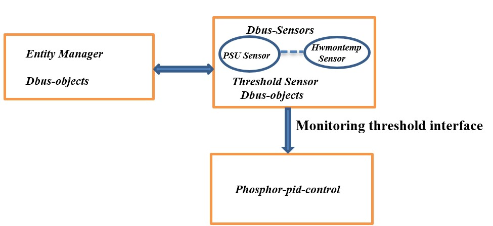
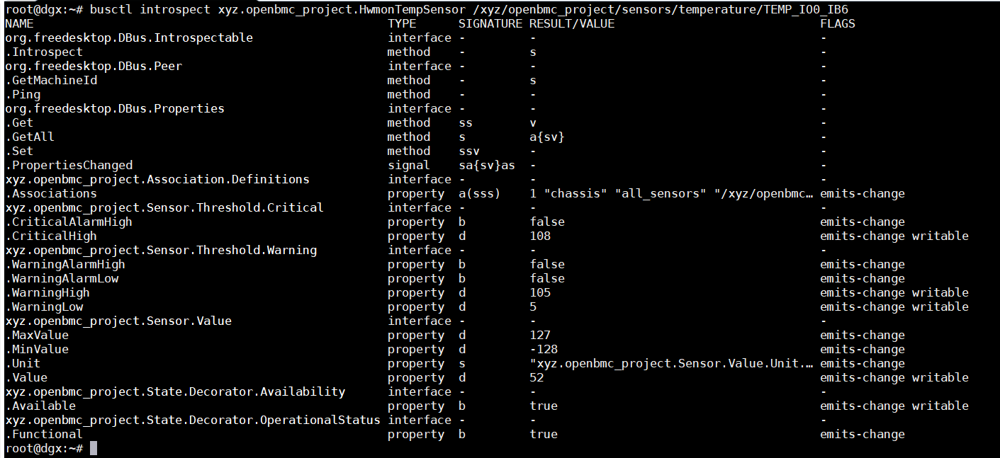

Thermal Management

Author: krishnar@ami.com

Primary assignee: krishnar@ami.com

Created: December 22, 2021

_ **Contents** _

**[1.](#_Toc91154603)****Thermal Management 4**

[**1.1.** One fan rotor failed. 4](#_Toc91154604)

[**1.2.** One of PSUs&#39; fan failed. 4](#_Toc91154605)

[**1.3.** Tcaution Action : 5](#_Toc91154606)

[**1.4.** At system start-up. 8](#_Toc91154607)

[**1.5.** Upon power on. 9](#_Toc91154608)

[**1.6.** PWM range 9](#_Toc91154609)

[**1.7.** Prior to proceeding to BMC Firmware Update. 11](#_Toc91154610)

## 1.Thermal Management

This document helps to enlighten the reader how Thermal management will
Perform specific Action when event condition meets.

## 1.1.One fan rotor failed.

Action to be taken
The Group which it belongs, will raise fan-duty to 80 % immediately.

Design

- Fan\*\_input can be used to determine whether fan is faulty or not.
  Fan\*\_input is created for each fan by driver itself.
  check fan speed at power ON state.If 0 RPM means Fan Failure(faulty).

 if Fan\_\*input = 0, then fan is faulty.

## 1.2.One of PSUs&#39; fan failed.

Action to be taken

The Group which it belongs, will raise fan-duty to 80 % immediately.

Design

- Fan\*\_input can be used to determine whether fan is faulty or not.
  Fan\*\_input is created for each fan by driver itself.

 if Fan\_\*input = 0, then fan is faulty.

## 1.3.Tcaution Action :

 

**Entity-Manager: -**

The entity-manager process parses all the .json files present in &quot;/usr/share/entity-manager/configurations/&quot; and checks if the Probe function is successful. If so, it uses those .json files to create system.json file in /var/configurations which is a combination of same platform specific .json file, then creates the sensor dbus objects.

**Dbus-Sensors: -**

Dbus Sensors are collection of sensor applications. For each sensor type, separate services run, updating sensor value from driver.

Each Sensor has multiple interface xyz.openbmc\_project.Sensor.Value used for Sensor Reading update,xyz. openbmc\_project.Sensor.Threshold.Critical and xyz. openbmc\_project.Sensor.Threshold.Warning used For Threshold value and its Status update.

Whenever Sensor Reading goes Below or Above Threshold Property getting changed.

xyz.openbmc\_project.Sensor.Threshold.Critical

.CriticalAlarmHigh property b false emits-change

.CriticalAlarmLow property b false emits-change

.CriticalHigh property d 3.647 emits-change writable

.CriticalLow property d 2.974 emits-change writable

xyz.openbmc\_project.Sensor.Threshold.Warning

.WarningAlarmHigh property b false emits-change

.WarningAlarmLow property b false emits-change

.WarningHigh property d 3.541 emits-change writable

.WarningLow property d 3.066 emits-change writable

**Phosphor-Pid-control: -**

Phosphor-Pid-control will be Monitoring threshold interface, whenever Properties getting changed Perform Specified Action.

Introspects of sensor TEMP\_IO0\_IB6

1.Sensor reaches to the upper non-critical threshold.

Action to be taken

Warning in event log. The Fan Zone which it belongs, will raise fan-duty to 80 % immediately.

Design

- Monitor Threshold interface

Interface:

xyz.openbmc\_project. Sensor.Threshold.Warning

Property:

WarningAlarmHigh

This property will be set to true when sensor reaches to upper non-critical threshold.

2.Sensor reaches to the upper critical threshold.

Action to be taken

System shutdown.

Design

- Monitor Threshold interface

Interface:

xyz.openbmc\_project.Sensor.Threshold.Critical

Property:

CriticalAlarmHigh

This property will be set to true when sensor reaches to upper critical threshold.

3.Sensor reaches to the upper non-recoverable threshold.

Action to be taken

System shutdown immediately.

Design

- upper non-recoverable and lower non-recoverable Not Supported in OE or Nvidia.

4.Sensor reaches to the lower non-critical threshold.

Action to be taken

Warning in event log.

Design

- Monitor Threshold interface

Interface:

xyz.openbmc\_project.Sensor.Threshold.Warning

Property:

WarningAlarmLow

This property will be set to true when sensor reaches to lower non-critical threshold.

Note: Already Events getting created when ever threshold going above or below Sensor Reading.

## 1.4. At system start-up.

Action to be taken

All the fan speed would keep in 50% duty, until the BMC is ready to monitor the temperature with auto fan.

Design

- Reference Olympus-nuvoton stack

[https://github.com/Nuvoton-Israel/openbmc/tree/runbmc/meta-quanta/meta-olympus-nuvoton/recipes-phosphor/fans/phosphor-pid-control](https://github.com/Nuvoton-Israel/openbmc/tree/runbmc/meta-quanta/meta-olympus-nuvoton/recipes-phosphor/fans/phosphor-pid-control)

## 1.5. Upon power on.

Action to be taken

If all fans in any zone are no detect, no readings or 0 RPM, then BMC turn off the system.

Design

- Reading fan value from sysfs &quot;/sys/class/hwmon/hwmon6/fan\*\_input&quot; path itself. If reading value is _0 rpm_ it is considered as fan failure.

if Fan\_\*input = 0, then fan is faulty.

Power Staus/OFF

Service

xyz.openbmc\_project.State.Chassis

Object Path

/xyz/openbmc\_project/state/chassis0 

Interface

xyz.openbmc\_project.State.Chassis

Property for power status

CurrentPowerState

Property for power off

RequestedPowerTransitions

## 1.6.PWM range

Action to be taken

Between 20%- 80%, If any manual command is trying to set any PWM through IPMI below 20%, then keep PWM on 20%. No cap on the top end of 80%.

Design

- While configuring Zone, keep minimum pwm value as 20 and maximum value as 80.

Example:

{

&quot;name&quot;: &quot;riser\_temp&quot;,

&quot;type&quot;: &quot;stepwise&quot;,

&quot;inputs&quot;: [

&quot;P0\_Riser\_Temp&quot;

],

&quot;setpoint&quot;: 30.0,

&quot;pid&quot;: {

&quot;samplePeriod&quot;: 1.0,

&quot;positiveHysteresis&quot;: 0.0,

&quot;negativeHysteresis&quot;: 0.0,

&quot;reading&quot;: {

&quot;0&quot;: 25000,

&quot;1&quot;: 26000,

&quot;2&quot;: 27000,

&quot;3&quot;: 28000,

&quot;4&quot;: 29000,

&quot;5&quot;: 30000,

&quot;6&quot;: 31000,

&quot;7&quot;: 32000,

&quot;8&quot;: 33000,

&quot;9&quot;: 34000,

&quot;10&quot;: 35000

}

&quot;output&quot;: {

**&quot;0&quot;: 20** ,

&quot;1&quot;: 22,

&quot;2&quot;: 34,

&quot;3&quot;: 46,

&quot;4&quot;: 48,

&quot;5&quot;: 50,

&quot;6&quot;: 55,

&quot;7&quot;: 59,

&quot;8&quot;: 65,

&quot;9&quot;: 70,

**&quot;10&quot;: 80**

}

}

}

## 1.7.Prior to proceeding to BMC Firmware Update.

Action to be taken

BMC shall set the fans to 80% PWM.

Design

**Image is Flashed by initrdscripts**

So, action can be performed using below scripts

https://github.com/openbmc/openbmc/blob/master/meta-phosphor/recipes-phosphor/initrdscripts/files/obmc-init.sh

**Note:**

**No Dbus-object path is getting created for phosphor-pid-control configurations.**

# OEM Action:  Callback Function

**actioncontroller.cpp**

This file has functions that are invoked during the oem action performed.

1. Function: processFanAction

**Synopsis**

double processFanAction(double reading, std::string sensorName,

int\* readFailureCnt)

This function is used to determine the setpoint values and perform

certain actions based on the sensor reading. This function should

return setpoint (pwm value)

| Parameter | Brief of Parameter |
| --- | --- |
| reading | Holds sensor reading |
| sensorName | The sensor name that is being monitored. |
| readFailureCnt | count number of fans having reading 0 in a Zone |

2. Function: processThermalAction

**Synopsis**

double processThermalAction(std::string sensorName)

This function is used to determine the setpoint values and perform

certain actions based on the sensor threshold change. This function should

return setpoint (pwm value)

| Parameter | Brief of Parameter |
| --- | --- |
| sensorName | The sensor name that is being monitored. |

**actioncontroller.hpp**

This file contains definitions of the functions that are being used in actioncontroller.cpp

1. Function: getPowerStatus

**Synopsis**

inline bool getPowerStatus (std::shared\_ptr\&lt;sdbusplus::asio::connection\&gt; conn)

This function is used to get the current power status.

| Parameter | Brief of Parameter |
| --- | --- |
| conn | Connection to dbus. |

2. Function: poweroff

**Synopsis**

inline void poweroff(std::shared\_ptr\&lt;sdbusplus::asio::connection\&gt; conn)

This function is used to turn off power.

| Parameter | Brief of Parameter |
| --- | --- |
| conn | Connection to dbus |

3. Function: getService

**Synopsis**

inline std::string getService(const std::string&amp; intf,

const std::string&amp; path)

This function is used to get the service name for each temperature sensor by using

the interface and object path.

| Parameter | Brief of Parameter |
| --- | --- |
| intf | The interface used for temperature sensor |
| path | The object path used for temperature sensor |

4. Function: monitorThreshold

**Synopsis**

inline double monitorThreshold (std::string sensorName)

This function is used to monitor threshold property (WarningAlarmHigh, CriticalAlarmHigh)

and perform action based on that.

| Parameter | Brief of Parameter |
| --- | --- |
| sensorName | The sensor name that is being monitored. |
