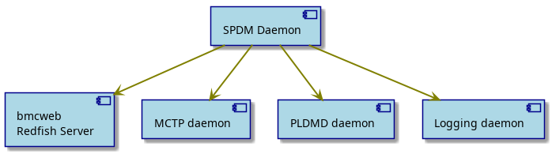
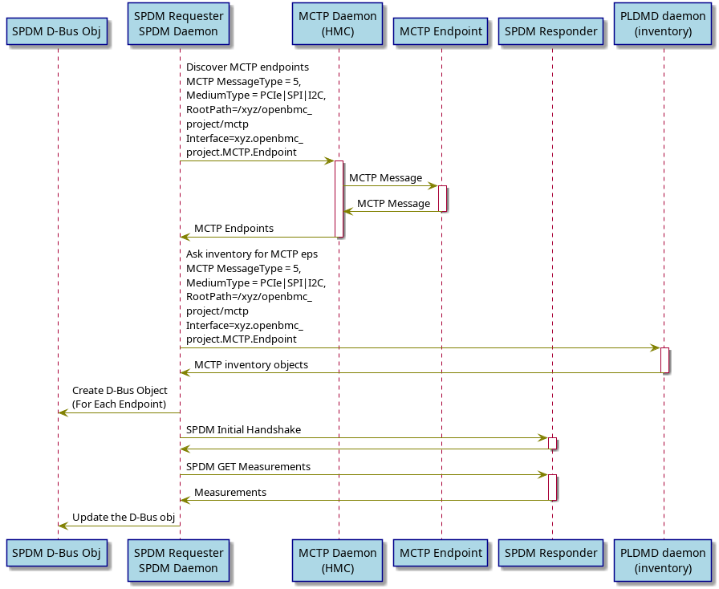
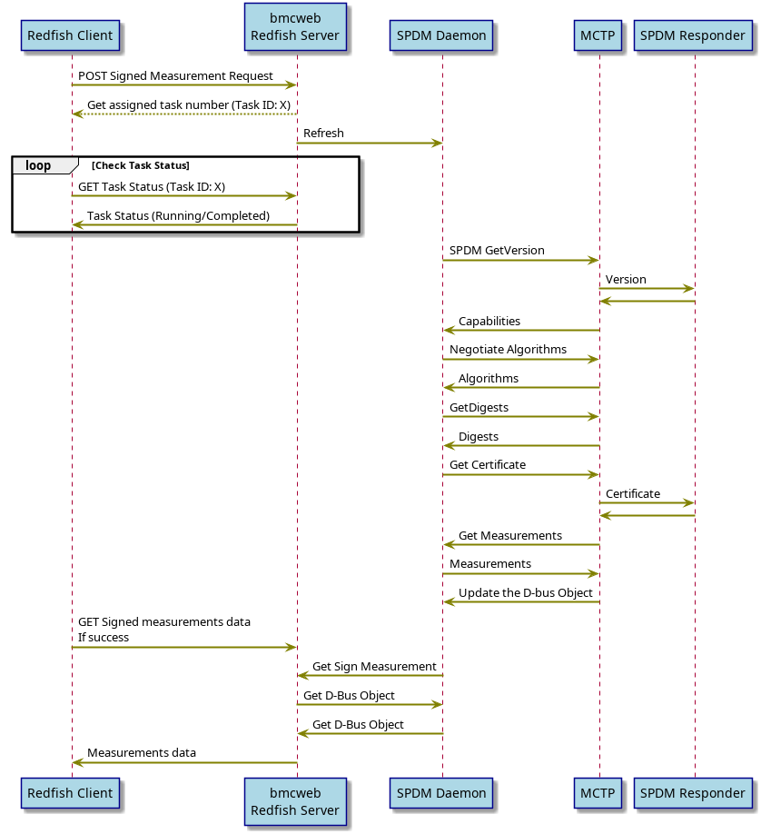
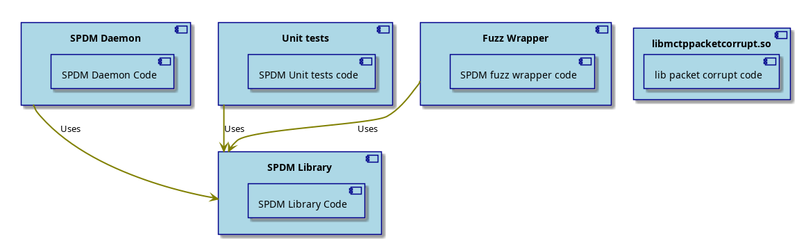

# SPDM

Author:
Marcin Nowakowski <marcin.nowakowski@conclusive.pl>

Primary assignee:

Other contributors:
Ratan Gupta <guptar@nvidia.com>

Created: 2021-11-30

## Problem Description

In a typical system where there are multiple subsystems, each subsystem can provide the measurement service but the problem is
- How can we securely share it with other subsystems.
- How can we safeguard from man in the middle attack.
- How does the subsystems establish the trust

SPDM’s vision is to resolve the long-lasting problem of compatible secure communication solution between two endpoints of embedded systems

Use-case:
- The authentication initiator can request from the component/subsystems a set of measurements of its firmware.
- These measurements can be compared to a database of validated measurements to assess whether or not the
  correct firmware is installed.
- If a measurement is determined to be incorrect, this indicates that an update is required,
  that malware has been introduced.
- If the authentication initiator sitting outside the BMC, can get this measurements through
  Redfish protocol (out of band management).

## Background and References

*Security Protocol and Data Model* (***SPDM***) is a standard published by the *Distributed Management Task Force* (***DMTF***) organization *Platform Management Components Intercommunication* (***PMCI***) working group.
The *Security Protocol and Data Model* (***SPDM***) Specification defines messages, data objects, and sequences for performing message exchanges between devices over a variety of transport and physical media. The description of message exchanges includes authentication of hardware identities, measurement for firmware identities and session key exchange protocols to enable confidentiality and integrity protected data communication. The SPDM enables efficient access to low-level security capabilities and operations.

SPDM specification is described here:
 Security Protocol and Data Model (SPDM) Specification (DSP0274)](https://www.dmtf.org/sites/default/files/standards/documents/DSP0274_1.1.1.pdf

Existing Reference implementation for SPDM:
 libspdm - a sample implementation that follows the DMTF SPDM specification](https://github.com/DMTF/libspdm)

### Glossary
* **RTT** - This is the worst case round trip transport timing.
* **ST1** - This shall be the maximum amount of time the Responder has to provide a response to
   requests that do not require cryptographic processing, such as GET_CAPABILITIES,
   GET_VERSION or NEGOTIATE_ALGORITHMS
   Value should be 100ms.
* **T1** - This shall be the minimum amount of time the Requester shall wait before issuing a
   retry for requests that do not require cryptographic processing.
   Value should be RTT + ST1.
* **CT** - This is the cryptographic timeout in microseconds. CTExponent is reported in the CAPABILITIES message
   Value should be 2^CTExponent
* **T2** - This shall be the minimum amount of time the Requester shall wait before issuing a retry for requests that require cryptographic processing.
* **Requester** - Original transmitter, or source, of an SPDM request message.
   It is also the ultimate receiver, or destination, of an SPDM response message.
* **Responder** - Ultimate receiver, or destination, of an SPDM request message.
   It is also the original transmitter, or source of an SPDM response message.

## Requirements

1. SPDM solution supports the following versions
	- Version 1.0 : Device Authentication and Measurement.
	- Version 1.1 : Device session key establishment and introduces secure communication.

2. BMC will act as an SPDM Requester, hence need to follow the requirements captured from the SPDM spec(DSP0274).

	- Concurrent SPDM message processing (SPDM Requester)
    	- A Requester shall not have multiple outstanding requests to the same Responder, with the exception of GET_VERSION addressed in GET_VERSION request message and VERSION response message.
    	- If the Requester has sent a request to a Responder and wants to send a subsequent request to the same Responder, then the Requester shall wait to send the subsequent request until after the Requester completes one of the following actions:
     		- Receives the response from the Responder for the outstanding request.
     		- Times out waiting for a response.
     		- Receives an indication, from the transport layer, that transmission of the request message failed.
    	- A Requester may send simultaneous request messages to different Responders

	- Timing requirements (SPDM Requester)
    	- If the Requester does not receive a response within T1 or T2 time accordingly, the Requester may retry a request message.
    	- Retry of a request message shall be a complete retransmission of the original SPDM request message.
      - Currently, for ERots, the T1 wait time is 3.1s while the T2 wait time is 68s

3. Fresh measurement will be taken on first boot or every boot of the BMC. This feature can be turned off in the configuration.

4. The BMC will be SPDM v1.1 compliant and the following messages need to be implemented.
   - GET_CAPABILITIES / CAPABILITIES,
   - NEGOTIATE_ALGORITHMS / ALGORITHMS,
   - GET_DIGEST / DIGEST,
   - GET_CERTIFICATE / CERTIFICATE,
   - CHALLENGE / CHALLENGE_AUTH,
   - GET_MEASUREMENTS / MEASUREMENTS

5. Supported requester capabilities:
   - CERT_CAP
   - CHAL_CAP
   - MEAS_CAP_10, MEAS_CAP_10

6. The BMC will not perform attestation by itself but will collect measurements on behalf of the Redfish client.

## Proposed Design

### High Level Architecture


- *SPDM Daemon*: Acts as the central component in the SPDM architecture, providing a D-Bus API used by bmcweb. It orchestrates the overall SPDM operations, including managing queries, performing handshakes, and data retrieval.
- *bmcweb Redfish*: Serves as an intermediary between the SPDM Daemon and Redfish clients. It translates Redfish API requests into SPDM commands and communicates these to the SPDM Daemon via the D-Bus interface.
- *MCTP daemon*: Facilitates communication between the SPDM Daemon and MCTP endpoints. It plays a crucial role in the transport of SPDM messages over various mediums such as PCIe, SPI, and I2C, ensuring efficient message exchange within the SPDM protocol.
- *PLDMD daemon*: Provides inventory information for MCTP endpoints to the SPDM Daemon. This daemon is instrumental in discovering and managing SPDM-capable devices.
- *Logging daemon*: Used to log diagnostic information related to the operations of the SPDM Daemon. It helps in monitoring, troubleshooting, and maintaining the health of the SPDM system by providing essential logs and error messages.


### High Level Design Diagram

#### SPDM Endpoint Discovery



- The SPDM daemon uses MCTP discovery mechanism and PLDM inventory mechanism to check available MCTP devices
- Only devices with message type 5 (SPDM) are detected
- In addition, the type of transport medium for a given MCTP device (PCIe, SPI, I2C) is checked from each device. 
If the same device is visible on several interfaces the medium with the highest possible speed is selected first in order: PCIe (first), SPI (second), I2C(third)
- The MCTP discovery mechanism is provided by ctrld, implemented in mctp library and the PLDM inventory mechanism is provided by PLDM daemon.
- SPDM daemon creates the D-bus object for all the connected SPDM endpoints.
- SPDM daemon initiate the handshake and get the measurement data from the connected devices and updates the D-Bus objects.
- Once all MCTP capable devices are discovered, SPDM daemon will do the handshake with all of them.


#### Redfish Client Invoking the signMeasurementFunction



- In the above flow diagram, Redfish client asks the BMC to get the fresh measurement of SPDM responder.
- SPDM daemon will start the SPDM message exchange.
- The Redfish server responds with a job number url, which should be periodically checked to see if the measurement processing has completed.
- SPDM daemon takes measurements and then updates the state of the D-bus object.
- Once processing is complete, the measurement data can be retrieved from the sub-address returned by the task status.

### D-Bus API

The D-Bus communication layer provides dedicated means to get all information required by the Redfish schema, specific to SPDM. The SPDM daemon uses the D-Bus API provided by the [sdbusplus repo](https://github.com/openbmc/sdbusplus.git). The individual SPDM endpoints are visible in the form of a DBUS object tree, each endpoint is assigned a specific name in the DBUS tree.

The D-Bus object for each SPDM endpoint will contain a set of properties and Refresh method that enable the retrieval of basic information about the state of a given endpoint, such as SPDM versions, capabilities, signing and hashing algorithms, measurements data, certificates, authentication status, and more.
The above D-Bus object will not be persistent (i.e., fresh measurement could be taken after BMC reboot or service restart). Additionally, the D-Bus object will have refresh method to get fresh measurements, refresh certificates.

#### Object tree

The individual SPDM endpoints are visible in the form of a DBUS object tree, each endpoint is assigned a specific name in the DBUS tree:
```
-/xyz
  `-/xyz/openbmc_project
    `-/xyz/openbmc_project/SPDM
      |-/xyz/openbmc_project/SPDM/<ID1>
      |-/xyz/openbmc_project/SPDM/<ID2>
      |-/xyz/openbmc_project/SPDM/<ID3>
```
where ***IDx*** can be a mash-up of the eRoT’s id plus the protected entity ex `HGX_ERoT_BMC_0`. 
The maximum number of supported MCTP/SPDM endpoints is 255.

#### DBus Interfaces

| Interface                                      | Description                                   |
| ---------------------------------------------- | --------------------------------------------- |
| `xyz.openbmc_project.Association.Definitions`  | Handles associations in xyz.openbmc_project.  |
| `xyz.openbmc_project.SPDM.Responder`           | Interface for the SPDM Responder.             |


#### xyz.openbmc_project.SPDM.Responder interface

| Name                          | Description                                                                                                                                                                                                                                                            |
| ----------------------------- | ---------------------------------------------------------------------------------------------------------------------------------------------------------------------------------------------------------------------------------------------------------------------- |
| **Capabilities**              | Responder capabilities according to the Responder flags fields definition in DSP0274_1.1.0c.                                                                                                                                                                           |
| **Certificate**               | ASN.1 PEM-encoded X.509 v3 format certificate chains provided by the responder.                                                                                                                                                                                        |
| **HashingAlgorithm**          | The hashing algorithm used for SPDM messages, negotiated between SPDM requester and responder.                                                                                                                                                                         |
| **LastUpdate**                | The point in time when the last successful read of certificate and measurements occurred.                                                                                                                                                                             |
| **Measurements**              | Representation of firmware/software or configuration data on an endpoint, typically a cryptographic hash value or the raw data itself.                                                                                                                                  |
| **MeasurementsHash**          | Hash of the given nonce and measurement blocks corresponding to the requested measurement indices.                                                                                                                                                                     |
| **MeasurementsSignature**     | Cryptographic signature of the hash stored in MeasurementsHash.                                                                                                                                                                                                        |
| **MeasurementsType**          | Type of measurements requested by an SPDM requester from a responder within the CHALLENGE request message.                                                                                                                                                             |
| **Nonce**                     | The last used nonce, a random number of exactly 32 bytes.                                                                                                                                                                                                              |
| **SessionId**                 | Session IDs used for the communication channels.                                                                                                                                                                                                                       |
| **SignedMeasurements**        | Cryptographic signed statement over the given nonce and measurement blocks corresponding to the requested measurement indices.                                                                                                                                         |
| **SigningAlgorithm**          | The signing algorithm used for SPDM messages, negotiated between SPDM requester and responder.                                                                                                                                                                         |
| **Slot**                      | A slot (index) of a certificate chain which was used for the last signing measurements.                                                                                                                                                                                |
| **Status**                    | Status of the SPDM communication between the SPDM daemon requester and the responder.                                                                                                                                                                                   |
| **Version**                   | The SPDM EROT responder version.                                                                                                                                                                                                                                       |

#### Arguments for the `Refresh` Method

| Argument               | Description                                                                                                                  |
| ---------------------- | ---------------------------------------------------------------------------------------------------------------------------- |
| **slot**               | Slot number to get certificates from a responder. By default value 0 should be used.                                         |
| **nonce**              | Nonce to be used with CHALLENGE and GET_MEASUREMENT request messages. It should be a random number up to 32 bytes.            |
| **MeasurementIndices** | An array of indices that identify the measurement blocks to sign. This array can contain values between 0 to 254, inclusive, or a single value of 255. If not provided by the client, it is assumed to be an array containing a single value of 255. |
| **sessionId**          | Session ID chosen for the communication channel. This parameter is optional as the current implementation does not provide secure sessions implementation. |


#### xyz.openbmc_project.Association.Definitions interface
In addition to the basic interface to the responder, each SPDM endpoint additionally exposes an *xyz.openbmc_project.Association.Definitions* interface with the *.Associations* property. 
In this property we can find two objects:
- *transport_object* which stores the path to the transport endpoint eg: MCTP.
- *inventory_object* which represents the path of the inventory object.


#### Example Usage of SPDM with D-Bus Interface

This section outlines the essential commands for interacting with the SPDM (Security Protocol and Data Model) using the D-Bus interface. These commands facilitate the management and querying of SPDM endpoints, enabling secure communication and data measurement in embedded systems.

##### Listing SPDM Endpoints

To list all SPDM endpoints registered under the D-Bus:

```bash
busctl tree xyz.openbmc_project.SPDM
```

This command displays the hierarchy of SPDM endpoints available in the system.

##### Refreshing Certificates

To refresh the certificates of a specific SPDM endpoint.

```bash
busctl call xyz.openbmc_project.SPDM /xyz/openbmc_project/SPDM/HGX_ERoT_BMC_0 xyz.openbmc_project.SPDM.Responder Refresh yayayu 0 0 0 0
```

This command triggers the SPDM daemon to update the certificates for the specified endpoint.

##### Getting Certificate Properties

To retrieve the certificate properties from an SPDM endpoint:

```bash
busctl --no-pager get-property xyz.openbmc_project.SPDM /xyz/openbmc_project/SPDM/HGX_ERoT_BMC_0 xyz.openbmc_project.SPDM.Responder Certificate
```

This command fetches the certificate information of the specified endpoint, essential for verifying its authenticity.

##### Introspecting an Endpoint

To introspect an SPDM endpoint for detailed information:

```bash
busctl --no-pager introspect xyz.openbmc_project.SPDM /xyz/openbmc_project/SPDM/HGX_ERoT_BMC_0
```

Introspection provides a detailed view of the D-Bus object's interface, methods, and properties.

##### Checking Endpoint Status

To get the status of an SPDM endpoint:

```bash
busctl --verbose --no-pager get-property xyz.openbmc_project.SPDM /xyz/openbmc_project/SPDM/HGX_ERoT_BMC_0 xyz.openbmc_project.SPDM.Responder Status
```

This command retrieves the current status of the SPDM communication, indicating if the endpoint is functioning correctly or experiencing issues.

##### Retrieving Measurements

To obtain the measurements data from an SPDM endpoint:

```bash
busctl --no-pager get-property xyz.openbmc_project.SPDM /xyz/openbmc_project/SPDM/HGX_ERoT_BMC_0 xyz.openbmc_project.SPDM.Responder Measurements
```

Measurements data are critical for assessing the firmware/software integrity of the endpoint.


#### How to get the inventory path of the EROT

- PLDM creates the inventory of the ERoT.
- During creation of the inventory object pldm implements the UUID interface 
as well as the Item.
- D-Bus client will query for inventory objects that implement *Item.ComponentIntegrity*
  interface by the pldm service.
- For each object which implements the *ComponentIntegrity* interface, gets the MCTP UUID
  from that object and match with the MCTP D-bus object UUID which is associated with the
  SPDM measurement D-Bus object.

#### How to get the inventory path of the components protected by the EROT

- Application which creates the EROT inventory object, will implement the component-
  integrity interface and its associations.
- D-Bus client will query for all the inventory objects implementing the Item.ComponentIntegrity interface.
- Get the associated objects from the objects implementing the Item.ComponentIntegrity interface.

### Structure of the SPDM Module

SPDM module will consists of the following parts:
- *SPDM library* - prepared as a separate library to support SPDM daemon, unitary tests and any external responder or requester implementation
- *SPDM daemon* - main daemon to manage SPDM queries
- *SPDM unitary tests* - unitary tests for SPDM library implementation
- *SPDM fuzz test code* - Wrapper to enable fuzz testing using the AFLFuzz framework
- *libmctppacketcorrupt.so* - Shared library that allows simulation of errors in transmitted packets at the level of MCTP<->SPDM communication



The solution has been prepared as a single SPDM daemon with D-Bus interface and without a dedicated library. However, layering the design into separate daemon and library may be useful to reuse the source code for other responders. Also, it makes unitary and fuzz tests more robust. Additional libmctpacketcorrupt library allows simulation and generation of packet corruption in communication between MCTP and SPDM.

### Dependencies
- SPDM library requires MCTP control module
- SPDM library requires also security libraries
- SPDM daemon requires accessing D-Bus

### Implementation assumptions
- Build system: meson
- Language for all source code files: `C++` (`C++` is chosen to distinguish implementation from open spdm reference project and also to speed up development, especially using standard classes)
- SPDM solution is meant to work in Linux environment, and it will not support Windows environment.
- We will not use shared (or global) variables. The whole implementation should be "thread safe" and use std::mutex and std::lock_guard if required.
- The daemon should work in Linux user space - we do not predict kernel modules in the implementation.

### SPDM library - *libspdmcpp*
The library provides the following external API:
- Serialization and deserialization of the required SPDM messages.
- Sending and receiving messages over MCTP with SPDM payload in secured and non-secured versions.
- Any security or certificates management required by SPDM requester or responder.

Security algorithms support: ***SHA-2***, ***RSA-SSA/ECDSA***, ***FFDHE/ECDHE***, ***AES_GCM/ChaCha20Poly1305***, ***HMAC***
The library internally uses as security library: [MbedTLS](https://tls.mbed.org/kb/development/hw_acc_guidelines)
Open SSL could be used also, but we need only one crypto library. MbedTLS seems to be a better choice.

##### Supported communication layers:

- Stage 1, SPDM over MCTP
[DSP0275 Security Protocol and Data Model (SPDM) over MCTP Binding Specification](https://www.dmtf.org/sites/default/files/standards/documents/DSP0275_1.0.0.pdf)
[DSP0276 Secured Messages using SPDM over MCTP Binding Specification](https://www.dmtf.org/sites/default/files/standards/documents/DSP0276_1.0.0.pdf)
- Optional stage 2, SPDM over the PCI DOE
[PCI Data Object Exchange (DOE)](https://members.pcisig.com/wg/PCI-SIG/document/14143)
[PCI Component Measurement and Authentication (CMA)](https://members.pcisig.com/wg/PCI-SIG/document/14236)
[PCI Integrity and Data Encryption (IDE)](https://members.pcisig.com/wg/PCI-SIG/document/15149)

Secure communication:
- [DSP0277 Secured Messages using SPDM Specification](https://www.dmtf.org/sites/default/files/standards/documents/DSP0277_1.0.0.pdf)

### SPDM daemon - *spdmd*
- SPDM daemon is a single threaded process.

- BMC acts as the SPDM requester

- After start, Daemon creates the D-Bus objects for the discovered SPDM responders(MCTP Discovery)
- We do not predict more than one SPDM daemon in the system.

Daemon has two parts:
- Dbus handler: Which handles the D-bus request
- libspdmreq/res: It handles the SPDM req/res parsing and the implementation of SPDM state machine

#### Configuration
The main configuration is done through parameters passed via the command line, which can be passed in the systemd service configuration. Additionally, there is an option to configure ERoT which are not considered during enumeration via a configuration file.

#### Command line parameters for spdmd
- **--version** (-v)
Returns spdm daemon version and compilation date.
- **--help** (-h)
Provides params syntax, also for a configuration file
- **--verbose** [0-7]
Sets debug level:

   0. Emergency
   1. Alert
   2. Critical
   3. Error
   4. Warning
   5. Notice
   6. Informational
   7. Debug
- **--cached_measurements** Enables automatic getting of measurements for all devices or the listed EIDs upon discovery but no quicker than delay
- **--cached_measurements_delay** The initial communication should be performed after running the daemon with a delay configured by this param. Default value: 60.

#### Meson Configuration

- **systemd:** create the spdmd systemd service or not,by default it is enabled
- **discovery_only_from_mctp_control:** SPDM Endpoint discovery is based only on MCTP, By default discovery is based on MCTP and inventory both, by default it is disabled  
- **fetch_serialnumber_from_responder:** If not 0 then SPDMD will feth the serial number measurement from the SPDM responder and write it to the inventory object, by default it is enabled
- **emu:** Build SPDM Responder emulator for testing purpose, by default it is disabled
- **use_default_dbus:** Use default DBus bus for tests on x86, by default it is disabled
- **conf_file_name:** path to SPDM json configuration file,It is optional, More detail is below

#### Configuration file for spdmd
The configuration file */etc/spdmd_conf.json* is an optional file where some SPDM endpoints doesn't need to be reported through Redfish and there is no inventory for those endpoints on the BMC, Eg: Sat-mc The format of this file is as follows:
```json
{
    "endpoints" : [
        {
            "eid" : eid_number,
            "name" : "endpoint_name",
            "enabled" : boolean,
            "description" : "endpoint_description"
        }
    ]
}
```
, where:
- ***eid*** *(range 1-255)* is the number of the SPDM endpoint to which we want to assign a name.
- ***name*** *(string)*, is the name of the SPDM endpoint that will be visible as a name in the DBUS endpoint tree.
- ***enabled*** *(true, false)*, SPDM endpoint needs to be shown through RF componemt integrity.
- ***endpoint_description*** *(string)*, describing the purpose of the given endpoint.

An example configuration file may look as follows:
```json
{
    "endpoints" : [
        {
            "eid" : 30,
            "name" : "satmc",
            "Enabled" : false,
            "description" : "Satellite Managemen Controller"                                        
        }
    ]
}

With the above configuration, When MCTP object having EID=30 appears, SPDMD looks into the configuration file, If it finds the EID then it gets the name of the endpoint from the configuration and set the enabled property to false.

```

### Error handling
Any error occurred during communication or due to timeout will cause failure in authorization verification.
Communication errors are reported through the status property.
Proper measurements can be read only if Status property is equal to "Success".
When Status is equal to *"Success"* and the value in this field is still empty then
it may mean that the responder does not provide proper measurements.
Data in this property is provided from an SPDM responder device directly.

The list of available status errors is as follows:
- ***Success***: The communication is proper, all certificates and measurements for this responder are properly gathered and ready.
- ***Initializing***: The SPDM requester has just started communication with the responder. This status is set by default after a system restart.
- ***GettingCertificates***: The SPDM requester is in the stage of getting certificates from the responder.
- ***GettingMeasurements***: The SPDM requester is in the stage of getting measurements from the responder.
- ***Error_ConnectionTimeout***: The SPDM daemon didn't receive a request response from an SPDM responder within an allowed time window. This status will be shown only for a while. A restart of the connection will be performed as soon as the SPDM requester does not perform any other communication with other SPDM responders. If the status exists most of the time, it may mean that the SPDM responder is not active or stuck in an unresponsive state. The Redfish client may map this error to: 504 Gateway Timeout.
- ***Error_Responder***: An issue was discovered in a request response during communication between SPDM requester and responder. SPDM daemon will stop communication with this responder until a new Refresh command. The Redfish client may map this error to: 502 Bad Gateway.
- ***Error_RequesterCommunication***: The SPDM responder provided more data in a request response than the SPDM requester expected, which resulted in an internal error: buffer too small. SPDM daemon will stop communication with this responder until a new Refresh command. The Redfish client may map this error to: 507 Insufficient Storage or 500 Internal Server Error.
- ***Error_CertificateValidation***: Certificate validation occurred in SPDM requester after checking a certificate provided by an SPDM responder. Possible reasons include an invalid root certificate hash, invalid certificate chain digest, or failed certificate chain verification. SPDM daemon will stop communication with this responder until a new Refresh command. The Redfish client may map this error to: 502 Bad Gateway.
- ***Error_AuthenticationFailed***: The SPDM requester encountered an authentication issue during communication with the SPDM responder. SPDM daemon will stop communication with this responder until a new Refresh command. The Redfish client may map this error to: 502 Bad Gateway.
- ***Error_MeasurementsSignatureVerificationFailed***: The SPDM requester failed on signature verification for measurements provided by the SPDM responder. SPDM daemon will stop communication with this responder until a new Refresh command. The Redfish client may map this error to: 502 Bad Gateway.
- ***Error_InvalidArguments***: The arguments provided to the Refresh method were invalid, so the call is ignored, and communication with this responder will not be started.
- ***Error_Other***: The SPDM daemon requester encountered some internal issue or unsupported error. This status will be shown only for a while. A restart of the connection will be performed as soon as the SPDM requester does not perform any other communication with other SPDM responders. If the status exists most of the time, it may mean that the SPDM requester has an internal issue. The Redfish client may map this error to: 500 Internal Server Error.


## Example Usage of SPDM with RedFish Interface

This section provides a guide on how to retrieve SPDM (Security Protocol and Data Model) attestation values using the Redfish API. The examples demonstrate various ways to interact with SPDM-enabled devices for attestation purposes.

### Retrieving SPDM Endpoints list

#### Getting the Base SPDM endpoints list

To retrieve the list of available endpoints:

```bash
curl http://${hmc}/redfish/v1/ComponentIntegrity/
```

This command fetches the list of SPDM endpoints for all components available in the system.

#### Getting the Measurement for a Specific Slot

To get the measurement data from a specified slot (e.g., slot 1):

```bash
curl -s -X POST -d '{ "SlotId": 1, "MeasurementIndices": [1]}' http://${hmc}/redfish/v1/ComponentIntegrity/HGX_ERoT_BMC_0/Actions/SPDMGetSignedMeasurements
```

This POST request triggers the measurement process for the specified slot and returns the task ID for further queries.

#### Retrieving the Certificate for a Specific Slot

To fetch the certificate chain from a given slot (e.g., slot 1):

```bash
curl http://${hmc}/redfish/v1/Chassis/HGX_ERoT_NVSwitch_0/Certificates/CertChain
```

This command retrieves the certificate chain for the specified slot, which is crucial for verifying the component's integrity.

### Example: Getting Measurements of All Indices

To request the measurement of all indices for a specific component:

```bash
curl -X POST -d '{ "MeasurementIndices": [1]}' http://${hmc}/redfish/v1/ComponentIntegrity/HGX_ERoT_FPGA_0/Actions/SPDMGetSignedMeasurements
```

The response will include a task ID, which can be used to query the task status:

```bash
curl http://${hmc}/redfish/v1/TaskService/Tasks/6
```

The response will detail the task's completion status, time, and any associated messages.
Once the task completes, retrieve the signed measurement data:

```bash
curl http://${hmc}/redfish/v1/ComponentIntegrity/HGX_ERoT_FPGA_0/Actions/SPDMGetSignedMeasurements/data
```

The output will include details like the hashing algorithm used, the signed measurements, the signing algorithm, and the SPDM version.

```json
{
    "HashingAlgorithm": "TPM_ALG_SHA_384",
    "SignedMeasurements": "EeABAQnAYGYfYURORuqWTgvOY0O0fQU9NTenEBqYTkYddndvzxgzxbcbxcbzxbzbbfWo7yrcwe9Hz5",
    "SigningAlgorithm": "TPM_ALG_ECDSA_ECC_NIST_P384",
    "Version": "1.1.0"
}
```

The above examples showcase how to interact with SPDM-enabled devices through the Redfish API to obtain crucial attestation data.
For comprehensive commands and detailed usage, refer to the official SPDM documentation and the Redfish API guide.


## Licensing
In the initial phase we assume [Apache v2](https://www.apache.org/licenses/LICENSE-2.0) type of the license for the repository and all sources.

## Platform enablement
### OpenBMC
To add the SPDM daemon (spdmd) to a new machine/platform

- set the *OBMC_IMAGE_EXTRA_INSTALL* variable for the target machine.

  This identifier is used to append the necessary packages to the image specifically for that machine. For example, if the target machine is identified as 'dgx', then the following line should be added to the appropriate .bbappend file, located in a machine-specific meta-layer *meta-nvidia/recipes-phosphor/images/obmc-phosphor-image.bbappend* 
```bash
OBMC_IMAGE_EXTRA_INSTALL:append:dgx = " libmctp pldm spdm"
```
This line ensures that the SPDM package is included in the final OpenBMC image built with all required dependencies MCTP and PLDM.

-  Need to update the JSON file optionaly, If the platform is having an SPDM endpoint which doesn't need to be shown as part of the OOB Redfish interface eg: sat-mc
To incorporate a custom configuration file for SPDM endpoints on a specific machine like 'dgx' in the OpenBMC project, an optional step can be taken. This involves modifications in the *spdm_%.bbappend* file within the *./meta-nvidia/meta-[platform]/recipes-phosphor/spdm/* directory. Here, a line is added to include a custom configuration file named *spdmd_conf_dgx.json* for the 'dgx' machine build, ensuring the SPDM daemon (spdmd) utilizes these manually defined endpoints.
```bash
FILESEXTRAPATHS:prepend := "${THISDIR}/files:"
SRC_URI:append:dgx = " file://spdmd_conf_dgx.json"

do_install:append:dgx() {
    mkdir -p ${D}${sysconfdir}
    install -m 0644 ${WORKDIR}/spdmd_conf_dgx.json ${D}${sysconfdir}/spdmd_conf.json
}
```
## How to enable verbose logging
Verbose logging in the SPDM Daemon (SPDMD) is crucial for debugging and understanding the internal operations of the daemon, especially in communication problems. By default, SPDMD logs errors at level 3. However, it supports more verbose logging levels, including level 6 for detailed message logging between SPDM and level 7 for full trace logging, including function calls. To enable verbose logging, you need to modify the spdmd.service file:

- Open the */lib/systemd/system/spdmd.service* service file in the vi editor
- Modify *ExecStart* command to `ExecStart=/usr/bin/spdmd -v6`
- Reload systemd manager configuration to apply the changes `systemctl daemon-reload`
- Restart the SPDMD service to enable verbose logging `systemctl restart spdmd.service`

## Testing
Unitary tests: each function available in the libspdmcpp API has to have its own unitary tests. We use the Google Test framework to write and execute these tests, ensuring robustness and reliability of the testing process.  Current code coverage is 88% line coverage and 96.5% function coverage.

### Fuzz tests
For fuzz testing, we have incorporated the AFL fuzz framework. This integration allows us to generate a wide range of input data to effectively test the robustness of our SPDM implementation under various conditions. The SPDM wrapper, which also uses the libspdmcpp library, employs a technique known as dependency injection, making it easy to replace components responsible for communication with the MCTP daemon.

The wrapper is tasked with reading data from the fuzzer and preparing responses based on this input. Unlike the SPDM daemon, the wrapper operates without networking capabilities, reading data directly from the fuzzer. Additionally, it does not trigger DBus; instead, it initiates the communication between the requester and responder.
Spdm wrapper can be used as standalone application or together with fuzzer. Using as standalone application is very useful for reproducing the bugs. Fuzzer is responsibly for delivering the spdm wrapper's input data that crashes the wrapper. It is very important to provide proper parameters to start the wrapper.
In order to test SPDM MCTP part, a special program called spdm_wrapper was implemented. This program is used by AflPlusPlus as an child process. Spdm wrapper can by started with following arguments:

```bash
SPDM wrapper for fuzz tests, version 0.1.0
Usage: ./spdm_wrapper/spdm_wrapper [OPTIONS]
```
The available arguments with their description are shown in the following table:

| Argument                 | Description |
| ------------------------ | ----------- |
| `-h, --help`             | Print this help message and exit. |
| `-e, --exitAfterFirstFuzzing` | Exit after first fuzzing. If not used, the wrapper reads the current state and takes into consideration that the transition between states could be disturbed, returning the SPDM responder to the initial state. |
| `-g, --grammar`          | Use grammar in the fuzz generator. This enables the generation of input data based on grammar rules. |
| `--fResponsesAll FLOAT:INT [0 - 100]` | Probability of altering all response messages. |
| `--fRespVersion FLOAT:INT [0 - 100]` | Probability of altering the VersionResponse message. |
| `--fRespCapabilities FLOAT:INT [0 - 100]` | Probability of altering the Capabilities response message. |
| `--fRespAlgorithms FLOAT:INT [0 - 100]` | Probability of altering the Algorithms response message. |
| `--fRespDigest FLOAT:INT [0 - 100]` | Probability of altering the Digest response message. |
| `--fRespCertificate FLOAT:INT [0 - 100]` | Probability of altering the Certificate response message. |
| `--fRespChallengeAuth FLOAT:INT [0 - 100]` | Probability of altering the Challenge Authentication response message. |
| `--fRespMeasurements FLOAT:INT [0 - 100]` | Probability of altering the Measurements response message. |
| `--alterHeader FLOAT:INT [0 - 100]` | Probability of altering the header. |
| `--alterHeaderVersion FLOAT:INT [0 - 100]` | Probability of altering the version in the header. |
| `--alterHeaderType FLOAT:INT [0 - 100]` | Probability of altering the message type in the header. |
| `--alterHeaderParam FLOAT:INT [0 - 100]` | Probability of altering param1 or param2 in the header. |
| `--alterPayloadData FLOAT:INT [0 - 100]` | Probability of altering payload's data. |
| `--readLogFile TEXT`     | Read log file with responses to reuse those responses. |
| `--readResponseFile TEXT`| Read file with responses (in hex format) to reuse those responses. |

- The `-e` flag is crucial for efficient fuzzing as it stops the process after the first altered message, indicating a potential issue in state transition.
- The `-g` flag activates the grammar generator scenario, instructing the wrapper to create inputs based on grammar rules.
- The `fRespX` and `alterX` arguments define probabilities for fuzzing specific parts of the message or header.
- The `--readLogFile` and `--readResponseFile` options enable the response dictionary scenario, where responses are read from a file and stored in a dictionary for reuse.

### ***libmctppacketcorrupt.so*** shared library used to simulate packet corruption

This library has been created to simulate packet corruptions between MCTP and SPDM. The primary function of the library is to intercept the system calls read and write used to communicate between MCTP and SPDM. Leveraging the ldpreload technique, the library is preloaded before other libraries, allowing it to intercept these calls and introduce modifications to the transmitted packets. The primary objective of this library is to simulate data packet corruption between MCTP and SPDM for testing purposes.

The library will read configuration data from two system variables ***MCTP_CORRUPT_MODE*** and ***MCTP_CORRUPT_RAND_LEVEL***  parameter will determine which field of the packet was corrupted:

| MCTP_CORRUPT_RAND_LEVEL name     | Description |
| ------------------ | ----------- |
| `bypass`           | Message is passed to the real caller without any modification. |
| `command`          | Command code is corrupted. |
| `reserved`         | Reserved fields are not empty. |
| `msglen`           | Actual response message length is less/greater than the given length in the message. |
| `zerolen`          | Message length is truncated to zero. |
| `version`          | SPDM message version header is modified. |
| `certlen`          | Certificate length field is corrupted. |
| `certdata`         | Certificate data are corrupted. |
| `unsupalgo`        | Algorithm fields are corrupted. |
| `unsupcapab`       | Capabilities fields are corrupted. |
| `versionfields`    | 'Get versions' fields param1, param2, reserved are modified. |
| `capabfields`      | 'Get capabilities' fields param1, param2, reserved are modified. |
| `digestfields`     | 'Get Digest' fields param1, param2, reserved are modified. |
| `certfields`       | 'Get Cert' fields param1, param2, reserved are modified. |
| `algofields`       | 'Get Algo' fields param1, param2, reserved are modified. |

#### System Variables
- `MCTP_CORRUPT_MODE`: Determines the mode of packet corruption based on the parameters above.
- `MCTP_CORRUPT_RAND_LEVEL`: Influences the level of randomness in packet corruption.

These parameters allow for a controlled and varied simulation of packet corruption, aiding in robustness testing of the SPDM protocol implementation.

***MCTP_CORRUPT_RAND_LEVEL*** parameter will determine with what probability the packet may be corrupted if use syntax `m/n`, where:
- `m`: where m is the number of packets that will be modified in the sequence
- `n` is the length of the sequence

There is also an alternative syntax that allows you to specify exactly the packet numbers in the sequence that will be modified `a,b,c,...%n` where:
- `a b c ` where abc are the sequence numbers of the packets that will be modified.
- `n` is the length of the sequence

#### Example usage

To configure the library to modify the size in 2 of the 10 packages, configure it as follows:
```
export MCTP_CORRUPT_MODE=msglen
export MCTP_CORRUPT_RAND_LEVEL='2/10'
LD_PRELOAD=libpacketcorrupt.so spdmd -v 7
```

To configure the library so that packages numbered 6 and 7 of 8 have a modified version header, configure it as follows
```
export MCTP_CORRUPT_MODE=version
export MCTP_CORRUPT_RAND_LEVEL='6,7,8%10'
LD_PRELOAD=libpacketcorrupt.so spdmd -v 7
```
### Stress tests
Stress testing is a critical part of resilience tests designed to evaluate system robustness under heavy load or demanding conditions. This test pusts limits, ensuring stability and performance under stress.
For testing purposes, a separate application was created which is available in the openbmc-test-automation repository. The operation of the application is to maximize the load on the system with various operations, and on the *SPDM* side, it consists of cyclically sending a request to download measurements to the *BMCWEB*.


The stress tests can be launched using the *Robot Framework*. Key parameters to specify include the system type (HGX or DGX), test type (stress), test duration, BMC IP, and Host OS IP. Optionally, you can specify the path to an image bundle.

Here's an example command to run a stress test:
```bash
robot -d <Reports Dir> -v SYSTEM_TYPE:<hgx/dgx> -v TEST_TYPE:stress -v TEST_DURATION:<hours> -v OPENBMC_HOST:<BMC_IP> -v OS_HOST:<Host IP> -v IMAGE_BUNDLE_PATH:</path> --pythonpath resiliency_tests --loglevel TRACE --maxerrorlines NONE resiliency_tests/test_longevity.robot
```
, where:
- `<Reports Dir>`: Directory for storing test reports and logs.
- `-SYSTEM_TYPE:<hgx/dgx>`: System type for the test (HGX or DGX).
- `TEST_TYPE:stress`: Type of test to run (stress test).
- `TEST_DURATION:<hours>`: Duration of the test in hours.
- `OPENBMC_HOST:<BMC_IP>`: IP address of the BMC (Baseboard Management Controller).
- `OS_HOST:<Host IP>`: IP address of the Host Operating System.
- `IMAGE_BUNDLE_PATH:</path>`: Path to the image bundle file.
