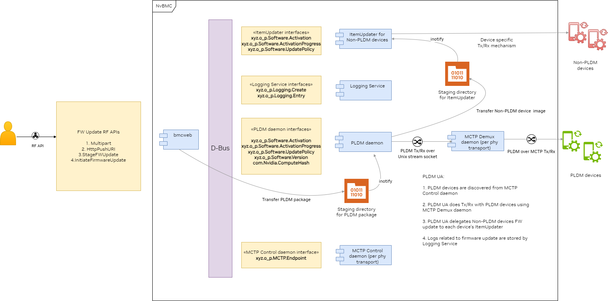
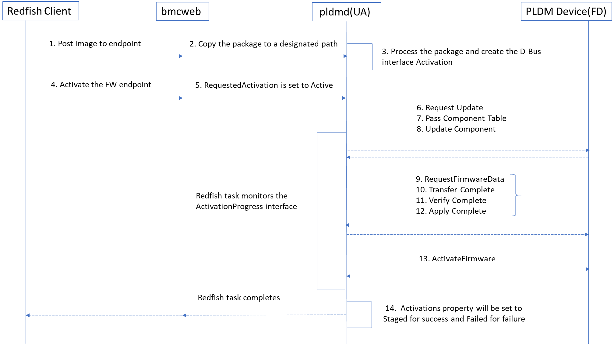
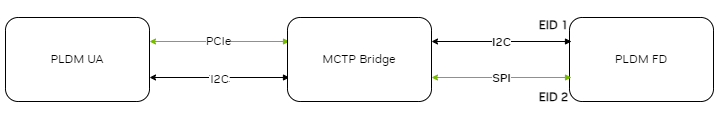
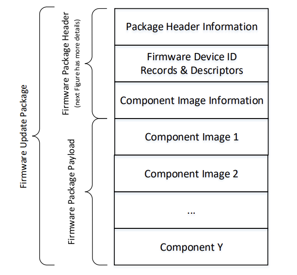
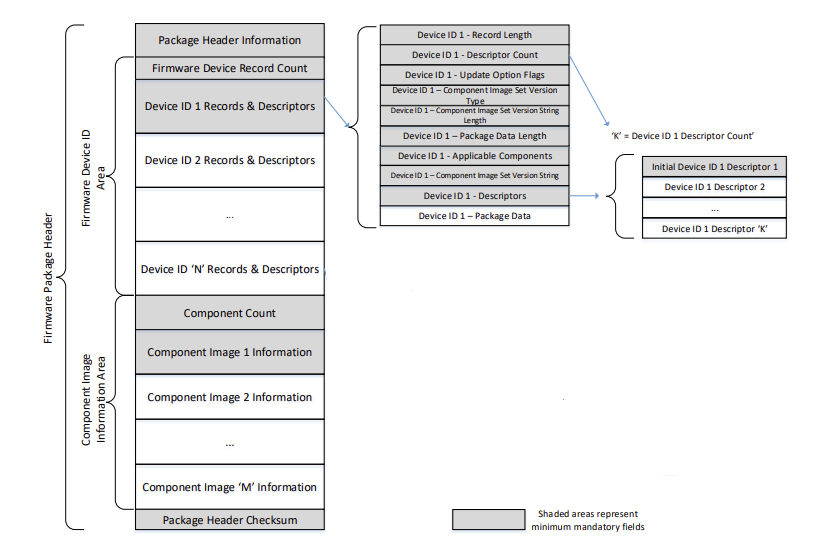

# FW Update Platform Guide

## Contents
- [FW Update Platform Guide](#fw-update-platform-guide)
  - [Contents](#contents)
  - [FW Update features](#fw-update-features)
  - [HighLevel Architecture](#highlevel-architecture)
    - [bmcweb](#bmcweb)
    - [MCTP control daemon](#mctp-control-daemon)
    - [MCTP demux daemon](#mctp-demux-daemon)
    - [PLDM daemon](#pldm-daemon)
  - [Low Level Design](#low-level-design)
    - [PLDM T5 Update](#pldm-t5-update)
      - [PLDM FW Update Path](#pldm-fw-update-path)
    - [Non-PLDM device Update](#non-pldm-device-update)
  - [Platform Enablement for FW update](#platform-enablement-for-fw-update)
    - [Build Time Configurations](#build-time-configurations)
      - [bmcweb build time configurations](#bmcweb-build-time-configurations)
      - [pldmd build time configurations](#pldmd-build-time-configurations)
    - [PLDM Firmware Packaging](#pldm-firmware-packaging)
    - [Package to firmware Device association](#package-to-firmware-device-association)
    - [PLDM FW update configuration](#pldm-fw-update-configuration)
    - [FW Inventory to MCTP endpoint mapping](#fw-inventory-to-mctp-endpoint-mapping)
  - [FW update platform enablement](#fw-update-platform-enablement)
    - [Build Time Configuration](#build-time-configuration)
    - [Enable new PLDM device for FW Update](#enable-new-pldm-device-for-fw-update)
      - [Enable PLDM FW Update for AP with an ERoT (CEC1736/Glacier)](#enable-pldm-fw-update-for-ap-with-an-erot-cec1736glacier)
      - [Enable FW update for a non-PLDM device](#enable-fw-update-for-a-non-pldm-device)
  - [FW recovery support on NvBMC](#fw-recovery-support-on-nvbmc)
    - [Recovery support on HGX-H100](#recovery-support-on-hgx-h100)


## FW Update features


| **Feature**                                                                                        | **Description**                                                                                                                                                                                                                                                                                                                         |
| :------------------------------------------------------------------------------------------------- | :-------------------------------------------------------------------------------------------------------------------------------------------------------------------------------------------------------------------------------------------------------------------------------------------------------------------------------------- |
| RF API for FW Update: <br><br> 1. Multipart HTTP Push Update <br> 2. Unstructured HTTP Push Update | FW update of PLDM supported & non PLDM devices using standard RF APIs. <br><br>Multipart HTTP Push Update is the preferred API and support for the deprecated <br>Unstructured HTTP Push Update is for the existing platforms and customers.                                                                                            |
| RF API for FW update staging & Update                                                              | FW update staging API allows users to stage the FW update package in the NvBMC and initiate the firmware update at a later point in time.                                                                                                                                                                                               |
| RF API for FW update policies                                                                      | 1. Enable/Disable inband firmware update <br> 2. Background Copy Enable/Disable/Query progress - to query and control the firmware redundancy supported by PLDM devices.                                                                                                                                                                |
| PLDM Firmware Packaging                                                                            | The firmware for NvBMC and for all devices (PLDM & Non-PLDM) is packaged using PLDM T5 standard (DSP0267_1.0.0). NvBMC does validation of the package based on the standard and additionally has capability to do integrity check and signature verification of the firmware package.                                                   |
| PLDM UA stack                                                                                      | NvBMC implements the PLDM UA stack as specified in the PLDM T5 standard (DSP0267_1.0.0). PLDM UA offloads the Non-PLDM devices update image to the device specific ItemUpdater for firmware update.                                                                                                                                     |
| Non-PLDM devices firmware update                                                                   | NvBMC provides a framework for Non-PLDM devices to be packaged using PLDM T5 standard. It also provides an implementation framework by which the platform implementer needs to implement and integrate the device specific mechanism.                                                                                                   |
| Firmware Inventory                                                                                 | Publish FW/SW active version of PLDM and Non-PLDM devices. This is configurable on a per platform basis.                                                                                                                                                                                                                                |
| Target Filtering                                                                                   | Provide a mechanism to select Target URIs where to apply the image.                                                                                                                                                                                                                                                                     |
| Version Check & Force Update                                                                       | NvBMC optimizes the firmware update of the devices if the versions match and skips the update and version downgrade is not supported by default for PLDM devices. To override the default behavior RF API is provided to do a force update.                                                                                             |
| Nvidia Debug Token                                                                                 | Debug token feature is the capability to update debug signed firmware on production hardware. <br> <br> The firmware update packaging supports packaging the debug tokens, NvBMC installs the debug tokens and the debug firmware. Once the debug is completed and the debug tokens will be erased when production firmware is updated. |


## HighLevel Architecture



### bmcweb

bmcweb is the Redfish server on NvBMC that implements the RF APIs for FW update.
On pushing a PLDM firmware package to the NvBMC, bmcweb copies the firmware
package to a predefined staging directory and waits for the PLDM UA to process
FW package and expose the *xyz.openbmc_project.Software.Activation* interface
and initiates the firmware update. bmcweb returns a RF task to the client to
track the progress of the FW update.

### MCTP control daemon

MCTP control daemon instance publishes the discovered MCTP endpoints on D-Bus
and MCTP demux daemon instance to used by the applications like PLDM daemon
to communicate with the MCTP endpoint.

### MCTP demux daemon

MCTP demux daemon abstracts the MCTP transport communication for upper layer
protocols like PLDM, MCTP control daemon. MCTP demux daemon receives PLDM over
MCTP,it forwards the PLDM payload to the PLDM daemon. When PLDM daemon wants to
send PLDM payload to destination endpoint it writes to corresponding MCTP
demux daemon over the Unix socket.

### PLDM daemon

PLDM daemon watches for D-Bus signals when MCTP endpoints are discovered and
caches information from the PLDM FD. PLDM daemon acts as the PLDM UA and on
getting notified on the PLDM FW package processeses the PLDM FW package and
matches the PLDM package with the discovered FDs and initiates the FW update.
The PLDM daemon updates the progress of the FW update by creating logs and
keeping the RF task updates.

## Low Level Design

### PLDM T5 Update



#### PLDM FW Update Path



In MCTP networks, as described in the diagram above, wthe PLDM FD has multiple MCTP endpoints connected to the MCTP bridge over different physical medium. The PLDM UA discovers both the MCTP endpoints and for FW update the default behavior is to pick the faster medium for firmware update. In the example above, PLDM UA will pick the outgoing medium as *PCIe*, since it is faster than *I2C* medium. PLDM UA will pick *EID 2* as the destination MCTP endpoint since that is the faster incoming medium to the PLDM FD. So the factors are the fastest outgoing medium from the PLDM UA to the destination MCTP endpoint and the fastest incoming medium to the PLDM FD. PLDM UA does not have additional logic if there are multiple MCTP bridges.

### Non-PLDM device Update


## Platform Enablement for FW update

### Build Time Configurations

#### bmcweb build time configurations

| **Build time configuration**  | **Description**                                                                                                                                                                                                                                          |
| :---------------------------- | :------------------------------------------------------------------------------------------------------------------------------------------------------------------------------------------------------------------------------------------------------- |
| update-service-task-timeout   | RF API for FW update returns a RF task once the image is transferred. The client tracks the progress of the FW update using RF task. If there is no progress in the FW update within this timeout then the FW update is marked cancelled in the RF task. |
| update-service-image-location | The directory where the package transferred for FW update will be copied for further processing.                                                                                                                                                         |
| update-service-stage-location | RF API for staging firmware update will copy the package to this location for futher processing. This directory should be on persistent storage                                                                                                          |
| http-body-limit               | This configuration specifies the maximum HTTP request body length supported by bmcweb. This configuration should be greater than or equal to firmware-image-limit                                                                                        |
| firmware-image-limit          | The FW update package maximum size supported on the platform. This confiuration is in megabytes.                                                                                                                                                         |


#### pldmd build time configurations

| **Build time configuration**                     | **Description**                                                                                                                                                                                                                                                                                   |
| :----------------------------------------------- | :------------------------------------------------------------------------------------------------------------------------------------------------------------------------------------------------------------------------------------------------------------------------------------------------ |
| number-of-request-retries                        | The number of times a PLDM request will be retried if the response is not received.                                                                                                                                                                                                               |
| number-of-command-attempts                       | The number of times a PLDM request will be retried on top of number-of-request-retries. This is to add resiliency for PLDM T5 firmware inventory discovery commands which are necessary for a firmware update.                                                                                    |
| instance-id-expiration-interval                  | Instance ID expiration interval is the time after which the PLDM request is timed out including the retries.                                                                                                                                                                                      |
| response-time-out                                | The amount of time a requester has to wait for a response message in milliseconds                                                                                                                                                                                                                 |
| maximum-transfer-size                            | Maximum size in bytes of the variable payload allowed to be requested by the FD, via RequestFirmwareData command                                                                                                                                                                                  |
| firmware-image-limit                             | Specifies the firmware image size limit                                                                                                                                                                                                                                                           |
| non-pldm                                         | Enables capability to update Non-PLDM devices using PLDM UA as the orchestrator.                                                                                                                                                                                                                  |
| oem-nvidia                                       | Enables capability to handle vendor (NVIDIA) specific response codes from PLDM FD.                                                                                                                                                                                                                |
| debug-token                                      | Enables debug token feature                                                                                                                                                                                                                                                                       |
| fw-update-skip-package-size-check                | Skip PLDM package size check                                                                                                                                                                                                                                                                      |
| pldm-package-verification-must-be-signed         | Allow to update only signed PLDM package                                                                                                                                                                                                                                                          |
| pldm-package-verification                        | Enable PLDM package signature verification. There are two possible types of verification: authentication and integrity. Authentication verification uses a public key delivered via a receipt, while integrity verification uses a public key included in the package.', value : 'disabled')      |
| firmware-update-time                             | Time in minutes for firmware update to complete. Note: This value should be greater than webserver task timeout.', value: 20)                                                                                                                                                                     |
| progress-percent-updater-interval                | Time in minutes to update progress percent                                                                                                                                                                                                                                                        |
| firmware-package-staging-dir                     | Firmware package staging directory for PLDM packages. This path will be used by bmcweb to copy the firmware update package.                                                                                                                                                                       |
| firmware-package-split-staging-dir               | Firmware package split staging and update directory for PLDM packages. This path will be used by bmcweb to copy the firmware update package.                                                                                                                                                      |
| firmware-package-staging-dir-mount-service       | Firmware package staging directory mount service. Before creating file event watch on the directory, pldm will check for this service status and if service is not completed it will wait for systemd signal. Keep this field empty if mount happens in init or its just a directory.             |
| firmware-package-split-staging-dir-mount-service | Firmware package split staging directory mount service. Before creating file event watch on the directory, pldm will check for this service status and if service is not completed it will wait for systemd signal. Keep this field empty if mount is taken care in init or its just a directory. |
| pldm-package-verification-key                    | Public key to verify signed PLDM package                                                                                                                                                                                                                                                          |
### PLDM Firmware Packaging

Build PLDM firmware package with the descriptor, component information and the component images for the device.

https://github.com/openbmc/pldm/blob/master/tools/fw-update/pldm_fwup_pkg_creator.py - Tool to create PLDM package
https://github.com/openbmc/pldm/blob/master/tools/fw-update/metadata-example.json - Configuration JSON to build firmware package






### Package to firmware Device association

PLDM UA matches the PLDM FW package to the PLDM FD and transfers the component images.
The UA can associate a given firmware package to all applicable FDs by using the following steps:

    FOR each FD that supports PLDM for Firmware Update
        Retrieve FD identifier via the QueryDeviceIdentifiers command
        MATCH = FALSE; Start at First Device Identifier Record in the package header

        WHILE ((MATCH==FALSE) AND (Device Identifier Record(s) remain in package))
            Read Device Identifier Record from Package Header
            IF all Package Device Identifier Record descriptors match FD descriptors
                MATCH = TRUE; Selected Record = Current Record; Break;
        Move to next Device Identifier Record in package header

Note that all descriptors in a package Device Identifier Record shall match those returned by the FD but not vice-versa (the FD may return more descriptors than those are indicated in the firmware package header Device Identifier record). Each FD that generated a match can accept components from the firmware update package.

### PLDM FW update configuration

PLDM UA works with a configuration json (fw_update_config.json) for creating
features on top of FW update.

1. Create D-Bus object to represent FW inventory for components in PLDM FD
2. Create D-Bus object to represent device inventory for PLDM FD
3. Create RF message registry entries to indicate the updated components 
4. Enable target filtering feature for FW update

```
// This is a sample JSON file for configuring the PLDM fw-update implementation
// to create firmware inventory, device inventory, populate message registries
// and for processing HttpPushUriTargets. The configuration may not be
// applicable for all PLDM implementations and alternate mechanisms can be used
// for the above purposes. This configuration depends on MCTP UUID which is
// known in advance and that is used as the key to derive device and component
// information. "match" field is mandatory for each entry in the
// configuration, it is used to identify whether an entry can be mapped to an MCTP endpoint.
// "match" uses D-Bus interface and properties to compare the inventory entry with MCTP endpoint.
// Inside "match", "Interface" indicates the D-Bus interface which the MCTP endpoint needs to have,
// "Properties" with "Name", "Type", "Value" indicates the MCTP endpoint need to have these properties
// with same values in order to use this inventory entry.
//
// 1) Device Inventory - Device inventory should be ideally created by
// processing PLDM for FRU (Type 4) from the devices. PLDM for FRU is not
// available on certain FD implementations and we are leveraging PLDM for
// firmware update specification(Type 5) to create device inventory. This
// implementation creates the ERoT inventory D-Bus object with the object_path
// if the "create" section is present in "device_inventory" section. It
// implements xyz.openbmc_project.Inventory.Item.Chassis interface and default
// ChassisType D-Bus property to "Component". It implements
// xyz.openbmc_project.Inventory.Decorator.LocationCode interface and default
// LocationTypes D-Bus property to "Embedded". It implements the
// xyz.openbmc_project.Inventory.Item.SPDMResponder interface. It implements
// the xyz.openbmc_project.Inventory.Decorator.Asset interface and defaults
// Manufacturer property to "NVIDIA" and SKU property to the value of vendor
// defined descriptor named "ECSKU" from the FD that matches to the MCTP UUID.
// It will implement the xyz.openbmc_project.Common.UUID D-Bus interface and
// populate UUID property with the MCTP UUID for the endpoint. Optionally D-Bus
// associations can be created by providing the forward, reverse type of the
// association and the association endpoint. If the "update" section is present
// in the "device_inventory" section then, SKU property of the AP's device
// inventory object is updated with the value of the vendor defined descriptor
// named "APSKU" from the FD that matches to the MCTP UUID. "device_inventory"
// and the sections are optional.
//
// 2) Firmware Inventory - The firmware version for the components on the FD is
// populated on the D-Bus if "create" entry is present in "firmware_inventory"
// section. The key is the component name and value is the object with two property,
// the first called component_id contains ComponentIdentifier as defined in DSP0267
// the second is the collection of associations. The object path is
// "ComponentName" appended to "/xyz/openbmc_project/software".
// "/xyz/openbmc_project/software/ComponentName" D-Bus object will implement
// xyz.openbmc_project.Software.Version interface and default Purpose to
// xyz.openbmc_project.Software.Version.VersionPurpose.Other and the Version
// property with "ActiveComponentVersionString" from GetFirmwareParameters
// response and SoftwareId with the ComponentIdentifier. If device inventory is
// created for the FD, then xyz.openbmc_project.Association.Definitions
// interface is implemented with forward association type - "inventory",
// reverse association type - "activation" and association endpoint -
// "/xyz/openbmc_project/inventory/chassis/DeviceName". Additionally will create
// the association, forward association type - "software_version", reverse
// association type - "updateable" and association endpoint -
// "/xyz/openbmc_project/software". This entry gives the flexibility to
// create D-Bus firmware inventory for selected components in the
// ComponentParameterTable. If the "update" entry is present in
// "firmware_inventory" section then pldmd updates the SoftwareId property of
// the "/xyz/openbmc_project/software/ComponentName" D-Bus object.
//
// 3) Message Registries - PLDM UA firmware update code will log message
// registry entries based on
// https://redfish.dmtf.org/registries/Update.1.0.0.json. The "component_info"
// entry is optional. The key is the component name and value is the
// ComponentIdentifier as defined in DSP0267. Component name and
// ComponentVersionString from PLDM firmware update package will be used to
// to populate the Args for the messages in the Update Message Registry.
// If "component_info" is not present, the ComponentIdentifier will be used
// instead of component name.
{
    "entries": [
        {
            "match": {
                "Interface":"xyz.openbmc_project.Common.UUID",
                "Properties":[
                    {
                        "Name":"UUID",
                        "Type":"s",
                        "Value":"ad4c8360-c54c-11eb-8529-0242ac130003"
                    }
                ]
            },
            "device_inventory": {
                "create": {
                    "object_path": "/xyz/openbmc_project/inventory/chassis/DeviceName1",
                    "associations": [
                        {
                            "forward": "parent",
                            "reverse": "child",
                            "endpoint": "/xyz/openbmc_project/inventory/chassis"
                        }
                    ]
                },
                "update": {
                    "object_path": "/xyz/openbmc_project/inventory/chassis/DeviceName2"
                }
            },
            "firmware_inventory": {
                "create": {
                    "ComponentName1": {
                        "component_id": 1,
                        "associations": [
                            {
                                "forward": "inventory",
                                "reverse": "activation",
                                "endpoint": "/xyz/openbmc_project/software/ComponentName1"
                            }
                        ]
					},

                    "ComponentName2": {
                        "component_id": 2,
                        "associations": [
                            {
                                "forward": "inventory",
                                "reverse": "activation",
                                "endpoint": "/xyz/openbmc_project/software/ComponentName2"
                            }
                        ]
                    }
                },
                "update": {
                    "ComponentName3": 3
                }
            },
            "component_info": {
                "ComponentName1": 1,
                "ComponentName2": 2,
                "ComponentName3": 3
            }
        },
        {
            "match": {
                "Interface":"xyz.openbmc_project.Inventory.Decorator.I2CDevice",
                "Properties":[
                    {
                        "Name":"Address",
                        "Type":"u",
                        "Value":0
                    },
                    {
                        "Name":"Bus",
                        "Type":"u",
                        "Value":16
                    }
                ]
			},
            "device_inventory": {
                "create": {
                    "object_path": "/xyz/openbmc_project/inventory/chassis/DeviceName3",
                    "associations": [
                        {
                            "forward": "parent",
                            "reverse": "child",
                            "endpoint": "/xyz/openbmc_project/inventory/chassis"
                        }
                    ]
                },
                "update": {
                    "object_path": "/xyz/openbmc_project/inventory/chassis/DeviceName4"
                }
            },
            "firmware_inventory": {
                "create": {
                    "ComponentName1": {
                        "component_id": 1,
                        "associations": [
                            {
                                "forward": "inventory",
                                "reverse": "activation",
                                "endpoint": "/xyz/openbmc_project/software/ComponentName3"
                            }
                        ]
					},

                    "ComponentName2": {
                        "component_id": 2,
                        "associations": [
                            {
                                "forward": "inventory",
                                "reverse": "activation",
                                "endpoint": "/xyz/openbmc_project/software/ComponentName4"
                            }
                        ]
                    }
                },
                "update": {
                    "ComponentName3": 3
                }
            },
            "component_info": {
                "ComponentName1": 1,
                "ComponentName2": 2,
                "ComponentName3": 3
            }
        }
    ]
}
```

### FW Inventory to MCTP endpoint mapping

ERoT has policy to enable and disable background copy. If the background copy is
disabled, then after firmware update, RF API is provided to commit the firmware
image. The commit image feature applies only to AP_FW. MCTP VDM command is
provided to commit the image. fw_mctp_mapping.json serves two purposes and is read
by bmcweb.

1. Publish on RF the allowable values of firmware inventory for which CommitImageAction applies
2. This configuration allows to translate the RF CommitImageAction operation to the MCTP endpoint the MCTP VDM command should be sent.

```
{
  "FwMctpMap":{
	"/xyz/openbmc_project/software/HGX_FW_FPGA_0": 13,
	"/xyz/openbmc_project/software/HGX_FW_GPU_SXM_1": 14,
	"/xyz/openbmc_project/software/HGX_FW_GPU_SXM_2": 15,
	"/xyz/openbmc_project/software/HGX_FW_GPU_SXM_3": 16,
	"/xyz/openbmc_project/software/HGX_FW_GPU_SXM_4": 17,
	"/xyz/openbmc_project/software/HGX_FW_GPU_SXM_5": 18,
	"/xyz/openbmc_project/software/HGX_FW_GPU_SXM_6": 19,
	"/xyz/openbmc_project/software/HGX_FW_GPU_SXM_7": 20,
	"/xyz/openbmc_project/software/HGX_FW_GPU_SXM_8": 21,
	"/xyz/openbmc_project/software/HGX_FW_BMC_0": 24,
	"/xyz/openbmc_project/software/HGX_FW_NVSwitch_0": 25,
	"/xyz/openbmc_project/software/HGX_FW_NVSwitch_1": 26,
	"/xyz/openbmc_project/software/HGX_FW_NVSwitch_2": 27,
	"/xyz/openbmc_project/software/HGX_FW_NVSwitch_3": 28,
	"/xyz/openbmc_project/software/HGX_FW_PCIeSwitch_0": 29
  }
}
```

## FW update platform enablement

### Build Time Configuration

1. Configure [PLDM build time configuration](#pldmd-build-time-configurations) to meet platform requirements.<br/>
   - Example of GB200NVL build configuration:
2. Configure [bmcweb build time configuration](#bmcweb-build-time-configurations) to meet platform requirements.<br/>
   - Example of GB200NVL build configuration:
3. Define PLDM descriptors and component information for the devices on the platform
4. Configure [fw_update_config.json](#pldm-fw-update-configuration) for the platform
5. Configure [fw_mctp_mapping.json](#fw-inventory-to-mctp-endpoint-mapping) for the platform
6. Build PLDM firmware package for the platform with the descriptors and component information defined for the PLDM device<br/>
   - Script to build the PLDM package: https://github.com/openbmc/pldm/tree/master/tools/fw-update<br/>
   - Configuration JSON used for GB200NVL:

### Enable new PLDM device for FW Update

This section covers details for enabling devices supporting PLDM T5. This document covers only Glacier implementation now.

#### Enable PLDM FW Update for AP with an ERoT (CEC1736/Glacier)

1. Create device inventory for ERoT
2. Create firmware inventory for EC_FW and AP_FW
3. Create RF message registry entries to indicate the updated components 
4. Enable target filtering feature for FW update 

| **Configuration**                                 | **Description**                                                                                                                                                                                                                                                                                          |
| :------------------------------------------------ | :------------------------------------------------------------------------------------------------------------------------------------------------------------------------------------------------------------------------------------------------------------------------------------------------------- |
| Define strap value for the new AP                 | https://confluence.nvidia.com/pages/viewpage.action?spaceKey=GFWBC&title=CEC1736+Key+Management#CEC1736KeyManagement-KeyGroupandEROT_FW_CONFAssignments |
| Define APSKU value for the AP firmware            | https://confluence.nvidia.com/pages/viewpage.action?spaceKey=GFWBC&title=CEC1736+AP+SKU+ID |
| Identify the ECSKU value for the Glacier firmware | |
| Define component information for the AP firmware  | https://confluence.nvidia.com/pages/viewpage.action?spaceKey=GFWBC&title=CEC1736+Key+Management#CEC1736KeyManagement-KeyGroupandEROT_FW_CONFAssignments                                                                                                                                                  |

Example of configuring the [fw_update_config.json](#pldm-fw-update-configuration) to add new PLDM device, description added for each section and fields.

```
    {
            "match": {
                "Interface":"xyz.openbmc_project.Common.UUID",
                "Properties":[
                    {
                        "Name":"UUID",
                        "Type":"s",
                        "Value":"f72d6f60-5675-11ed-9b6a-0242ac120002" -> MCTP UUID of the ERoT corresponding to Grace
                    }
                ]
            },
            "device_inventory": { -> PLDM daemon will create the device inventory based on MCTP endpoint discovery that matches the MCTP UUID above
                "create": {
                    "object_path": "/xyz/openbmc_project/inventory/system/chassis/ERoT_CPU_0", -> Device inventory D-Bus object path
                    "associations": [ -> Associations between device inventory object and other D-Bus objects
                        {
                            "forward": "parent_chassis",
                            "reverse": "all_chassis",
                            "endpoint": "/xyz/openbmc_project/inventory/system/chassis/Baseboard_0"
                        },
                        {
                            "forward": "inventory",
                            "reverse": "associated_ROT",
                            "endpoint": "/xyz/openbmc_project/inventory/system/board/ProcessorModule_0/CPU_0"
                        }
                    ]
                },
                "update": {
                    -> APSKU field retrieved using QueryDeviceDescriptor command will be updated to SKU property implemented by this D-Bus object path
                    "object_path": "/xyz/openbmc_project/inventory/system/board/ProcessorModule_0/CPU_0"
                }
            },
            "firmware_inventory": { -> PLDM daemon will create the firmware inventory based on MCTP endpoint discovery with the UUID match
                "create": {
                    -> PLDM daemon will create the D-Bus object path /xyz/openbmc_project/software/ERoT_CPU_0 and implement xyz.openbmc_project.Software.Version interface
                    -> Version property will be populated from the ActiveComponentVersionString for the component_id, SoftwareID property with component_id
                    "ERoT_CPU_0": { 
                        "component_id": 65280,
                        "associations": [
                            {
                                "forward": "inventory",
                                "reverse": "activation",
                                "endpoint": "/xyz/openbmc_project/inventory/system/chassis/ERoT_CPU_0"
                            }
                        ]
                    },
                   -> PLDM daemon will create the D-Bus object path /xyz/openbmc_project/software/CPU_0 and implement xyz.openbmc_project.Software.Version interface,
                   -> Version property will be populated from the ActiveComponentVersionString of component_id, SoftwareID property with component_id
                   "CPU_0": {
                        "component_id": 48
                    }
                }
            },
            -> Add component information for the component IDs to create MessageRegistries & handle target filtering
            "component_info": {
                "ERoT_CPU_0": 65280,
                "CPU_0": 48
            }
        }
```

Example of configuring [fw_mctp_mapping.json](#fw-inventory-to-mctp-endpoint-mapping) for the HGX-H100 platform.

```
{
  "FwMctpMap":{
	"/xyz/openbmc_project/software/HGX_FW_FPGA_0": 13,
	"/xyz/openbmc_project/software/HGX_FW_GPU_SXM_1": 14,
	"/xyz/openbmc_project/software/HGX_FW_GPU_SXM_2": 15,
	"/xyz/openbmc_project/software/HGX_FW_GPU_SXM_3": 16,
	"/xyz/openbmc_project/software/HGX_FW_GPU_SXM_4": 17,
	"/xyz/openbmc_project/software/HGX_FW_GPU_SXM_5": 18,
	"/xyz/openbmc_project/software/HGX_FW_GPU_SXM_6": 19,
	"/xyz/openbmc_project/software/HGX_FW_GPU_SXM_7": 20,
	"/xyz/openbmc_project/software/HGX_FW_GPU_SXM_8": 21,
	"/xyz/openbmc_project/software/HGX_FW_BMC_0": 24,
	"/xyz/openbmc_project/software/HGX_FW_NVSwitch_0": 25,
	"/xyz/openbmc_project/software/HGX_FW_NVSwitch_1": 26,
	"/xyz/openbmc_project/software/HGX_FW_NVSwitch_2": 27,
	"/xyz/openbmc_project/software/HGX_FW_NVSwitch_3": 28,
	"/xyz/openbmc_project/software/HGX_FW_PCIeSwitch_0": 29
  }
}
```

#### Enable FW update for a non-PLDM device

ItemUpdater framework (https://github.com/NVIDIA/nvidia-code-mgmt) is used for doing FW update for non-PLDM devices by packing the FW update in PLDM package.

1. Add configuration for the device type and updater
2. Add service ItemUpdater and DeviceUpdater service
3. Configure a UUID for the device updater and this should be provided in the bundle
4. Pick component ID to uniquely identify the firmware image
5. Add service to invoke the device specific update mechanism
6. Inherit the BaseItemUpdater class and implement the device specific updater

Example of simple ItemUpdater implementation to update the QSPI flash of Orin device. https://github.com/NVIDIA/nvidia-code-mgmt/commit/38b7187c72e6f8a20f70796a3edebdce982c16dd

## FW recovery support on NvBMC

On each platform, FW recovery of the platform involves recovering devices in a
particular order based on the dependencies between the firmware. The section below
describes how FW recovery is supported on HGX-H100.

### Recovery support on HGX-H100

For PLDM based devices (HMC, FPGA, GPU, NVSwitch, PEXSwitch)
each devices ERoT implements the PLDM T5 stack. So once the ERoT is recovered
PLDM T5 is possible. FPGA and HMC are exceptions since FPGA is the MCTP bridge
and HMC implements the PLDM UA. So FPGA and HMC needs to be recovered first before
PLDM T5 update is possible. Retimer is non-PLDM device on HGX-H100 and it can be
recovered using PLDM T5 firmware update once HMC is recovered.

https://docs.google.com/document/d/1343T3VyguJC_CFTWjA56vHuumpI-6BTxcHp27CmeVEg/edit#heading=h.bf918z1d4brr
The following is a summary of each device on HGX-H100 and how its firmware can be recovered.

| **Device**                                                                           | **Recovery Method**        | **Comments**                                                                          |
| :----------------------------------------------------------------------------------- | :------------------------- | :------------------------------------------------------------------------------------ |
| FPGA ERoT                                                                            | Recovery from BMC over I2C | If FPGA ERoT is in recovery it needs to be recovered first from HostBMC               |
| FPGA                                                                                 | Recovery from BMC over I2C | Once the FPGA ERoT is recovered, if FPGA is in recovery it needs to be recovered next |
| Downstream devices ERoT recovery (HMC ERoT, GPU ERoT, NVSwitch ERoT, PEXSwitch ERoT) | Recovery from BMC over I2C | Downstream ERoTs needs to be recovered to do PLDM T5 firmware update                  |
| HMC                                                                                  | Recovery from BMC over I2C | HMC needs to be recovered to do PLDM T5 update                                        |
| Downstream device recovery (GPU, NVSwitch, PEXSwitch)                                | PLDM T5 update from HMC    | Once the devices above are recovered, HMC can be used to recover using PLDM T5 update |
| Retimer (Non-PLDM device)                                                            | PLDM T5 update from HMC    | If HMC and FPGA are functional, recovery from HMC can be done using PLDM T5 update    |
