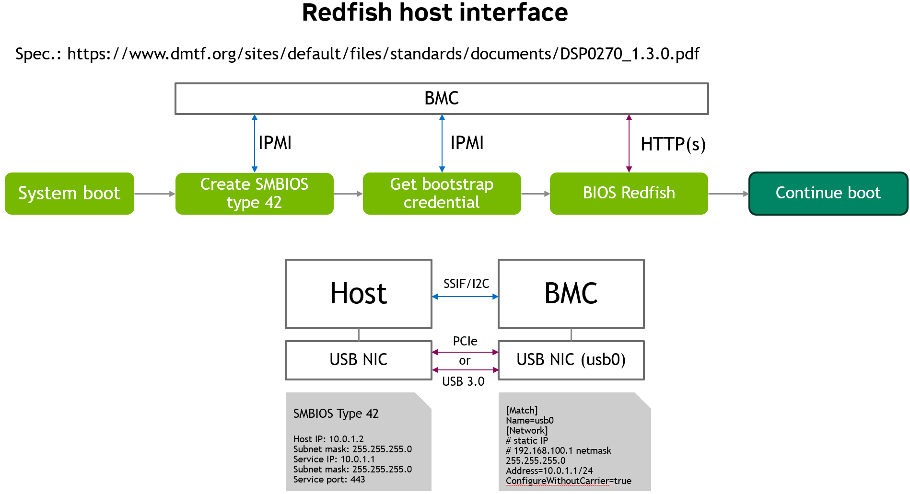

# Redfish Host Interface 
Author: Rohit PAI 
Created: Jan 29th, 2024

## Features 
1. Enables BIOS to communicate to BMC using standard redfish protocol over network interface. 
2. BIOS can get and set BIOS attributes, Boot Options and Boot Order from the BMC. 
3. Allows OOB users to modify BIOS settings which is consumed by the BIOS in the next boot cycle. 
4. Ability to perform BIOS password change and reset BIOS configuration. 
5. Allows configuration change of secure boot feature from OOB user. 

## Standard Specs 
- [Redfish Host Interface Specification](https://www.dmtf.org/sites/default/files/standards/documents/DSP0270_1.3.1.pdf)

## High Level Architecture 

- BIOS fetches the Host Interface related information over IPMI from the BMC and prepares the SMBIOS type 42 record. 
- BIOS creates gets host interface credentials (bootstrap account) from the BMC over IPMI. Host interface credentials are created each time BIOS request them and are erased when BMC detects BIOS POST complete or reset. 
- BIOS uses the bootstrap account to perform GET/PUT/PATCH request to BMC over redfish. 
- BIOS fetches any pending setting from the BMC initially, applies then and send the new configuration to the BMC.  

## Low level design 
Redfish BIOS-BMC communication uses host interface network channel for most of their communication though it uses IPMI commands for the initial authentication. It adheres to the [Redfish Host Interface Specification 1.3.1](https://www.dmtf.org/sites/default/files/standards/documents/DSP0270_1.3.1.pdf). 

Host Interface is the standardized interface specified by Redfish DMTF Community that enables Redfish based communication between the Host CPU and the Redfish service in the BMC. In this communication Redfish Host and the service in BMC does not require any external network interface and it is achieved via internal network channel between the BIOS and the BMC. This interface is used in both Pre-boot(Firmware) stage and by the drivers and applications in the Host Operating System without use of external networking. Sections below explains the protocol used in the communication flow, beginning with the initial handshake to the final stages, with intermediate Redfish calls to transfer the BIOS Attributes, Boot Options, Boot Order and Secure boot information from the BIOS to the BMC.

```
+-----------------------------------------------------------------------------------------------------------------+
|                                                                                                                 |
|                                                                                                                 |
|                                                                                                                 |
| +-------------+        +-------------+       +--------------------------------+      +-------+                  |
| |             |  LAN   |             |       |   RBC daemon                   |      |       |    +----------+  |
| |  BIOS/HOST  +<-over->+   REDFISH   +<Dbus->+                                |      |       |    |Web client|  |
| |             |  USB   |             |       |  Provide following Methods     |      |       |    |          |  |
| +-------------+        +-------------+       |     -SetAttribute()            |      |       |    +----^-----+  |
|                                              |     -GetAttribute()            |      |       |         |        |
|                                              |     -VerifyPassword()          |      |       |        LAN       |
|                                              |     -ChangePassword()          |      |       |         |        |
|                                              |                                |      |Redfish|    +----V-----+  |
|                                              | Properties                     +<Dbus>+  API  |    |Redfish & |  |
|                                              |     -BaseBIOSTable             |      |       +<-->+BMCWeb    |  |
|                                              |     -PendingAttributes         |      |       |    +----^-----+  |
|                                              |     -ResetBIOSSettings         |      |       |         |        |
|                                              |     -IsPasswordInitDone        |      |       |         |        |
|                                              |                                |      |       |    +----V-----+  |
|                                              |                                |      |       |    | Redfish  |  |
|                                              |                                |      |       |    |  Host    |  |
|                                              |                                |      |       |    | Interface|  |
|                                              +--------------------------------+      +-------+    +----------+  |
|                                                                                                                 |
+-----------------------------------------------------------------------------------------------------------------+
```

### BIOS BMC Communication
Redfish Host Interface supports HTTPS requests/responses over a TCP/IP network connection between a Host and Redfish Service. The following main modules are involved in the communication as depicted in the block diagram below:

```
+------------------+                  +------------------+
|     +------+     |                  |     +------+     |
|     | BIOS |     |                  |     | BMC  |     |
|     +------+     <------------------>     +------+     |
|                  |  Host Interface  |                  |
|   Host Computer  <------------------>     Redfish      |
|     System       |                  |     Service      |
|                  |                  |                  |
+------------------+                  +------------------+
```
```
┌────┐                    ┌───────┐                       ┌───┐                ┌──────┐
│BIOS│                    │Redfish│                       │RBC│                │Client│
└──┬─┘                    └───┬───┘                       └─┬─┘                └───┬──┘
   │                          │                             │                      │
   │  HTTPS Request (Inband)  │                             │                      │
   ───────────────────────────>        Update Values        │                      │
   │                          ──────────────────────────────>                      │
   <─ ─ ─ ─ ─ ─ ─ ─ ─ ─ ─ ─ ─ ─                             │                      │
   │         200 OK           │                             │                      │
   │                          │                  HTTPS Request (OOB)               │
   │                          <────────────────────────────────────────────────────
   │                          ─ ─ ─ ─ ─ ─ ─ ─ ─ ─ ─ ─ ─ ─ ─ ─ ─ ─ ─ ─ ─ ─ ─ ─ ─ ─ ─>
   │                          │                         200 OK                     │
   │                          │                             │                      │
```
BIOS communicates with BMC over USB Ethernet interface IP and pushes the firmware configurations (BIOS Attributes and Attribute Registry) onto BMC. Once transferred, these data are available for BMC Out of band users.

#### Authentication
The communication between the Redfish (BMC) and BIOS are done in below way:-
* Basic Auth:-
BIOS Initiates BootStrap IPMI Command to get the Credentials.
BIOS communicates to BMC with these account credentials for subsequent HTTPS Requests.

#### Initialization

```
┌────┐                                            ┌───┐
│BIOS│                                            │BMC│
└──┬─┘                                            └─┬─┘
   │                                                │    ╔════════════════════════════╗
   │               Initial Handshake                │    ║ BIOS gets the BMC network  ║
   ─────────────────────────────────────────────────>    ║ interface information and  ║
   <─ ─ ─ ─ ─ ─ ─ ─ ─ ─ ─ ─ ─ ─ ─ ─ ─ ─ ─ ─ ─ ─ ─ ─ ─    ║ establish basic BIOS-BMC   ║
   │      <<return>> HI Interface Config Info       │    ║ communication with that    ║
   │                                                │    ║ interface.                 ║
   │                                                │    ╚════════════════════════════╝
   │                                                │    ╔════════════════════════════╗
   │Send IPMI BootStrap Account Credentials command │    ║ BMC generates credentials  ║
   ─────────────────────────────────────────────────>    ║ (UserName & Password), and ║
   <─ ─ ─ ─ ─ ─ ─ ─ ─ ─ ─ ─ ─ ─ ─ ─ ─ ─ ─ ─ ─ ─ ─ ─ ─    ║ send it back to BIOS.      ║
   │         <<return>> Credentials Info            │    ╚════════════════════════════╝
   │                                                │
```

1. BIOS checks for the SMBIOS type 42 related information as well as it checks for network interface configuration details through initial handshake mechanism which are required to establish connection with BMC network interface. (As per this design it will be mapped  to BMC USB interface.)

2. BIOS first reads the BMC USB interface information like VendorId, ProductId with the help of Get USB description IPMI Oem command (NetFn 3Ch, Command 30h).

3. Then BIOS reads the serial number of USB interface with the help of Get Virtual USB Serial Number IPMI Oem command (NetFn 3Ch, Command 31h).

4. Then BIOS reads the Redfish Hostname with the help of Get Redfish Hostname IPMI Oem command (NetFn 3Ch, Command 32h).

5. Then BIOS gets the channel number for the BMC network interface for which HI is configured with the help of Get IPMI Channel Number Oem command (NetFn 3Ch, Command 33h). And with that channel number it will read the network configuration details with the help of standard IPMI command Get LAN Configuration Parameters.

6. Once the handshaking is completed and basic BIOS-BMC communication is established, then BIOS sends Get BootStrap Account Credentials IPMI command (NetFn 2Ch, Command 02h) to get auto generated credentials.

7. BMC generates username and password to be used for further authentication and sends it back to BIOS. This account will only be used by host interface alone and it will not be shown under IPMI user list as well as Redfish AccountService schema. And this account should only be used to push the BIOS attributes to Bios schema.

8. Upon normal completion of this command, the Enabled property within the CredentialBootstrapping property of the host interface resource will be set to false , unless the "Disable credential bootstrapping control" parameter of the command contains the value A5h.

9. And whenever there is host or service reset, then this account will be deleted.


### BIOS-BMC Firmware Configuration
#### First Boot
```
+----------------------------------------+                    +----------------------------------------+                    +-----------------------------------+
|                BIOS                    |                    |                  BMC                   |                    |              REDFISH              |
|                                        |                    |                                        |                    |                                   |
|  +----------------------------------+  |                    | +------------------------------------+ |                    | +-------------------------------+ |
|  | Send the Redfish host interface  |  |                    | |1.Get the complete attributes data. | |                    | | BIOS Attributes and Attribute | |
|  | BIOS configuration data          |  |-----LanOverUSB---->| |2.Validate and convert into         | |------------------->| | Registry available on         | |
|  | (PUT request to /redfish/v1      |  |-------Redfish----->| |  native to D-bus format.           | |------------------->| | GET /redfish/v1/Systems       | |
|  |  /Systems/system/Bios URI)       |  |                    | |3.Expose the D-bus interface        | |                    | | /system/Bios and              | |
|  +----------------------------------+  |                    | |  (RBC Daemon)                      | |                    | | /redfish/v1/Registries        | |
|                                        |                    | +------------------------------------+ |                    | | /BiosAttributeRegistry URI's  | |
|                                        |                    |                                        |                    | +-------------------------------+ |
|  +----------------------------------+  |                    |                                        |                    |                                   |
|  |  Continue the BIOS boot          |  |                    |                                        |                    |                                   |
|  +----------------------------------+  |                    |                                        |                    |                                   |
+----------------------------------------+                    +----------------------------------------+                    +-----------------------------------+
```

- The first boot can be determined as, there will be empty response for "Attributes" and "AttributeRegistry" redfish properties under /redfish/v1/System/system/Bios URI.

- BIOS has to send all the Attributes to BMC via Lan Over USB interface with respect to Redfish Host Interface specification. BIOS will make PUT request with BIOS configuration attributes to "/redfish/v1/Systems/system/Bios" URI.
- Once all the attributes are received, then Bios PUT handler will convert JSON data into DBus format and then it will be exposed to DBus via bios-config-manager on "xyz.openbmc_project.BIOSConfig.Manager" DBus interface and update the "BaseBIOSTable" DBus property.
- The "BaseBIOSTable" DBus property expects the input likely in the BIOS Attribute Registry format

```
     busctl set-property xyz.openbmc_project.BIOSConfigManager /xyz/openbmc_project/bios_config/manager xyz.openbmc_project.BIOSConfig.Manager BaseBIOSTable a{s\(sbsssvva\(sv\)\)} 2 "DdrFreqLimit" "xyz.openbmc_project.BIOSConfig.Manager.AttributeType.String" false "Memory Operating Speed Selection" "Force specific Memory Operating Speed or use Auto setting." "Advanced/Memory Configuration/Memory Operating Speed Selection" s "0x00" s "0x0B" 5 "xyz.openbmc_project.BIOSConfig.Manager.BoundType.OneOf" s "auto" "xyz.openbmc_project.BIOSConfig.Manager.BoundType.OneOf" s "2133" "xyz.openbmc_project.BIOSConfig.Manager.BoundType.OneOf" s "2400" "xyz.openbmc_project.BIOSConfig.Manager.BoundType.OneOf" s "2664" "xyz.openbmc_project.BIOSConfig.Manager.BoundType.OneOf" s"2933" "BIOSSerialDebugLevel" "xyz.openbmc_project.BIOSConfig.Manager.AttributeType.Integer" false "BIOS Serial Debug level" "BIOS Serial Debug level during system boot." "Advanced/Debug Feature Selection" x 0x00 x 0x01 1 "xyz.openbmc_project.BIOSConfig.Manager.BoundType.ScalarIncrement" x 1

```
- Redfish will make use of this dbus interface and property and shows all the BIOS Attributes and BiosAttributeRegistry under "/redfish/v1/Systems/system/Bios/" and "/redfish/v1/Registries/BiosAttributeRegistry" Redfish URI dynamically.


#### Second Boot
```
+----------------------------------------+                    +----------------------------------------+                    +-----------------------------------+
|                BIOS                    |                    |                  BMC                   |                    |              REDFISH              |
|                                        |                    |                                        |                    |                                   |
|  +----------------------------------+  |                    |                                        |                    |                                   |
|  | Get the config status            |  |                    |                                        |                    |                                   |
|  | (Get updated Settings)           |  |                    |  +-----------------------------------+ |                    |  +-----------------------------+  |
|  | - Any config changed or not      |  |<-Get config status-|  | Update the Pending Attributes list| |<----Update BIOS----|  | Update the BIOS Attribute   |  |
|  | - New attribute values exist     |  |<-----from BMC------|  | (PendingAttributes DBus property) | |     Attributes     |  | values (PATCH /redfish/v1   |  |
|  | (GET /redfish/v1/Systems/system  |  |                    |  +-----------------------------------+ |                    |  | /Systems/system/Settings    |  |
|  |   /Bios/Settings)                |  |                    |                                        |                    |  +-----------------------------+  |
|  +----------------------------------+  |                    |                                        |                    |                                   |
|                                        |                    |  +-----------------------------------+ |                    |                                   |
|  +----------------------------------+  |                    |  |                                   | |                    |                                   |
|  | If new attribute value exist     |<-|-----------------------|  Send the new value attributes    | |                    |                                   |
|  |           then                   |  |                    |  |  (Pending Attributes list)        | |                    |                                   |
|  | Get & Update the BIOS variables  |--|------+             |  |                                   | |                    |                                   |
|  |                                  |  |      |             |  +-----------------------------------+ |                    |                                   |
|  +---------------+------------------+  |      |             |                                        |                    |                                   |
|                  |                     |      |             |                                        |                    |                                   |
|                 YES                    |      |             |                                        |                    | +-------------------------------+ |
|                  |                     |      |             |  +----------------------------------+  |                    | | BIOS Attributes and Attribute | |
|   +--------------V------------------+  |      |             |  |                                  |  |                    | | Registry available on         | |
|   | Send the updated data to BMC    |  |      |             |  | Update the BIOS attributes       |  |                    | | GET /redfish/v1/Systems       | |
|   | (PUT request to /redfish/v1/    |------------------------->| (BaseBIOSTable)                  |  |----Get Updated---->| | /system/Bios and              | |
|   |  Systems/system/Bios)           |  |      |             |  | Clear Pending Attributes list    |  |    Attributes      | | /redfish/v1/Registries        | |
|   +---------------------------------+  |      |             |  |                                  |  |                    | | /BiosAttributeRegistry URI's  | |
|                                        |      |             |  +----------------------------------+  |                    | +-------------------------------+ |
|                                        |      |             |                                        |                    |                                   |
|   +---------------------------------+  |      |             |                                        |                    |                                   |
|   | Reset the BIOS for BIOS conf    |  |     NO             |                                        |                    |                                   |
|   | update                          |  |      |             |                                        |                    |                                   |
|   +---------------------------------+  |      |             |                                        |                    |                                   |
|                                        |      |             |                                        |                    |                                   |
|  +----------------------------------+  |      |             |                                        |                    |                                   |
|  |  Continue the BIOS boot          |<--------+             |                                        |                    |                                   |
|  +----------------------------------+  |                    |                                        |                    |                                   |
+----------------------------------------+                    +----------------------------------------+                    +-----------------------------------+
```

- The OOB user can update the BIOS Attribute values with PATCH request to "/redfish/v1/Systems/system/Bios/Settings" Redfish URI.

- In Redfish Bios/Settings PATCH request handler, it will first validate the newly requested attribute values with the help of RBC application for the current attribute types and the valid values. If it matches then only PATCH will be allowed, if in case it doesn't match then PATCH will be failed.

- On PATCH success, the newly requested attribute values will be set to "PendingAttributes" DBus property. The RBC application will persist the "BaseBIOSTable" and "PendingAttributes" DBus properties on BMC/service reset.

- The "PendingAttributes" DBus property will be cleared, whenever the new "BaseBIOSTable" is received from the BIOS.

- On next boot onwards, BIOS checks for any changes like

    a. Check for BIOS Configuration reset (/redfish/v1/Systems/system/Bios/Actions/Bios.ResetBios) action is perfomed or not, by reading the "ResetBiosToDefaultsPending" Redfish property under "/redfish/v1/Systems/system/Bios" Redfish URI.

    b. Check for Password change (/redfish/v1/Systems/system/Bios/Actions/Bios.ChangePassword) acton is performed or not.

    c. Check for BIOS attributes changed or not (GET /redfish/v1/Systems/system/Bios/Settings).

    d. If BIOS find that any of the above mentioned checks has performed, then it will update the BIOS variables accordingly, and then send the updated BIOS configurations to BMC by making PUT call to "/redfish/v1/Systems/system/Bios" Redfish URI.

    (As per this design, BIOS will always make PUT request to /redfish/v1/Systems/system/Bios URI to push the BIOS Attributes and Attribute Registry. Even if there is only single attribute changed by OOB user. But this can also be achievable with PATCH request to "/redfish/v1/Systems/system/Bios" URI for "Attributes" Redfish property.)

    d. Reset system in any one of the above actions applied.

    e. If there are no changes, then BIOS boots normally.

- In some case, even if the OOB user updates the value correctly and also if PATCH Bios/Settings success, but then if anyhow BIOS didn't update it with some failure at BIOS side, then the same old attribute value will be displayed at "Attributes" Redfish property under /redfish/v1/Systems/system/Bios" Redfish URI.

- There can be race condition, where BIOS is booting and OOB user might try to update the Bios/Settings. But this situation can be avoided by adding the condition check at Redfish Bios/Settings PATCH handler to not perform the operation whenever the BIOS is booting by getting current host state.

- If someone changes the BIOS settings directly through BIOS, then it will be communicated to the BMC only on the next BIOS boot cycle.

```
 +-----------------------------------------------------------------------------------------------------------+
 | +-------------------------+             +----------------------------------------------------------------+|
 | |                         |             |   BMC                                                          ||
 | |                         |             |  +-----------------------+       +---------------------------+ ||
 | | RBC Web tool - POSTMAN  |             |  |Redfish Daemon         |       |RBC Daemon Manager         | ||
 | |                         |             |  |-Responsible for handle|       |-Parse Bios Data,convert to| ||
 | |                         |             |  |all Redfish request    |       | required format & return  | ||
 | |                         |             |  +-----------------------+       +---------------------------+ ||
 | +-------------------------+             |  +-----------------------+       +---------------------------+ ||
 | |                         |             |  |                       |       |                           | ||
 | |1.Get Current attributes |<---Req-/Res--> | Read BaseBIOSTable    |<-dbus-| BaseBIOSTable             | ||
 | |   name & value list     |             |  |                       |       |                           | ||
 | |                         |             |  |                       |       |                           | ||
 | |2.Get Attribute Registry |<---Req-/Res--> | Read BaseBIOSTable    |<-dbus-| BaseBIOSTable             | ||
 | |                         |             |  |                       |       |                           | ||
 | |3.Change BIOS Password   |<---Req-/Res--> | Call RBC D-bus Method |-dbus->| ChangePassword()          | ||
 | |                         |             |  |                       |       |                           | ||
 | |4.Reset To default       |<---Req-/Res--> | Set ResetBIOSSettings |-dbus->| ResetBiosSettings         | ||
 | |            settings     |             |  |                       |       |     -ResetFlag            | ||
 | |5.Update new BIOS setting|<---Req-/Res--->| Call RBC D-bus Method |-dbus->| SetAttribute()            | ||
 | |  (For single attribute) |             |  |                       |       |                           | ||
 | |                         |             |  |                       |       |                           | ||
 | |6.Get Pending attributes |<---Req-/Res--->| Get PendingAttributes |<-dbus-| PendingAttributes         | ||
 | |           list          |             |  |                       |       |                           | ||
 | |7.Update new BIOS setting|<---Req-/Res--->| Set PendingAttributes |<-dbus-| PendingAttributes         | ||
 | |           list          |             |  |                       |       |                           | ||
 | |  For multiple attributes|             |  |                       |       |                           | ||
 | +-------------------------+             |  +-----------------------+       +---------------------------+ ||
 |                                         +---------------------------------------------------------------+||
 +-----------------------------------------+-----------------------------------------------------------------+
```

## RF APIs 

### Read BIOS current settings and attributes.

```
curl -k -u $BMC_USER:$BMC_PASSWORD https://$BMC_IP/redfish/v1/Registries/BiosttributeRegistry/BiosAttributeRegistry
Find target BIOS attribute. If attribute is in Enumeration type, please choose target value in “Value” attribute.

{
"RegistryEntries": {
        "Attributes": [
            {
                "AttributeName": "AssetTagProtection",
                "CurrentValue": "Disabled",
                "DefaultValue": "Disabled",
                "DisplayName": "Asset Tag Protection",
                "HelpText": "Locks product asset tag information. The asset tag is not erased if restoring default system settings.",
                "MenuPath": "./Device Manager/NVIDIA Configuration/Product Information",
                "ReadOnly": false,
                "Type": "Enumeration",
                "Value": [
                    {
                        "ValueName": "Disabled"
                    },
                    {
                        "ValueName": "Enabled"
                    }
                ]
            },
            {
                "AttributeName": "EGM",
                "CurrentValue": false,
                "DefaultValue": false,
                "DisplayName": "EGM",
                "HelpText": "Used to Enable EGM mode.",
                "MenuPath": "./Device Manager/NVIDIA Configuration/Grace Configuration",
                "ReadOnly": false,
                "Type": "Boolean"
            },
...
}
```


### Create target BIOS attribute in below format and send to BMC. In below example, “EGM” is set to true and “AssertTagProtection” is set to “Enabled”.

```
curl -k -u $BMC_USER:$BMC_PASSWORD -X PATCH https://$BMC_IP/redfish/v1/Systems/System_0/Bios/Settings -d '{"Attributes":{"EGM":true,"AssetTagProtection":"Enabled"}}'
If BMC returns below response, BMC receives request successfully. 

{
  "@Message.ExtendedInfo": [
    {
      "@odata.type": "#Message.v1_1_1.Message",
      "Message": "The request completed successfully.",
      "MessageArgs": [],
      "MessageId": "Base.1.15.0.Success",
      "MessageSeverity": "OK",
      "Resolution": "None"
    }
  ]
}

```


### Read BIOS pending setting.
```
curl -k -u $BMC_USER:$BMC_PASSWORD https://$BMC_IP/redfish/v1/Systems/System_0/Bios/Settings
Check the output and see if target attribute is presented or not.

{
  "@odata.id": "/redfish/v1/Systems/System_0/Bios/Settings",
  "@odata.type": "#Bios.v1_2_0.Bios",
  "Attributes": {
    "AssetTagProtection": "Enabled",
    "EGM": true
  },
  "Description": "BIOS Settings",
  "Id": "BIOS_Settings",
  "Name": "BIOS Configuration"
}
Reboot system.

curl -k -u $BMC_USER:$BMC_PASSWORD -X POST https://$BMC_IP/redfish/v1/Systems/System_0/Actions/ComputerSystem.Reset -d '{"ResetType":"ForceRestart"}'
After host boot to OS, read BIOS current value.

curl -k -u $BMC_USER:$BMC_PASSWORD https://$BMC_IP/redfish/v1/Systems/System_0/Bios
BIOS attribute should be updated accordingly.

{
  "@Redfish.Settings": {
    "@odata.type": "#Settings.v1_3_5.Settings",
    "SettingsObject": {
      "@odata.id": "/redfish/v1/Systems/System_0/Bios/Settings"
    }
  },
  "@odata.id": "/redfish/v1/Systems/System_0/Bios",
  "@odata.type": "#Bios.v1_2_0.Bios",
  "Actions": {
    "#Bios.ChangePassword": {
      "target": "/redfish/v1/Systems/System_0/Bios/Actions/Bios.ChangePassword"
    },
    "#Bios.ResetBios": {
      "target": "/redfish/v1/Systems/System_0/Bios/Actions/Bios.ResetBios"
    }
  },
  "Attributes": {
    "AssetTagProtection": "Enabled",
    "EGM": true,
    "EGMHypervisorReservedMemory": 0,
    "EnableAcpiTimer": "Disabled",
…
}

```


### Change boot order
```
Read boot option details.

curl -k -u $BMC_USER:$BMC_PASSWORD https://$BMC_IP/redfish/v1/Systems/System_0/BootOptions?\$expand=.
BMC response:

{
  "@odata.id": "/redfish/v1/Systems/System_0/BootOptions",
  "@odata.type": "#BootOptionCollection.BootOptionCollection",
  "Members": [
    {
      "@odata.id": "/redfish/v1/Systems/System_0/BootOptions/Boot000A",
      "@odata.type": "#BootOption.v1_0_4.BootOption",
      "BootOptionEnabled": true,
      "BootOptionReference": "Boot000A",
      "Description": "UEFI PXEv4 (MAC:946DAE570DD6)",
      "DisplayName": "UEFI PXEv4 (MAC:946DAE570DD6)",
      "Id": "Boot000A",
      "Name": "Boot000A",
      "UefiDevicePath": "VenHw(1E5A432C-0466-4D31-B009-D4D9239271D3)/MemoryMapped(0xB,0x14080000,0x14081FFF)/PciRoot(0x0)/Pci(0x0,0x0)/Pci(0x0,0x0)/Pci(0x0,0x0)/Pci(0x0,0x0)/MAC(946DAE570DD6,0x1)/IPv4(0.0.0.0)"
    },
    {
      "@odata.id": "/redfish/v1/Systems/System_0/BootOptions/Boot000B",
      "@odata.type": "#BootOption.v1_0_4.BootOption",
      "BootOptionEnabled": true,
      "BootOptionReference": "Boot000B",
      "Description": "UEFI HTTPv4 (MAC:946DAE570DD6)",
      "DisplayName": "UEFI HTTPv4 (MAC:946DAE570DD6)",
      "Id": "Boot000B",
      "Name": "Boot000B",
      "UefiDevicePath": "VenHw(1E5A432C-0466-4D31-B009-D4D9239271D3)/MemoryMapped(0xB,0x14080000,0x14081FFF)/PciRoot(0x0)/Pci(0x0,0x0)/Pci(0x0,0x0)/Pci(0x0,0x0)/Pci(0x0,0x0)/MAC(946DAE570DD6,0x1)/IPv4(0.0.0.0)/Uri()"
    },
…
}
```

### Read current boot order.
```
curl -k -u $BMC_USER:$BMC_PASSWORD https://$BMC_IP/redfish/v1/Systems/System_0?\$select=Boot/BootOrder
In BMC response, it only shows the name of boot option showed in first step:

{
  "@odata.id": "/redfish/v1/Systems/System_0",
  "@odata.type": "#ComputerSystem.v1_17_0.ComputerSystem",
  "Boot": {
    "BootOrder": [
      "Boot000D",
      "Boot000E",
      "Boot0001",
      "Boot000A",
      "Boot000B",
      "Boot0006",
      "Boot0007",
      "Boot0008"
    ]
  },
…
}
Based on the information we received in first step, reorder the “BootOrder” array to the order we like. And send the new boot order to BMC. Below is an example. Please modify it to match the boot order name showing on system.

curl -k -u $BMC_USER:$BMC_PASSWORD -X PATCH https://$BMC_IP/redfish/v1/Systems/System_0/Settings -d '{"Boot":{"BootOrder":["Boot000E","Boot000D"........]}}'
Reboot system and system should follow new boot order to boot system.

curl -k -u $BMC_USER:$BMC_PASSWORD -X POST https://$BMC_IP/redfish/v1/Systems/System_0/Actions/ComputerSystem.Reset -d '{"ResetType":"ForceRestart"}'
```

### Secure boot
```
Read the secure boot status
Use below command to read secure boot status:

curl -k -u $BMC_USER:$BMC_PASSWORD https://$BMC_IP/redfish/v1/Systems/System_0/SecureBoot
This is response from BMC: 

{
 "@odata.id": "/redfish/v1/Systems/System_0/SecureBoot",
  "@odata.type": "#SecureBoot.v1_1_0.SecureBoot",
  "Description": "The UEFI Secure Boot associated with this system.",
  "Id": "SecureBoot",
  "Name": "UEFI Secure Boot",
  "SecureBootCurrentBoot": "Enabled",
  "SecureBootDatabases": {
    "@odata.id": "/redfish/v1/Systems/System_0/SecureBoot/SecureBootDatabases"
  },
  "SecureBootEnable": true,
  "SecureBootMode": "UserMode"
}
Check attribute “SecureBootCurrentBoot” value. When the value is “Enabled”, secure boot is enabled in this boot. When the value is “Disabled”, secure boot is disabled.
Enable secure boot
Make sure that platform key (PK) is properly enrolled.
Use below command to enable secure boot: 

curl -k -u $BMC_USER:$BMC_PASSWORD -X PATCH https://$BMC_IP/redfish/v1/Systems/System_0/SecureBoot -d '{"SecureBootEnable":true}'
Reboot system: 

curl -k -u $BMC_USER:$BMC_PASSWORD -X POST https://$BMC_IP/redfish/v1/Systems/System_0/Actions/ComputerSystem.Reset -d '{"ResetType":"PowerCycle"}'
After system reboot, follow Read the secure boot status  to read “SecureBootCurrentBoot” value. The value should be “Enabled”.

```

## Platform Enablement 
### Yocto Recipes 
The remote bios config manager recipe can be pulled into platform image by adding biosconfig-manager package. We also need nvidia-ipmi-oem package which has implementation of all OEM specific IPMI commands related to host interface. 
```
Example 
OBMC_IMAGE_EXTRA_INSTALL:append = " biosconfig-manager \
                                    nvidia-ipmi-oem \
```
### Compilation Macros Usage 
1. biosconfig-manager 

```
bios-persist-path - The filesystem path to persist the bios-settings-manager object. Default value - /var/lib/bios-settings-manager 
```
2. bmcweb 

host-iface macro needs to be enabled and host-iface-channel need to set per the platform configuration 
```
host-iface - Enables Host Interface RF schema. Default value - Disabled
host-iface-channel - Host interface channel name. Default value - usb0  
```
redfish-hostiface group is created to manage privileges associated with host interface RF account used by the BIOS. This is currently added in meta-nvidia layer. By default this user group is present in phosphor-user-manager. 
```
# add "redfish-hostiface" group
GROUPADD_PARAM:${PN}:append = ";redfish-hostiface"
```
3. nvidia-ipmi-oem

Enable GH-oem-commands macro. This macro enables the reference implementation of Host Interface OEM commands.   
```
 GH-oem-commands - Enables Host Interface related IPMI OEM commands. Default value - disabled 
```

### Host Interface Lan Configuration   
For Nvidia Grace reference platform the Redfish Host Interface is via virtual LAN over USB connection between the Host and the BMC. An example of systemD network configuration for usb virtual lan with static IP address is show below 
00-bmc-usb0.network
```
[Match]
Name=usb0
[Network]
# static IP
# 192.168.100.1 netmask 255.255.255.0
Address=10.0.1.1/24
ConfigureWithoutCarrier=true
```
```
ConfigureWithoutCarrier  - This allows interface to retain static IP information even when the physical career link is down. This helps bios to Smbios type 42 record even when the usb link between bios and bmc is not yet established. 
```

### IPMI inband channel configuration 
Nvidia Grace reference platform the IPMI inband protocol between the host and the BMC uses SSIF as the physical channel.
This configuration is specified in the IPMI channel_config.json file 
```
  "15" : {
    "name" : "ipmi_ssif",
    "is_valid" : true,
    "active_sessions" : 0,
    "channel_info" : {
      "medium_type" : "system-interface",
      "protocol_type" : "ipmi-smbus",
      "session_supported" : "session-less",
      "is_ipmi" : true
    }
  }
```

## References 
1. https://github.com/openbmc/docs/blob/master/designs/remote-bios-configuration.md
2. https://www.dmtf.org/sites/default/files/standards/documents/DSP0270_1.3.0.pdf
3. https://redfish.dmtf.org/schemas/v1/Bios.v1_1_0.json
4. https://redfish.dmtf.org/schemas/v1/AttributeRegistry.v1_3_2.json
5. https://github.com/openbmc/phosphor-dbus-interfaces/blob/master/yaml/xyz/openbmc_project/BIOSConfig/Manager.interface.yaml
