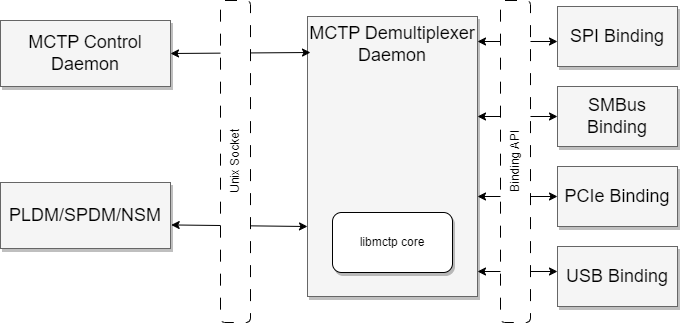
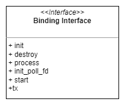
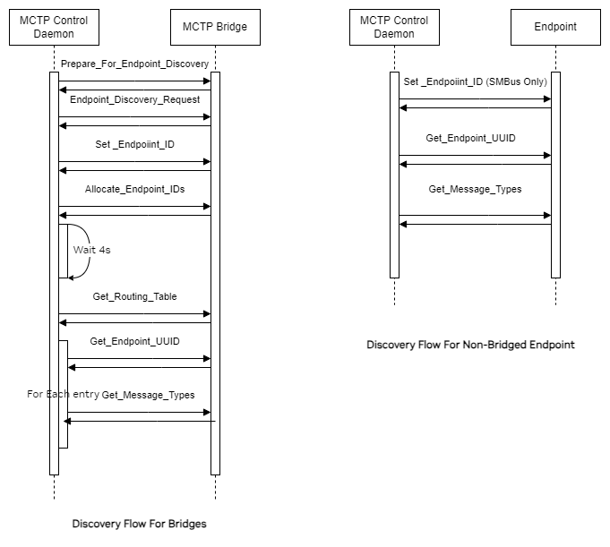

# MCTP

Author: Santosh Puranik <spuranik@nvidia.com>

Created: Feb 1, 2024

## Contents

- [MCTP](#mctp)
  - [Contents](#contents)
  - [Features/Capabilities](#featurescapabilities)
  - [High-level Design](#high-level-design)
  - [Low-level Design](#low-level-design)
    - [MCTP Demux](#mctp-demux)
    - [MCTP Control](#mctp-control)
    - [Code structure](#code-structure)
  - [Platform Enablement](#platform-enablement)
    - [Pre-requisites](#pre-requisites)
    - [Platform Meta Layer Changes](#platform-meta-layer-changes)
    - [Compile Flag Configuration](#compile-flag-configuration)
    - [Systemd Environment File](#systemd-environment-file)
    - [Command Line Parameters](#command-line-parameters)
      - [MCTP Control Daemon](#mctp-control-daemon)
      - [MCTP Demux Daemon](#mctp-demux-daemon)
    - [Adding Support For PCIe Endpoints](#adding-support-for-pcie-endpoints)
    - [Adding Support For USB Endpoints](#adding-support-for-usb-endpoints)
    - [Adding Support For SPI Endpoints](#adding-support-for-spi-endpoints)
    - [Adding Support For SMBus Endpoints](#adding-support-for-smbus-endpoints)
      - [JSON Configuration](#json-configuration)
  - [Differences From Upstream OpenBMC libmctp](#differences-from-upstream-openbmc-libmctp)

## Features/Capabilities

This [repository][4] contains the NvBMC implementation of DMTF's MCTP protocol.
This includes the base MCTP protocol itself as defined in the [DMTF MCTP Base
Specification][1] as well as supported bindings.

The overall architecture of the MCTP stack follows the upstream OpenBMC's
userspace implementation of [libmctp][2] and its associated design
[document][3].

On platforms using NvBMC, MCTP is the primary means for most in-band
(communications that happen between entities considered to be a part of the
managed system) communication between the management controller and managed
entities. It enables higher-level application protocols such as PLDM, SPDM,
NVMe-MI to operate over it.

## High-level Design

The overall design consists of two main MCTP daemons (systemd services) per
physical bus that we need to run MCTP on. As of this writing, PCIe VDM, USB,
SMBus and SPI transport bindings are supported on NvBMC.

The first service is the `mctp-demux-daemon`, which forms the actual core
of the libmctp library and its associated bus bindings. This service exposes a
UNIX domain socket as an interface for applications needing to communicate over
MCTP.

The second service is `mctp-ctrl` which is a partial implementation of the MCTP
control and discovery protocol as described in [1]. Its job is to perform
discovery of MCTP endpoints on the system, assign EIDs to directly attached
devices (i.e., those not downstream to a bridge), query the EIDs for their
capabilities, and present them as D-Bus objects that implement the
`xyz.openbmc_project.MCTP.Endpoint` D-Bus interface.

Other applications can use the `xyz.openbmc_project.MCTP.Endpoint` D-Bus
interface to discover MCTP-capable devices on the platform.

In addition to the control and demux daemons, this repository also houses
implementation of a `mctp-vdm-util` CLI that implements the NVIDIA VDM
specification

The block diagram below shows a high-level overview of the MCTP services and how
applications interact with them.



## Low-level Design

This section will be divided into two sub-sections. The first will cover
low-level design for the MCTP demux daemon and the second will cover the same
for the MCTP control daemon.

### MCTP Demux

The demux daemon is a single-threaded model like most other OpenBMC
applications. It reacts to events by running an event-loop. Feeding this event
loop are the following sources:

- The main Unix domain socket file descriptor that `accept()'s` connections from
  clients.
- The socket file descriptor returned by `accept()`, which is a file descriptor
  unique to every client connected to the demux daemon.
- Any poll file descriptors (FDs) returned by the binding. These are used by
  the demux daemon to process events arising out of the bindings.
- A timerfd that wakes the event loop every so often to kick the systemd
  watchdog timer.

A binding for the demux daemon needs to implement the following interface:



### MCTP Control

The MCTP control daemon manages the MCTP level discovery using a subset of the
MCTP control protocol, as described by the [DMTF MCTP Base Specification][1].
The demux daemon acts as a client to the corresponding MCTP demux daemon,
registering itself with client type `0`, where `0` denotes the MCTP type for
MCTP control messages.

Broadly, the discovery flow can follow two paths: one where the MCTP network
consists of endpoints connected downstream to an FPGA that acts as the MCTP
bridge, and the second where the endpoints are directly connected to the
management controller.

MCTP over PCIe and MCTP over USB supports only the former, where the endpoints
must to be connected via an FPGA MCTP bridge. MCTP over SPI supports only a
single MCTP endpoint per instance of the SPI demux/control dameon pair. MCTP
over SMBus offers the most flexible configuration, allowing for the use of a
JSON configuration file to support multiple MCTP endpoints in a non-bridged
network.

The following sequence diagram shows the flow of discovery for both bridged and
non-bridged configurations:



### Code structure

Overall directory structure from the libmctp [repository][5]:

```txt
.
├── alloc.c
├── astlpc.c
├── astpcie.c
├── astpcie.h
├── astspi.c
├── astspi.h
├── cfg_files
│   └── hw_cfg.json
├── CMakeLists.txt
├── compiler.h
├── config.h.in
├── container_of.h
├── core.c
├── crc32.c
├── crc32c.c
├── crc32c.h
├── crc32.h
├── ctrld
│   ├── mctp-ctrl.c
│   ├── mctp-ctrl-cmdline.h
│   ├── mctp-ctrl-cmds.h
│   ├── mctp-ctrl.h
│   ├── mctp-ctrl-log.h
│   ├── mctp-ctrl-spi.c
│   ├── mctp-ctrl-spi.h
│   ├── mctp-discovery.c
│   ├── mctp-discovery-common.c
│   ├── mctp-discovery-common.h
│   ├── mctp-discovery.h
│   ├── mctp-discovery-i2c.c
│   ├── mctp-discovery-i2c.h
│   ├── mctp-encode.c
│   ├── mctp-encode.h
│   ├── mctp-sdbus.c
│   ├── mctp-sdbus.h
│   ├── mctp-spi-cmds.c
│   ├── mctp-spi-cmds.h
│   ├── meson.build
│   └── README
├── ctrld-spi
│   └── README
├── dbus_log_event.c
├── dbus_log_event.h
├── docs
│   └── bindings
│       ├── Makefile
│       └── vendor-ibm-astlpc.md
├── format-code.sh
├── glacier-spb-ap.c
├── glacier-spb-ap.h
├── libmctp-alloc.h
├── libmctp-astlpc.h
├── libmctp-astpcie.h
├── libmctp-astspi.h
├── libmctp-cmds.h
├── libmctp.h
├── libmctp-log.h
├── libmctp-serial.h
├── libmctp-smbus.h
├── libmctp-usb.h
├── LICENSE
├── linux
│   └── aspeed-mctp.h
├── log.c
├── mctp-i2c-ctrl
├── mctp-json.c
├── mctp-json.h
├── mctp-pcie-ctrl
├── mctp-socket.c
├── mctp-socket.h
├── mctp-spi-ctrl
├── mctp-usb-ctrl
├── meson.build
├── meson_options.txt
├── OWNERS
├── range.h
├── README.md
├── serial.c
├── smbus.c
├── systemd
│   └── system
│       ├── mctp-pcie-ctrl.service
│       ├── mctp-pcie-demux.service
│       ├── mctp-pcie-demux.socket
│       ├── mctp-spi-ctrl.service
│       ├── mctp-spi-demux.service
│       ├── mctp-spi-demux.socket
│       ├── mctp-usb-ctrl.service
│       ├── mctp-usb-demux.service
│       └── mctp-usb-demux.socket
├── tests
│   ├── meson.build
│   ├── test_astlpc.c
│   ├── test_bridge.c
│   ├── test_cmds.c
│   ├── test_core.c
│   ├── test_eid.c
│   ├── test_seq.c
│   ├── test_serial.c
│   ├── test-utils.c
│   └── test-utils.h
├── udev
│   └── rules.d
│       ├── mctp0-raw-kcs3.rules.in
│       └── mctp0-raw-kcs4.rules.in
├── usb.c
├── utils
│   ├── mctp-astlpc-daemon.c
│   ├── mctp-capture.c
│   ├── mctp-capture.h
│   ├── mctp-demux-daemon.c
│   ├── mctp-in.c
│   ├── mctp-pipe.c
│   └── meson.build
└── vdm
    └── nvidia
        ├── libmctp-vdm-cmds.h
        ├── mctp-vdm-commands.c
        ├── mctp-vdm-commands.h
        ├── mctp-vdm-connect.c
        ├── mctp-vdm-encode.c
        ├── mctp-vdm-nvda.c
        ├── mctp-vdm-nvda.h
        ├── meson.build
        └── README

```

The root directory contains the libmctp core, `core.c` and all the associated
bindings, `smbus.c`, `astpcie.c`, `astspi.c`, `usb.c`.

Also contained in the root directory are files for JSON parsing, `mctp-json.c`;
and logging, `log.c`.

The `ctrld` directory contains code for the MCTP control daemon, while `utils`
contains the code for the demux daemon.

The `vdm` directory contains the code for the MCTP VDM utility.

## Platform Enablement

This section will describe the various aspects platforms will have to consider
when implementing MCTP support.

### Pre-requisites

Before delving into repository specific configurations, each platform needs to
finalize on the following:

- The number of MCTP networks required, along with pre-defined endpoint IDs and
  the physical buses over which the network operates. This includes determining
  if there will be an MCTP bridge handling downstream MCTP endpoints.
- The endpoint ID of the management controller itself should be pre-determined.
- In case of a bridged configuration, the endpoint ID of the bridge itself
  should be pre-determined a-priori and the same should be provided to the MCTP
  control daemon as a command-line argument (See the [Command Line
  Parameters](#command-line-parameters) section).
- The outcome of this exercise should include:
  - For directly attached endpoints, i.e., where the management controller is
    the sole bus owner, EIDs need to be pre-determined for every managed
    endpoint.
  - For bridged endpoints, the EID of the management controller and that of the
    bridge should be known, as should the starting EID of the pool of EIDs to be
    supplied to the bridge.

In case of using an FPGA bridge, this typically involves coordination with
the FPGA teams to determine the number of downstream endpoints. The EIDs and
MCTP UUIDs are defined by the FPGA team in an IAS document.

It is important to note that although EIDs that are assigned by the management
controller are pre-determined, this may not always be the case when we have a
host BMC is involved. On platforms where either the Host BMC or the local
management controller can be the MCTP topmost bus owner, the Host BMC may choose
to assign its own EIDs to the endpoints on the network. When the local
management controller queries these EIDs, they would simply be returned by the
bridge in its routing table. Therefore, it is not recommended that any
application code on the management controller rely on the EID being a certain
specific value for a given device.

Instead of an EID, the applications can use the MCTP UUID that the FPGA bridge
can (optionally) assign to ERoT endpoints only. The FPGA design documents
will need to explicitly specify the UUID that the FPGA assigns to a specific
endpoint. Note that not all endpoints support setting a UUID and may instead
generate their own globally unique UUID.

### Platform Meta Layer Changes

The libmctp package is pulled in by default by the meta-nvidia [layer][6]. The
package, by default, will include libmctp core along with all the transport
bindings except USB, the MCTP demux and control daemons, and the MCTP VDM
utility executable.

Any platform specific configurations are placed in the bitbake meta layers for
the platform under `meta-nvidia/.../recipes-phosphor/libmctp/`. For example,
here is how a platform can override systemd service files:

The below code would be placed in
`meta-nvidia/.../meta-platform/.../recipes-phosphor/libmctp/libmctp_%.bbappend`

```bitbake
do_install:append:<MACHINE_NAME>() {
    rm -f ${D}${nonarch_base_libdir}/systemd/system/mctp-spi-ctrl.service
    rm -f ${D}${nonarch_base_libdir}/systemd/system/mctp-spi-demux.service
    rm -f ${D}${nonarch_base_libdir}/systemd/system/mctp-spi-demux.socket
}
```

The above snippet shows an example of how a platform could disable the MCTP SPI
services because it has no MCTP endpoints connected to a SPI bus.

Here's another example where a platform is enabling MCTP services over I2C bus
12:

```bitbake
do_install:append:<MACHINE_NAME>() {
    install -m 0644 ${WORKDIR}/systemd/mctp-i2c12-ctrl.service  ${D}${nonarch_base_libdir}/systemd/system/
    install -m 0644 ${WORKDIR}/systemd/mctp-i2c12-demux.service ${D}${nonarch_base_libdir}/systemd/system/
    install -m 0644 ${WORKDIR}/systemd/mctp-i2c12-demux.socket  ${D}${nonarch_base_libdir}/systemd/system/
    install -m 0644 ${WORKDIR}/udev/92-i2cmux.rules ${D}/${nonarch_base_libdir}/udev/rules.d
}
```

In the above example, the MCTP services are launched based on a udev rule that
waits for the device file pertaining to I2C bus 12 to show up. Here's how that
can be done using the systemd service file for the demux daemon:

`meta-nvidia/.../meta-platform/.../recipes-phosphor/libmctp/systemd/mctp-i2c12-demux.service`

```INI
[Unit]
Description=MCTP I2C 12 demultiplexer daemon
Wants=mctp-i2c12-demux.socket
Conflicts=obmc-power-off@0.target
Requires=sys-bus-i2c-devices-12\x2d0070.device
After=sys-bus-i2c-devices-12\x2d0070.device

[Service]
Type=notify
Restart=always
ExecStart=/usr/bin/mctp-demux-daemon smbus i2c_bus=12 i2c_config_file=/usr/share/mctp/mctp_cfg_smbus12.json
SyslogIdentifier=mctp-i2c12-demux

[Install]
WantedBy=obmc-power-on@0.target
```

And here is the actual udev rule that creates the device unit:

```udev
  ACTION=="add",SUBSYSTEMS=="i2c",DEVPATH=="*i2c-12/12-0070",TAG+="systemd",ENV{SYSTEMD_ALIAS}="/sys/bus/i2c/devices/12-0070"
```

It goes without saying that the amount of tweaking a platform can do via systemd
unit files for managing the lifetime of the MCTP services is limitless. The
above snippets are only meant to illustrate possible customizations.

Here is an example of how a platform could override the MCTP environment file
(see further sections for details about the environment file itself) as well as
install a config file for the MCTP services running for I2C bus 12.

`meta-nvidia/.../meta-platform/.../recipes-phosphor/libmctp/libmctp_%.bbappend`

```bitbake
do_install:append() {
    install -m 0644 ${WORKDIR}/skinnyjoe/mctp ${D}${datadir}/mctp/mctp
    install -m 0644 ${WORKDIR}/mctp_cfg_smbus12.json ${D}${datadir}/mctp/mctp_cfg_smbus12.json
}
```

### Compile Flag Configuration

There are two compile time flags (meson options) that can be used to control
whether the USB binding is enabled and when the USB binding is enabled, another
flag can be used to indicate whether multiple MCTP packets are packed into a
single USB packet (a feature unique to the MCTP over USB binding).

Here is an example [bbappend][5] where one can enable both these flags:

```bitbake
EXTRA_OEMESON += " -Denable-usb=enabled "
EXTRA_OEMESON += " -Dmctp-batch-tx=enabled "
```

Since the USB binding uses libusb, the following dependency needs to be
specified in the bbappend file:

```bitbake
DEPENDS += " libusb1 "
```

### Systemd Environment File

While the libmctp repository itself will install default systemd unit files for
the demux and control daemons, every platform will have some unique requirements
or CLI parameters to pass to the service. It is, therefore, not atypical for
platforms to override these service files in their meta-layers of a bitbake
recipe. For instance, a platform might want to add systemd service dependencies
on launching of the MCTP services.

Provided below are sample systemd unit files that are meant to illustrate the
usage of the environment file and discuss the various command line options for
the demux and control daemons.

Systemd unit file for the PCIe control daemon:

```INI
[Unit]
Description=MCTP PCIe control daemon

[Service]
Restart=always
Environment=MCTP_PCIE_CTRL_OPTS=null
EnvironmentFile=-/usr/share/mctp/mctp
ExecStart=/usr/bin/mctp-pcie-ctrl $MCTP_PCIE_CTRL_OPTS
SyslogIdentifier=mctp-pcie-ctrl

[Install]
WantedBy=multi-user.target
```

Systemd unit file for the PCIe demux daemon:

```INI
[Unit]
Description=MCTP PCIe demultiplexer daemon

[Service]
Type=notify
Restart=always
Environment=DEMUX_PCIE_BINDING_OPTS=null
EnvironmentFile=-/usr/share/mctp/mctp
ExecStart=/usr/bin/mctp-demux-daemon $DEMUX_PCIE_BINDING_OPTS
SyslogIdentifier=mctp-pcie-demux
WatchdogSec=10
```

Systemd unit file for the PCIe demux daemon's socket based activation:

```INI
[Unit]
Description=MCTP PCIe demux Unix domain socket

[Socket]
ListenSequentialPacket=@mctp-pcie-mux
Accept=no

[Install]
WantedBy=sockets.target
```

The above unit files refer to an environment file `/usr/share/mctp/mctp`, from
which systemd references environment variables to supply as CLI arguments to the
demux/control daemon executables.

Here is an example of the environment file:

```shell
DEMUX_PCIE_BINDING_OPTS=astpcie -e 8
MCTP_PCIE_CTRL_OPTS= -m 1 -t 2 --bindinfo "00 00 00 00 00 01" --pci_own_eid 8 --i2c_own_eid 10 --pci_bridge_eid 12 --i2c_bridge_eid 30 --pci_bridge_pool_start 13 --i2c_bridge_pool_start 32 -d 1 -v 1 -c 1
DEMUX_SPI_BINDING_OPTS=astspi gpio=953
MCTP_SPI_CTRL_OPTS= -e 0 -i 3 -t 6 -m 1 -d 20 -v 0 -u "ad4c836b-c54c-11eb-8529-0242ac130003"
```

The options described in the environment file above can also be directly
supplied via the systemd service files if the platform chooses to override the
systemd unit file as a whole. There are several other ways to override systemd
configurations, which are out of scope of this document, but the above
illustrates one such method. See the following section for a complete list of
command line parameters, along with descriptions.

Platforms may want to use systemd's socket based activation for the demux
daemon. This can be done by providing a socket file such as [this][7].

### Command Line Parameters

This section will describe the command line parameters that can be supplied to
the MCTP control and demux daemons. Certain parameters are only applicable for
certain transport bindings and will be marked as such.

#### MCTP Control Daemon

| Option | Description | Bindings |
| :----- | :---------- | :------- |
| `-t` or `type`| Used to indicate the transport type in use. Allowed values: `1` (I2C), `2` (PCIe), `3` (USB) and `6` (SPI).| All|
|`m` or `mode`| Used to set the running mode for the control daemon. In a service file, this should always be `1` for running in a daemon mode. There are use-cases such as running raw commands over that need this mode to be `0` and the SPI test mode `2`. Modes other than `1` are only meant for debugging and testing purposes and will be covered in a separate document.| All|
|`v` or `verbose`| Used to control verbose logging. This takes no arguments.| All|
|`d` or `delay`| Delay in seconds before starting the MCTP discovery flow.|  All|
|`b` or `bindinfo`| Used to supply the PCIe BDF value. Ex: `00 00 00 00 00 01`|PCIe|
|`f` or `cfg_file_path`| Used to supply JSON config file for SMBus.| SMBus|
|`n` or `bus_num`| Used to supply the physical I2C bus number.| SMBus|
|`u` or `uuid`| Used to supply a UUID to assign to the lone SPI ERoT endpoint.| SPI|
|`e` or `eid`| Used to supply EID for SPI transport. Since the SPI transport only supports one ERoT endpoint, it always uses the MCTP peer-EID `0`.| SPI|
|`s` or `tx`| Only used when `mode` is `2` for command line mode. Can be used to supply raw data to send to a given EID.| All|
|`c` or `remove_duplicates`| Legacy parameter used to remove any duplicates from the routing table returned by a bridge endpoint.| All|
|`i` or `pci_own_eid`| Local EID on the PCIe/USB bus.| PCIe, USB|
|`p` or `pci_bridge_eid`| The EID to be assigned to the FPGA bridge.| PCIe, USB|
|`x` or `pci_bridge_pool_start`| The starting EID to be sent to the FPGA bridge for pool allocation.| PCIe, USB|
|`j` or `i2c_own_eid`| Local EID on the I2C bus. Use this exclusive of the JSON config file. Meant to support FPGA bridge connected over I2C bus.| SMBus|
|`q` or `i2c_bridge_eid`| The EID to be assigned to the FPGA bridge when connected over I2C bus.| SMBus|
|`y` or `i2c_bridge_pool_start`| The starting EID to be sent to the FPGA bridge for pool allocation, when connected over I2C.| SMBus|

#### MCTP Demux Daemon

The first parameter immediately after the executable name is the binding type
used. Allowed values are: `astpcie`, `astspi`, `usb` and `smbus`.

The SMBus binding also accepts the following parameters:

|Parameter|Description|
|:--------|:----------|
|`i2c_bus`| The physical I2C bus number on which the demux daemon will operate.|
|`i2c_config_file`| The config JSON to be used by the demux daemon.|
|`i2c_dest_addr`| For SMBus connection to a bridge, this is used to specify the destination's I2C slave address. A JSON config, if provided, will override this.|
|`i2c_src_addr`| For SMBus connection to a bridge, this is used to specify the management controller's own I2C slave address. A JSON config, if provided, will override this.|

The SPI binding also accepts the following parameters:

|Parameter|Description|
|:--------|:----------|
|`gpio`| Used to specify the GPIO number used to perform SPI mailbox handshake.|
|`device`| The SPI device number.|
|`channel`| The SPI channel number.|
|`mode`| The SPI mode.|
|`disablecs`| To disable chip-select.|
|`singlemode`| To enable single mode.|

The USB binding also accepts the following parameters:

|Parameter|Description|
|:--------|:----------|
|`usb vendor_id`| The USB vendor ID of the FPGA bridge's USB device. 0x0955 is the value for NVIDIA|
|`product_id`| The FPGA bridge endpoint's USB product ID. Currently set as 0xFFFF|
|`class_id`| Currently unused and will be deprecated/removed later. Use 0x0 for now.|

Remaining optional parameters which are consumed only by the demux daemon and
not the bindings follow:

|Parameter|Description|
|:--------|:----------|
|`e` or `eid`| The local EID.|
|`v` or `verbose`| To control verbosity.|

This document does not cover the PCAP related options as that feature is unused
in NvBMC.

### Adding Support For PCIe Endpoints

For PCIe transport, only an FPGA bridge as a direct endpoint from the management
controller is supported. As described earlier in the document, all
configurations for this transport are supplied using command line arguments to
the demux/control daemons and/or via the environment file. In order to enable
the MCTP controller on the ASPEED AST2600, the following needs to be added to
the platform kernel device tree:

```dts
&mctp {
    status = "okay";
};
```

By default, libmctp will install the standard systemd service files when an
image is built. Platforms may choose to remove/override these files as needed as
described in the meta layer changes section.

### Adding Support For USB Endpoints

For USB transport, only an FPGA bridge as a direct endpoint from the management
controller is supported. As described earlier in the document, all
configurations for this transport are supplied using command line arguments to
the demux/control daemons and/or via the environment file.

By default, libmctp will install the standard systemd service files when an
image is built. Platforms may choose to remove/override these files as needed as
described in the meta layer changes section.

### Adding Support For SPI Endpoints

For SPI transport, the implementation only supports one ERoT endpoint connected
directly over the SPI bus. As described earlier in the document, all
configurations for this transport are supplied using command line arguments to
the demux/control daemons and/or via the environment file.

By default, libmctp will install the standard systemd service files when an
image is built. Platforms may choose to remove/override these files as needed as
described in the meta layer changes section.

### Adding Support For SMBus Endpoints

To enable the SMBus binding to work, there are some Linux kernel configurations
that need to be enabled. The SMBus binding relies on the I2C slave mqueue
driver, which needs to be configured in the kernel [KConfig][8] for the
platform:

```Makefile
CONFIG_I2C_SLAVE_MQUEUE=y
```

Since the SMBus binding relies on the endpoints being able to reliably master
the I2C bus, the DTS node for the I2C adapter needs to specify multi-master
capability. This can be done by including a `multi-master;` line in the I2C node
entry in the kernel device tree:

```dts
&i2c5 {
    status = "okay";
    bus-frequency = <400000>;
    multi-master;
};
```

#### JSON Configuration

A JSON configuration is supported only by the SMBus MCTP Control and Demux
daemons. The JSON configuration file can be used to specify the I2C bus, the
slave addresses of MCTP capable endpoints and EIDs to be assigned. Here's an
example of a JSON config file that can be supplied to the MCTP demux and control
daemons running for I2C bus 5 (as referenced by the `bus_number_smq` key in
the config JSON):

```json
{
  "i2c": {
    "i2c_src_address": 24,
    "src_eid": 11,
    "buses": [
      {
        "bus_number": "i2c16",
        "bus_number_smq": "i2c5",
        "socket_name": "mctp-i2c5-mux",
        "endpoints": [
          {
            "eid_type": "static",
            "eid": 101,
            "i2c_slave_address": 50
          }
        ]
      },
      {
        "bus_number": "i2c17",
        "bus_number_smq": "i2c5",
        "socket_name": "mctp-i2c5-mux",
        "endpoints": [
          {
            "eid_type": "static",
            "eid": 102,
            "i2c_slave_address": 50
          }
        ]
      },
      {
        "bus_number": "i2c18",
        "bus_number_smq": "i2c5",
        "socket_name": "mctp-i2c5-mux",
        "endpoints": [
          {
            "eid_type": "static",
            "eid": 103,
            "i2c_slave_address": 50
          }
        ]
      },
      {
        "bus_number": "i2c19",
        "bus_number_smq": "i2c5",
        "socket_name": "mctp-i2c5-mux",
        "endpoints": [
          {
            "eid_type": "static",
            "eid": 104,
            "i2c_slave_address": 50
          }
        ]
      }
    ]
  }
}
```

The above JSON describes four MCTP endpoints on I2C buses 16, 17, 18 and 19
which are logical buses to physical bus 5 in a muxed I2C topology. All numbers
used are base 10 unless otherwise specified.

The `i2c` key is the first key in the file and serves to indicate that the
configuration is meant to be for I2C transports. This is the only value
supported as of this writing as JSON configuration is only allowed for I2C
transports.

The `i2c_src_address` key is used to specify the management controller's own I2C
address. The `src_eid` key is used to set the local EID.

This is followed by a `busses` array of objects where keys in each object are
described below.

The `bus_number` key is used to specify the logical bus number in the form
`i2cx` where `x` is the logical I2C bus number as defined in the linux device
tree. The `bus_number_smq` key is used to supply the physical bus number as
defined in the form `i2cy` where `y` is the physical I2C bus number as defined
in the linux device tree.

For non-muxed topologies, the two numbers `x` and `y` can be the same.

`endpoints` is an array of objects where each entry describes a possible MCTP
endpoint on the logical bus `x`. The endpoint object itself has keys as
described below.

The `eid_type` is used to specify the EID type for the endpoint. Only `static`
is supported right now. `eid` key can be used to specify an EID to assign to the
slave device defined by the `i2c_slave_address`.

libmctp will not provide any systemd service files for SMBus transport.
Platforms will have to write their own as described in the meta layer changes
section of this document.

## Differences From Upstream OpenBMC libmctp

Although the overall architecture of the userpace libmctp implementation still
applies as described in design [document][3], the NvBMC implementation has some
key differences:

- The control daemons are an entirely downstream only NvBMC specific
  implementation tailored to the platform specific needs such as an FPGA MCTP
  bridge that bridges PCIe bus to downstream low-speed buses to various device
  endpoints.

- The bus bindings for SMBus and SPI are entirely downstream only.

- The libmctp core has been changed to supply private binding specific data from
  the control daemon to the demux daemon during the discovery process.

- It uses meson build system as opposed to autotools upstream. Upstream is no
  longer maintaining the userspace MCTP implementation.

[1]: https://www.dmtf.org/standards/pmci
[2]: https://github.com/openbmc/libmctp
[3]: https://github.com/openbmc/docs/blob/master/designs/mctp/mctp-userspace.md
[4]: https://github.com/NVIDIA/libmctp
[5]: https://github.com/NVIDIA/openbmc/blob/develop/meta-nvidia/meta-prime/meta-gb200nvl/recipes-phosphor/libmctp/libmctp_%25.bbappend
[6]: https://github.com/NVIDIA/openbmc/blob/develop/meta-nvidia/recipes-phosphor/packagegroups/packagegroup-nvidia-apps.bb
[7]: https://github.com/NVIDIA/libmctp/blob/develop/systemd/system/mctp-usb-demux.socket
[8]: https://github.com/NVIDIA/openbmc/blob/develop/meta-nvidia/meta-prime/recipes-kernel/linux/linux-aspeed/
