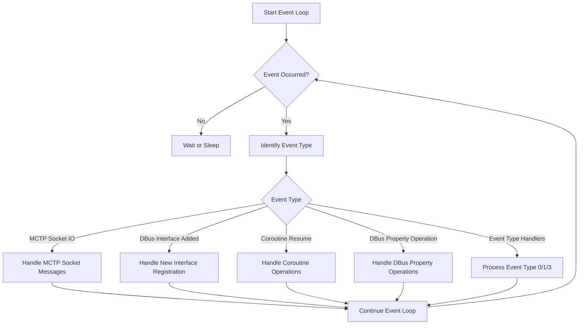
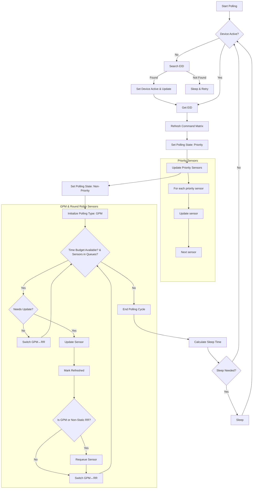
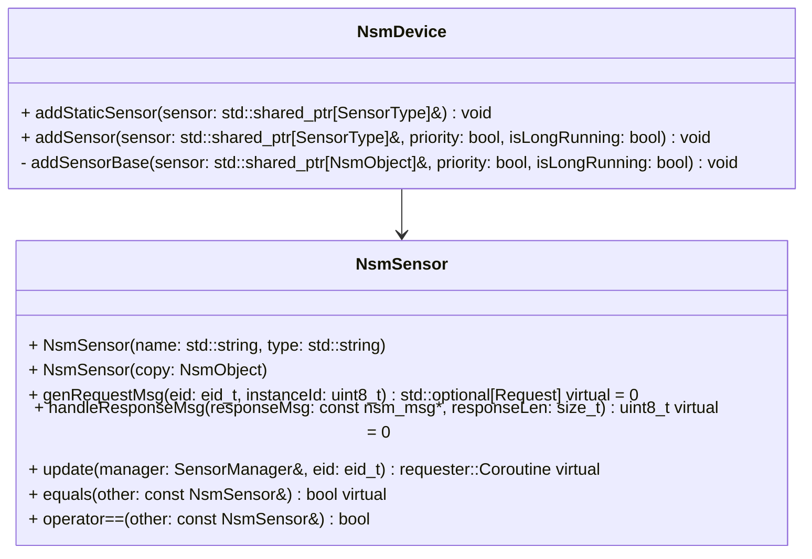
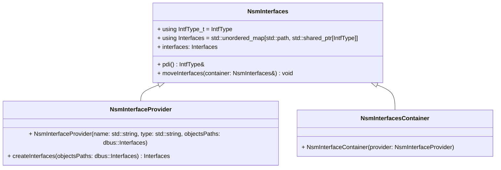
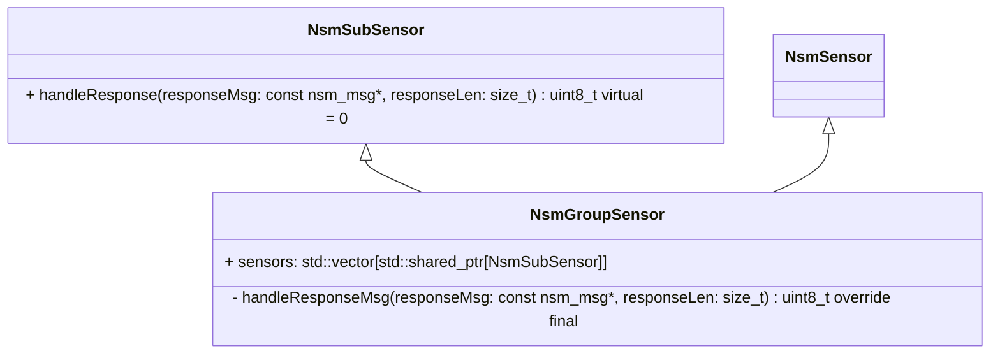
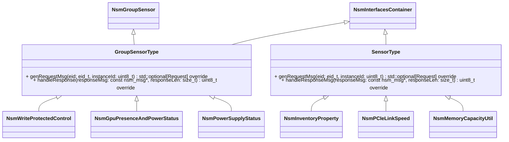
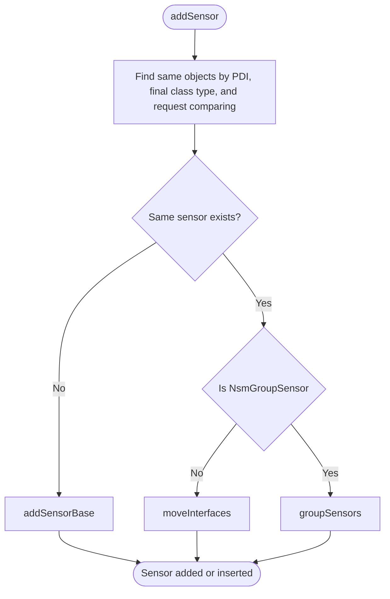

# nsmd - Nvidia System Management Daemon

Authors:  

- Gilbert Chen (<gilbertc@nvidia.com>)
- Harshit Aghera (<haghera@nvidia.com>)
- Rajat Jain (<rajatj@nvidia.com>)
- Aishwary Joshi (<aishwaryj@nvidia.com>)
- Utkarsh Yadav (<uyadav@nvidia.com>)
- Pawel Iwaneczko (<piwaneczko@nvidia.com>)

Primary assignee:

- Harshit Aghera (<haghera@nvidia.com>)

Reviewers:  

- Deepak Kodihalli (<dkodihalli@nvidia.com>)
- Shakeeb Pasha (<spasha@nvidia.com>)
- Gilbert Chen (<gilbertc@nvidia.com>)

## Capabilities

The nsmd service can discover NSM endpoint, gather telemetry data from the endpoints, and can publish them to D-Bus or similar IPC services, for consumer services like bmcweb.

## Relevant Standard Specifications

1. NVIDIA System Management API Specification
2. [DMTF MCTP Base Specification](https://www.dmtf.org/dsp/DSP0236)

## Architecture

### nsmd flow chart

```text
   ┌──────┐                       ┌───────────────┐              ┌───────────┐           ┌───────────┐     ┌────────────┐
   │ nsmd │                       │ EntityManager │              │ FruDevice │           │ mctp-ctrl │     │ NSM Device │
   └──┬───┘                       └───────┬───────┘              └─────┬─────┘           │  daemon   │     └────────────┘
      │                                   │    ┌────┐                  │                 └────┬──────┘           │       
      │                                   │    │JSON│                  │                      │                  │       
      │                                   │    └─┬──┘                  │                      │                  │       
      │                                   │ load │                    ┌┤                      │                  │       
      │                                   │◄─────┘      fruDevice PDI ││ detect EEPROM        │                  │       
      │                                   │     interfaceAdded signal ││ expose to D-Bus      │                  │       
      │                                  ┌┤◄──────────────────────────┴┤                      │                  │       
      │  config PDI InterfaceAdded signal││ Probe success              │                      │                  │       
      │             e.g. NSM_Temp        ││                            │                      │                  │       
     ┌┤  ◄───────────────────────────────││                            │                      │                  │       
     ││                                  ││                            │                      │                  │       
     ││1.get UUID for devType and inst#  ││                            │                      │                  │       
     ││2.search nsmDevice(devType, inst#)││                            │                      │                  │       
     ││3.create nsmDevice if not found   ││                            │                      │                  │       
     ││4.create sensor add to nsmDevice  ││                            │                      │                  │       
     ││5.start sensor pollign task for   ││                            │                      │                  │       
     └┤  the nsmDevice if not start yet  ││                            │                      │                  │       
      │                                  ││                            │                      │                  │       
      │             InterfaceAdded signal││                            │                      │                  │       
      │             NSM_Tble_RemapInst   ││                            │                      │                  │       
     ┌┤  ◄───────────────────────────────││                            │                      │                  │       
     ││1.get name for devType            ││                            │                      │                  │       
     ││2.get type for remapping type     ││                            │                      │                  │       
     ││3.add table to deviceManager      ││                            │                      │                  │       
     └┤                                  ││                            │                      │                  │       
      │                                  ││                            │                      │                  │       
      │             interfaceAddes singal││                            │                      │                  │       
      │             NSM_XXX              ││                            │                      │                  │       
     ┌┤  ◄───────────────────────────────┴┤                            │                      │                  │       
     ││  ...                              │                            │                      │                  │       
     └┤                                   │                            │                      │                  │       

   ┌──────┐                                                                              ┌───────────┐     ┌────────────┐
   │ nsmd │                                                                              │ mctp-ctrl │     │ NSM Device │
   └──┬───┘                                                                              │  daemon   │     └─────┬──────┘
      │                                                                                  └────┬──────┘           │       
      │                                                                                      ┌┤ EID enumerated   │       
      │                                                                                      ││ or start to support NSM  
      │                                         interfacesAdded or PropertiesChanged signal  ││                  │       
      │                                      xyz.openbmc_project.MCTP.Endpoint,Enabled=true  ││                  │       
     ┌┤  ◄───────────────────────────────────────────────────────────────────────────────────┴┤                  │       
     ││1.check if EID support message type 0x7E                                               │                  │       
     ││2.send queryDeviceIdentification                                                       │                  │       
     ││  ─────────────────────────────────────────────────────────────────────────────────────┼────────────────► │       
     ││                                                                           response devType=X Instance#=Y │       
     ││  ◄────────────────────────────────────────────────────────────────────────────────────┼───────────────── │       
     ││3.add EID to discoveredEIDs table                                                      │                  │       
     ││4.record devType,Inst# to table                                                        │                  │       
     └┤5.mark EID is online                                                                   │                  │       

   ┌──────┐                                                                              ┌───────────┐     ┌────────────┐
   │ nsmd │                                                                              │ mctp-ctrl │     │ NSM Device │
   └──┬───┘                                                                              │  daemon   │     └─────┬──────┘
      │                                                                                  └────┬──────┘           │       
      │                                                                                      ┌┤ detect EID       │       
      │                                                            propertiesChanged signal  ││ offline          │       
      │                                     xyz.openbmc_project.MCTP.Endpoint,Enabled=false  ││                  │       
     ┌┤ ◄────────────────────────────────────────────────────────────────────────────────────┴┤                  │       
     ││ search nsmDevice by EID and set isActive to false                                     │                  │       
     ││ update DiscoveredEIDs table to set EID offline                                        │                  │       
     ││                                                                                       │                  │       
     └┤                                                                                       │                  │       

   ┌──────┐                                                                              ┌───────────┐     ┌────────────┐
   │ nsmd │                                                                              │ mctp-ctrl │     │ NSM Device │
   └──┬───┘                                                                              │  daemon   │     └─────┬──────┘
      │                                                                                  └────┬──────┘           │       
┌──► ┌┤ sensor doPollingTask start                                                            │                  │       
│    ││                                                                                       │                  │       
│    ││ if(nsmDevice.isActive==false) {                                                       │                  │       
│    ││   remap the inst# if remapTable for the devType is available                          │                  │       
│    ││   search EID for devType=X,Inst#=Y                                                    │                  │       
│    ││   set isActive=true if EID is online                                                  │                  │       
│    ││ }                                                                                     │                  │       
│    └┤                                                                                       │                  │       
│    ┌┤                                                                                       │                  │       
│    ││ if(nsmDevice.isActive==false) {                                                       │                  │       
│    ││   sleep and continue sensor polling loop                                              │                  │       
│    ││ }                                                                                     │                  │       
│    └┤                                                                                       │                  │       
│    ┌┤                                                                                       │                  │       
│    ││ if(nsmDevice.isActive==true) {                                                        │                  │       
│    ││   foreach sensor in nsmDevice              send NSM command to get reading            │                  │       
│    ││   call sensor.update()       ─────────────────────────────────────────────────────────┼────────────────► │       
│    ││   handle response                          response                                   │                  │       
│    ││   update PDI                 ◄────────────────────────────────────────────────────────┼────────────────  │       
│    ││ }                                                                                     │                  │       
│    └┤ sleep                                                                                 │                  │       
└─────┤                                                                                                                  
```

### nsmd instanceNumber remapping

```text
┌──────────────┐                        ┌───────────────┐                                                                                   
│SensorManager │                        │ DeviceManager │                                                                                   
├──────────────┴───┐                    ├───────────────┴────────────┐                                                                      
│NsmDevice[]   ────┼───┐                │ DiscoveredEIDs[]   ────────┼───┐                                                                  
│...               │   │                │ mapInstToInst[DevType] ────┼───┼────────────────────────────────┐                                 
├──────────────────┤   │                │ mapUuidToInst[DevType]  ───┼───┼─────────────────────────────┐  │                                 
│doPollingTask()   │   │                │ mapEidToInst[DevType]      │   │                             │  │                                 
│                  │   │                │ ...                        │   │                             │  │                                 
└──────────────────┘   │                ├────────────────────────────┤   │                             │  │                                 
                       │                │ SearchEIDs()               │   │                             │  │          ┌──────────────────┐   
                       │                │ ...                        │   │                             │  └────────► │mapInstToInst[GPU]│   
                       │                └────────────────────────────┘   │                             │             ├──────────────────┴─┐ 
                       │  ┌─────────────┐                                │  ┌────────────────┐         └──────────┐  │ 4 -> 0             │ 
                       └─►│ NsmDevice[] │                                └─►│DiscoveredEIDs[]│                    │  │ 5 -> 1             │ 
                          ├──────┬──────┴─────────┐                         ├────┬───────────┴──────────────────┐ │  │ 6 -> 2             │ 
                          │index#│ DevType:Inst#  │                         │EID │ DevType, Inst#, Uuid, active │ │  │ 7 -> 3             │ 
                          ├──────┴────────────────┤                         ├────┴──────────────────────────────┤ │  │ 0 -> 4             │ 
                          │[0]     FPGA     0     │                         │ 12    FPGA     0     abc1   true  │ │  │ 1 -> 5             │ 
                          │[1]     ERoT     0     │                         │ 13    ERoT     0->0  abc2   true  │ │  │ 2 -> 6             │ 
                          │[2]     ERoT     1     │                         │ 14    ERoT     0->1  abc3   true  │ │  │ 3 -> 7             │ 
                          │[3]     ERoT     2     │                         │ 15    ERoT     0->2  abc4   true  │ │  └────────────────────┘ 
                          │[4]     SWITCH   0     │                         │ 22    SWITCH   0     abc5   true  │ │  ┌───────────────────┐  
                          │[5]     BRIDGE 255     │   matched after         │ 23    BRIDGE 255     abc6   true  │ └─►│mapUuidToInst[ERoT]│  
                          │[6]     GPU      0     │ ◄────────────────────►  │ 28    GPU      4->0  abc7   true  │    ├───────────────────┴─┐
                          │[7]     GPU      1     │   inst# was remapped    │ 29    GPU      5->1  abc8   true  │    │ abc2 -> 0           │
                          └───────────────────────┘   via mapXXXtoInst      └───────────────────────────────────┘    │ abc3 -> 1           │
                                                                                           //remap inst#             │ abc4 -> 2           │
                                                                                           //if table is available   └─────────────────────┘
```

### End to End data path of OpenBMC service block diagram

```text
                    ┌──────────────────┐
                    │    Redfish       │
                    └──────┬───────────┘
    Async DBus Calls       │   ▲
                           ▼   │
                    ┌──────────┴───────┐
                    │      D-Bus       │
                    └──────┬───────────┘
       D-Bus req/Res       │  ▲
                           ▼  │
         ┌────────────────────┴───────────────────┐
         │  NSMD                                  │
         │ ┌──────────┐ ┌──────────┐┌──────────┐  │
         │ │coroutine1│ │coroutine2││coroutine3│  │
         │ └──────────┘ └──────────┘└──────────┘  │
         │                                        │
         └──────┬───────────┬────────────┬────────┘
  Unix Socket   │  ▲        │  ▲         │  ▲
                ▼  │        ▼  │         ▼  │
              ┌────┴───────────┴────────────┴──┐
              │ MCTP demux daemon              │
              └─┬───────────┬────────────┬─────┘
MCTP over PCIe  │  ▲        │  ▲         │  ▲
                ▼  │        ▼  │         ▼  │
              ┌────┴───────────┴────────────┴──┐
              │       FPGA                     │
              └─┬────────────┬───────────┬─────┘
                │  ▲         │  ▲        │  ▲
 MCTP over I2C  ▼  │         ▼  │        ▼  │
              ┌────┴──┐    ┌────┴─┐    ┌────┴──┐
              │  CX7  │    │ QM3  │    │ GB100 │
              └───────┘    └──────┘    └───────┘
```

### Event Loop Responsibilities in NSMD Service

The NSMD event loop (based on `sdeventplus::Event`) handles the following specific tasks:

1. **MCTP Socket Communication:**
   - Handles incoming MCTP messages through socket file descriptors
   - Manages socket connections and disconnections
   - Processes VDM (0x7e) message type registrations

2. **DBus Interface Management:**
   - Monitors for new interface additions
   - Handles interface registration and object creation
   - Manages DBus object paths and service names

3. **Coroutine Management:**
   - Resumes suspended coroutines
   - Manages coroutine semaphores
   - Handles coroutine scheduling and prioritization
   - Manages timer-based coroutine operations
   - Controls sleep/wake cycles for coroutines
   - Handles request retry timeouts

4. **DBus Property Operations:**
   - Handles DBus property operations (get/set)
   - Manages property notifications and updates
   - Processes DBus method calls and responses
   - Handles DBus errors and timeouts

5. **Event Type Handlers:**
   - Processes Event Type 0 handlers
   - Processes Event Type 1 handlers
   - Processes Event Type 3 handlers
   - Manages long-running event responses
   - Handles event acknowledgments

6. **Resource Management:**
   - Manages socket file descriptors
   - Handles instance ID expiration
   - Controls request queue management

---



### Sensor polling loop

The sensor polling loop implements a multi-tiered approach to manage sensor updates with different refresh rates and priorities:

1. **Priority Sensors**:
   - Critical sensors requiring immediate updates
   - Processed first in each polling cycle
   - Updated regardless of time budget

2. **GPM & Round Robin Sensors**:
   - GPM (GPU Performance Monitoring) sensors - Performance monitoring sensors with 1-second refresh rate
   - Round-robin sensors - Non-critical sensors processed in a round-robin fashion
   - Processed alternately (GPM ↔ RR) within available time budget
   - GPM sensors are always requeued
   - Round Robin sensors are only requeued if non-static
   - Both types switch to other queue after processing

3. **Time Management**:
   - Tracks elapsed time during polling cycles
   - Implements sleep intervals between polling cycles
   - Uses buffer time to optimize polling frequency
   - Maintains separate GPM time tracking for 1-second interval updates

4. **Device State Management**:
   - Continuously monitors device active state
   - Attempts to recover inactive devices by searching for their EID
   - Updates device state based on EID availability

5. **Error Handling**:
   - Command matrix refresh failures are logged but don't stop polling
   - Failed sensor updates are logged and sensors are requeued
   - Device disconnections trigger EID search and state recovery
   - Timeout handling through sleep intervals between retries
   - Static sensors that fail to update are not requeued

The flow ensures efficient resource utilization while maintaining data freshness for different types of sensors based on their priority and update requirements, with robust error handling to maintain system stability.



## Design

### **Sensors Insertion to Avoid Duplication**  

To prevent duplicate sensor creation and ensure received data is propagated correctly to multiple PDI paths, use `NsmInterfaceContainer<IntfType>` instead of defining a PDI as a direct class member. This approach helps maintain structured and efficient sensor management.  

#### **When to Use `NsmGroupSensor` vs. `NsmInterfaceContainer`**  

- **Use `NsmInterfaceContainer`** when a sensor's data should be sent and received only once, but the decoded result needs to be propagated to multiple PDI paths. This ensures that a single sensor instance efficiently updates all relevant interfaces without redundant communication.  

- **Use `NsmGroupSensor`** as an additional abstraction layer over `NsmInterfaceContainer` when multiple `NsmSubSensor` instances need to handle the same received data differently. While `NsmInterfaceContainer` ensures that data is shared across PDIs, `NsmGroupSensor` calls `handleResponse` for each `NsmSubSensor`, allowing them to process the data in a specific way. This is useful in cases where differentiation is needed, such as handling GPU instance IDs within a shared response.

#### Class Diagrams

- Core Sensor Structure:



- Interface Management:



- Group and Sub Sensors:



- Sensor Types and Specializations:



#### Flowchart diagram



## Interaction with other services and relevant D-Bus APIs

nsmd interacts with other services listed below, using D-Bus IPC mechanism. In OpenBMC framework D-Bus Interfaces sometimes are referred as Phosphor D-Bus Interfaces (or PDI for short), and hence both the terms are used interchangeably in this document.

1. MCTP demux and control daemons
2. Entity Manager
3. PLDM daemon

## Platform Enablement

Following sections outline steps to be followed to enable telemetry acquisition from an NSM endpoint using nsmd. In addition these sections can also be referred to understand various nsmd capabilities and its dependencies on other services and involved D-Bus Interfaces.

### Discovering NSM endpoint

nsmd detects creation of D-Bus Interface xyz.openbmc_project. MCTP. Endpoint at object path /xyz/openbmc_project/mctp. To identify whether an MCTP endpoint support NSM, nsmd check if 0x7E (VDM-PCI) is present in Property SupportedMessageTypes of this Interface. Similar exercise can also be carried out manually, to check whether an MCTP endpoint supports NSM or not.

nsmd uses D-Bus IPC service, to publish information for each device endpoints that supports NSM. D-Bus Interface - herein referred as FRU PDI - xyz.openbmc_project. FruDevice will be published at object path /xyz/openbmc_project/FruDevice/{DeviceType}_{InstanceNumber} by nsmd.

#### FRU Device PDI Properties

#### FRU Device PDI Properties

List of Properties of FRU Device PDI created by nsmd. The list is not exhaustive.

| Property                | Type    | Mandatory/Optional | NSM Command used to get Value            | Use                         |
|-------------------------- |---------- |------------------- |----------------------------------------- | --------------------------- |
| BOARD_PART_NUMBER        | string  | Mandatory          | Type 3 Get Inventory Information (0x11)  | For debugability.           |
| DEVICE_TYPE             | byte   | Mandatory          | Type 0 Query Device Identification (0x09)| To determine list of inventories to be published. |
| INSTANCE_NUMBER           | byte    | Mandatory          | Type 0 Query Device Identification (0x09)| To determine list of inventories to be published. |
| SERIAL_NUMBER             | string    | Mandatory          | Type 3 Get Inventory Information (0x11)  | For debugability.           |
| UUID                   | string    | Mandatory          | NA (Populated by MCTP Control Daemon)    | To uniquely identify a device and EID lookup.     |

#### Example 1

FruDevice D-Bus object (for exposition purpose only)

```text
root@e4869:~# busctl introspect xyz.openbmc_project.NSM /xyz/openbmc_project/FruDevice/30
NAME                                TYPE      SIGNATURE RESULT/VALUE         FLAGS
xyz.openbmc_project.FruDevice       interface -         -                    -
.BOARD_PART_NUMBER                  property  s         "MCX750500B-0D00_DK" emits-change
.DEVICE_TYPE                        property  y         2                    emits-change
.EID                                property  y         30                   emits-change
.INSTANCE_NUMBER                    property  y         0                    emits-change
.SERIAL_NUMBER                      property  s         "SN123456789"        emits-change
.UUID                               property  s         "550e8400-e29b-41d4- emits-change
```

### Enabling an NSM endpoint and gathering of telemetry values from it

nsmd looks out for creation of certain D-Bus Interfaces at /xyz/openbmc_project/inventory Object path, to start requesting telemetry value from an NSM endpoint.

These interfaces should also contains individual telemetry specific details like which NSM command to use and its content. These interfaces are herein referred to as Configuration PDIs (Phosphor D-Bus Interfaces).

However, nsmd doesn't create Configuration PDIs itself and rely on Entity Manager for their creation. nsmd has configuration driven design and since Configuration PDIs are static, Entity Manager is available as part of OpenBMC infrastructure to host Configuration PDIs on D-Bus. Entity Manager detects the existence of D-Bus Interface xyz.openbmc_project. FruDevice (could have been published by nsmd as mentioned in previous section), on any of the D-Bus services and publishes Configuration PDI based on its content. Entity Manager uses JSON configuration file to determine list of Configuration PDI and their content to be published, upon detection of certain type of FRU Device. Please refer Entity Manager design documents for in depth understanding of the process of publishing Configuration PDI from FRU device D-Bus Interface.

### Structure for EM configs for NSM with examples to follow

As of now NSM support following devices:

```text
typedef enum {
 NSM_DEV_ID_GPU = 0,
 NSM_DEV_ID_SWITCH = 1,
 NSM_DEV_ID_PCIE_BRIDGE = 2,
 NSM_DEV_ID_BASEBOARD = 3,
 NSM_DEV_ID_UNKNOWN = 0xff,
} NsmDeviceIdentification;
```

- Now based on MCTP discovery, for MCTP endpoints which are NSM endpoints, NSM service will create a fruDevice object for each instance of device found.
- We fire a few nsmd commands for FRU and inventory details for the device. We then expose properties required for EM configuration on the PDI.

e.g.

```text
:# busctl tree xyz.openbmc_project.NSM
`-/xyz
  `-/xyz/openbmc_project
    `-/xyz/openbmc_project/FruDevice
      `-/xyz/openbmc_project/FruDevice/31
# busctl introspect xyz.openbmc_project.NSM /xyz/openbmc_project/FruDevice/31
NAME                                TYPE      SIGNATURE RESULT/VALUE                           FLAGS
org.freedesktop.DBus.Introspectable interface -         -                                      -
.Introspect                         method    -         s                                      -
org.freedesktop.DBus.Peer           interface -         -                                      -
.GetMachineId                       method    -         s                                      -
.Ping                               method    -         -                                      -
org.freedesktop.DBus.Properties     interface -         -                                      -
.Get                                method    ss        v                                      -
.GetAll                             method    s         a{sv}                                  -
.Set                                method    ssv       -                                      -
.PropertiesChanged                  signal    sa{sv}as  -                                      -
xyz.openbmc_project.FruDevice       interface -         -                                      -
.BOARD_PART_NUMBER                  property  s         "MCX750500B-0D00_DK"                   emits-change
.DEVICE_TYPE                        property  y         2                                      emits-change
.INSTANCE_NUMBER                    property  y         0                                      emits-change
.SERIAL_NUMBER                      property  s         "SN123456789"                          emits-change
.UUID                               property  s         "c13e2b99-68e4-45f1-8686-409009062aa8" emits-change
```

- As we can see CX7 was identified, we created object /xyz/openbmc_project/FruDevice/31 and interface “xyz.openbmc_project. FruDevice” , exposing UUID, DEVICE_TYPE, INTANCE_NUMBER etc on fru device interface.

#### PCIE BRIDGE DEVICE EM config

Here is the basic example for the device pcie bridge EM json. It also contains sensors to be assumed by pldm type 2.

```text
{
        "Exposes": [
            {
                "Name": "HGX_Driver_NVLinkManagementNIC_$INSTANCE_NUMBER",
                "Type": "NSM_NVLinkManagementSWInventory",
                "UUID": "$UUID",
                "Manufacturer": "Nvidia",
                "Priority": false
            },
            {
                "Name": "HGX_NVLinkManagementNIC_$INSTANCE_NUMBER_Temp_0",
                "Type": "SensorAuxName",
                "SensorId": 1,
                "AuxNames": ["HGX_NVLinkManagementNIC_$INSTANCE_NUMBER_Temp_0"]
            },
            {
                "Name": "HGX_NVLinkManagementNIC_$INSTANCE_NUMBER_Port_0_Temp_0",
                "Type": "SensorAuxName",
                "SensorId": 8,
                "AuxNames": ["HGX_NVLinkManagementNIC_$INSTANCE_NUMBER_Port_0_Temp_0"]
            },
            {
                "Name": "HGX_NVLinkManagementNIC_$INSTANCE_NUMBER_Port_1_Temp_0",
                "Type": "SensorAuxName",
                "SensorId": 9,
                "AuxNames": ["HGX_NVLinkManagementNIC_$INSTANCE_NUMBER_Port_1_Temp_0"]
            }
        ],
        "Probe": "xyz.openbmc_project.FruDevice({'DEVICE_TYPE': 2})",
        "Name": "NVLinkManagementNIC_$INSTANCE_NUMBER",
        "Type": "NetworkAdapters",
        "Parent_Chassis": "/xyz/openbmc_project/inventory/chassis/Baseboard_0",
        "xyz.openbmc_project.Inventory.Decorator.Asset": {
            "Manufacturer": "Nvidia",
            "Model": "$BOARD_PRODUCT_NAME",
            "PartNumber": "$BOARD_PART_NUMBER",
            "SerialNumber": "$BOARD_SERIAL_NUMBER"
        },
        "xyz.openbmc_project.Inventory.Item.Chassis": {
            "Type": "xyz.openbmc_project.Inventory.Item.Chassis.ChassisType.Component"
        },
        "xyz.openbmc_project.Common.UUID": {
            "UUID": "$UUID"
        },
        "xyz.openbmc_project.Inventory.Item.NetworkInterface": {},
        "xyz.openbmc_project.Inventory.Decorator.Instance": {
            "InstanceNumber": "$INSTANCE_NUMBER"
        }
     },
```

- As soon as the probe gets true , we expose 1 sensor here, for cx7 software inventory related to the driver version.
- “Why UUID”: This uuid will be passed on from fru interface on device objects in NSM. It is required because UUID will be used to uniquely identify the EID/device we are running the nsmd command for. EID is not unique , may change across restarts, after dropping from mctp network and rediscover  etc.
- “Significance of Priority” -  It reflects that the sensor is dynamic. Need to be updated in polling coroutine. Now it has value true, its put in priority sensor list, if its false it is put in round robin list.

On Entity Manager we have:

```text
`-/xyz/openbmc_project/inventory/system/networkadapters
          `-/xyz/openbmc_project/inventory/system/networkadapters/NVLinkManagementNIC_0
|-/xyz/openbmc_project/inventory/system/networkadapters/NVLinkManagementNIC_0/HGX_Driver_NVLinkManagementNIC_0
```

```
root@umbriel:~# busctl introspect xyz.openbmc_project.EntityManager /xyz/openbmc_project/inventory/system/networkadapters/NVLinkManagementNIC_0/HGX_Driver_NVLinkManagementNIC_0NAME                                                              TYPE      SIGNATURE RESULT/VALUE                           FLAGS
org.freedesktop.DBus.Introspectable                               interface -         -                                      -
.Introspect                                                       method    -         s                                      -
org.freedesktop.DBus.Peer                                         interface -         -                                      -
.GetMachineId                                                     method    -         s                                      -
.Ping                                                             method    -         -                                      -
org.freedesktop.DBus.Properties                                   interface -         -                                      -
.Get                                                              method    ss        v                                      -
.GetAll                                                           method    s         a{sv}                                  -
.Set                                                              method    ssv       -                                      -
.PropertiesChanged                                                signal    sa{sv}as  -                                      -
xyz.openbmc_project.Configuration.NSM_NVLinkManagementSWInventory interface -         -                                      -
.Manufacturer                                                     property  s         "Nvidia"                               emits-change
.Name                                                             property  s         "HGX_Driver_NVLinkManagementNIC_0"     emits-change
.Priority                                                         property  b         false                                  emits-change
.Type                                                             property  s         "NSM_NVLinkManagementSWInventory"      emits-change
.UUID                                                             property  s         "a007f776-7805-4e00-0000-0000482e4f00" emits-change
```

After NSMD consumes it:
- It creates /xyz/openbmc_project/inventory_software/HGX_Driver_NVLinkManagementNIC_0 object path which contains sensor information for driver version.
- It is kept in priority round robin polling loop because priority property was false in EM config.

```text
`-/xyz
  `-/xyz/openbmc_project
    |-/xyz/openbmc_project/FruDevice
    | `-/xyz/openbmc_project/FruDevice/31
    `-/xyz/openbmc_project/inventory_software
      `-/xyz/openbmc_project/inventory_software/HGX_Driver_NVLinkManagementNIC_0
```

```text
root@umbriel:~# busctl introspect xyz.openbmc_project.NSM /xyz/openbmc_project/inventory_software/HGX_Driver_NVLinkManagementNIC_0
NAME                                                  TYPE      SIGNATURE RESULT/VALUE                             FLAGS
org.freedesktop.DBus.Introspectable                   interface -         -                                        -
.Introspect                                           method    -         s                                        -
org.freedesktop.DBus.Peer                             interface -         -                                        -
.GetMachineId                                         method    -         s                                        -
.Ping                                                 method    -         -                                        -
org.freedesktop.DBus.Properties                       interface -         -                                        -
.Get                                                  method    ss        v                                        -
.GetAll                                               method    s         a{sv}                                    -
.Set                                                  method    ssv       -                                        -
.PropertiesChanged                                    signal    sa{sv}as  -                                        -
xyz.openbmc_project.Association.Definitions           interface -         -                                        -
.Associations                                         property  a(sss)    0                                        emits-change writable
xyz.openbmc_project.Inventory.Decorator.Asset         interface -         -                                        -
.BuildDate                                            property  s         ""                                       emits-change writable
.Manufacturer                                         property  s         "a0f7f076-7805-4200-0000-0000482e4300"   emits-change writable
.Model                                                property  s         ""                                       emits-change writable
.Name                                                 property  s         ""                                       emits-change writable
.PartNumber                                           property  s         ""                                       emits-change writable
.SKU                                                  property  s         ""                                       emits-change writable
.SerialNumber                                         property  s         ""                                       emits-change writable
.SparePartNumber                                      property  s         ""                                       emits-change writable
.SubModel                                             property  s         ""                                       emits-change writable
xyz.openbmc_project.Software.Version                  interface -         -                                        -
.Purpose                                              property  s         "xyz.openbmc_project.Software.Version... emits-change writable
.SoftwareId                                           property  s         ""                                       emits-change writable
.Version                                              property  s         "MockDriverVersion 1.0.0"                emits-change writable
xyz.openbmc_project.State.Decorator.OperationalStatus interface -         -                                        -
.Functional                                           property  b         true                                     emits-change writable
.State                                                property  s         "xyz.openbmc_project.State.Decorator.... emits-change writable
```

This is the general pattern we follow for sensor creation. For nsmd we are assuming everything as a sensor.

```text
|                              STATIC SENSORS                                    |               DYNAMIC SENSORS             |
|--------------------------------------------------------------------------------|-------------------------------------------|
| No nsm command trigger required.   |   NSM command need to be triggered once.  |    Priority           |     Round Robin   |
| E.g. Manufacturer NVIDIA           |                                           |                       |                   |
|                                    |                                           |                       |                   |
|                                    |                                           |                       |                   |
|-----------------------------------------------------------------------------------------------------------------------------
|                      Separate update function()                                |      Separate polling coroutine           |
```

#### GB100 DEVICE EM config

```text
{
        "Exposes": [
            {
                "Name": "GPU_$INSTANCE_NUMBER + 1 Processor",
                "Type": "NSM_Processor",
                "UUID": "$UUID",
                "InventoryObjPath": "/xyz/openbmc_project/inventory/system/processors/GPU_SXM_$INSTANCE_NUMBER + 1",
                "MIGMode": {
                    "Type": "NSM_MIG",
                    "UUID": "$UUID",
                    "InventoryObjPath": "/xyz/openbmc_project/inventory/system/processors/GPU_SXM_$INSTANCE_NUMBER + 1",
                    "Priority": false
                },
                "ECCMode": {
                    "Type": "NSM_ECC",
                    "UUID": "$UUID",
                    "InventoryObjPath": "/xyz/openbmc_project/inventory/system/processors/GPU_SXM_$INSTANCE_NUMBER + 1",
                    "Priority": false
                }
            }
        ],
        "Probe": "xyz.openbmc_project.FruDevice({'DEVICE_TYPE': 0})",
        "Name": "GPU_$INSTANCE_NUMBER + 1",
        "Type": "Processor",
        "Parent_Chassis": "/xyz/openbmc_project/inventory/chassis/Baseboard_0",
        "xyz.openbmc_project.Inventory.Decorator.Asset": {
            "Manufacturer": "Nvidia",
            "Model": "$BOARD_PRODUCT_NAME",
            "PartNumber": "$BOARD_PART_NUMBER",
            "SerialNumber": "$BOARD_SERIAL_NUMBER"
        },
        "xyz.openbmc_project.Inventory.Decorator.Instance": {
            "InstanceNumber": "$INSTANCE_NUMBER"
        }
    }
```

- Here we handle both scenario whether we want to index gpu from 0 or 1 .
- For hgxb it is 1 based.

```text
root@umbriel:/usr/share/entity-manager/configurations# busctl tree xyz.openbmc_project.EntityManager
`- /xyz
`- /xyz/openbmc_project
|- /xyz/openbmc_project/EntityManager
`- /xyz/openbmc_project/inventory
`- /xyz/openbmc_project/inventory/system
|- /xyz/openbmc_project/inventory/system/fabric
| `- /xyz/openbmc_project/inventory/system/fabric/Fabric_0
| `- /xyz/openbmc_project/inventory/system/fabric/Fabric_0/QM3_0
`- /xyz/openbmc_project/inventory/system/processor
`- /xyz/openbmc_project/inventory/system/processor/GPU_1
`- /xyz/openbmc_project/inventory/system/processor/GPU_1/GPU_1_Processor
```

```text
root@umbriel:/usr/share/entity-manager/configurations# busctl introspect xyz.openbmc_project.EntityManager /xyz/openbmc_project/inventory/system/processor/GPU_1/GPU_1_Processor
NAME                                                              TYPE      SIGNATURE RESULT/VALUE                             FLAGS
org.freedesktop.DBus.Introspectable                               interface -         -                                        -
.Introspect                                                       method    -         s                                        -
org.freedesktop.DBus.Peer                                         interface -         -                                        -
.GetMachineId                                                     method    -         s                                        -
.Ping                                                             method    -         -                                        -
org.freedesktop.DBus.Properties                                   interface -         -                                        -
.Get                                                              method    ss        v                                        -
.GetAll                                                           method    s         a{sv}                                    -
.Set
                    method    ssv       -                                        -
.PropertiesChanged                                                signal    sa{sv}as  -                                        -
xyz.openbmc_project.Configuration.NSM_Processor                   interface -         -                                        -
.InventoryObjPath                                                 property  s         "/xyz/openbmc_project/inventory/syste... emits-change
.Name                                                             property  s         "GPU_1 Processor"                        emits-change
.Type                                                             property  s         "NSM_Processor"                          emits-change
.UUID                                                             property  s         "c13e2b99-68e4-45f1-8686-409009062aa8"   emits-change
xyz.openbmc_project.Configuration.NSM_Processor.ECCMode           interface -         -                                        -
.InventoryObjPath                                                 property  s         "/xyz/openbmc_project/inventory/syste... emits-change
.Priority                                                         property  b         false                                    emits-change
.Type                                                             property  s         "NSM_ECC"                                emits-change
.UUID                                                             property  s         "c13e2b99-68e4-45f1-8686-409009062aa8"   emits-change
xyz.openbmc_project.Configuration.NSM_Processor.EDPpScalingFactor interface -         -                                        -
.InventoryObjPath                                                 property  s         "/xyz/openbmc_project/inventory/syste... emits-change
.Priority                                                         property  b         false                                    emits-change
.Type                                                             property  s         "NSM_EDPp"                               emits-change
.UUID                                                             property  s         "c13e2b99-68e4-45f1-8686-409009062aa8"   emits-change
xyz.openbmc_project.Configuration.NSM_Processor.MIGMode           interface -         -                                        -
.InventoryObjPath                                                 property  s         "/xyz/openbmc_project/inventory/syste... emits-change
.Priority                                                         property  b         false                                    emits-change
.Type                                                             property  s         "NSM_MIG"                                emits-change
.UUID                                                             property  s         "c13e2b99-68e4-45f1-8686-409009062aa8"   emits-change
```

- Now if we compare EM config and the results we can see that main configuration PDI is "xyz.openbmc_project. Configuration. NSM_Processor".
- ECCMode, MIGMode which are created in sub blocks of EM json. here are created as kind of secondary PDI's, e.g. "xyz.openbmc_project. Configuration. NSM_Processor. ECCMode" etc.

#### PCIeRetimer DEVICE EM config

- This is a special scenario. Retimer is not a device which is directly supported by nsmd. We get all its info from FPGA.
- So here we tightly couple retimer with fpga EM json.
- As soon as fpga is up we create all retimers supported.

```
{
        "Exposes": [
            {
                "Name": "HGX_PCIeRetimer_0",
                "Type": "NSM_PCIeRetimer",
                "UUID": "$UUID",
                "INSTANCE_NUMBER": 0,
                "Association": [
                    "all_sensors",
                    "chassis",
                    "/xyz/openbmc_project/sensors/temperature/HGX_PCIeRetimer_0_TEMP_0",
                    "parent_chassis",
                    "all_chassis",
                    "/xyz/openbmc_project/inventory/system/chassis/HGX_Chassis_0",
                    "fabrics",
                    "chassis",
                    "/xyz/openbmc_project/inventory/system/fabrics/HGX_PCIeRetimerTopology_0"
                ]
            },
            {
                "Name": "HGX_PCIeRetimer_1",
                "Type": "NSM_PCIeRetimer",
                "UUID": "$UUID",
                "INSTANCE_NUMBER": 1,
                "Association": [
                    "all_sensors",
                    "chassis",
                    "/xyz/openbmc_project/sensors/temperature/HGX_PCIeRetimer_1_TEMP_0",
                    "parent_chassis",
                    "all_chassis",
                    "/xyz/openbmc_project/inventory/system/chassis/HGX_Chassis_0",
                    "fabrics",
                    "chassis",
                    "/xyz/openbmc_project/inventory/system/fabrics/HGX_PCIeRetimerTopology_1"
                ]
            },
            {
                "Name": "HGX_PCIeRetimer_2",
                "Type": "NSM_PCIeRetimer",
                "UUID": "$UUID",
                "INSTANCE_NUMBER": 2,
                "Association": [
                    "all_sensors",
                    "chassis",
                    "/xyz/openbmc_project/sensors/temperature/HGX_PCIeRetimer_2_TEMP_0",
                    "parent_chassis",
                    "all_chassis",
                    "/xyz/openbmc_project/inventory/system/chassis/HGX_Chassis_0",
                    "fabrics",
                    "chassis",
                    "/xyz/openbmc_project/inventory/system/fabrics/HGX_PCIeRetimerTopology_2"
                ]
            },
            {
                "Name": "HGX_PCIeRetimer_3",
                "Type": "NSM_PCIeRetimer",
                "UUID": "$UUID",
                "INSTANCE_NUMBER": 3,
                "Association": [
                    "all_sensors",
                    "chassis",
                    "/xyz/openbmc_project/sensors/temperature/HGX_PCIeRetimer_3_TEMP_0",
                    "parent_chassis",
                    "all_chassis",
                    "/xyz/openbmc_project/inventory/system/chassis/HGX_Chassis_0",
                    "fabrics",
                    "chassis",
                    "/xyz/openbmc_project/inventory/system/fabrics/HGX_PCIeRetimerTopology_3"
                ]
            },
            {
                "Name": "HGX_PCIeRetimer_4",
                "Type": "NSM_PCIeRetimer",
                "UUID": "$UUID",
                "INSTANCE_NUMBER": 4,
                "Association": [
                    "all_sensors",
                    "chassis",
                    "/xyz/openbmc_project/sensors/temperature/HGX_PCIeRetimer_4_TEMP_0",
                    "parent_chassis",
                    "all_chassis",
                    "/xyz/openbmc_project/inventory/system/chassis/HGX_Chassis_0",
                    "fabrics",
                    "chassis",
                    "/xyz/openbmc_project/inventory/system/fabrics/HGX_PCIeRetimerTopology_4"
                ]
            },
            {
                "Name": "HGX_PCIeRetimer_5",
                "Type": "NSM_PCIeRetimer",
                "UUID": "$UUID",
                "INSTANCE_NUMBER": 5,
                "Association": [
                    "all_sensors",
                    "chassis",
                    "/xyz/openbmc_project/sensors/temperature/HGX_PCIeRetimer_5_TEMP_0",
                    "parent_chassis",
                    "all_chassis",
                    "/xyz/openbmc_project/inventory/system/chassis/HGX_Chassis_0",
                    "fabrics",
                    "chassis",
                    "/xyz/openbmc_project/inventory/system/fabrics/HGX_PCIeRetimerTopology_5"
                ]
            },
            {
                "Name": "HGX_PCIeRetimer_6",
                "Type": "NSM_PCIeRetimer",
                "UUID": "$UUID",
                "INSTANCE_NUMBER": 6,
                "Association": [
                    "all_sensors",
                    "chassis",
                    "/xyz/openbmc_project/sensors/temperature/HGX_PCIeRetimer_6_TEMP_0",
                    "parent_chassis",
                    "all_chassis",
                    "/xyz/openbmc_project/inventory/system/chassis/HGX_Chassis_0",
                    "fabrics",
                    "chassis",
                    "/xyz/openbmc_project/inventory/system/fabrics/HGX_PCIeRetimerTopology_6"
                ]
            },
            {
                "Name": "HGX_PCIeRetimer_7",
                "Type": "NSM_PCIeRetimer",
                "UUID": "$UUID",
                "INSTANCE_NUMBER": 7,
                "Association": [
                    "all_sensors",
                    "chassis",
                    "/xyz/openbmc_project/sensors/temperature/HGX_PCIeRetimer_7_TEMP_0",
                    "parent_chassis",
                    "all_chassis",
                    "/xyz/openbmc_project/inventory/system/chassis/HGX_Chassis_0",
                    "fabrics",
                    "chassis",
                    "/xyz/openbmc_project/inventory/system/fabrics/HGX_PCIeRetimerTopology_7"
                ]
            }
        ],
        "Probe": "xyz.openbmc_project.FruDevice({'DEVICE_TYPE': 3})",
        "Name": "HGX_FPGA_0",
        "Type": "fpga",
        "Parent_Chassis": "/xyz/openbmc_project/inventory/system/chassis/HGX_Chassis_0"
    }
```

- Each retimer has type "NSM_PCIeRetimer".
- the advantage of this is future exposes on all pcieretimer now can we done wirth single json block.

e.g. Look at the probe, it gets true for all retimer devices.

```
{
        "Exposes": [
            {
                "Name": "HGX_FW_PCIeRetimer_$INSTANCE_NUMBER",
                "Type": "NSM_PCIeRetimer_FWInventory",
                "Association": [
                    "inventory",
                    "activation",
                    "/xyz/openbmc_project/inventory/system/chassis/HGX_PCIeRetimer_$INSTANCE_NUMBER",
                    "software_version",
                    "updateable",
                    "/xyz/openbmc_project/software"
                ],
                "UUID": "$UUID",
                "Manufacturer": "Nvidia",
                "INSTANCE_NUMBER": "$INSTANCE_NUMBER"
            }
        ],
        "Probe": "xyz.openbmc_project.Configuration.NSM_PCIeRetimer({})",
        "Name": "PCIeRetimer_$INSTANCE_NUMBER",
        "Type": "chassis",
        "Parent_Chassis": "/xyz/openbmc_project/inventory/system/chassis/HGX_Chassis_0"
    }
```

#### HSC Device

- Device for which no chassis schema is applicable.

```
{
           "Name": "HGX_Chassis_0_HSC_0_Temp_0",
           "Type" : "NSM_Temp",
           "Associations": [
               {
                   "Forward" : "chassis",
                   "Backward" : "all_sensors",
                   "AbsolutePath" : "/xyz/openbmc_project/inventory/system/chassis/HGX_Chassis_0"
               }
           ],
           "UUID": "$UUID",
           "Aggregated": true,
           "SensorId": 192,
           "Priority": true
        },
{
           "Name": "HGX_Chassis_0_HSC_0_Power_0",
           "Type" : "NSM_Power",
           "Associations": [
               {
                   "Forward" : "chassis",
                   "Backward" : "all_sensors",
                   "AbsolutePath" : "/xyz/openbmc_project/inventory/system/chassis/HGX_Chassis_0"
               }
           ],
           "UUID": "$UUID",
           "Aggregated": true,
           "SensorId": 128,
           "AveragingInterval": 0,
           "Priority": true
        },
 {
           "Name": "HGX_Chassis_0_StandbyHSC_0_Power_0",
           "Type" : "NSM_Power",
           "Associations": [
               {
                   "Forward" : "chassis",
                   "Backward" : "all_sensors",
                   "AbsolutePath" : "/xyz/openbmc_project/inventory/system/chassis/HGX_Chassis_0"
               }
           ],
           "UUID": "$UUID",
           "Aggregated": true,
           "SensorId": 138,
           "AveragingInterval": 0,
           "Priority": true
        },
],
      "Probe": "xyz.openbmc_project.FruDevice({'DEVICE_TYPE': 3})",
      "Name": "HGX_FPGA_0",
      "Type": "chassis",
      "Parent_Chassis": "/xyz/openbmc_project/inventory/system/chassis/HGX_Chassis_0",
      "xyz.openbmc_project.Inventory.Decorator.Asset":
      {
        "Manufacturer": "Nvidia",
        "Model": "$BOARD_PRODUCT_NAME",
        "PartNumber": "$BOARD_PART_NUMBER",
        "SerialNumber": "$BOARD_SERIAL_NUMBER"
      },
      "xyz.openbmc_project.Inventory.Item.Chassis": {
         "Type": "xyz.openbmc_project.Inventory.Item.Chassis.ChassisType.Module"
      },
      "xyz.openbmc_project.Inventory.Decorator.Instance": {
            "InstanceNumber": "$INSTANCE_NUMBER"
      }
   }
```

#### NSM Event Configs

- json blocks are of 2 types
- applicable for all message types for each device.

```
 {
            "Name": "GlobalEventSetting",
            "Type": "NSM_EventSetting",
            "UUID": "$UUID",
            "EventGenerationSetting": 2     #push mode selected
         },
```

- applicable for each message type for each device.

```
{
            "Name": "PlatformEnvironmentalEventSetting",
            "Type": "NSM_EventConfig",
            "MessageType": 3,     #messagetype applicable
            "UUID": "$UUID",
            "SubscribedEventIDs": [ #events to subscribe for
               0,
               1
            ],
            "AcknowledgementEventIds": [   #events for ack we want
               0,
               1
            ]
         },
```

For detaisl can be found in events block of this document.

### List of Configuration PDIs of nsmd

TODO - All Configuration PDIs with their application and type and description of each of its property are to be added in this section.

#### Nvlink Port Configuration in EM Json

1. To create required number of links of type "Name", add below mentioned configuration in EM json.

| Configuration Property  | type    | Description                                                       |
|------------------------ |-------- |----------------------------------------------------------------- |
| Type                    | string  | NSM_NVLink                                                        |
| Name                    | string  | Name for EM dbus object, which is also used as port dbus object name prefix.            |
| ParentObjPath             | string  | Dbus object path of the device on which the port objects will be created.                 |
| DeviceType                | int     | Device type as per defination in NsmDeviceIdentification enum defined above.              |
| UUID                      | string   | UUID of the device.                                               |
| Priority                  | boolean   | Priority to indicate which queue to add the created sensor for polling.                   |
| Count                   | int     | The total port count on the device.<br>example: if Count=4 and Name="NVPort", then four dbus objects will be created.<br>/xyz/openbmc_project/.../Ports/NVPort_0<br>/xyz/openbmc_project/.../Ports/NVPort_1<br>/xyz/openbmc_project/.../Ports/NVPort_2<br>/xyz/openbmc_project/.../Ports/NVPort_3  |

Example json snippet:

```
    {
        "Name": "NVLinkManagement",
        "Type": "NSM_NVLink",
        "ParentObjPath": "/xyz/openbmc_project/inventory/system/chassis/HGX_NVLinkManagementNIC_0/NetworkAdapters/NVLinkManagementNIC_0",
        "DeviceType": "$DEVICE_TYPE",
        "UUID": "$UUID",
        "Priority": true,
        "Count": 2
    }
```

2. To add topology details on the created dbus port objects, there is a python script which generates the EM json from a mapping excel sheet.
More details are added in nsmd repo (nsmd/tools/topology/Readme.md).

3. To have correlation/association with available sensors in PLDM (in case of NVSwitches & NetworkAdapters) and NSM device EM json configuration is to be added for each sensor Id in PLDM providing the auxiliary name and other EM config derived details.
More details are added in nsmd repo (nsmd/tools/correlation/Readme.md).

### Steps to enable nsmd for a specific platform

To enable nsmd for a Platform, please follow steps given below.

1. Include nsmd as distro dependency for the Platform.
2. Create Entity Manager configuration file for the device that supports NSM, and configure Entity Manager to use this file for the Platform. Refer Entity Manager documentation for information on involved steps. An example file in given in earlier sections.
3. Provide Platform specific settings like request timeouts, number of retries etc, by using Meson Options (nsmd uses Meson build system). Use EXTRA_OEMESON variable from meson bbclass to provide non-default values for these settings. Refer meson_options.txt file at nsmd repo for list of all available configuration options.

## Reference

1. <https://www.dmtf.org/sites/default/files/standards/documents/DSP0257_1.0.1_0.pdf>

2. <https://www.dmtf.org/sites/default/files/standards/documents/DSP0236_1.3.0.pdf>

3. <https://www.dmtf.org/sites/default/files/standards/documents/DSP0249_1.1.0.pdf>
