# SMBPBI Telemetry
- Author  : Rajat Jain(rajatj@nvidia.com)
- Created : 2nd February 2024 
## Contents
1. [Features/capabilities](#featurescapabilities)
2. [High-Level architecture](#high-level-architecture)
   - [Data Categories for Device Management](#data-categories-for-device-management)
   - [Categories](#categories)
3. [Platform Enablement](#platform-enablement) 
   - [Pre-requisites](#pre-requisites) 
   - [Enable SMBPBI Telemetry on new platform](#enable-smbpbi-telemetry-on-new-platform)
   - [Enablement for new device](#enablement-for-new-device)
   - [Enablement for supported device](#enablement-for-supported-device)
4. [D-Bus APIs](#dbus-apis) 
5. [Redfish APIs](#redfish-apis) 
6. [Low-level Design](#low-level-design)
   - [SMBPBI Service Module](#smbpbi-service-module)
   - [Interface Selection](#interface-selection)
   - [Baseboard Selection](#baseboard-selection)
   - [NVIDIA Firmware GPU Module](#nvidia-firmware-gpu-module)

## Features/capabilities

The GPU Out-of-Band (OOB) Management for NVIDIA GPUs via OpenBMC introduces a range of features and capabilities designed to enhance the management and monitoring of NVIDIA GPUs in server environments. Key features include:

#### Comprehensive GPU Management
- **GPU Information**: Access detailed information about each GPU, including model, specifications, and operational status.
- **GPU Status Monitoring**: Real-time monitoring of GPU health, performance metrics, and operational status.
- **GPU Configuration**: Configure GPU settings remotely to optimize performance and resource utilization.
- **GPU Firmware Management**: Update and manage GPU firmware remotely, ensuring devices are up-to-date and secure.

#### Enhanced Interface Support
- **WebUI Integration**: Manage GPUs through a user-friendly web interface.
- **Redfish API Support**: Utilize the industry-standard Redfish API for managing hardware platforms.
- **IPMI OEM Commands**: Support for IPMI (Intelligent Platform Management Interface) OEM commands for advanced management.

#### Robust Architecture
- **SMBPBI Service Module**: Leverages D-Bus client for communication with NVIDIA Firmware GPU Module.
- **NVIDIA Firmware GPU Module**: Provides an abstraction layer for GPU data access, isolating API logic from hardware design.
- **GPU Recipes**: Tailored platform-specific definitions for GPU sensors and manifests.

## High-Level architecture
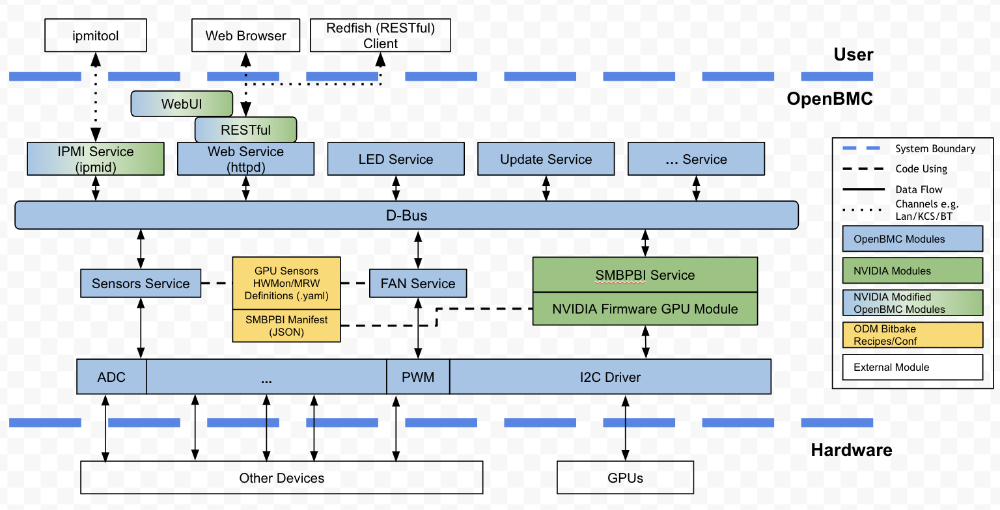

NVIDIA GPUs, along with NVSwitch and the baseboard, are compatible with the SMBPBI protocol via SMBus/PCIe. This compatibility allows the Baseboard Management Controller (BMC) to access detailed information from the GPUs. Consequently, it enables the BMC to offer out-of-band (OOB) management capabilities for GPUs to end users. Such functionalities encompass a range of information, including Field Replaceable Unit/Vital Product Data (FRU/VPD), telemetry data, system configuration, and firmware details.

### Data Categories for Device Management

For effective device management, data from devices are organized into several key categories. Each category serves a specific purpose and aids in understanding and managing the device more effectively.

### Categories

#### 1. Information
- **Static Info**: Data that remains constant post-production. Examples include:
  - Field Replaceable Unit (FRU) Details
  - Part Number (PN)
  - Serial Number (SN)
  - Vendor ID (VID)
  - Device ID (DID)

- **Dynamic Info**: Data reflecting the current status, useful for monitoring. This includes:
  - Error Status
  - Temperature
  - Power Consumption
  - Voltage

#### 2. Configuration
Data that can be altered to control the device's operational status. This includes:
- Enable/Disable functions
- Power Control Settings
- Policy Configurations

#### 3. Firmware
Information regarding the device's firmware, such as:
- Firmware Version
- Update History

#### 4. Event
Concerns the device's event log and logging logic. Note:
- Currently, no event or log data is provided through the SMBPBI protocol.

### Platform Enablement

#### Pre-requisites
To integrate this module into the target BMC firmware, each platform needs to configure properties supported, hardware configurations, nlink mapping etc. into json files.

- Each platform needs to create the following configuration files :
        - manifest json
        - profile json
        - properties json

More details about json are present in next section.

#### Enable SMBPBI Telemetry on new platform
Following bitbake recipies changes and configration files are required to be installed to Linux *${datadir}/gpuoob* folder.

**Bitbake recipes to enable**
    - **Picking services** - The following relevant modules need to be included in the platform build in `obmc-phosphor-image.bbappend`
    
```
    OBMC_IMAGE_EXTRA_INSTALL:append = "nvidia-gpuoob \
                                       nvidia-gpumgr \
                                    ...
```

Along with this `libgpuoob` requires three configuration files. The selection of these files depends on the type of connected baseboard and the operational interface (i2c/pcie).

##### Manifest & Configuration Files Selection for Platform Enablement 

###### Configuration Files

###### 1. Manifest File
- **Purpose**: Represents the physical connections and the number of devices for each baseboard type.
- **Variants**: One for each interface (pcie and i2c), specific to a baseboard type.
- **Example**: `oob_manifest_<interface_type>_<baseboard_type>.json`

To define the SMBPBI device I2C informations. The HAL for this module. To describe a SMBPBI device, *I2C bus number*, *slave address (7-bit)* and *MUX info* must be present as below,
``` json
{
  "version": 0.1,
  "gpu": [ <= device type name
    {
      "i2c": { <= Index 0
        "bus": "0x03", <= I2C bus number
        "slave_addr": "0x4c", <= I2C slave address (7-bit)
        "mux": null <= MUX info, a byte array used for switching the MUX. 'null' for no MUX
      }
    },
    {
      "i2c": { <= Index 1
        "bus": "0x02",
        "slave_addr": "0x4c",
        "mux": null
      }
    }
  ]
}
```

###### 2. Properties File
- **Purpose**: Contains all the properties and their accessors.
- **Variants**: One file per baseboard type.
- **Example**: `oob_properties_<baseboard_type>.json`

This file describe all the properties to be supported on the target platform. Only those in this file will be accessible regardless of the APIs in *gpu_api.hpp* or SMBPBI hardware capabilities. The typical structure is as below,
``` json
{
  "version" : 0.1,
  "properties" : [
    {
      "name" : "pcie.vendorId", <= property name, used for external queries
      "unit" : "id", <= property value type and unit. Check *data_info.hpp* for all
      "category" : "static", <= property category. 'static' properties will be cached once
      "accessor" : "opcode.vendorId", <= service token by SMBPBI. Check *smbpbi.cpp* for all
      "description" : "PCIe VendorID", <= description
    }
  ]
}
```

**Sensor Thresholds**
Some of the sensors need thresholds defined per type of the sensors, mainly redfish and ipmi.
There could be two ways of configuring the sensor thresholds

- **Statically defined in HMC Code**
These are implemented in a module specific manner. For e.g., GPU Manager will have a "static" property defined with value in its properties json.

``` json
{
  "name": "fpga.thermal.temperature.max",
  "unit": "degreeC",
  "category": "static",
  "value": "255",
  "accessor": "fpga.static.temperatureMax",
  "description": "FPGA max temperature"
}
```

- **Dynamically fetched from devices**
These are implemented as respective commands - as captured in Telemetry Catalog/Redfish Supplement, by the respective modules. For e.g., GPU Manager will implement the threshold property mapping to one SMBPBI opcode and arguments combination and makes it available on dbus.

``` json
{
  "name": "gpu.thermal.temperature.shutdownTemperatureTLimit",
  "unit": "degreeC",
  "category": "configuration",
  "refresh_interval": "BUCKET_2",
  "priority": 2,
  "accessor": "gpu.opcode.thermal.shutdownTemperatureTLimit",
  "description": "get GPU shutdown temperature (T.Limit)"
}
```

Implementation -

```
{"gpu.opcode.thermal.shutdownTemperatureTLimit",
     {opcodeAccessAPI(OpCode::readThermalParameters,
                      Arg1::gpuShutdownTemperatureTLimit, 0)}},
```

###### 3. Profile File
- **Purpose**: Contains static information specific to a baseboard type, like nvlink mapping.
- **Variants**: One file per baseboard type.
- **Example**: `oob_profile_<baseboard_type>.json`

profile configuration having platform topology details like nvlinkTopology for nvswitch and gpu, pcieTopology for upstream and downstream ports, GPMTopology
etc. Also it carries platform component naming configuration eg serviceLabel configuration for HGX H100.

```
"pcieTopology": {
		"pcieSwitchTopology": [{
			"up": [{
				"type": "pcieswitch",
				"id": 0
			}],
			"down": [{
					"type": "nvswitch",
					"id": 0
				},
				{
					"type": "nvswitch",
					"id": 1
				},
				{
					"type": "nvswitch",
					"id": 2
				},
				{
					"type": "nvswitch",
					"id": 3
				}
			]
		}],
		"pcieRetimerTopology": [{
				"up": [{
					"type": "pcieretimer",
					"id": 0
				}],
				"down": [{
					"type": "gpu",
					"id": 0
				}]
			},
			{
				"up": [{
					"type": "pcieretimer",
					"id": 1
				}],
				"down": [{
					"type": "gpu",
					"id": 1
				}]
			},
                ],
}
```

#### Dependencies

The configuration files are specific to the active interface and the connected baseboard type, and therefore depend on two entities:
- `nvidia-gpu-oob-recovery`: Determines the active interface (i2c or pcie).
- `entity-manager`: Identifies the connected baseboard type.
- `smbus library`:
- `shared memory library`:

##### Examples of Baseboard Types
- HGX H100

[CONFIGURE_FLAGS](#tablebuildmode) are defined as below, any combinations of them are valid,
<a id="tablebuildmode"></a>
 
Mode | `${CONFIGURE_FLAGS}` | Description
--- | --- | ---
Sandbox | `--enable-sandbox-mode` | Build this module for the host CPU architecture, so as to develop & debug & verify without burning code into BMC with real hardware.
Default Debug Log Level | `--enable-debug-log=n` | Log level `n` definition is [here](#tabledbgloglevel).
SDK | `--host=x86_64`<br>or<br>(SDK-defined options) | Verify if this module can be built into target BMC firmware SDK with cross-compiler toolchains.<br>SDK Build Environment needs to be exported first, e.g. for OpenBMC SDK (assume installed at */usr/local/oecore-x86_64*),<br>**$ source /usr/local/oecore-x86_64/environment-setup-armv6-openbmc-linux-gnueabi** <sup>1</sup>
Production | (user-defined options) | Build this module into target BMC firmware for production release. The options depend on the target BMC firmware requirement.

#### Enablement for new device
- Update all the json configuration files.
- Enable the new backend API and publish the same on dbus using the PDI defined earlier.
```
GPUProcessorOperatingConfig::GPUProcessorOperatingConfig(sdbusplus::asio::object_server& server, const std::string& ifPath,
const int& id)
{ .....
        maxSpeedPropertySupported =
                isPropertySupported(devId, oob_api::apis::GPUGetMaxProgrammableClock,
                                                        oob_api::data_type::IsInt32);
        if (maxSpeedPropertySupported)
        {
                iface->register_property("MaxSpeed", static_cast<uint32_t>(0));
        }
        .....
}
```

- To refresh a property in loop register a callback function that gets invoked with every update
```
void GPUProcessorOperatingConfig::registerCallbacks()
{
        if (maxSpeedPropertySupported)
        {
                // Max clock speed
                registerDynamicDBUSPropertyCb(iface, devId, "MaxSpeed",
                        oob_api::apis::GPUGetMaxProgrammableClock,
                        oob_api::data_type::IsInt32, maxSpeedErr);
        }
}
```

#### Enablement for supported device
- For adding new device which is already supported , need to update the configurations files only.

## DBus APIs

### Numeric Sensor
- The reading of Numeric sensor is exposed to D-Bus via xyz.openbmc_project.Sensor.Value PDI
- The table of supported numeric sensor base units


| GpuMgr Sensor Base Unit                  | D-Bus NameSpace                          | Redfish Reading Type |                         Devices                          |
| ---------------------------------------- | ---------------------------------------- | -------------------- | ---------------------------------------------------------|
| xyz.openbmc_project.Sensor.Unit.DegreesC | /xyz/openbmc_project/sensors/temperature | Temperature          | GPU, PCIeRetimer, NVSwitch, PCIeSwitch, FPGA, HGX_Chassis|
| xyz.openbmc_project.Sensor.Unit.Volts    | /xyz/openbmc_project/sensors/voltage     | Voltage              | GPU                                                      |
| xyz.openbmc_project.Sensor.Unit.Pascals  | /xyz/openbmc_project/sensors/altitude    | Altitude             | HGX_Chassis                                              |
| xyz.openbmc_project.Sensor.Unit.Watts    | /xyz/openbmc_project/sensors/power       | Power                | GPU, HGX_Chassis                                         |
| xyz.openbmc_project.Sensor.Unit.Joules   | /xyz/openbmc_project/sensors/energy      | EnergyJoules         | GPU                                                      |

### State Sensor

| PDI                                                   | properties               | Note           |
| ----------------------------------------------------- | ------------------------ | -------------- |
| xyz.openbmc_project.Inventory.Item.Port               | linkState and linkStatus | downstream PDI |
| xyz.openbmc_projcet.State.Decorator.Health            | health                   | downstream PDI |

### Updating Association PDI

- All sensors paths for a particular device are associated with its parent object with forward association "all_sensors" from parent object path,
- Similarly we have forward associations like "all_processors", "all_memory", "all_sensors", "health_rollup" etc.

e.g. Below is associations from GPU chassis path.
```
root@hgx:~# busctl get-property xyz.openbmc_project.GpuMgr /xyz/openbmc_project/inventory/system/chassis/HGX_GPU_SXM_1 xyz.openbmc_project.Association.Definitions Associations -j
{
        "type" : "a(sss)",
        "data" : [
                [
                        "all_processors",
                        "",
                        "/xyz/openbmc_project/inventory/system/processors/GPU_SXM_1"
                ],
                [
                        "all_processors",
                        "parent_chassis",
                        "/xyz/openbmc_project/inventory/system/processors/GPU_SXM_1"
                ],
                [
                        "all_memory",
                        "parent_chassis",
                        "/xyz/openbmc_project/inventory/system/memory/GPU_SXM_1_DRAM_0"
                ],
                [
                        "pciedevice",
                        "chassis",
                        "/xyz/openbmc_project/inventory/system/chassis/HGX_GPU_SXM_1/PCIeDevices/GPU_SXM_1"
                ],
                [
                        "all_sensors",
                        "chassis",
                        "/xyz/openbmc_project/sensors/temperature/HGX_GPU_SXM_1_TEMP_0"
                ],
                [
                        "all_sensors",
                        "chassis",
                        "/xyz/openbmc_project/sensors/temperature/HGX_GPU_SXM_1_TEMP_1"
                ],
                [
                        "all_sensors",
                        "chassis",
                        "/xyz/openbmc_project/sensors/temperature/HGX_GPU_SXM_1_DRAM_0_Temp_0"
                ],
                [
                        "all_sensors",
                        "chassis",
                        "/xyz/openbmc_project/sensors/voltage/HGX_GPU_SXM_1_Voltage_0"
                ],
                [
                        "all_sensors",
                        "chassis",
                        "/xyz/openbmc_project/sensors/power/HGX_GPU_SXM_1_Power_0"
                ],
                [
                        "all_sensors",
                        "chassis",
                        "/xyz/openbmc_project/sensors/energy/HGX_GPU_SXM_1_Energy_0"
                ],
                [
                        "all_sensors",
                        "chassis",
                        "/xyz/openbmc_project/sensors/power/HGX_GPU_SXM_1_DRAM_0_Power_0"
                ],
                [
                        "parent_chassis",
                        "all_chassis",
                        "/xyz/openbmc_project/inventory/system/chassis/HGX_Chassis_0"
                ],
                [
                        "health_rollup",
                        "",
                        "/xyz/openbmc_project/inventory/system/chassis/HGX_GPU_SXM_1/PCIeDevices/GPU_SXM_1"
                ],
                [
                        "health_rollup",
                        "",
                        "/xyz/openbmc_project/inventory/system/fabrics/HGX_NVLinkFabric_0/Endpoints/GPU_SXM_1"
                ],
                [
                        "health_rollup",
                        "",
                        "/xyz/openbmc_project/inventory/system/fabrics/HGX_PCIeRetimerTopology_0/Endpoints/GPU_SXM_1"
                ],
                [
                        "health_rollup",
                        "",
                        "/xyz/openbmc_project/inventory/system/processors/GPU_SXM_1"
                ],
                [
                        "health_rollup",
                        "",
                        "/xyz/openbmc_project/inventory/system/chassis/HGX_PCIeRetimer_0"
                ],
                [
                        "health_rollup",
                        "",
                        "/xyz/openbmc_project/inventory/system/fabrics/HGX_PCIeRetimerTopology_0/Switches/PCIeRetimer_0"
                ],
                [
                        "health_rollup",
                        "",
                        "/xyz/openbmc_project/inventory/system/memory/GPU_SXM_1_DRAM_0"
                ],
                [
                        "health_rollup",
                        "",
                        "/xyz/openbmc_project/inventory/system/chassis/HGX_ERoT_GPU_SXM_1"
                ]
        ]
}
```
## ### Redfish APIs

### Numeric Sensor

- Numeric sensors from GpuMgr are exposed to the RF URL /redfish/v1/Chassis/<$ChassisID>/Sensors/<$SensorName> by default
  - The ChassisID is from the Association property of xyz.openbmc_project.Association.Definition PDI
  - The sensorName is from D-Bus object path where the xyz.openbmc_project.Sensor.Value PDI is.
- The upstream bmcweb has implementation to expose D-Bus sensor to RF API for the D-Bus path with sensor.value and Association.Definition PDIs.

| Redfish Property Name | Description                                                      | backend PDI                                                          |
| --------------------- | ---------------------------------------------------------------- | -------------------------------------------------------------------- |
| Name                  | The Sensor name                                                  | The leaf of D-Bus path where xyz.openbmc_project.Sensor.Value PDI is |
| Reading               | Reading is from the response of smbpbi command                   | The value property of xyz.openbmc_project.Sensor.Value               |
| ReadingType           | According to the base unit field of numeric sensor PDR           | The unit property of xyz.openbmc_project.Sensor.Value                |

### State Sensor

- All of RF API for gpu manager state sensor are platform specific.

### The steps needed by Developer for unsupported state sensor

## Low level Design

### SMBPBI Service Module

This Service is running as an OpenBMC service to provide the interface for NVIDIA Firmware GPU Module to work with OpenBMC D-Bus channel. It’s under OpenBMC systemd (Reference: https://github.com/openbmc/docs/blob/master/openbmc-systemd.md) management.

```
+----------+     +---------+     +----------------+
| Pass-thru |    | Events  |     | RESTful Request|
| Request   |    +---------+     | / Response     |
| / Response|        |           +----------------+
+-------+---+        |                   |
        |            |                   |
    +---V------------V-------------------V-+
    |              D-Bus                   |
    +----------------^---------------------+
                     |
                     |
                D-Bus    
                Objects  
                     |
                     |
        +------------v--------------+
        |    SMBPBI Service         |
        +---------------------------+
                     |
                     | GPU OOB APIs
                     |
        +------------v-----------------+
        |  NVIDIA Firmware GPU Module  |
        +------------------------------+
```

#### Process Flow
On startup, the Service creates all GPU related D-Bus objects and interfaces, register service execution method, signal handlers and D-Bus event handlers. During running, it handles all incoming RESTful requests and D-Bus events and calls corresponding NVIDIA FW GPU Module APIs to fulfill them.

```
                            +------------+
                            |            | <---------- create Dbus objects
                            |   Init     | <---------- create server interfaces
                            |            | <---------- register execution method/ signal handlers
                            |            | <---------- register Event Handlers
                            |            |
                            +----+-------+
                                 |
                                 v
                            +-------------------+
      IPMI req  ----------->|   Running Loop    |
    Redfish req ----------->|                   |
other restful req --------->|  +------------+   |                +-------------------------+
HOST DC power on ---------->|  | Handlers   |<------------------>| NVIDIA FW GPU Module    |
HOST DC power off --------->|  |            |   |                |                         |
   AC power on    --------->|  | Req/Event- |   |                |     +-------------+     |
                            |  | APIs Map   |   |                |     | GPU APIs    |     |
                            |  +------------+   |                |     +-------------+     |
                            |                   |                +-------------------------+
                            +---------+---------+
                                 |
                                 v
                            +-----------+
                            |Termination|
                            +-----------+

```

#### Objects & Interfaces
These D-Bus service will be created on initialization,
| D-Bus Service Name                  | Description                     |
|-------------------------------------|---------------------------------|
| xyz.openbmc_project.GpuMgr          | GPU Management Service          |
| xyz.openbmc_project.GpuOobRecovery  | nvidia-gpu-oob-recovery.service |

These object paths will be created on initialization
| Path                              | Description |
|-----------------------------------|-------------|
| /xyz/openbmc_project/GpuMgr       | (TBD)       |

#### Requests & Events Handling
These requests and events will be handled,
| Request/Event             | Action                         |
|---------------------------|--------------------------------|
| AC On                     | GPU_SnapshotRefresh* (Full)    |
| DC On                     | GPU_SnapshotRefresh* (Full)    |
| DC Off                    | Server Suspend                 |
| Query Request (normal)    | GPU_Get* (Normal Priority**)   |
| Query Request (Pass-Through) | GPU_Get* (High Priority**) |
| Config Request            | GPU_Set* (High Priority**)     |


### Interface Selection

##### Overview
The selection of the interface is primarily controlled by the recovery software module. 

##### Publication on D-Bus
- The selected interface is published on D-Bus by the recovery software module.
- It is shown as a string property named **"SMBPBIInterface"**.
- This property is exposed on the interface **"xyz.openbmc_project.GpuOobRecovery.Server"**.
- Possible values: `i2c` / `pcie`.

##### Default Behavior
- In the event of a failure where this interface is unavailable, `nvidia-gpu-manager` will default to the `pcie` interface.
- **Note**: `SMBPBIInterface` is not persistent. Therefore, on a reboot or restart of `nvidia-gpu-oob-recovery.service`, the `pcie` interface will be selected.

### Baseboard Selection

##### Overview
The selection of the baseboard is primarily driven by the configuration published by the entity manager.

##### Publication on D-Bus
- The entity manager exposes a string property named **"GPUBaseboardType"**.
- This property is available on the interface **"xyz.openbmc_project.Inventory.Decorator.Asset"**.
- It is updated based on the probe in entity manager configuration matching the **"MODEL"** field in the baseboard's FRU EEPROM.

##### Important Note
- `nvidia-gpu-manager` will fail to start if the `GPUBaseboardType` property is not available on D-Bus.

### NVIDIA Firmware GPU Module
#### Overview

This section introduces the **NVIDIA Firmware GPU Module**, a firmware module that enables access to GPU information and supports the SMBPBI protocol. It is distributed as Linux libraries to facilitate GPU Out-Of-Band (OOB) management capabilities for upper layer programs.

#### Key Features

##### Hardware Abstraction Layer (Manifest)
- The Module includes a hardware abstraction layer, also known as the Manifest.
- This layer allows support for various server hardware designs under the same distribution.

##### Request Priority Handling
- It is designed to handle various kinds of data access requirements through Request Priority handling.

#### Functionalities of the Module
- **Board Level Manifest of GPU SMBus Map** : Defines the mapping of GPUs on the system's SMBus.
- **GPU Data API Layer** : Provides an interface for accessing GPU data.
- **Data Snapshot for Each GPU** : Allows taking snapshots of data specific to each GPU.
- **Pass-through Mode GPU Access** : Enables direct access to GPUs in a pass-through mode.
- **Request Dispatcher with Data Accessor for Each SMBus with GPUs** : Manages requests and accesses data for each GPU on the SMBus.
- **SMBPBI Protocol Layer** : Implements the SMBPBI protocol for communication and data transfer.

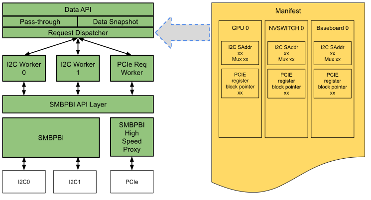

### Manifest
It’s a JSON based inventory configuration for GPUs, NVSWITCHes and Baseboard along with the access details in a server. It maps the device index (0-based) to I2C bus number (0-based) and slave address (7-bit), and also describe the MUX info if exists. It also specifies the PCIe register block pointer per device. It abstracts the hardware design to the Module internal logic, to give more feasibility and flexibility to the Module to be integrated into the BMCs on customer server products.

### Request Priority
A priority logic is imported to support different types of GPU data access requests such as,

- Routine Information Polling
- Pass-through requests
- Configuration requests

Priority is represented by numbers, the bigger the higher. The table below addresses the details,

#### Priority & Request Map

| Priority | Request Type            | Description                                           |
|----------|-------------------------|-------------------------------------------------------|
| 0        | Stale Priority (T.P.)   |                                                       |
| 1        | Normal Priority (N.P.)  | SnapshotRefresh                                       |
| 2        | Medium Priority (M.P.)  |                                                       |
| 3        | High Priority (H.P.)    | Pass-through, Configuration, Events (AC On, DC On/Off)|
| 4        | System Priority (S.P.)  |                                                       |

#### Data API Layer

This layer exports a set of APIs for device data access. Every APIs accept device Index as the first parameter. Request Priority will be assigned to each API calling in this layer.

It supports two types of data access mode,
- Data Snapshot,
    - Static/FW Information: Refresh when AC on / DC on by default (and by OEM defined events).
    - Dynamic Information: Refresh timely (interval is 1sec/GPU, can be OEM defined).
    - Firmware Information: e.g. Firmware Version.

- Pass-through,
    - GPU Direct Access requests
    - GPU Configuration requests

#### Data Snapshot
Data Snapshots provides a format to present device data to upper level processes. It’s basically a data buffer to cache all the device data which is refreshed timely or on-demand based on the date categories. The timely refresh requests take normal priority (N.P.) and the on-demand requests take high priority (H.P.). The refresh timer will be initialized and be started on the Module library loading.

| Refresh Type | Triggers             | Configurable  | Request Priority  |
|--------------|----------------------|---------------|-------------------|
| Timely       | SW Timer             | Timer interval| Normal Priority   |
| On-demand    | AC on, DC on, Other OEM events | No | High Priority     |

The data format supports,
- C Structures
- RESTful APIs
- ...

The data includes,

| GPU | VID  | DID  | SVID | SDID | Temp. | Power |
|-----|------|------|------|------|-------|-------|
| 0   | 10DEh| 25E8h| xxxxh| xxxxh| 52C   | 250W  |
| 1   | 10DEh| 25E8h| xxxxh| xxxxh| 30C   | 100W  |
| ... | ...  | ...  | ...  | ...  | ...   | ...   |

#### API Behavior at Initialization

GPU OOB library will setup snapshot buffers for all the properties per device and triggers parallel threads to refresh the properties, one thread per refresh interval bucket, during library initialization.

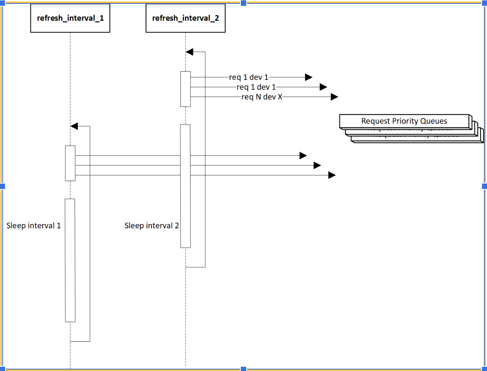

Note: Depending on the priority and number of pending requests, it takes a while for all properties to get refreshed once on the snapshot buffer. Till then, any caller reading from snapshot  shall expect a specific rc as defined in Error Handling section along with the expected flow.

#### Pass-through
This data access mode provides a way to directly communicate with GPU. All requests in this mode will be processed immediately if no active transaction, or right after the active transaction completed. The requests take high priority (H.P.).


#### Data API List
A set of APIs are defined to provide data access from logic point of view. Providing,
- Data Get,
    - Return data structure based on data category.
- Data Set,
    - Individual data change.
- Access Mode Support: Snapshot, Pass-through.

#### GPU Data Structures
Data structures are defined in JSON format in this document to reduce the implementation dependency. As the data could be represented in program languages like C/C++ for libraries, or in D-Bus object, etc.

#### Request Dispatcher
Any data access request from GPU API Layer will be redirected to the Request Dispatcher. This function manages Data Accessors based on the Manifest, and distribute a request to a Data Accessor based on the request priority and the GPU ID. 

Internally, it maintains a list of Worker (Data Accessor) ID and GPU ID mappings for a faster requests distribution. This list will be built on the Module initialization, and will be rebuilt on DC on.

#### Data Accessor
Data Accessor is called “Worker”, which is an execution thread helping with parallelizing the request processing for efficient use of the underlying bus. There are two different kinds of assessors - one for serializing all data transactions on a single I2C bus and the other one is for batch processing of PCIe transactions. 

#### I2C Data Accessor
The Module may start multiple I2C Data Accessor workers according to the Manifest to serve every I2C bus with GPUs. Each of them maintains a queue with priority support for all incoming requests. Each request is called “transaction”. And the processing transaction is called “the active transaction” and it will block the I2C bus it is requesting to. To avoid the bus being blocked forever due any code bug or any unexpected code state, the bus will be unblocked on a protection timer timeout. The interval can be configured in the Module configuration during code building, by default it’s 200 msec.

Some details here,
- Transaction,
Each transaction is a complete SMBPBI request/response loop. Because SMBPBI opcode requests don't support being interrupted. It’ll start over on any interruption.

- Insertion Position Searching based on Request Priority,
The new request priority higher the position is nearer the front of the queue. But the active transaction will take the highest priority and no new request will be inserted before it, as it owns the bus before it responds.

The logic flow for Request Dispatcher & I2C Data Accessor is as below,

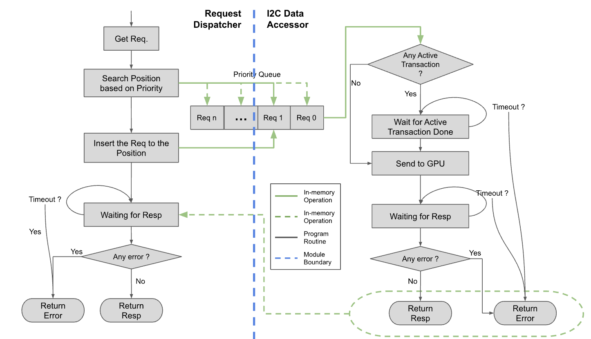

#### PCIe Data Accessors

PCIe Data Accessors consists of two worker threads that take care of batch processing the SMBPBI high speed proxy transactions over PCIe. One of the workers is called “PCIe Transaction Handler” and the other is “PCIe Interrupt Handler”. As per the SMBPBI High Speed Proxy Specification smbpbi request and response is separated with the implementation of interrupts on proxy server. There can be multiple high speed proxy transactions running SMPBI requests targeting different inferiors, initiated before receiving the completion of previous high speed proxy transactions.
Noting that a high speed proxy transaction is not equivalent to a single SMBPBI transaction, the two PCIe data accessors handle orchestrating SMBPBI transactions over high speed proxy transactions.

To achieve the concurrent transactions, the two worker threads share multiple priority queues - each queue corresponding to one inferior(GPU/NVSWITCH/Baseboard) as defined by the manifest.  Additionally each queue maintains a request state to coordinate the transaction handling between transaction handler and interrupt handler - with following states defined
- REQ_READY
- REQ_IN_PROGRESS
- REQ_DONE
- RESP_READY

Following is the logical view of the queues maintained between PCIe Data Accessors

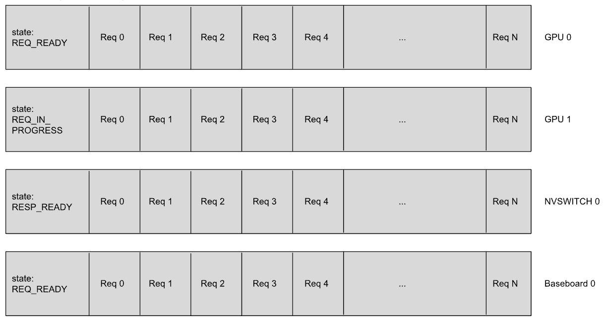

#### PCIe Transaction Handler
PCIe Transaction Handler processes the shared priority request queues and initiates the SMBPBI high speed proxy transactions using SMBPBI Protocol Layer targeting SMBPBI high speed proxy. To achieve the concurrency requirements, PCIe Transaction Handler would run periodically and gather all the requests from each of the queues in REQ_READY state and prepare a batch of requests to be sent over a high speed proxy. It also marks each of the queues from which the batch is made up of as REQ_IN_PROGRESS. This request batch is a priority queue in itself, containing pointers to the requests picked up in the order of their priority. At any point in time we may need a maximum number equal to the number of inferiors - so the size of this request batch queue will be equal to the number of inferiors.

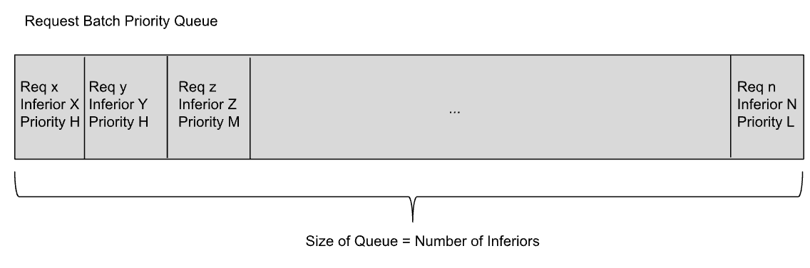

After preparing the batch queue, the PCIe Requester picks up the request and sends the high speed proxy transaction. Finally the relevant shared queue is marked as REQ_DONE.

After request processing, the transaction handler moves on to the response processing. It gathers all the requests from each of the shared queues in RESP_READY(note that transition from REQ_DONE to RESP_READY is handled by interrupt handler which is explained later in the document) state and prepares a batch of requests where the response is ready. This response batch is a priority queue in itself, containing pointers to the requests picked up in the order of their priority. At any point in time we may need a maximum number equal to the number of inferiors - so the size of this response batch queue will be equal to the number of inferiors.

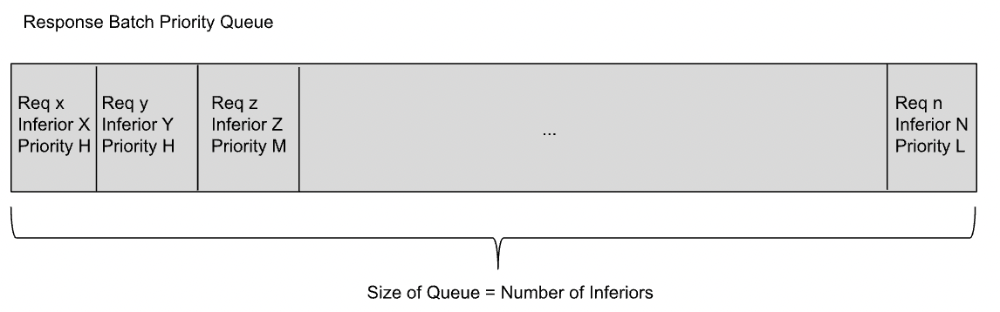

After preparing the batch queue, the transaction handler then gets all the relevant response status and data from the high speed proxy and updates the results in the buffer pointed to by the request item. At the end of processing the response, the responder updates the state of the relevant inferior queue as REQ_READY.

Following is the representation of the state transitions of the shared queues.

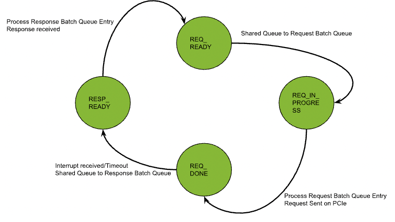

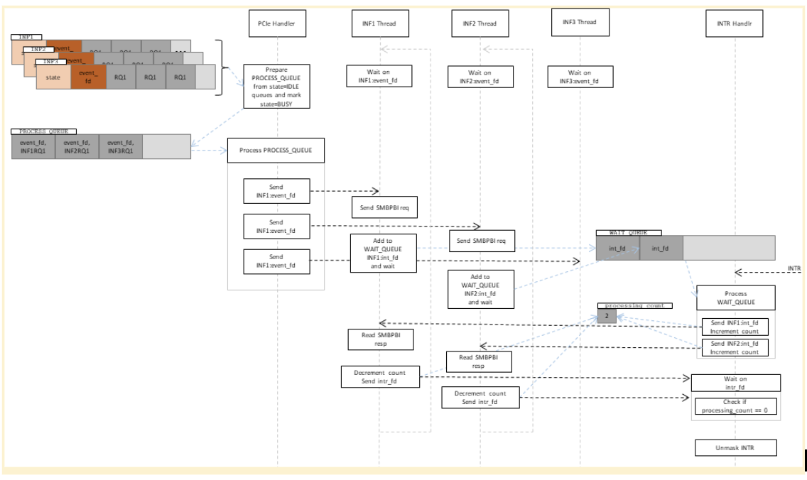

#### PCIe Interrupt Handler
PCIe Interrupt Handler processes the interrupts from PCIe high speed proxy server and decodes the interrupt to the corresponding inferior response on which there is a REQ_DONE request queue and marks the relevant shared queue as RESP_WAITING. 

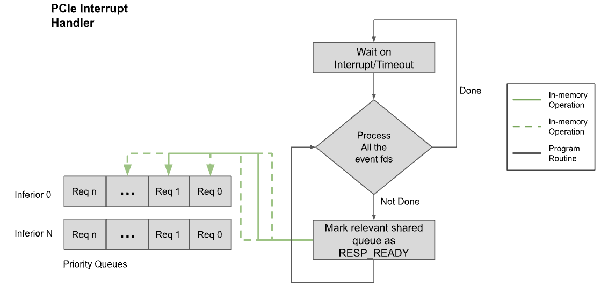

#### SMBPBI Protocol Layer
SMBPBI protocol defines the GPU data access logic and data format. This layer implements that protocol to provide raw SMBPBI APIs for upper layer programs to invoke.

SMBPBI provides below two set of methods to access GPU data,
SMBus Data Register Access
SMBPBI Opcode
Both sets of them will accept I2C bus number and device slave address as the parameter.

This layer will handle I2C bus access control, I2C raw data read/write, I2C status report, SMBPBI status report, SMBPBI logic, etc.

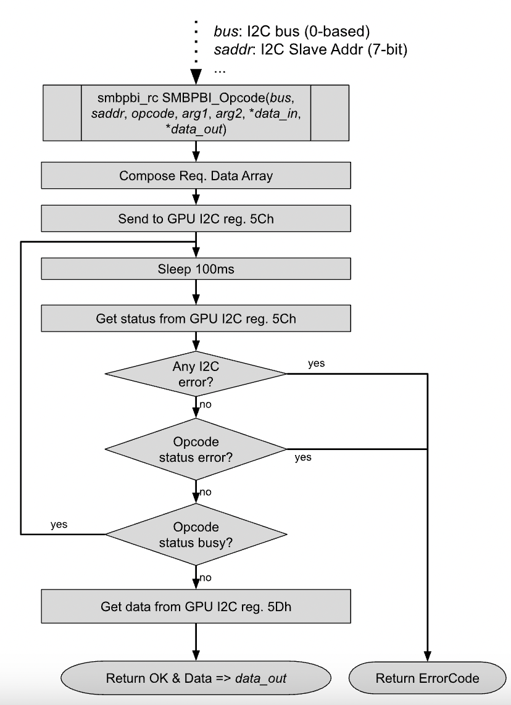

This layer also packages the raw SMBPBI APIs and SMBPBI access logics to provide logic level GPU data access for upper layers. It accepts GPU I2C information from upper layers and provides the data access for this GPU. It’s the layer to interpret the SMBPBI Manifest to locate the I2C bus and slave address of the target GPU and pass to the raw SMBPBI APIs. It also handles the I2C MUX switch if exists.

Example logic diagram of SMBPBI_Op_GetTemp API,

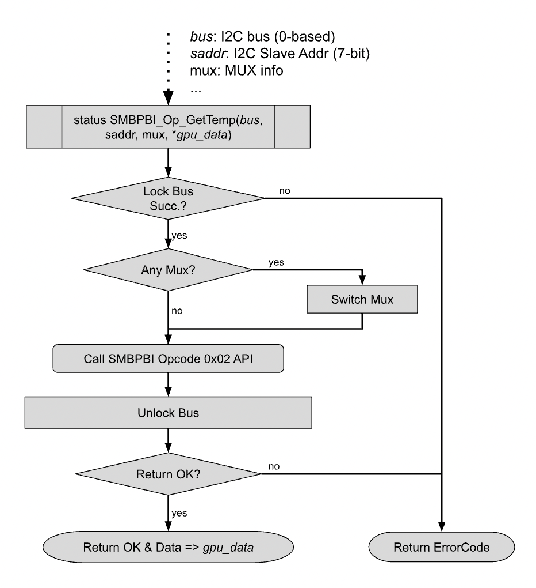

#### GPU APIs
##### Get/Set/Clear
This module provides Get, Set, and/or Clear APIs for every property if applicable.
 
Type | AccessMode | Timeout Compiler Macro (for Passthrough) | Default Value (ms)
--- | --- | --- | ---
Get | Snapshot/Passthrough | GPU_GETREQ_TIMEOUT_INTERVAL | 2000
Set | Passthrough | GPU_SETREQ_TIMEOUT_INTERVAL | 20000
Clear | Passthrough | GPU_SETREQ_TIMEOUT_INTERVAL | 20000
|
