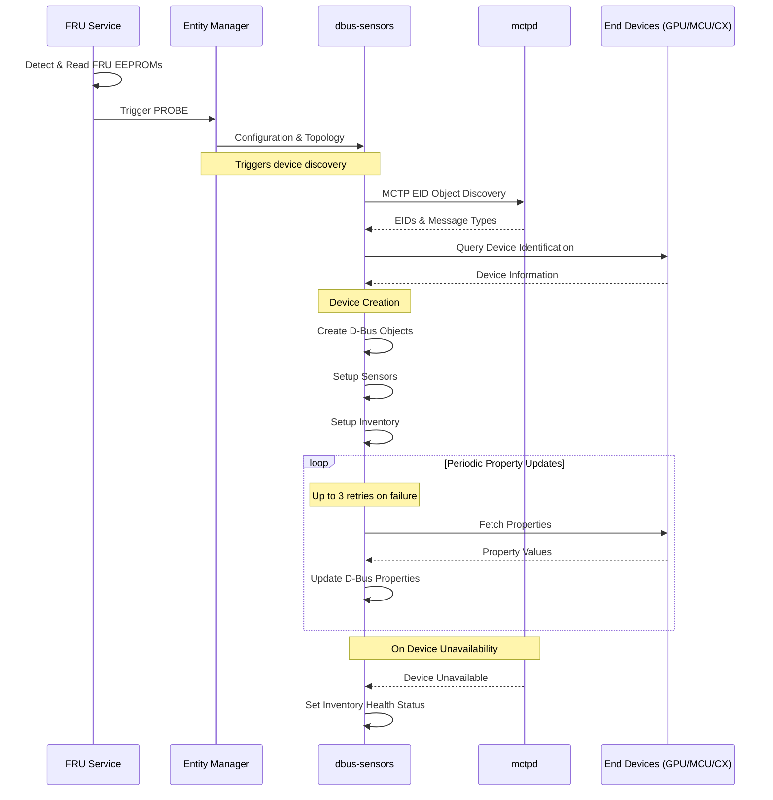
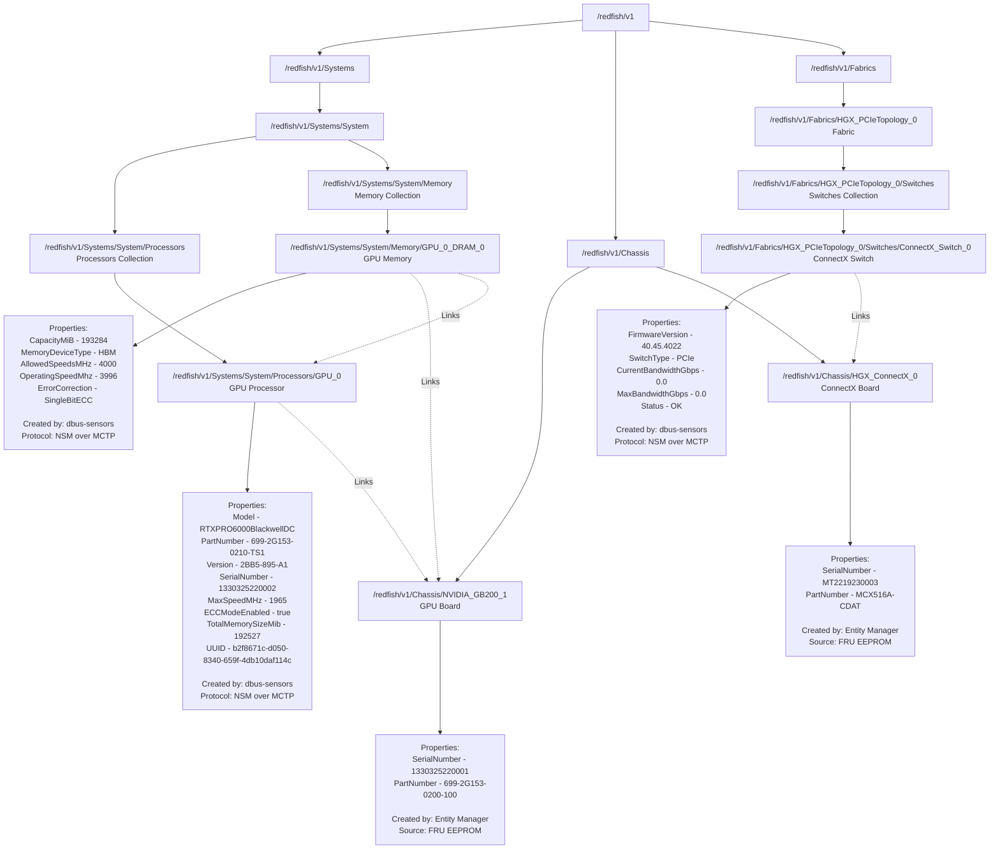

# Inventory Management Design Document

## Overview
This document describes the design of the inventory management system in dbus-sensors, which is responsible for managing device inventory information for NVIDIA devices (GPU, MCP, CX) using the NVIDIA System Management (NSM) protocol.

- Creation and management of D-Bus inventory objects for NVIDIA devices
- Implementation of NSM protocol communication for inventory property retrieval
- Exposure of device inventory information through D-Bus interfaces
- Support for multiple device types:
  - NVIDIA GPUs and its memory 
  - NVIDIA MCUs 
  - NVIDIA CX (ConnectX) devices

## Desingn Details

### System Flow



**Summary**: The system flow begins with FRU service detecting and reading FRU EEPROMs, which triggers Entity Manager to provide configuration and topology information to dbus-sensors. The dbus-sensors service then discovers NVIDIA devices through MCTP communication, queries device identification, creates corresponding D-Bus objects (sensors and inventory), and maintains periodic property updates with retry logic. Device health status is automatically managed when devices become unavailable.

## Inventory Update

- Inventory properties are refreshed immediately after device creation
- Up to 3 attempts are made in case of failures (NSM API retrun code RC=0 and CC=0 for success; any other code is considered failure)
- D-Bus properties are only populated after receiving a successful response
- If the endpoint goes offline, existing inventory properties are preserved and not removed

### Architecture Components

- **NvidiaDevice**:  
  Represents an individual NVIDIA device (GPU, MCU, CX, etc). Each device manages:
  - A set of `Sensor` objects (for telemetry, health, etc.)
  - A set of `Inventory` objects (for static/dynamic inventory properties)
  
  The device type determines which Platform Device Interface (PDI) will be used for D-Bus representation. The device handles its own inventory property fetching, sensor reading, and state management.

- **Inventory**:  
  For each `NvidiaDevice`, one or more inventory objects will be created and exposed on D-Bus using the appropriate interface. The primary interface for inventory properties is `xyz.openbmc_project.Inventory.Decorator.Asset`, which is used to represent asset-related information such as part number, serial number, and manufacturer. Additional inventory-related interfaces may be added as needed to represent other device attributes.

- **Chassis Association**:  
  Entity Manager (EM) is responsible for detecting FRU presence in each device board and creating the chassis objects using the `xyz.openbmc_project.Inventory.Item.Board` interface. dbus-sensors is responsible for creating the device types like GPU, Memory, Network Adaptor. 
  
  **Example**: For GPU boards, Entity Manager creates the chassis object using `xyz.openbmc_project.Inventory.Item.Board` interface, which maps to the GPU Chassis Object in Redfish (`/redfish/v1/Chassis/NVIDIA_GB200_GPU_0`). dbus-sensors creates the Processor instance by implementing `xyz.openbmc_project.Inventory.Item.Accelerator` which maps to the GPU Processor Object in Redfish (`/redfish/v1/Systems/System_0/Processors/GPU_0`). dbus-sensors uses the Entity Manager's board path as the parent path to create the association between the Processor and its containing GPU chassis, establishing the proper hierarchy for Redfish representation.

### D-Bus Associations

The following associations will be created to establish relationships between components. These are new associations that will be added to the PDI repository:

**GPU to Chassis Association**:
```bash
busctl get-property xyz.openbmc_project.GpuSensor /xyz/openbmc_project/inventory/NVIDIA_GB200_GPU_0 xyz.openbmc_project.Association.Definitions Associations
a(sss) 1 "parent_chassis" "all_processor" "/xyz/openbmc_project/inventory/system/board/NVIDIA_GB200_1/NVIDIA_GB200_GPU"
```
- Associates the GPU processor with its parent chassis board
- Forward association: `parent_chassis` (GPU → chassis)
- Reverse association: `all_processor` (chassis → all processors)

**GPU Memory to Processor Association**:
```bash
busctl get-property xyz.openbmc_project.GpuSensor /xyz/openbmc_project/inventory/NVIDIA_GB200_GPU_0_DRAM_0 xyz.openbmc_project.Association.Definitions Associations
a(sss) 1 "parent_processor" "all_memory" "/xyz/openbmc_project/inventory/NVIDIA_GB200_GPU_0"
```
- Associates the GPU memory with its parent GPU processor
- Forward association: `parent_processor` (memory → processor)
- Reverse association: `all_memory` (processor → all memory modules)


### Device to PDI Interface Mapping

| Device Type | D-Bus PDI Interface | Description |
|-------------|---------------------|-------------|
| GPU | `xyz.openbmc_project.Inventory.Item.Accelerator` | NVIDIA GPU processors |
| GPU Memory | `xyz.openbmc_project.Inventory.Item.Dimm` | GPU-attached memory modules (HBM) |
| ConnectX | `xyz.openbmc_project.Inventory.Item.NetworkInterface` | NVIDIA ConnectX network adapters |


### Redfish Model Diagram




## Redfish Schema and APIs

1. **Processor Management**
   ```
   GET /redfish/v1/Systems/{system}/Processors
   GET /redfish/v1/Systems/{system}/Processors/{processor}
   ```

   **Mock Response for GET /redfish/v1/Systems/{system}/Processors:**
   ```json
   {
     "@odata.id": "/redfish/v1/Systems/System/Processors",
     "@odata.type": "#ProcessorCollection.ProcessorCollection",
     "Name": "Processor Collection",
     "Members@odata.count": 1,
     "Members": [
       {
         "@odata.id": "/redfish/v1/Systems/System/Processors/GPU_0"
       }
     ]
   }
   ```

   **Mock Response for GET /redfish/v1/Systems/{system}/Processors/{processor}:**
   ```json
   {
     "@odata.id": "/redfish/v1/Systems/System/Processors/GPU_0",
     "@odata.type": "#Processor.v1_20_0.Processor",
     "Id": "GPU_0",
     "Name": "Processor",
     "Model": "GB200",
     "Manufacturer": "NVIDIA",
     "PartNumber": "2941-891-A1",
     "SerialNumber": "1643224000594",
     "ProcessorType": "GPU",
     "MaxSpeedMHz": 1965,
     "MinSpeedMHz": 120,
     "TotalMemorySizeMiB": 192527,
     "MemorySummary": {
       "ECCModeEnabled": true
     },
     "Location": {
       "PartLocation": {
         "LocationType": "Embedded",
         "ServiceLabel": "GPU_0"
       },
       "PartLocationContext": "NVIDIA_GB200_1"
     },
     "Links": {
       "Chassis": {
         "@odata.id": "/redfish/v1/Chassis/NVIDIA_GB200_1"
       },
       "Memory": [
         {
           "@odata.id": "/redfish/v1/Systems/System/Memory/GPU_0_DRAM_0"
         }
       ]
     },
     "Status": {
       "Health": "OK",
       "HealthRollup": "OK",
       "State": "Enabled"
     },
     "UUID": "b2f8671c-d050-8340-659f-4db10daf114c",
     "Version": "2941-891-A1"
   }
   ```

### Processor Property Mapping

| Redfish Property                        | D-Bus Interface/Property                                      | Status |
|------------------------------------------|--------------------------------------------------------------|--------|
| UUID                                    | xyz.openbmc_project.Common.UUID                              | Existing |
| MaxSpeedMhz                             | xyz.openbmc_project.Inventory.Item.Accelerator (MaxSpeedMHz) | New |
| SerialNumber                            | xyz.openbmc_project.Inventory.Decorator.Asset (SerialNumber) | Existing |
| Model                                   | xyz.openbmc_project.Inventory.Decorator.Asset (Model)        | Existing |
| Manufacturer                            | xyz.openbmc_project.Inventory.Decorator.Asset (Manufacturer) | Existing |
| PartNumber                              | xyz.openbmc_project.Inventory.Decorator.Asset (PartNumber)   | Existing |
| Version                                 | xyz.openbmc_project.Inventory.Decorator.Revision (Version)   | Existing |
| Location.PartLocation.ServiceLabel       | xyz.openbmc_project.Inventory.Decorator.LocationCode (ServiceLabel) | Existing |

2. **Memory Management**
   ```
   GET /redfish/v1/Systems/{system}/Memory
   GET /redfish/v1/Systems/{system}/Memory/{memory}
   GET /redfish/v1/Systems/{system}/Memory/{memory}/MemoryMetrics
   ```

   **Mock Response for GET /redfish/v1/Systems/{system}/Memory/{memory}:**
   ```json
   {
     "@odata.id": "/redfish/v1/Systems/System/Memory/GPU_0_DRAM_0",
     "@odata.type": "#Memory.v1_20_0.Memory",
     "AllowedSpeedsMHz": [
       4000,
       4000
     ],
     "CapacityMiB": 193284,
     "ErrorCorrection": "SingleBitECC",
     "EnvironmentMetrics": {
       "@odata.id": "/redfish/v1/Systems/System/Memory/GPU_0_DRAM_0/EnvironmentMetrics"
     },
     "ErrorCorrection": "SingleBitECC",
     "Id": "GPU_0_DRAM_0",
     "Links": {
       "Chassis": {
         "@odata.id": "/redfish/v1/Chassis/HGX_GPU_0"
       }
     },
     "Processors": [
       {
         "@odata.id": "/redfish/v1/Systems/System/Processors/GPU_0"
       }
     ],
     "Location": {
       "PartLocation": {
         "LocationType": "Embedded",
         "ServiceLabel": "GPU_0_DRAM_0"
       },
       "PartLocationContext": "NVIDIA_GB200_1"
     },
     "MemoryDeviceType": "HBM",
     "MemoryType": "DRAM",
     "Metrics": {
       "@odata.id": "/redfish/v1/Systems/System/Memory/GPU_0_DRAM_0/MemoryMetrics"
     },
     "Name": "DIMM Slot",
     "OperatingSpeedMhz": 3996,
     "Status": {
       "Conditions": [],
       "Health": "OK",
       "HealthRollup": "OK",
       "State": "Enabled"
     }
   }
   ```

### ConnectX Management
   ```
   GET /redfish/v1/Fabrics/{fabric}/Switches/{switch}
   GET /redfish/v1/Fabrics/{fabric}/Switches/{switch}/Ports
   GET /redfish/v1/Fabrics/{fabric}/Switches/{switch}/SwitchMetrics
   ```

   **Mock Response for GET /redfish/v1/Fabrics/{fabric}/Switches/{switch}:**
   ```json
   {
     "@odata.id": "/redfish/v1/Fabrics/HGX_PCIeTopology_4/Switches/ConnectX_Switch_4",
     "@odata.type": "#Switch.v1_8_0.Switch",
     "Actions": {
       "#Switch.Reset": {
         "ResetType@Redfish.AllowableValues": [
           "ForceRestart"
         ],
         "target": "/redfish/v1/Fabrics/HGX_PCIeTopology_4/Switches/ConnectX_Switch_4/Actions/Switch.Reset"
       }
     },
     "CurrentBandwidthGbps": 0.0,
     "Enabled": false,
     "FirmwareVersion": "40.45.4022",
     "Id": "ConnectX_Switch_4",
     "Links": {
       "Chassis": {
         "@odata.id": "/redfish/v1/Chassis/HGX_ConnectX_4"
       },
       "Endpoints": [
         {
           "@odata.id": "/redfish/v1/Fabrics/HGX_PCIeTopology_4/Endpoints/GPU_4"
         }
       ],
       "PCIeDevice": {
         "@odata.id": "/redfish/v1/Chassis/HGX_ConnectX_4/PCIeDevices/ConnectX_4"
       }
     },
     "MaxBandwidthGbps": 0.0,
     "Metrics": {
       "@odata.id": "/redfish/v1/Fabrics/HGX_PCIeTopology_4/Switches/ConnectX_Switch_4/SwitchMetrics"
     },
     "Name": "ConnectX_Switch_4 Resource",
     "Oem": {
       "Nvidia": {
         "@odata.type": "#NvidiaSwitch.v1_4_0.NvidiaSwitch",
         "DeviceId": "0",
         "PCIeReferenceClockEnabled": false,
         "VendorId": "0"
       }
     },
     "Ports": {
       "@odata.id": "/redfish/v1/Fabrics/HGX_PCIeTopology_4/Switches/ConnectX_Switch_4/Ports"
     },
     "Status": {
       "Conditions": [],
       "Health": "OK",
       "HealthRollup": "OK",
       "State": "Enabled"
     },
     "SupportedProtocols": [
       "PCIe"
     ],
     "SwitchType": "PCIe",
     "TotalSwitchWidth": 0
   }
   ```

### ConnectX Property Mapping

| Redfish Property                        | D-Bus Interface/Property                                      |
|------------------------------------------|--------------------------------------------------------------|
| FirmwareVersion                          | xyz.openbmc_project.Software.Version (Version)               |
| SwitchType                               | xyz.openbmc_project.Inventory.Item.NetworkInterface (Type)   |
| CurrentBandwidthGbps                     | xyz.openbmc_project.Inventory.Item.NetworkInterface (CurrentBandwidth) |
| MaxBandwidthGbps                         | xyz.openbmc_project.Inventory.Item.NetworkInterface (MaxBandwidth) |
| Status.Health                            | xyz.openbmc_project.State.Decorator.Health (Health)          |
| Status.State                             | xyz.openbmc_project.State.Decorator.OperationalStatus (State) |

