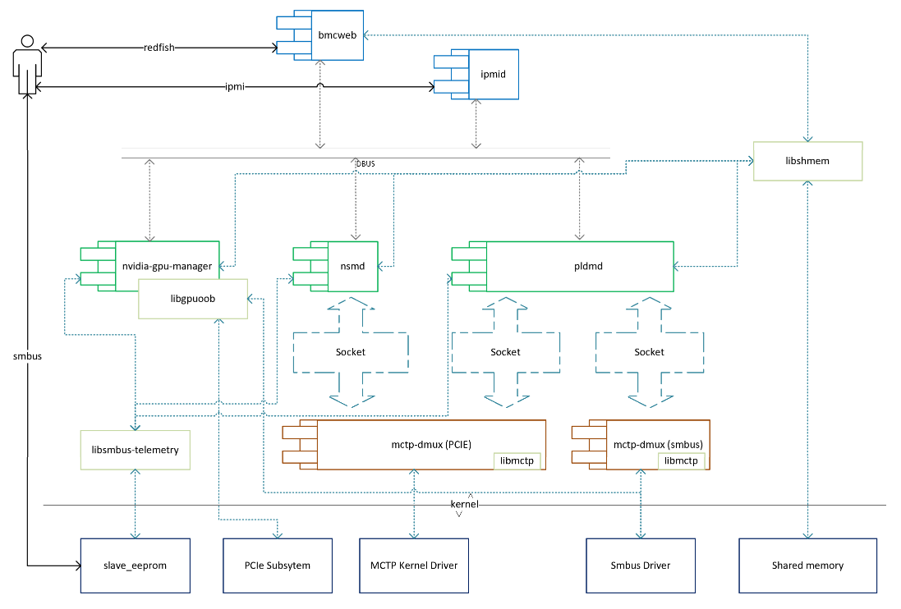
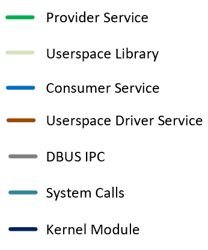
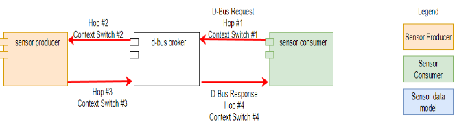
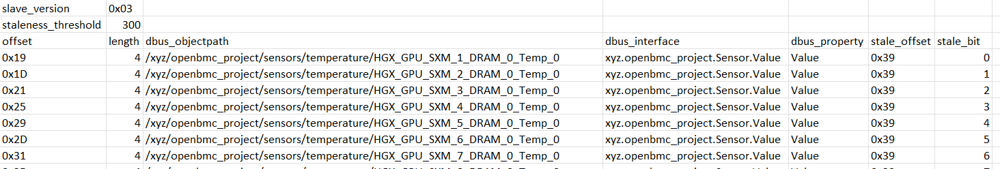
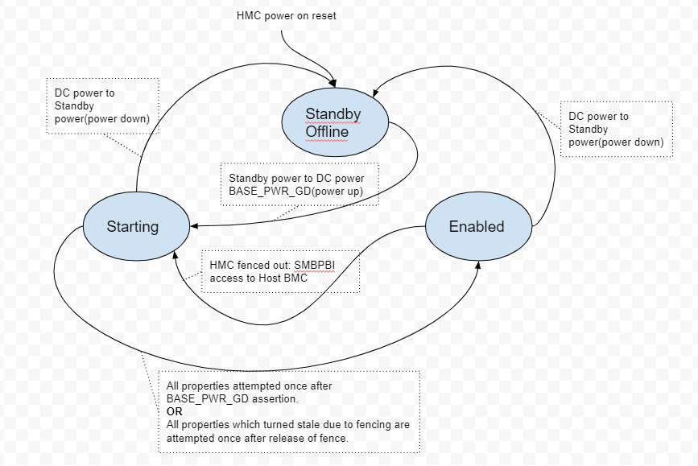
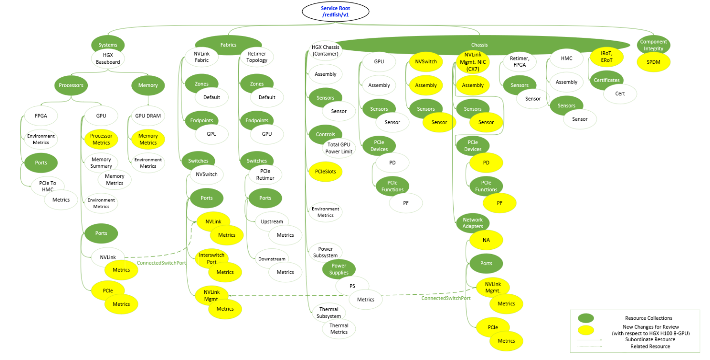

<!-- vscode-markdown-toc -->
* 1. [Features](#Features)
* 2. [High Level Architecture](#HighLevelArchitecture)
	* 2.1. [Provider Services](#ProviderServices)
	* 2.2. [Consumer Services](#ConsumerServices)
* 3. [IPCs](#IPCs)
* 4. [Platform Enablement](#PlatformEnablement)
	* 4.1. [Pre-requisites](#Pre-requisites)
	* 4.2. [Enabling Supported Telemetry on a New Platform](#EnablingSupportedTelemetryonaNewPlatform)
		* 4.2.1. [Bitbake recipes to enable](#Bitbakerecipestoenable)
		* 4.2.2. [Configuration files](#Configurationfiles)
		* 4.2.3. [Sensor Thresholds](#SensorThresholds)
		* 4.2.4. [Telemetry Readiness](#TelemetryReadiness)
	* 4.3. [Enabling New Telemetry on redfish - A new telemetry which is currently not supported](#EnablingNewTelemetryonredfish-Anewtelemetrywhichiscurrentlynotsupported)

<!-- vscode-markdown-toc-config
	numbering=true
	autoSave=true
	/vscode-markdown-toc-config -->
<!-- /vscode-markdown-toc -->
# Telemetry Stack Architecture

##  1. <a name='Features'></a>Features
- OOB interfaces supported for telemetry and control
    - Redfish API
    - IPMI (limited)
      Not all GPU telemetry is enabled over IPMI, only limited support coming from upstream implementation - for e.g., sensors might work. Its not been validated on any reference platforms.
    - SMBUS (limited to time critical sensors)
- Backend protocols/interfaces supported
    - SMBPBI(SMBus Mailbox Interface - supported by NVIDIA GPUs) over smbus and PCIe
    - PLDM T2 over MCTP(smbus, pcie, usb)
    - NSM(NVIDIA System Management API) over MCTP VDM(smbus, pcie, usb)
    - smbus/pmbus sensors using hwmon
- Devices Telemetry Supported
    - NVIDIA GPU Hopper, Hopper-Next
    - NVIDIA NSwitches
    - NVIDIA Grace CPU
    - NVIDIA Baseboard sensors including VRs, HSCs, PCIe Retimer, PCIe Switch etc
    - pmbus based - fans, psu, temp sensors
    - ConnectX-7
- Device Control Operations Supported
    - Control operations for NVIDIA Baseboard and GPUs. Following are few examples(not an exhaustive list)
        - Power Limit
        - Clock Limit
        - MIG mode
    - pmbus based Fan and PSU Control
- Readiness Indication - On every boot it takes a certain time for all the telemetry properties to be refreshed atleast once - to account for this init delay, the telemetry services provide a representation of readiness, which is an indication of having attempted a refresh of all the telemetry properties once since boot.

##  2. <a name='HighLevelArchitecture'></a>High Level Architecture

Legend<br>


Telemetry stack consists of a collection of systemd services following the OpenBMC design. The services can be grouped into provider services, *consumer services*, *driver services* etc. And these services interact with each other over multiple IPC mechanisms like socket, dbus and shared memory.

###  2.1. <a name='ProviderServices'></a>Provider Services
These services are the provider services that produce data implementing backend protocols to talk to the devices and implement polling loops to keep the data refreshed on BMC.

Following are the provider services -
1. **NVIDIA GPU Manager**
Protocols: SMBPBI
HW Interfaces: smbus, PCIe
Supported Devices: GPU, NVSwitch, NVIDIA Baseboard(FPGA)
Dependent Repos and Recipe Names: 
    - nvidia-gpuoob(Driver Library) - nvidia-gpuoob_git.bb
    - nvidia-gpu-manager(Systemd Service) - nvidia-gpumgr_git.bb
Description: A systemd module implementing SMBPBI protocol commands, sensor loops to refresh them at regular intervals and update the value on dbus.
2. **NSM Module**
Protocols: NSM Over MCTP VDM
HW Interfaces: smbus, PCIe
Supported Devices: GPU, ConnectX-7, NVIDIA Baseboard(FPGA)
Dependent Repos and Recipe Names:  
    - nsmd(Systemd Service) - nsm_git.bb
Description: A systemd module implementing NSM protocol commands, sensor loops to refresh them at regular intervals and update the value on dbus.
3. **PLDM Daemon**
Protocols: PLDM T2 over MCTP
HW Interfaces: smbus, PCIe, USB
Supported Devices: ConnectX-7
Dependent Repos and Recipe Names:  
    - pldmd(Systemd Service) - pldm_git.bb
Description: A systemd module implementing PLDM T2 protocol commands, sensor loops to refresh them at regular intervals and update the value on dbus.

###  2.2. <a name='ConsumerServices'></a>Consumer Services
These services are responsible for collecting various telemetry data from producer services and preparing the data model for user consumption, for instance bmcweb is a consumer service, implementing redfish model.

Following are the consumer services -
1. **Bmcweb Redfish Server**
Protocols: HTTP/Redfish
HW Interfaces: Ethernet, USBNet
Dependent Repos and Recipe Names:
    - bmcweb(Systemd Service) - bmcweb_git.bb

2. **SMBus Telemetry Target**
Protocols: smbus
HW Interfaces: i2c/smbus
Dependent Repos and Recipe Names:
    - libsmbus-telemetry-target(Library) - smbus-telemetry-target.bb
Description: HMC specific sensors on SMBUS virtual EEPROM.

2. **IPMI Daemon**
Protocols: ipmi
HW Interfaces: Ethernet, USBNet
Dependent Repos and Recipe Names:
    - libsmbus-telemetry-target(Library) - smbus-telemetry-target.bb


##  3. <a name='IPCs'></a>IPCs
1. **DBus**<br>
DBus is the primary IPC mechanism used across the telemetry stack for both data and control.<br>
2. **Shared Memory**<br>
Problem: Inability to support MetricReport/MRD sensor aggregates on Redfish while meeting sensor performance requirements
Manifestation: It was leading to issues in supporting more than 200 sensors under one Redfish URI and individual API Turnaround Time > 2s violating the KPIs
Root Cause: D-Bus round trip time (4 hops) & serialization make it not suitable for large amounts of data transfer

To address this issue, Shared memory infrastructure was introduced - which would be used as a fast IPC to share data between telemetry producers and telemetry consumers. In the first phase, the infrastructure is implemented to support sensor aggregation based data sets which would be populated by a sensor aggregation process and these data sets are consumed by bmcweb MRD URIs. 
Shared memory infrastructure is implemented as a library which can be used by different OpenBMC applications.<br>
Refer details: [nv-shmem](https://github.com/NVIDIA/nv-shmem/blob/develop/README.md)<br>
3. **Unix Domain Sockets**<br>
Mainly used by MCTP based stack for data exchange between the protocol modules like PLDM, NSM and transport layer(mctp demux daemon)<br>

##  4. <a name='PlatformEnablement'></a>Platform Enablement

###  4.1. <a name='Pre-requisites'></a>Pre-requisites
Each platform needs to finalize on the following as a pre-req for telemetry stack enablement.

1. Backend API speicifications from respective devices - for example - NSM Specifications.

2. Redfish Schema Definition - this involves defining the redfish model considering the platform specific details and devices, and the usage model for the product. The collaterals expected out of this activity are
- Schema guide - a word document capture the redfish tree and schema definitions
- Schema Supplement - capturing all the properties and their respective mapping backend APIs like NSM command codes
- Mock ups - this is the mockup jsons for the platform which can be used to spin up a mock server using DMTF mock server.

3. Telemetry Catalog - this is a document capturing the most important telemetry for the platform along with this mapping to redfish APIs, backend APIs, refresh intervals and associated inband commands or alternate ways to validate the telemetry against.

###  4.2. <a name='EnablingSupportedTelemetryonaNewPlatform'></a>Enabling Supported Telemetry on a New Platform
####  4.2.1. <a name='Bitbakerecipestoenable'></a>Bitbake recipes to enable
- **Picking services** - depending on the protocols and devices supported, the relevant modules need to be included in the platform build in `obmc-phosphor-image.bbappend`. These are not added by default by any other recipes, while the platforms can choose to enable as applicable.
```
OBMC_IMAGE_EXTRA_INSTALL:append = " pldm  \
                                nvidia-gpuoob \
                                nvidia-gpumgr \
                                ...
```
For all the available provider services refer [provider services](###-Provider-Services) and [consumer services](###-Consumer-Services).
Typically more than one such services are enabled for each platform. 
- **Build time configs** - There might specific build time configs that need to enabled as part of bitbake recipe enablement and that specific options are detailed out in individual module specific readmes.

Some Options that are applicable across the telemetry stack include:

1. Shared memory library for MRD properties - that help with performance improvement of redfish APIs. MRD properties configuration required is captured below.
```
EXTRA_OEMESON:append = "-Dshmem-platform-metrics=enabled"
```
Refer details: [nv-shmem/-/blob/develop/README.md](https://github.com/NVIDIA/nv-shmem/blob/develop/README.md)

2. SMBus Telemetry Agent (HMC specific) - that help expose some time critcal sensors on faster smbus interface. Sensors to be enabled per platform is captured below.
```
EXTRA_OEMESON:append = "-Dsmbus-telemetry-target=enabled"
```
Refer details: [smbus-telemetry-target]()
####  4.2.2. <a name='Configurationfiles'></a>Configuration files
Each module can have its own set of configuration files, for various pruposes, including the list of supported telemetry to be enabled for a platform - which is driven through module specific configuration, for e.g., GPU Manager needs it to be configured in properties json, NSM in entity manager json and PLDM T2 through discovery using PDRs. Individual readmes capture the details of each one of them and more. Here are the main configuration files to look forward to
- GPU Manager - manifest, profile, properties jsons - [link]()
- PLDM T2 - Priority Sensor Config and Entity Manager jsons - [link]()
- NSM and PLDM T2 - Entity Manager jsons - 
- Shared memory library - MRD configuration json file - [link](https://github.com/NVIDIA/nv-shmem/blob/develop/README.md)
- SMBus Slave Target (HMC specific)
Each platform is supposed to put up a smbus table capturing the sensors and assigning relevant register addresses on smbus. The configuration is captured in [smbus-telemetry-config.csv]()

Refer Details - [link]()

####  4.2.3. <a name='SensorThresholds'></a>Sensor Thresholds
Some of the sensors need thresholds defined per type of the sensors, mainly redfish and ipmi. 
There could be two ways of configuring the sensor thresholds

- *Statically defined in HMC Code*
These are implemented in a module specific manner. For e.g., GPU Manager will have a "static" property defined with value in its properties json.

- *Dynamically fetched from devices*
These are implemented as respective commands - as captured in Telemetry Catalog/Redfish Supplement, by the respective modules. For e.g., GPU Manager will implement the threshold property mapping to one SMBPBI opcode and arguments combination and makes it available on dbus.

Since dynamic thresholds are fetched from devices, platforms don't have to do anything specifically for them. But each of the platforms will need to update/review the static thresholds though.
Refer module specific readmes for details on configuring static thresholds.

####  4.2.4. <a name='TelemetryReadiness'></a>Telemetry Readiness
Telemetry readiness is a software concept presented by each telemetry provider service to provide a way to query whether telemetry stack is ready for service.
This property is supposed to be marked enabled once all the telemetry objects(inventory, sensors) are populated with valid data once on boot. 

This is implemented with [NVIDIA CSM](https://github.com/NVIDIA/phosphor-state-manager/blob/develop/docs/configurable_state_manager.md) on the following redfish API

```
/redfish/v1/Managers/HGX_BMC_0
{
    ...
   "State": "Enabled"
    ...
}
``` 
It's upto the platforms to define the specific behavior of `Managers/State` redfish API through the platform specific json configuration for CSM.

Each of the telemetry module publishes readiness on the following dbus interface, for example
```
DBus Obj: /xyz/openbmc_project/GpuMgr
DBus Intf: xyz.openbmc_project.State.ServiceReady
Property: State
Value: xyz.openbmc_project.State.ServiceReady.States.Enabled
```
Then through the CSM configuration, overall telemetry readiness is determined and represented on redfish as `Managers/HGX_BMC_0/State`.

An example state machine as implemented for HMC


Corresponding Config file
```
{
    "InterfaceName" : "xyz.openbmc_project.State.FeatureReady",
    "TypeInCategory": "xyz.openbmc_project.State.FeatureReady.FeatureTypes.Telemetry",
    "ServicesToBeMonitored": {
        "xyz.openbmc_project.State.Chassis": ["/xyz/openbmc_project/state/configurableStateManager/ChassisPower"],
        "xyz.openbmc_project.State.ServiceReady": ["/xyz/openbmc_project/GpuMgr", "/xyz/openbmc_project/inventory/metrics/platformmetrics"]
    },
    "State": {
        "State_property": "State",
        "Default": "xyz.openbmc_project.State.FeatureReady.States.StandbyOffline",
        "States": {
            "xyz.openbmc_project.State.FeatureReady.States.StandbyOffline": {
                "Conditions": {
                    "xyz.openbmc_project.State.Chassis": {
                        "Property" : "CurrentPowerState",
                        "Value" : "xyz.openbmc_project.State.Chassis.PowerState.Off"
                    }
                }
            },
            "xyz.openbmc_project.State.FeatureReady.States.Enabled": {
                "Conditions": {
                    "xyz.openbmc_project.State.Chassis": {
                        "Property": "CurrentPowerState",
                        "Value": "xyz.openbmc_project.State.Chassis.PowerState.On"
                    },
                    "xyz.openbmc_project.State.ServiceReady": {
                        "Property" : "State",
                        "Value" : "xyz.openbmc_project.State.ServiceReady.States.Enabled",
                        "Logic": "AND"
                    }
                },
                "Logic": "AND"
            },
            "xyz.openbmc_project.State.FeatureReady.States.Starting": {
                "Conditions": {
                    "xyz.openbmc_project.State.Chassis": {
                        "Property": "CurrentPowerState",
                        "Value": "xyz.openbmc_project.State.Chassis.PowerState.On"
                    },
                    "xyz.openbmc_project.State.ServiceReady": {
                        "Property" : "State",
                        "Value" : "xyz.openbmc_project.State.ServiceReady.States.Starting",
                        "Logic": "OR"
                    }
                },
                "Logic": "AND"
            }
        }
    }
}

```

###  4.3. <a name='EnablingNewTelemetryonredfish-Anewtelemetrywhichiscurrentlynotsupported'></a>Enabling New Telemetry on redfish - A new telemetry which is currently not supported
Following are the generic steps involved in defiining new telemetry items:<br>

**Step 1:** Define the redfish modelling for the platform - identifying right schema
*Example HGX Platform:*
New device to be modelled: ConnectX-7

The redfish model identified for ConnectX-7 are `/redfish/v1/Chassis/HGX_NVLinkManagementNIC_0`, `/redfish/v1/Chassis/HGX_NVLinkManagementNIC_0/NetworkAdapters/HGX_NVLinkManagementNIC_0`<br>

**Step 2:** Update platform specific telemetry catalog, mapping the telemetry item to relevant backend API.

*Telemetry Catalog*: It's a table that lists the system parameters (metrics) recommended for periodic collection by a monitoring system. It helps in implementation as well as testing/tooling. 

The Telemetry Catalog captures the following details in the columns: 

- Telemetry GUID: A unique ID to refer to this metric. 
- Device: The device to which the metric belongs, e.g., GPU, NVSwitch, PCIe Switch, HSC, VR. 
- Metric (ParamName): Name or ID of the metric (unique within the device) 
- Description: Brief description of what the metric represents 
- Category (ParamClass): The classification of the metric into one of the following categories: 
    - Inventory: Vendor, Model and Serial Number to keep track of devices present, absent, or replaced on the platforms in the past.  Because all data is timestamped, this can help you trace changes to system hardware. 
    - Specs: Device capabilities and maximum PCIe speed and bandwidth, which never change. 
    - Configuration: User-configured power limits and clock speeds, which you can use to match expected versus observed behavior. 
    - Status: PCIe link speed and width, NVlink speed and health, and power good status, to help you trace the actual state of the platform. 
    - Sensors: Fast-changing data, like temperatures (inlet, GPU, NVSwitch, HSC, and VR), fan speeds, and power draw.  
    - Errors: Error counters and registers, like PCIe uncorrectable error count. 

- Data Type: The type of value contained in the metric, such as Integer, Text, Binary Blob, JSON struct etc. 

- OOB API (SMBPBI/NSM/PLDM T2/etc): The OOB API to fetch the value of this metric, if available. 

- In-Band API (NVML): NVML API to fetch the value of this metric, if available. 

- In-Band API (DCGM): DCGM Field ID to fetch the value of this metric, if available. 

- OOB API (Redfish): The Redfish API (schema version, URI, and fieldname) to fetch the value of this metric, if available. 

- NSM : Nvidia Systems API to get aggregated telemetry from the device and also for subscribing and getting event notifications from the device.  

*Example HGX Platform:*
Refer following mapping of one particular redfish telemetry for ConnectX-7
```
/redfish/v1/Chassis/{ChassisId}/NetworkAdapters/{NetworkAdapterId}/Ports/{PortId}

property: LinkState
Protocol Mapped: PLDM T2, Port Link State 
```
<br>

**Step 3:** Define phosphor-dbus-interface(PDI) API to implement the property on dbus.
Here the preference should be given to an existing PDI from [upstream](https://github.com/openbmc/phosphor-dbus-interfaces/tree/master/yaml), if nothing matches to any of the upstream versions, then we can define a new interface as below.
*Example HGX Platform:*
Refer following mapping of one particular dbus API for ConnectX-7 Port Link state.
PDI yaml - *xyz/openbmc_project/Inventory/Item/Port.interface.yaml*
```
properties:
...
    - name: LinkStatus
      type: enum[self.LinkStatusType]
      default: LinkUp
      description: >
          The desired link status for this interface.
...
```
<br>

**Step 4:** Enable the new backend API(following relevant protocol modules design pattern) and publish the same on dbus using the PDI defined earlier
*Example HGX Platform:*
Following snippet of code in pldm t2 stack for updating ConnectX-7 Port Link state on dbus.
```
...
void setValue(uint8_t value) override
    {
        switch (value)
        {
            case PLDM_STATESET_LINK_STATE_DISCONNECTED:
                ValueIntf->linkState(PortLinkStates::Disabled);
                ValueIntf->linkStatus(PortLinkStatus::LinkDown);
                break;
            case PLDM_STATESET_LINK_STATE_CONNECTED:
                ValueIntf->linkState(PortLinkStates::Enabled);
                ValueIntf->linkStatus(PortLinkStatus::LinkUp);
                break;
            default:
                ValueIntf->linkState(PortLinkStates::Unknown);
                ValueIntf->linkStatus(PortLinkStatus::NoLink);
                break;
        }

        if (linkSpeedSensor)
        {
            ValueIntf->currentSpeed(linkSpeedSensor->getReading());
        }
    }
...
```
*Refer individual model readmes for implementation details.* <br>

**Step 5:** Update redfish implementation in bmcweb to consume the property published on dbus, following the bmcweb design patterns.
*Example HGX Platform:*
Following snippet of code in bmcweb for updating ConnectX-7 Port Link state on redfish reading the relevant DBus API.

Route Handler
```
...
    BMCWEB_ROUTE(app,
                 "/redfish/v1/Chassis/<str>/NetworkAdapters/<str>/Ports/<str>/")
        .privileges(redfish::privileges::getPort)
        .methods(boost::beast::http::verb::get)(
            std::bind_front(handlePortGet, std::ref(app)));
...
```
DBus API Fetch
```
...
                else if (propertyName == "LinkState")
                {
                    const std::string* value =
                        std::get_if<std::string>(&property.second);
                    if (value == nullptr)
                    {
                        BMCWEB_LOG_ERROR << "Null value returned "
                                            "for link state";
                        messages::internalError(asyncResp->res);
                        return;
                    }
                    if (*value ==
                        "xyz.openbmc_project.Inventory.Item.Port.LinkStates.Enabled")
                    {
                        asyncResp->res.jsonValue["Status"]["State"] = "Enabled";
                    }
                    else if (
                        *value ==
                        "xyz.openbmc_project.Inventory.Item.Port.LinkStates.Disabled")
                    {
                        asyncResp->res.jsonValue["Status"]["State"] =
                            "Disabled";
                    }
                    else if (
                        *value ==
                        "xyz.openbmc_project.Inventory.Item.Port.LinkStates.Error")
                    {
                        asyncResp->res.jsonValue["Status"]["State"] =
                            "UnavailableOffline";
                    }
                    else
                    {
                        asyncResp->res.jsonValue["Status"]["State"] = "Absent";
                    }
                }
...
},
        service, objPath, "org.freedesktop.DBus.Properties", "GetAll",
        "xyz.openbmc_project.Inventory.Item.Port");
...
```
