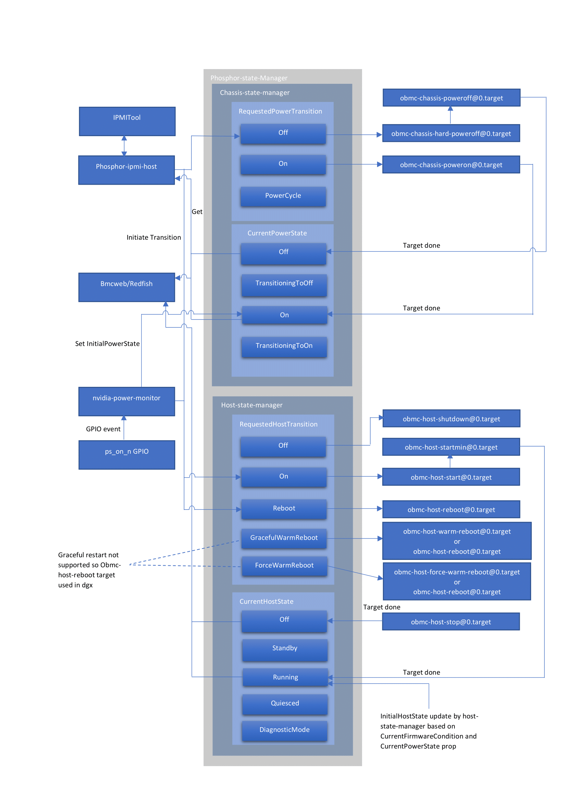
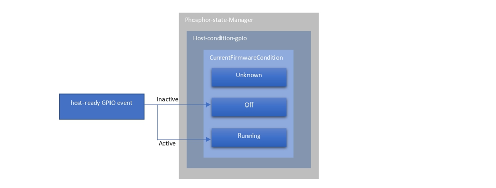
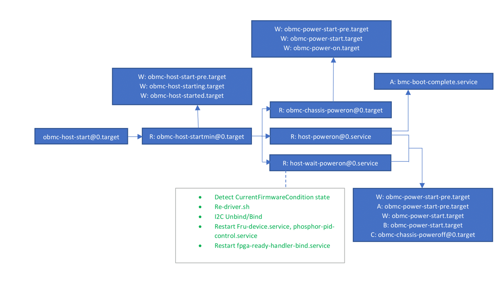
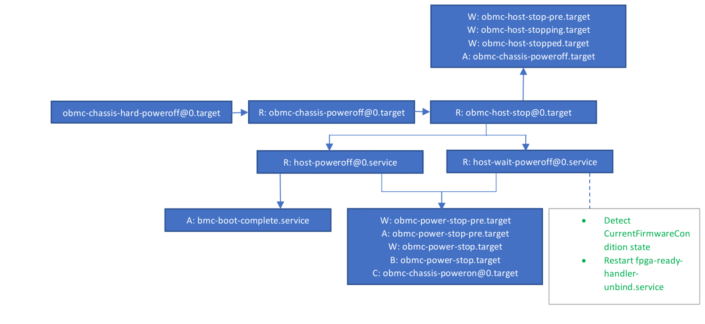
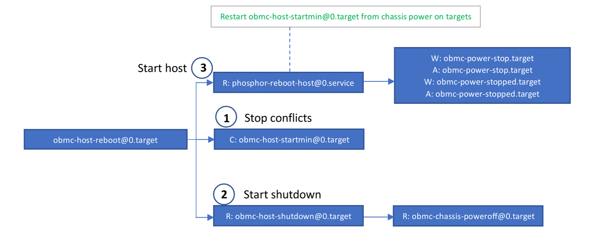

# **Phosphor State Manager States and Transition**
Author: Selvaganapathi M

## State-Manger States and Transitions:

- phosphor-state-manager software is its support for requests to power on and off the system by the user
- There are two main services chassis-state-manager, host-state-manager. Both services 
exposes property called "RequestedPowerTransition", "CurrentPowerState", "RequestedHostTransistion", 
"CurrentHostState" respectively
- These properties are then used by external interface protocols, such as Redfish and IPMI, 
to report and control state to/by the end user
## Host-Condition-Gpio

- The Host Condition gpio is the service to detect host state
- This service utilize "host-ready" gpio event to update "currentFirmwareCondition" property
- "currentFirmwareCondition" is used to detect host state and verify on power on/off operation
## Power-Button:

- Power status of LUNA/LUNA-DP chassis detected by "nvidia-power-monitor" service
- Nvidia-power-monitor service detects "ps_on_n" gpio event and state transistion(On/Off) initiated
## Target Dependencies Hierarchy:
### Chassis power on:

- The obmc-host-startmin@.target represents the bare minimum of services and targets required to start the host
- This target is also utilized in host reboot scenarios
- host-poweron@0.service, host-wait-poweron@0.service is LUNA/LUNA-DP specific service to power 
on the host and initialize Hardwares(Re-driver.sh, i2c unbind/bind, restart fpga-ready-handler-bind.service)
- The services have dependencies(synchronization targets) within them that control the execution 
of each service. These dependencies are set using targets and the Wants,Before,After keywords
### Chassis power off:

- The obmc-chassis-hard-poweroff@0.target represents the bare minimum of services and targets required to stop the host
- host-poweroff@0.service, host-wait-poweroff@0.service is LUNA/LUNA-DP specific service to power 
off the host and de-initialize hardwares(restart fpga-ready-handler-unbind.service)
- The services have dependencies(synchronization targets) within them that control the execution 
of each service. These dependencies are set using targets and the Wants,Before,After keywords
### Chassis power cycle:

- The reboot of the server is encapsulated in the obmc-host-reboot@.target
- This target will utilize the obmc-host-shutdown@0.target and then, once that completes, start the host power on target
